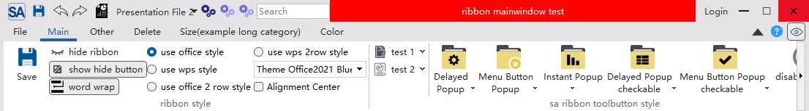

# 版本记录(change log):

## 2025-07-14 -> 2.4.0

- 调整了SARibbonBar的布局方式，添加了SARibbonBarLayout类
- 调整了原来的代码格式化clang-format

## 2025-03-12 -> 2.3.0

- 静态引入版本仅仅只需`SARibbon.h`和`SARibbon.cpp`两个文件，其他文件不需要
- 增加`SARibbonApplicationWidget`,可以方便快速实现类似office的文件窗口的效果，具体见MainWindow例子
- `SARibbonMainWindow`的构造函数第二个参数设置为枚举类
- 支持使用原生边框，不使用无边框的方案，具体见`example/UseNativeFrameExample`例子,效果如下：

## 2025-02-05 -> 2.2.9

- `SARibbonBar`增加`setWindowTitleBackgroundBrush`/`windowTitleBackgroundBrush`函数，允许用户设置标题栏的背景色

- 修正了`SARibbonBar`针对标题的渲染方式，能根据父窗口的`isWindowModified`状态，针对`[*]`占位符进行渲染
- 例子中增加了标题栏背景颜色周期改变的示例

## 2025-01-04 -> 2.2.8 [hotfix]

- 修正合并文件会存在宏重复定义问题-2.2.7遗漏了一个调试宏
- `SARibbonSeparatorWidget`的宽度增加了最小1像素的判断
- `SARibbonToolButton`添加了`textEllipsisAspectFactor`相关函数，用户可以通过设置文字省略显示的长宽比，来调整按钮的最宽宽度
- 优化了一些cmake的内容

## 2024-12-23 -> 2.2.7 [hotfix]

- 修正合并文件会存在宏重复定义问题

## 2024-12-23 -> 2.2.6 

- 修正了category在滚动时，右边的滚动按钮不会随着滚动到最右边消失的问题
- 统一所有文件的换行为CRLF
- 调整cmake，qwk的依赖为private
- example的cmake添加静态编译的例子

## 2024-10-17 -> 2.2.5

- 原有的qt关键宏替换为`Q_SIGNAL` / `Q_SLOT` / `Q_EMIT`，以适应no_keywords设置
- 调整目录结构，单独把example提取出来
- 完善mdi窗口的例子，可以结合qwk实现mdi窗口的最大最小化按钮的显示

## 2024-09-12 -> 2.2.4

- 修正自定义`SARibbonMainWindow`调用`setRibbonBar`后，会导致最大最小化按钮被遮挡的问题
- 调整Mdi例子中cmake的文件大小写，避免在linux系统下大小写敏感
- 修正qwk开启后，`SARibbonMainWindow::eventfilter`没有捕获的问题

## 2024-07-25 -> 2.2.1

- 增加`setPannelSpacing`接口，可调节pannel按钮的间距
- `SARibbonToolButton`的icon尺寸可设置，在小按钮模式下，用户可指定icon尺寸
- 把`SARibbonMainWindow`的事件处理通过`eventfilter`实现，避免用户在重写事件时误操作
- 修正`SARibbonGalleryButton`的样式错误
- 修正SystemBar在qwk下会位置有偏离的问题

## 2024-07-15 -> 2.2.0

- 增加了mdi窗口的示例
- 增加了`SARibbonTabBar`的tab尺寸计算方式，可以让tab高度按照tabbar高度自动调整
- 示例增加了尺寸设置的配置，可以任意调整titlebar，tabbar，pannel title height的高度
- 修正调整category高度后，pannel高度不跟着改变的问题
- 添加snap layout的开关，在依赖qwk下，可以设置是否开启snap layout

## 2024-05-23 -> 2.1.0

- 添加`actionTriggered`信号
- 修正了滚动action显示效果
- 把`SARibbonTheme`从SARibbonMainWindow中转移到`SARibbonGloabls.h`中并作为枚举类(enum class)
- 添加`SARibbonWidget`，同时调整example/widget示例
- 调整了布局移动的实现方式，不会出现压缩式移动

## 2024-02-07 -> 2.0.3

- 调整`SAColorToolButton`的实现，使之更简单
- 修正qwk库引入的cmake
- 调整文档

## 2024-02-07 -> 2.0.2 

- 修正`SARibbonSystemButtonBar`的编码问题，可能会导致vs下无法编译成功
- `SARibbonContextCategory`的标签颜色调整

## 2024-01-27 -> 2.0.1【失效，请使用v2.0.2及以上版本】

- 调整qss，让`SARibbonApplicationButton`的下拉箭头不显示
- 文档添加gallery
- 修正了一个布局可能异常的点

## 2024-01-09 -> 2.0.0

- `SARibbonCategory`和`SARibbonPannel`可以通过qss定制
- `SARibbonPannel`的文字使用`SARibbonPannelLabel(QLabel)`显示，可以通过qss进行自定义
- `SARibbonSeparatorWidget`分割线也支持qss定制
- `SARibbonBar`的样式`RibbonStyle`改为`QFlags`
- `SARibbonBar`添加了相关的迭代函数，可快速遍历所有的category和pannel
- 尺寸的计算重新进行了调整
- 默认的qss进行了重新调整，适用更多的屏幕尺寸
- `SARibbonBar`添加了如下接口：
  1.`SARibbonBar::setCornerWidgetVisible` 可以设置`cornerwidget`的显示隐藏与否
  2.属性`enableShowPannelTitle`，控制是否显示pannel的标题
  3.属性`pannelTitleHeight`，控制pannel标题栏高度
  4.属性`pannelLayoutMode`，可控制pannel的布局方式
  5.属性`tabOnTitle`，可控制tab放置在title栏上
  6.`titleBarHeight`，`tabBarHeight`，`categoryHeight`这三个高度支持用户自定义，默认会根据字体大小计算
  7.`setTabBarBaseLineColor`控制tabbar下基线颜色，某些主题需要设置颜色（窗口标题栏和category区域颜色一样的情况下如office 2013主题）可通过此函数设置，传入`QColor()`取消颜色
- 添加了`SARibbonBar::initHighDpi()`静态函数，方便开启高分屏设置
- 【注意】frameless库更换为qwindowkit(https://github.com/stdware/qwindowkit)，qwindowkit源码不作为项目一部分，使用`git submodule`管理，因此，项目clone下来后，需要执行`git submodule update --init --recursive`
- 【注意】如果开启`SARIBBON_USE_FRAMELESS_LIB`（默认不开启），需要先构建`qwindowkit`，目前`qwindowkit`不提供qmake，只提供cmake，编译完`qwindowkit`后，SARibbon支持qmake和cmake
- `SARibbonMainWindow`支持非ribbon模式
- 原`SAWindowButtonGroup`改名为`SARibbonSystemButtonGroupBar`，同时支持添加action

【警告】编译过程会在当前目录下生成bin_qtx.x.x_[MSVC/GNU]_x[64/86]这样的文件夹，请确保有写入权限，否则执行qmake过程会报错

由于接口函数有明显调整，因此版本变更为2.0

## 2023-12-29 -> 1.1.2

- 合并了lixinchang的修改(https://gitee.com/lixinchang)
- 添加了`SARibbonControlToolButton`，ControlBar不再使用QToolButton，避免和QToolButton的qss冲突
- ControlBar支持按钮菜单样式的指定
- 调整了默认样式的内容

## 2023-12-25 -> 1.1.1

- 修正了`SARibbonBar`的布局过程对窗体隐藏的判断方式，使得在窗口没显示时也能正确布局

## 2023-12-25 -> 1.1.0

- 修正了尺寸刷新的问题，在首次显示不会出现控件跳动的状态
- 修正了一些问题
- 调整了创建RibbonButton的方式
- 调整了`SARibbonPannel`一些接口，使得创建更加规范
- 调整了ToolButton的渲染方式

  ------------------------

## 2023-11-19 -> 1.0.6

- 添加Office2016主题
- Category可以居中对齐
- QuickAccessBar的图标调小一像素，且用户可设置

## 2023-11-10 -> 1.0.5

- 自动根据Qt版本来适配是否加载frameless库

## 2023-11-02 -> 1.0.4

cn:因为引入了framelss库，导致很多版本的qt无法编译，为了兼容不同版本的qt编译问题，进行了版本自适应，
不符合framelss的qt版本自动使用原来的framelss方案，从而实现了qt5.9到qt6的完全支持

en:Because of the introduction of the framelss library, many versions of qt cannot be compiled.
In order to be compatible with different versions of qt compilation, version adaptation is carried out.
The qt version that does not conform to the framelss automatically uses the original framelss scheme, thus realizing full support for qt5.9 to qt6

## 2023-10-26 -> 1.0.2

- 添加了SARibbonBar在QWidget窗口上使用的例子
- 整理了SARibbon.h和SARibbon.cpp,调整了静态使用的例子
- frameless库更新到c4a7bc8版本（20231022）

## 2023-10-14 -> 1.0.1

cn:
- 引入第三方库frameless
- 支持ubuntu和macos
- 解决windwos系统的多屏幕移动问题
- 依赖frameless，实现windows系统的一些界面操作，如边缘触发半屏
- 添加深色主题
- 优化了一些界面刷新逻辑
- 最低C++版本要求为c++17
- 一些接口的调整和一些枚举名称的调整
- 添加了QWidget使用SARibbonBar的例子
- 同步把自定义ribbon的SARibbonMainWindow的依赖去除
- 完善了文档包括高分屏问题和linux编译的方法

en(machine translation):
- import third-party library:frameless
- Supports ubuntu and macos
- Solving the problem of multi screen movement in Windwos system
- Relying on frameless library to implement some interface operations in Windows systems, such as edge triggered half screen
- Add a dark theme
- Optimized some interface refresh logic
- The minimum C++version requirement is c++17
- Some interface adjustments and some enumeration name adjustments
- Added an example of using SARibbonBar for QWidgets
- Synchronize the removal of dependencies on SARibbonMainWindow for custom ribbons
- Improved documentation including high resolution issues and methods for compiling Linux

## 2023-10-09 -> 0.7.1

- 增加了深色主题
- 调整了枚举的命名方式
- 增加了一些重绘方式

## 2023-10-09 -> 0.7.0

- 修正了category的布局问题

## 2023-09-27 -> 0.6.0

- 添加了Amalgamate，修正了一些显示的bug，修正cmake的异常
- 添加了上下文标签中category标题名字改变的信号

## 2023-05-28 -> 0.5.0

- 调整了大按钮模式下的显示方案，去除了原来`SARibbonToolButton`的Lite和Normal模式，以WordWrap来表征
- 支持文字自定义换行
- 调整了RibbonPannel的标题栏的高度计算方案

## 0.5.1

- 不使用`QString::simplified`,而是简单的仅仅替换\n的simplified，这样中文换行不会多出空格

## 0.5.2

- `SARibbonColorToolButton` / `SARibbonToolButton`修正&操作在三项表达式未加括号问题
- `SARibbonStyleOption`添加虚析构函数
- 原来`SARibbonElementCreateDelegate`类改名为`SARibbonElementFactory`