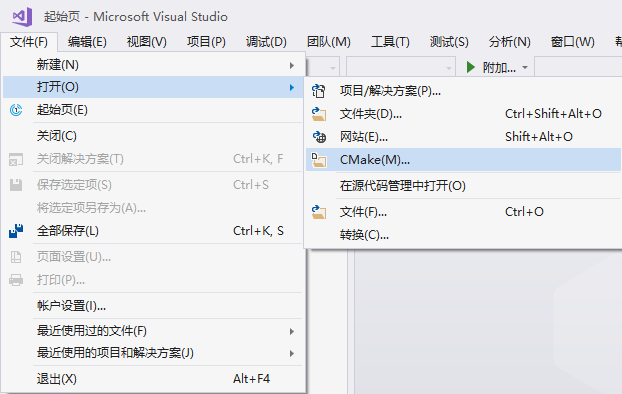
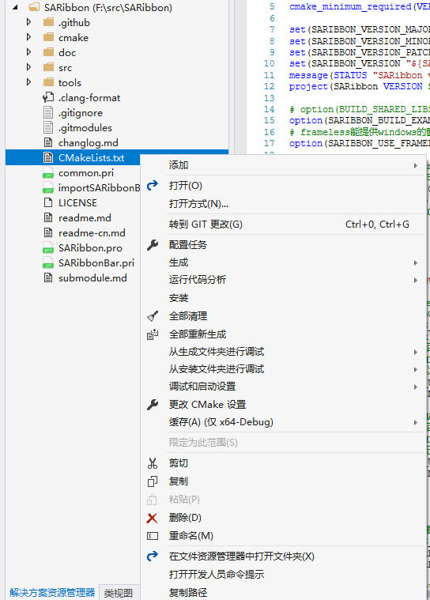
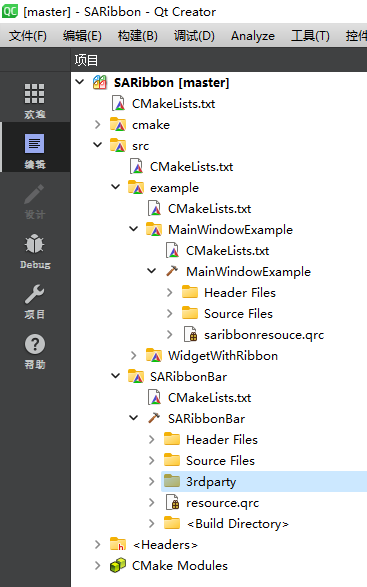

# SARibbon构建说明

此文会详细介绍如何动态构建SARibbon，如果你不熟悉构建，建议你用静态引入的方法，你只需把SARibbon.h和SARibbon.cpp引入你的工程即可使用

SARibbon采用[QWindowkit](https://github.com/stdware/qwindowkit)作为无边框窗口方案，同时也支持简单的无边框设置。如果你需要操作系统原生的窗口特性，如Windows 7及以后版本的贴边处理，或Windows 11的Snap Layout效果，建议启用[QWindowkit](https://github.com/stdware/qwindowkit)库。该库还能有效解决多屏幕移动问题。

启用QWindowkit后，你将能实现如下效果：


若要启用[QWindowkit](https://github.com/stdware/qwindowkit)，需先编译该库。作为SARibbon项目的子模块，如果你在`git clone`时没有使用`--recursive`参数，需执行`submodule update`命令：

```shell
git submodule update --init --recursive
```

## 关于安装位置

通过CMake构建完成后，使用`install`命令可以安装所有依赖。引用库时，只需通过`find_package`命令，即可将所有依赖和预定义宏等配置一并引入，这是目前最推荐的做法。

然而，在程序开发过程中，可能会遇到不同编译器（如MSVC、MinGW）和不同Qt版本的编译问题。如果使用默认的安装位置（Windows下为C:\Program Files），则只能安装一个版本的库。为了区分不同编译器和Qt版本，SARibbon默认使用本地安装。本地安装会根据编译器和Qt版本生成一个安装文件夹，文件夹命名格式为`bin_qt{version}_[MSVC/GNU]_x[64/86]`。通过`SARIBBON_INSTALL_IN_CURRENT_DIR`选项可以配置是否根据编译器和Qt版本安装到本地，该选项默认为`ON`，即会根据编译器和Qt版本生成一个本地文件夹进行安装。

## 编译QWindowkit库(如果不开启跳过此步)

`QWindowkit`库仅提供CMake的编译方式，必须使用CMake进行编译。

为简化操作，在`src/SARibbonBar/3rdparty`下提供了一个`CMakeLists.txt`文件，已对该库的必要配置进行了设置。你可以直接调用该文件进行编译。

使用Qt Creator和Visual Studio进行构建和安装的方式基本相同。

### 使用Qt Creator构建和安装QWindowkit库

1. 使用Qt Creator打开`src/SARibbonBar/3rdparty/CMakeLists.txt`文件。


2. 点击运行（Ctrl+R）。


3. 切换到项目模式（Ctrl+5）。

4. 在Build步骤中选择`install`（有些版本的Qt Creator无法同时选中`all`和`install`，此时可先选`all`，编译完成后再选`install`进行安装）。


5. 再次点击运行（Ctrl+R）。

此时，你会在SARibbon根目录下看到形如`bin_qt5.14.2_MSVC_x64`的安装目录，`QWindowkit`库已自动安装在此目录下。


至此，`QWindowkit`库的编译和安装已完成。

### 使用visual studio构建和安装QWindowkit库

1. 使用Visual Studio打开CMake项目，选择`src/SARibbonBar/3rdparty/CMakeLists.txt`文件。



2. 在CMake菜单中选择“全部生成”（有些版本没有CMake菜单，可在`CMakeLists.txt`上点击右键）。


3. 在CMake菜单中选择“安装”（有些版本没有CMake菜单，可在`CMakeLists.txt`上点击右键）。


> 注意：不同版本的Visual Studio操作可能略有不同，没有CMake菜单的，可以在`CMakeLists.txt`上点击右键。



此时，你会在SARibbon根目录下看到形如`bin_qt5.14.2_MSVC_x64`的安装目录，`QWindowkit`库已自动安装在此目录下。


至此，`QWindowkit`库的编译和安装已完成。

### 使用命令行构建(适用Qt5及vs2019以下)

由于`QWindowkit`库要求的CMake版本较高，VS2019及以下版本内置的CMake版本可能无法满足需求。因此，需要通过命令行对`QWindowkit`库进行构建。以下是在Windows下通过CMD命令行构建`QWindowkit`库的步骤：

1. 安装一个高版本的CMake工具，并确认其路径（例如：`C:\Program Files (x86)\cmake3.27.9\bin\cmake.exe`）。

2. 确认你的Qt版本路径和编译器。以Qt5.14.2 MSVC 2017版本为例。

3. 找到Qt安装路径下`Qt5Config.cmake`所在的文件夹（例如：`C:\Qt\Qt5.14.2\5.14.2\msvc2017_64\lib\cmake\Qt5`）。

4. 打开命令行，切换到`src/SARibbonBar/3rdparty`目录，执行以下命令：

   ```shell
   "C:\Program Files (x86)\cmake3.27.9\bin\cmake.exe" -B build -S . -G "Visual Studio 15 2017" -A x64 -DQt5_DIR="C:\Qt\Qt5.14.2\5.14.2\msvc2017_64\lib\cmake\Qt5"
   ```

   如果`cmake.exe`不在环境变量中，需指定完整路径。如果在环境变量中，则只需输入`cmake`即可。

5. 执行完成后，会看到相应的输出。

   

6. 接着执行以下两个命令：

```shell
"C:\Program Files (x86)\cmake3.27.9\bin\cmake.exe" --build build --target install --config Debug
"C:\Program Files (x86)\cmake3.27.9\bin\cmake.exe" --build build --target install --config Release
```

## 构建SARibbonBar库

`SARibbonBar`库提供CMake和QMake两种方式构建，推荐使用CMake。

> 注意：Qt6之后不再维护QMake，逐渐转向CMake。SARibbon的未来版本可能会移除QMake支持。

### 基于`CMake`构建`SARibbonBar`库

#### vs下基于`cmake`的构建

1. 如果要启用`QWindowKit`，在`CMakeLists.txt`中将`SARIBBON_USE_FRAMELESS_LIB`的option值手动改为ON。
2. 打开CMake项目，选中`CMakeLists.txt`。

   

3. 将会形成如下的构建树。

   

4. 直接在CMake菜单中选择“全部生成”（有些版本没有CMake菜单，可在`CMakeLists.txt`上点击右键）。

   

5. 全部生成完成后，在CMake菜单中选择“安装”->“SARibbon”（有些版本没有CMake菜单，可在`CMakeLists.txt`上点击右键）。

   

此时，你会在源码根目录下看到一个新文件夹，文件夹命名格式为`bin_qt{version}_[MSVC/GNU]_x[64/86]`（你可以使用默认安装位置，将`SARIBBON_INSTALL_IN_CURRENT_DIR`变量设置为OFF即可：`SARIBBON_INSTALL_IN_CURRENT_DIR=OFF`）。

   

#### Qt Creator下基于CMake的构建

点击文件->打开文件或项目选中CMakeLists.txt，加载完成后形成如下的构建树



Qt Creator可以在界面修改`SARIBBON_USE_FRAMELESS_LIB`值，也可以手动修改，在Qt Creator中，点击左侧边，切换到项目模式（Ctrl+5）,如下图，在Current Configuration中设置`SARIBBON_USE_FRAMELESS_LIB`为ON即可开启`QWindowKit`，前提是要先编译`QWindowKit`


点击运行按钮


运行结束，会弹出例子窗口，点击左侧边栏的项目标签，Build的步骤，选中install


再次点击运行按钮，这时候你会看到源码的根目录下多出一个文件夹,文件夹命名方式为`bin_qt{version}_[MSVC/GNU]_x[64/86]`（前提是你没有改变CMAKE_INSTALL_PREFIX）


使用SARibbon的所有内容都在这个文件夹下

### 基于QMake构建SARibbonBar

qmake构建SARibbonBar只需使用Qt Creator打开`SARibbon.pro`文件即可

> 注意，如果使用Qt Creator打开`SARibbon.pro`文件过程报错，那么你的账户可能是没有足够的写权限，不同版本的Qt Creator在不同操作系统由不一样的表现，建议使用cmake

## 使用SARibbonBar库

### 基于cmake引入SARibbonBar库

首先要通过cmake编译并执行安装，在自己的工程CMakeLists.txt按照如下步骤执行：

1. 指定SARibbonBar的安装目录，把安装目录下的`lib/cmake/SARibbonBar`位置设置给`SARibbonBar_DIR`变量(CMake在执行`find_package(xx)`时，会先查看是否有`xx_DIR`变量，如果有，会先查询`xx_DIR`下是否有对应的`xxConfig.cmake`文件)

```cmake
set(SARibbonBar_DIR "C:\src\Qt\SARibbon\bin_qt5.14.2_MSVC_x64\lib\cmake\SARibbonBar")
```

2. 使用find_package找到SARibbonBar的Config文件，这个函数实际上是调用`lib/cmake/SARibbonBar/SARibbonBarConfig.cmake`文件，这里会把需要include的路径、预定义的宏，和需要添加的库给指定好，此时`SARibbonBar_INCLUDE_DIR`就是SARibbonBar的include文件路径

```cmake
find_package(SARibbonBar)
```

3. 最后调用`target_link_libraries`添加SARibbonBar库到自己的工程中,这里${myapp_target_name}是自己工程的target名字

```cmake
target_link_libraries(${myapp_target_name} PUBLIC
    SARibbonBar
)
```

### 基于qmake引入SARibbonBar库

> Qt6开始，不再推荐使用`qmake`，SARibbon未来的版本有可能会取消qmake的支持

qmake的编译过程会在SARibbon下生成`bin_qt{Qt version}_{MSVC/GNU}_x{32/64}`文件夹，库文件和dll文件都在此文件夹下，importSARibbonBarLib.pri会自动把这个文件夹下的库引用进来，在引入之前需要先进行配置，配置内容位于`common.pri`中

步骤如下：

1. 先在你的工程中建立一个`3rdparty`文件夹，再把整个`SARibbon`文件夹拷贝过去

> SARibbon内部已经有几个pri文件可以很方便的让你把工程引入到自己目录中，`./importSARibbonBarLib.pri`文件就是用于引入SARibbon库的

importSARibbonBarLib.pri文件按照本库目录结构引入了依赖和头文件，如果你自己需要调整目录结构，可参考此文件进行修改

2. 配置common.pri文件

按照你实际的库的编译情况，配置SARibbon/common.pri文件，目前可选配置如下：

```shell
# SA_RIBBON_CONFIG+=use_frameless
#     此选项将使用frameless第三方库，这个选项在SARibbonBar.pri中会自动判断，如果，达到frameless的使用要求将会自动定义
#     frameless第三方库必须C++17且只有几个版本的qt可用，目前支持（qt5.14,qt5.15,qt6.4以上）
#     除了上诉版本SA_RIBBON_CONFIG中不会加入use_frameless
#     frameless库能实现Ubuntu下和mac下的显示，同时多屏幕的支持也较好
# 使用frameless库，需要定义QWindowKit的安装目录，默认在SARIBBON_BIN_DIR
# SA_RIBBON_QWindowKit_Install_DIR = $$SARIBBON_BIN_DIR
# 
# SA_RIBBON_CONFIG+=enable_snap_layout
#      此选项将允许开启windows11的snap layout效果，目前在qt6.5下是正常显示位置，其它已知qt版本的snap layout位置会有偏移
#      此选项必须在 SA_RIBBON_CONFIG+=use_frameless 下才有效
```

你根据实际情况打开配置项（把注释去掉）

3. 在自己的Qt工程pro文件中加入如下语句即可

```shell
include($$PWD/3rdparty/SARibbon/importSARibbonBarLib.pri)
```

此时你的工程目录结构大致如下：

```
|-[you-project-dir]
|  |-you-project.pro
|  |-[3rdparty]
|     |-[SARibbon](直接把SARibbon完整复制过来)
|        |-importSARibbonBarLib.pri（这个是方面你的qmake工程导入的文件，实际是引入了SARibbonBar.pri）
|        |-SARibbonBar.pri（用于引入库和依赖）
|        |-common.pri（这里是你的配置内容）
|        |-[bin_qtx.x.x_{MSVC/GNU}_x{32/64}]
|        |-[src]
|        |   |-[SARibbonBar]
```

`importSARibbonBarLib.pri`、`SARibbonBar.pri`、`common.pri`这三个文件是引入工程的关键文件

> 再次声明：Qt6.0版本后已经放弃qmake，建议使用cmake来管理工程

## 公开的预定义宏

SARibbon在编译过程中有些预定义宏，这些宏在基于visual studio的库引入是必须的

`SARIBBON_USE_3RDPARTY_FRAMELESSHELPER=1/0`,此宏用来定义是否引入了`QWindowkit`库

`SARIBBON_ENABLE_SNAP_LAYOUT=1/0`,此宏在SARIBBON_USE_3RDPARTY_FRAMELESSHELPER=1时才有用，用于定义是否开始windows11的snap layout效果
