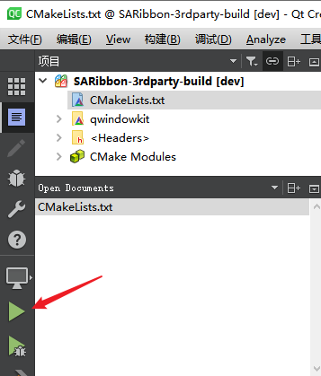
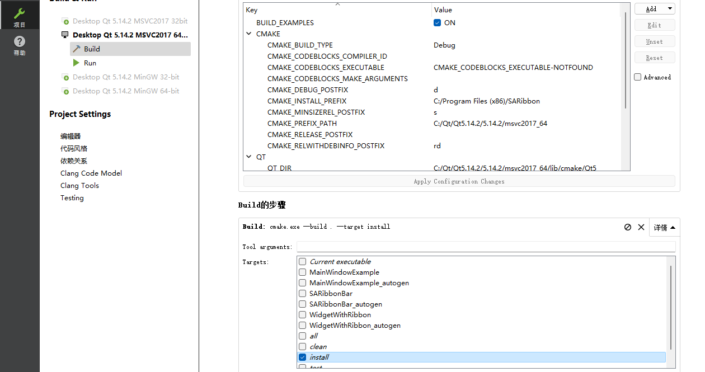

此文会详细介绍如何构建和引入SARibbon

# 准备工作

SARibbon使用了[QWindowkit](https://github.com/stdware/qwindowkit)作为无边框方案，同时也支持简单的无边框方案，如果你需要操作系统原生的窗口支持，如windows7以后的贴边处理，windows11的最大化按钮悬停的效果，建议开启[QWindowkit](https://github.com/stdware/qwindowkit)库，[QWindowkit](https://github.com/stdware/qwindowkit)库还能较好解决多屏幕移动问题

如果你要依赖[QWindowkit](https://github.com/stdware/qwindowkit)库，需要先编译[QWindowkit](https://github.com/stdware/qwindowkit)库，[QWindowkit](https://github.com/stdware/qwindowkit)库作为SARibbon项目的submodules，如果在`git clone`时没有附带`--recursive`参数，需要执行`submodule update`命令:

```shell
git submodule update --init --recursive
```

# 编译QWindowkit库(如果不开启跳过此步)

`QWindowkit`库只提供了cmake的编译方式，必须使用cmake

为了简单，在`src/SARibbonBar/3rdparty`下提供了一个`CMakeLists.txt`文件，已经对此库的必要配置进行了设置，直接调用`src/SARibbonBar/3rdparty/CMakeLists.txt`文件编译即可

使用Qt Creator和使用visual studio构建和安装基本一样

## 使用Qt Creator构建和安装

使用qt creator编译`QWindowkit`库，直接用qt creator打开`src/SARibbonBar/3rdparty/CMakeLists.txt`文件


点击运行（Ctrl+R）



切换到项目模式（Ctrl+5）

build步骤选择install


再点击运行（Ctrl+R）

这时你会在SARibbon根目录下看到形如`bin_qt5.14.2_Debug_x64`这样的安装目录，这里自动把`QWindowkit`库安装在此目录下


此时完成`QWindowkit`库的编译和安装

## 使用visual studio构建和安装

使用visual studio编译`QWindowkit`库，用visual studio打开->CMake，选择`src/SARibbonBar/3rdparty/CMakeLists.txt`文件


选中CMake菜单->全部生成


选中CMake菜单->安装


这时你会在SARibbon根目录下看到形如`bin_qt5.14.2_Debug_x64`这样的安装目录，这里自动把`QWindowkit`库安装在此目录下


此时完成`QWindowkit`库的编译和安装

# Cmake构建及使用SARibbon教程

最近发现有许多使用visual studio（以下简称vs）咨询可以构建但无法引入的问题，为此，这里专门写此文针对此问题进行说明

分两种方式，第一种使用cmake，个人推荐使用cmake对工程进行构建，毕竟能用到Ribbon的界面都算大型工程了

另外一种是直接通过visual studio建立的工程引入SARibbon

# 基于cmake的构建和使用

## vs下基于cmake的构建

点击文件->打开->Cmake 选中CMakeLists.txt


将会形成如下的构建树


直接点击CMake菜单->全部生成


全部生成完成后，CMake菜单->安装->SARibbon


这时候你会看到源码的根目录下多出一个文件夹,文件夹命名方式为`bin_qt{version}_[Debug/Release]_x[64/86]`（前提是你没有改变CMAKE_INSTALL_PREFIX）


## qtcreator下基于cmake的构建

点击文件->打开文件或项目选中CMakeLists.txt，加载完成后形成如下的构建树


点击运行按钮


运行结束，会弹出例子窗口，点击左侧边栏的项目标签，Build的步骤，选中install



再次点击运行按钮，这时候你会看到源码的根目录下多出一个文件夹,文件夹命名方式为`bin_qt{version}_[Debug/Release]_x[64/86]`（前提是你没有改变CMAKE_INSTALL_PREFIX）


使用SARibbon的所有内容都在这个文件夹下

# 基于cmake引入SARibbonBar

引用SARibbonBar和编译器无关，主要针对自己cmake文件的编写

1、指定SARibbonBar的安装目录，把安装目录下的`lib/cmake/SARibbonBar`位置设置给`SARibbonBar_DIR`变量

```cmake
set(SARibbonBar_DIR "C:\src\Qt\SARibbon\bin_qt5.14.2_Debug_x64\lib\cmake\SARibbonBar")
```

2、使用find_package找到SARibbonBar的Config文件，这个函数实际上是调用`lib/cmake/SARibbonBar/SARibbonBarConfig.cmake`文件，这里会把需要include的路径、预定义的宏，和需要添加的库给指定好，此时`SARibbonBar_INCLUDE_DIR`就是SARibbonBar的include文件路径

```cmake
find_package(SARibbonBar)
```

3、最后调用`target_link_libraries`添加SARibbonBar库到自己的工程中,这里${myapp_target_name}是自己工程的target名字

```cmake
target_link_libraries(${myapp_target_name} PUBLIC
    SARibbonBar
)
```