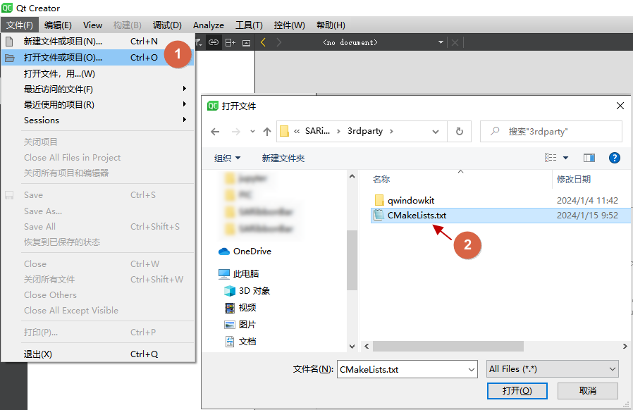
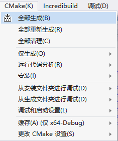

此文会详细介绍如何构建和引入SARibbon

# 准备工作

SARibbon使用了[QWindowkit](https://github.com/stdware/qwindowkit)作为无边框方案，同时也支持简单的无边框方案，如果你需要操作系统原生的窗口支持，如windows7以后的贴边处理，windows11的最大化按钮悬停的效果，建议开启[QWindowkit](https://github.com/stdware/qwindowkit)库，[QWindowkit](https://github.com/stdware/qwindowkit)库还能较好解决多屏幕移动问题

开启QWindowkit将能实现如下效果：


如果你要开启[QWindowkit](https://github.com/stdware/qwindowkit)，需要先编译[QWindowkit](https://github.com/stdware/qwindowkit)库，[QWindowkit](https://github.com/stdware/qwindowkit)库作为SARibbon项目的submodules，如果在`git clone`时没有附带`--recursive`参数，需要执行`submodule update`命令:

```shell
git submodule update --init --recursive
```

# 编译QWindowkit库(如果不开启跳过此步)

`QWindowkit`库只提供了cmake的编译方式，必须使用cmake

为了简单，在`src/SARibbonBar/3rdparty`下提供了一个`CMakeLists.txt`文件，已经对此库的必要配置进行了设置，直接调用`src/SARibbonBar/3rdparty/CMakeLists.txt`文件编译即可

使用Qt Creator和使用visual studio构建和安装基本一样

## 使用Qt Creator构建和安装QWindowkit库

使用qt creator编译`QWindowkit`库，直接用qt creator打开`src/SARibbonBar/3rdparty/CMakeLists.txt`文件



点击运行（Ctrl+R）


切换到项目模式（Ctrl+5）

build步骤选择install


再点击运行（Ctrl+R）

这时你会在SARibbon根目录下看到形如`bin_qt5.14.2_MSVC_x64`这样的安装目录，这里自动把`QWindowkit`库安装在此目录下


此时完成`QWindowkit`库的编译和安装

## 使用visual studio构建和安装QWindowkit库

使用visual studio编译`QWindowkit`库，用visual studio打开->CMake，选择`src/SARibbonBar/3rdparty/CMakeLists.txt`文件


选中CMake菜单->全部生成



选中CMake菜单->安装


这时你会在SARibbon根目录下看到形如`bin_qt5.14.2_MSVC_x64`这样的安装目录，这里自动把`QWindowkit`库安装在此目录下


此时完成`QWindowkit`库的编译和安装

# 构建SARibbonBar库

SARibbonBar库提供cmake和qmake两种方式构建，推荐使用cmake

## 基于CMake构建SARibbonBar库

### vs下基于cmake的构建

如果要开启`QWindowKit`，在CMakeLists.txt中把`SARIBBON_USE_FRAMELESS_LIB`的option值手动改为ON

```
# frameless能提供windows的窗口特效，如边缘吸附，且对高分屏多屏幕的支持更好,默认开启
option(SARIBBON_USE_FRAMELESS_LIB "Using the QWindowKit library as a frameless solution" ON)
```

点击文件->打开->Cmake 选中CMakeLists.txt


将会形成如下的构建树


直接点击CMake菜单->全部生成


全部生成完成后，CMake菜单->安装->SARibbon


这时候你会看到源码的根目录下多出一个文件夹,文件夹命名方式为`bin_qt{version}_[MSVC/GNU]_x[64/86]`（前提是你没有改变CMAKE_INSTALL_PREFIX）


### qtcreator下基于cmake的构建

点击文件->打开文件或项目选中CMakeLists.txt，加载完成后形成如下的构建树


Qt Creator可以在界面修改`SARIBBON_USE_FRAMELESS_LIB`值，也可以手动修改，在Qt Creator中，点击左侧边，切换到项目模式（Ctrl+5）,如下图，在Current Configuration中设置`SARIBBON_USE_FRAMELESS_LIB`为ON即可开启`QWindowKit`，前提是要先编译`QWindowKit`


点击运行按钮


运行结束，会弹出例子窗口，点击左侧边栏的项目标签，Build的步骤，选中install


再次点击运行按钮，这时候你会看到源码的根目录下多出一个文件夹,文件夹命名方式为`bin_qt{version}_[MSVC/GNU]_x[64/86]`（前提是你没有改变CMAKE_INSTALL_PREFIX）


使用SARibbon的所有内容都在这个文件夹下

## 基于QMake构建SARibbonBar

qmake构建SARibbonBar只需使用Qt Creator打开SARibbon.pro文件即可

> 注意，如果使用Qt Creator打开SARibbon.pro文件过程报错，那么你的账户可能是没有足够的写权限，不同版本的Qt Creator在不同操作系统由不一样的表现，建议使用cmake

# 使用SARibbonBar库

## 基于cmake引入SARibbonBar库

首先要通过cmake编译并执行安装，在自己的工程按照如下步骤执行：

1. 指定SARibbonBar的安装目录，把安装目录下的`lib/cmake/SARibbonBar`位置设置给`SARibbonBar_DIR`变量

```cmake
set(SARibbonBar_DIR "C:\src\Qt\SARibbon\bin_qt5.14.2_MSVC_x64\lib\cmake\SARibbonBar")
```

2. 使用find_package找到SARibbonBar的Config文件，这个函数实际上是调用`lib/cmake/SARibbonBar/SARibbonBarConfig.cmake`文件，这里会把需要include的路径、预定义的宏，和需要添加的库给指定好，此时`SARibbonBar_INCLUDE_DIR`就是SARibbonBar的include文件路径

```cmake
find_package(SARibbonBar)
```

3. 最后调用`target_link_libraries`添加SARibbonBar库到自己的工程中,这里${myapp_target_name}是自己工程的target名字

```cmake
target_link_libraries(${myapp_target_name} PUBLIC
    SARibbonBar
)
```

## 基于qmake引入SARibbonBar库

qmake的编译过程会在SARibbon下生成`bin_qt{Qt version}_{MSVC/GNU}_x{32/64}`文件夹，库文件和dll文件都在此文件夹下，importSARibbonBarLib.pri会自动把这个文件夹下的库引用进来

步骤如下：

1. 先在你的工程中建立一个3rdparty文件夹，再把整个SARibbon文件夹拷贝过去

> SARibbon内部已经有几个pri文件可以很方便的让你把工程引入到自己目录中，`./importSARibbonBarLib.pri`文件就是用于引入SARibbon库的

2. 在自己的Qt工程pro文件中加入如下语句即可

```shell
include($$PWD/3rdparty/SARibbon/importSARibbonBarLib.pri)
```

此时你的工程目录结构大致如下：

```
|-[you-project-dir]
|  |-you-project.pro
|  |-[3rdparty]
|     |-[SARibbon](直接把SARibbon完整复制过来)
|        |-importSARibbonBarLib.pri
|        |-SARibbonBar.pri
|        |-common.pri
|        |-[bin_qtx.x.x_{MSVC/GNU}_x{32/64}]
|        |-[src]
|        |   |-[SARibbonBar]
```

`importSARibbonBarLib.pri`、`SARibbonBar.pri`、`common.pri`这三个文件是引入工程的关键文件

> Qt6.0版本后已经放弃qmake，建议使用cmake来管理工程