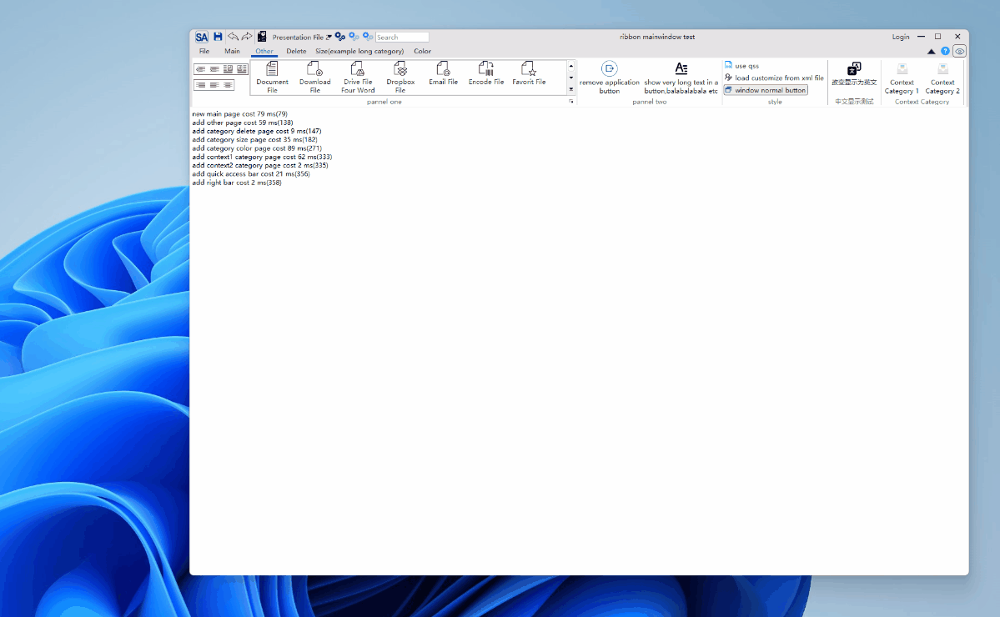
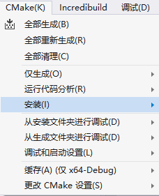

This document will detail how to build and introduce SARibbon.

# Preparation

SARibbon uses [QWindowkit](https://github.com/stdware/qwindowkit) as a borderless solution, while also supporting a simpler approach. If you require native window support from the operating system, such as edge sticking in Windows 7 or later, and hover effects on the maximize button in Windows 11, it is recommended to enable the [QWindowkit](https://github.com/stdware/qwindowkit) library. The [QWindowkit](https://github.com/stdware/qwindowkit) library can also better handle multi-screen movement issues.

Enabling QWindowkit will achieve the following effects:



If you want to enable [QWindowkit](https://github.com/stdware/qwindowkit), you need to first compile the [QWindowkit](https://github.com/stdware/qwindowkit) library. As the [QWindowkit](https://github.com/stdware/qwindowkit) library is a submodule of the SARibbon project, if you did not include the `--recursive` parameter during `git clone`, you need to execute the `submodule update` command:

```shell
git submodule update --init --recursive
```

# Compile QWindowkit Library (Skip this step if not enabled)

`QWindowkit` library provides only cmake compilation method, and cmake must be used.

For simplicity, a `CMakeLists.txt` file is provided under `src/SARibbonBar/3rdparty`, which has already set up the necessary configurations for this library. Simply call the `src/SARibbonBar/3rdparty/CMakeLists.txt` file to compile.

Building with Qt Creator is similar to using Visual Studio.

## Build and Install QWindowkit Library with Qt Creator

Compile the `QWindowkit` library using Qt Creator by directly opening the `src/SARibbonBar/3rdparty/CMakeLists.txt` file.


Click run (Ctrl+R).


Switch to the Projects mode (Ctrl+5).

Select the 'install' option for the build step.


Click run again (Ctrl+R).

You will now see an installation directory like `bin_qt5.14.2_MSVC_x64` in the SARibbon root directory. The `QWindowkit` library is automatically installed in this directory.


This completes the compilation and installation of the `QWindowkit` library.

## Build and Install QWindowkit Library with Visual Studio

Compile the `QWindowkit` library using Visual Studio by opening CMake and selecting the `src/SARibbonBar/3rdparty/CMakeLists.txt` file.


Select CMake menu->Generate All.


Select CMake menu->Install.



You will now see an installation directory like `bin_qt5.14.2_MSVC_x64` in the SARibbon root directory. The `QWindowkit` library is automatically installed in this directory.


This completes the compilation and installation of the `QWindowkit` library.

# Build SARibbonBar Library

SARibbonBar library provides two ways to build: cmake and qmake. It is recommended to use cmake.

## Build SARibbonBar Library with CMake

### Building with CMake in Visual Studio

To enable `QWindowKit`, manually set the value of the `SARIBBON_USE_FRAMELESS_LIB` option to ON in the CMakeLists.txt file:

```
option(SARIBBON_USE_FRAMELESS_LIB "Using the QWindowKit library as a frameless solution" ON)
```

Open file->Open->CMake and select CMakeLists.txt.


The build tree will look like this:


Click CMake menu->Generate All.


After generation, click CMake menu->Install->SARibbon.


You will see a new folder in the root directory named `bin_qt{version}_{MSVC/GNU}_x{64/86}` (assuming you did not change CMAKE_INSTALL_PREFIX).


### Building with CMake in Qt Creator

Click File->Open File or Project and select CMakeLists.txt. Once loaded, the project tree will appear as follows:


In Qt Creator, you can modify the value of `SARIBBON_USE_FRAMELESS_LIB` in the interface or manually. Switch to the Projects mode (Ctrl+5), navigate to Current Configuration, and set `SARIBBON_USE_FRAMELESS_LIB` to ON to enable `QWindowKit`, assuming you have compiled `QWindowKit` first.


Click the run button.


After completion, a sample window will pop up. Click the Build steps in the sidebar, and select install.


Click run again, and you will see a new folder in the root directory named `bin_qt{version}_{MSVC/GNU}_x{64/86}` (assuming you did not change CMAKE_INSTALL_PREFIX).


All contents related to using SARibbon are located in this folder.

## Build SARibbonBar Library with QMake

Building SARibbonBar with qmake only requires opening the SARibbon.pro file in Qt Creator.

Note: If there are errors during the process of opening the SARibbon.pro file in Qt Creator, your account may lack sufficient write permissions. Different versions of Qt Creator exhibit different behaviors on different operating systems. It is recommended to use cmake.

# Using SARibbonBar Library

## Introducing SARibbonBar with CMake

First, compile and install SARibbonBar using cmake in your project:

1. Specify the SARibbonBar installation directory and set the `SARibbonBar_DIR` variable to point to the `lib/cmake/SARibbonBar` location in the installation directory.

```cmake
set(SARibbonBar_DIR "C:\src\Qt\SARibbon\bin_qt5.14.2_MSVC_x64\lib\cmake\SARibbonBar")
```

2. Use `find_package` to locate the SARibbonBar Config file. This function actually calls the `lib/cmake/SARibbonBar/SARibbonBarConfig.cmake` file, which sets up the necessary include paths, predefined macros, and libraries to add. At this point, `SARibbonBar_INCLUDE_DIR` is the path to the SARibbonBar include files.

```cmake
find_package(SARibbonBar)
```

3. Finally, use `target_link_libraries` to add the SARibbonBar library to your project. Here, `${myapp_target_name}` is the target name of your project.

```cmake
target_link_libraries(${myapp_target_name} PUBLIC
    SARibbonBar
)
```

## Introducing SARibbonBar with QMake

During the qmake compilation process, a `bin_qt{Qt version}_{MSVC/GNU}_x{32/64}` folder will be generated under SARibbon, containing library and dll files. The `importSARibbonBarLib.pri` file will automatically reference the libraries in this folder.

Follow these steps:

1. Create a `3rdparty` folder in your project and copy the entire SARibbon folder into it.

> Inside SARibbon, there are several `.pri` files that can easily integrate the project into your directory. The `importSARibbonBarLib.pri` file is used to import the SARibbon library.

2. Add the following statement to your project's Qt project pro file:

```shell
include($$PWD/3rdparty/SARibbon/importSARibbonBarLib.pri)
```

Your project directory structure should look roughly like this:

```
|-[you-project-dir]
|  |-you-project.pro
|  |-[3rdparty]
|     |-[SARibbon](Copy SARibbon entirely here)
|        |-importSARibbonBarLib.pri
|        |-SARibbonBar.pri
|        |-common.pri
|        |-[bin_qtx.x.x_{MSVC/GNU}_x{32/64}]
|        |-[src]
|        |   |-[SARibbonBar]
```

These three files (`importSARibbonBarLib.pri`, `SARibbonBar.pri`, `common.pri`) are crucial for integrating the project.

> Note: Starting from Qt 6.0, qmake has been abandoned. It is recommended to use cmake to manage projects.