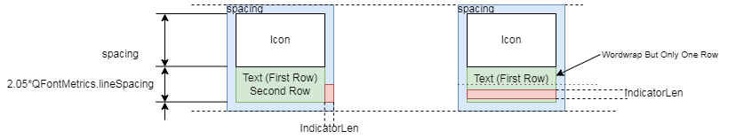

Ribbon界面无法用普通的tab+toolbutton组合来实现主要就是因为ribbon界面对工具按钮有特殊的渲染方式，和经典菜单按钮是有很大不同的，在没有菜单的情况下没有什么区别，但有菜单的情况下，会有明显不同

差别主要通过下面这个动图可以提现，尤其是在MenuPopup模式下，按钮会被拆分为两部分，普通的工具栏是左右拆分，而ribbon的工具按钮是上下拆分

# ribbon工具栏按钮绘制方案

`SARibbon`的工具栏按钮为`SARibbonToolButton`，它继承`QToolButton`，重写了其绘图方法

工具栏按钮分3个矩形区域，一个是icon绘制区域，一个是文本显示区域，一个是indicator绘制区域

三个区域会有两种布局方案，根据文本是否换行来进行布局

## 文字换行显示的布局方案

换行模式下，文本区域会占据两行行高，office的word就是这种布局方案

可以看到，第一个pannel文本没有换行，会有一行的留白，第二个pannel文本都换行，充满了文本区域,且能看到菜单的箭头在第二行最右边

对于没有换行的文本，但有菜单的情况下，indicator在第二行文本处

下图为`SARibbonToolButton`文本换行的布局方案

indicator是有菜单时的下箭头提示，在文本确切要换行时，下箭头在第二行文本的最右边，若在换行模式，但文本没有换行，第二行的位置就用来显示indicator

> 注意，如果文本太长，`SARibbonToolButton`会尝试换行，由于英文的文本每个单词不是定长，因此会在原有文本单行显示的长度基础上先尝试1/2的长度能否换行完全显示，如果显示不了，就把长度递增为1/2+1/3，并继续尝试，如果3次都无法容纳下，就显示为原来的长度

> 注意，换行模式下，用户可以手动给文本换行，就是加入`\n`换行，加入`\n`的文本，`SARibbonToolButton`就不用进行换行估算

> 注意，带有`\n`的文本在不换行模式下也可正常显示，此时`\n`会被忽略掉

## 文字不换行显示的布局方案

对于不换行的方案，最经典的就是wps的布局方案，wps-word所有文字都是一行，不存在换行的情况，indicator布置在最右边

wps的方案尤其适合显示中文文本，但英文会有可能放不下，或者英文太长，单行很难显示全，因此如果要显示英文，建议使用换行方案，要显示中文，建议使用不换行方案

`SARibbonToolButton`不换行的布局方案如下

# 如何布置一个更美观的Ribbon界面

如果文字都比较短，又没有菜单情况下，使用换行模式显示会有一行文本的留白，如果很多的话会不太美观

此时又如下几种方案：

- 大小搭配，如2个大按钮搭配3个小按钮
- 使用\n强制换行,尤其是4个文字的情况下可以两个两个