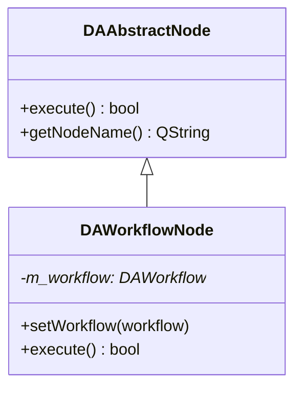
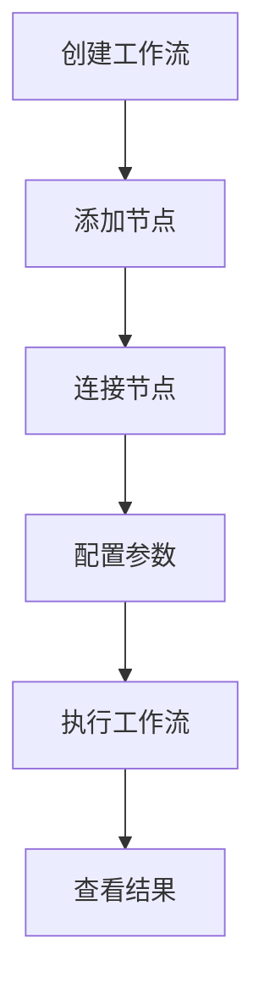
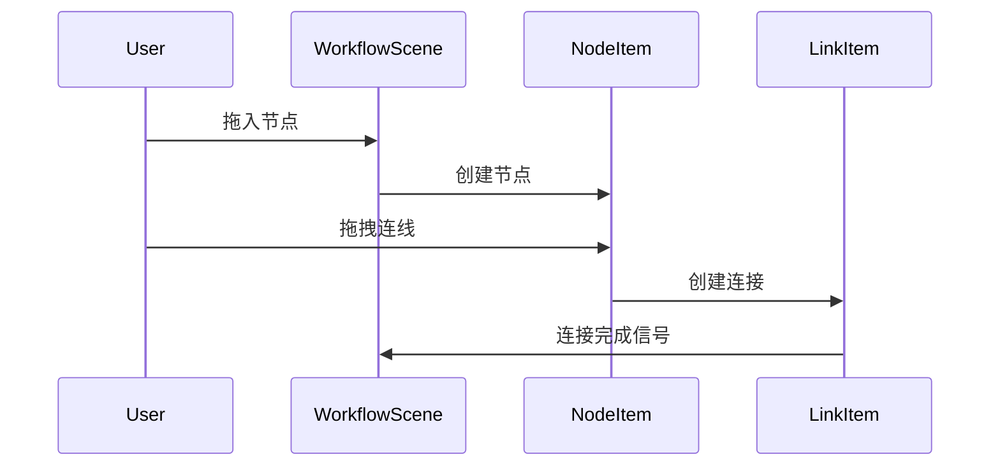

# SARibbon 文档撰写规范手册

本规范用于指导 SARibbon 项目中文文档的撰写，确保文档风格统一、内容完整、易于理解。

项目文档使用 mkdocs 组织，采用 [mkdocs-material](https://squidfunk.github.io/mkdocs-material/getting-started/) 主题。文档绘图优先考虑 `mermaid`。

## 文档结构规范

### 1. 标题层级

```markdown
# 模块名称/功能名称
## 主要功能特性
## 基本概念
## 使用方法
### 子功能模块
#### 具体功能点
## API 参考
## 注意事项
## 参考资料
```

### 2. 必备章节

每个功能文档应包含以下章节：

| 章节 | 必备程度 | 说明 |
|------|----------|------|
| 功能概述 | 必备 | 开头一句话说明模块用途和特点 |
| 主要功能特性 | 必备 | 列举核心功能，使用 ✅ 标记 |
| 使用方法 | 必备 | 详细使用步骤和代码示例 |
| API 参考 | 推荐 | 核心类、方法、属性的表格说明 |
| 注意事项 | 推荐 | 使用 `!!!` 格式标注重要信息 |
| 参考资料 | 可选 | 相关文档、示例路径链接 |

## 内容撰写原则

### 1. 文字说明要求

- **每个代码块前后必须有文字说明**：解释代码作用、关键步骤、输出效果
- **避免纯代码堆砌**：文字说明应占文档主体 60% 以上
- **逐步引导**：按照"是什么 → 为什么 → 怎么用"的逻辑顺序组织

### 2. 功能介绍格式

使用功能列表形式，每项功能前加 ✅ 标记：

```markdown
**特性**

- ✅ **功能名称**：简要说明
- ✅ **另一功能**：简要说明
```

### 3. 代码示例规范

代码示例必须包含：

1. **注释说明**：关键行必须有中文注释
2. **完整可运行**：示例代码应可直接编译运行
3. **效果说明**：代码后说明运行效果

```cpp
// 注释
代码示例
```

### 4. 概念解释要求

对于复杂概念，使用以下方式辅助说明：

- **mermaid UML图**：展示类关系、继承结构
- **mermaid 流程图**：展示工作流程、数据流
- **mermaid 时序图**：展示交互过程
- **配图**：实际效果截图

### 5. 注意事项格式

使用 mkdocs-material 扩展语法标注重要信息：

```markdown
!!! warning "重要警告"
    可能导致严重问题的注意事项

!!! info "说明"
    补充说明信息

!!! tip "技巧"
    使用技巧和建议

!!! example "示例"
    示例代码路径：`examples/xxx`

!!! bug "已知问题"
    已知缺陷和规避方法

!!! note "Qt版本兼容性"
    Qt5 和 Qt6 的差异说明
```

### 6. 属性/方法说明格式

表格形式展示核心属性和方法：

```markdown
### 核心方法

| 方法 | 参数 | 返回值 | 说明 |
|------|------|--------|------|
| `setXXX(param)` | int* | void | 一句话说明作用 |

### 核心属性

| 属性 | 类型 | 说明 |
|------|------|------|
| `name` | QString | 一句话说明作用 |
```

## 图表使用规范

### 1. mermaid 类图

用于展示类的继承关系、组合关系：



注意，类图非常关键，能让读者清晰了解这个类的全貌

### 2. mermaid 流程图

用于展示使用流程、工作流程：



### 3. mermaid 时序图

用于展示模块间交互、信号槽连接：



### 4. 效果截图

实际运行效果图片放在 `docs/assets/` 目录：

```markdown

```

效果截图前应说明对应的示例位置：

```markdown
示例位于 `examples/xxx`，效果截图如下：


```

## mkdocs-material 语法

### 1. Admonition 格式

```markdown
!!! type "标题"
    内容内容内容
```

支持的类型：
- `note` - 备注
- `info` - 信息
- `tip` - 技巧
- `warning` - 警告
- `danger` - 危险
- `bug` - 已知问题
- `example` - 示例
- `quote` - 引用

### 2. 代码高亮

```markdown
```cpp
// C++ 代码
```

```python
# Python 代码
```

```cmake
# CMake 代码
```
```

### 3. 脚注

```markdown
这是一个脚注引用[^1]。

[^1]: 这是脚注内容。
```

### 4. 任务列表

```markdown
- [x] 已完成
- [ ] 未完成
```


### 2. Qt 信号槽描述规范

描述信号槽时使用以下格式：

```markdown
### 信号

| 信号 | 参数 | 触发时机 |
|------|------|----------|
| `dataChanged()` | 无 | 数据发生变化时 |
| `nodeAdded(node)` | DAAbstractNode* | 添加节点时 |

### 槽函数

| 槽函数 | 参数 | 说明 |
|--------|------|------|
| `refreshData()` | 无 | 刷新数据显示 |
```

### 3. CMake 配置示例格式

```cmake
# 添加模块依赖
find_package(Qt6 REQUIRED COMPONENTS Core Widgets)

# 添加源文件
set(SOURCES
    src/main.cpp
    src/workflow.cpp
)

# 创建库
add_library(DAWorkflow ${SOURCES})
target_link_libraries(DAWorkflow
    PRIVATE
        Qt6::Core
        Qt6::Widgets
)
```

### 4. 版本兼容性说明格式

```cpp
#if QT_VERSION < QT_VERSION_CHECK(6, 0, 0)
    // Qt5 的实现
    QRegExp rx(pattern);
#else
    // Qt6 的实现
    QRegularExpression rx(pattern);
#endif
```

版本兼容性说明框：

```markdown
!!! note "Qt版本兼容性"
    此功能在 Qt5 和 Qt6 中实现方式不同：
    
    - **Qt5**: 使用 QRegExp
    - **Qt6**: 使用 QRegularExpression
```


## 撰写流程建议

1. **收集信息**：阅读类头文件、源代码、示例代码、相关文档
2. **确定结构**：按照必备章节规划文档框架
3. **编写内容**：
   - 先写功能概述和特性列表
   - 再写使用方法，每个代码块配合文字说明
   - 补充 API 参考表格
   - 添加注意事项和参考资料
4. **添加图表**：绘制类图、流程图、时序图
5. **审阅修订**：检查代码可运行性、文字通顺度、格式一致性

---

本规范适用于 SARibbon 项目所有中文文档的撰写。