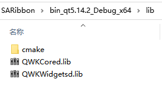

# Third-Party Library Build Guide

!!! warning 
    Skip this document if you do not plan to enable **QWindowkit**.  
    QWindowkit offers a superior borderless-window solution that respects native OS behaviors (snap, maximize animations, etc.) and handles multi-monitor / mixed-DPI relocation correctly.

## Building the QWindowkit library

QWindowkit **must** be built with CMake; no qmake project is provided.

For your convenience a ready-to-use `CMakeLists.txt` is placed in  
`src/SARibbonBar/3rdparty`.  
Open or invoke that file to build and install the library.

The steps are almost identical for **Qt Creator** and **Visual Studio**.


### Qt Creator route

1. Open `src/SARibbonBar/3rdparty/CMakeLists.txt` in Qt Creator.  
   

2. Press **Run** (Ctrl+R).  
   

3. Switch to **Projects** mode (Ctrl+5).

4. In the **Build** steps tick `install`.  
   (Some Creator versions cannot select `all` and `install` together; build `all` first, then `install`).  
   

5. Press **Run** again.

When finished you will find a folder such as  
`bin_qt5.14.2_MSVC_x64` in the SARibbon root; QWindowkit is installed inside.  


Done.


### Visual Studio route

1. Open the folder `src/SARibbonBar/3rdparty` as a CMake project in Visual Studio.  
   

2. Choose **Build → Build All** (or right-click `CMakeLists.txt` → **Build**).  
   

3. Choose **Build → Install** (same right-click alternative).  
     
   

The same `bin_qt5.14.2_MSVC_x64`-style folder appears in the SARibbon root.  


Done.


### Command-line route (Qt 5, VS ≤ 2019)

QWindowkit needs a recent CMake.  
The bundled CMake in VS 2019 (or older) is often too old, so build from the terminal:

1. Install CMake ≥ 3.20 and note its path, e.g.  
   `C:\Program Files (x86)\CMake\cmake-3.27.9\bin\cmake.exe`

2. Know your Qt kit, e.g. Qt 5.14.2 / MSVC 2017 64-bit.

3. Locate `Qt5Config.cmake`, typically  
   `C:\Qt\Qt5.14.2\5.14.2\msvc2017_64\lib\cmake\Qt5`

4. Open a **Developer Command Prompt** for your compiler, cd to  
   `src/SARibbonBar/3rdparty` and run:

   ```cmd
   cmake -B build -S . -G "Visual Studio 15 2017" -A x64 ^
         -DQt5_DIR=C:\Qt\Qt5.14.2\5.14.2\msvc2017_64\lib\cmake\Qt5
   ```

   (Use quotes if the path contains spaces.)

   Output similar to:  
   

5. Build and install both configurations:

   ```cmd
   cmake --build build --target install --config Debug
   cmake --build build --target install --config Release
   ```

The same local install folder (`bin_qt5.14.2_MSVC_x64`) is produced.