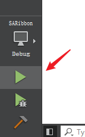

# Building SARibbon Library

The `SARibbon` library provides two build methods: `CMake` and `QMake`, with `CMake` being recommended.

!!! warning "Note"
    Qt6 no longer maintains `QMake` and is gradually shifting to `CMake`. Future versions of SARibbon will remove `QMake` support.

## Building the SARibbon Library with CMake

### Building under Visual Studio

1. If you want to enable `QWindowKit`, change the option `SARIBBON_USE_FRAMELESS_LIB` to ON in `CMakeLists.txt`.

2. Open the CMake project and select `CMakeLists.txt`.

   

3. The following build tree will be formed.

   

4. Directly select "Build All" in the CMake menu (some versions do not have a CMake menu; you can right-click on `CMakeLists.txt`).

   

5. After all builds are completed, select "Install" -> "SARibbon" in the CMake menu (some versions do not have a CMake menu; you can right-click on `CMakeLists.txt`).

   

At this point, you will see a new folder in the root directory of the source code. The folder is named in the format `bin_qt{version}_[MSVC/GNU]_x[64/86]` (you can use the default installation location by setting the `SARIBBON_INSTALL_IN_CURRENT_DIR` variable to OFF: `SARIBBON_INSTALL_IN_CURRENT_DIR=OFF`).

   

### Building with Qt Creator

Click File -> Open File or Project, select CMakeLists.txt, and after loading, the following build tree will be formed.

Qt Creator allows modifying the value of `SARIBBON_USE_FRAMELESS_LIB` in the interface, or you can modify it manually. In Qt Creator, click the left sidebar to switch to Project mode (Ctrl+5), and set `SARIBBON_USE_FRAMELESS_LIB` to ON in Current Configuration to enable `QWindowKit`, provided that `QWindowKit` has been compiled first.

Click the run button.

After the run ends, an example window will pop up. Click the Project tab in the left sidebar, go to the Build steps, and select install.

Click the run button again, and at this time you will see a new folder in the root directory of the source code. The folder is named in the format `bin_qt{version}_[MSVC/GNU]_x[64/86]` (provided that you have not changed CMAKE_INSTALL_PREFIX).

All content for using SARibbon is in this folder.

## Building SARibbonBar with QMake

To build SARibbon with qmake, simply open the `SARibbon.pro` file using Qt Creator.

!!! warning "Note"
    If an error occurs while opening the `SARibbon.pro` file with Qt Creator, your account may not have sufficient write permissions. Different versions of Qt Creator behave differently on different operating systems, so it is recommended to use cmake.