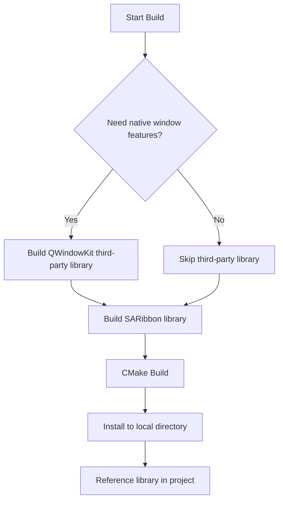

# SARibbon Build Instructions

- ✅ **Static approach**: add `SARibbon.h` + `SARibbon.cpp` directly — no build needed
- ✅ **Dynamic library build**: CMake-based, with compiler/version-isolated install
- ✅ **Optional QWindowKit**: native OS window features (snap layout, multi-monitor)

!!! tip
    You don't need to compile SARibbon — just add `SARibbon.h` and `SARibbon.cpp` (located in the `src` directory) to your project.

This document explains in detail how to build SARibbon dynamically.  
If you are not familiar with building, we recommend the static approach: simply add `SARibbon.h` and `SARibbon.cpp` to your project and you are ready to go.

## Sub-document Navigation

| Document | Content |
|----------|---------|
| [Building SARibbon Library](./build-SARibbon.md) | CMake build options and detailed steps |
| [Third-Party Library Build](./build-3rdparty.md) | How to compile QWindowKit |
| [Common Build Errors](./common-build-errors.md) | Troubleshooting compilation issues |
| [Internationalization](./i18n.md) | Translation file generation and new languages |

## Build Workflow Overview

SARibbon building is divided into two parts: third-party dependencies (optional) and SARibbon itself. The following flowchart shows the overall build route:



!!! warning "Note"
    SARibbon removed qmake-based builds after v2.6.3 and only supports CMake. If you need qmake support, use v2.6.2 or earlier.

## QWindowKit Third-Party Library

SARibbon uses [QWindowKit](https://github.com/stdware/qwindowkit) as its borderless-window solution, while also supporting a simple built-in borderless mode. If you need native OS window features, such as Windows 7+ snap-to-edge handling or Windows 11 Snap Layout effects, it is recommended to enable the [QWindowKit](https://github.com/stdware/qwindowkit) library. This library also effectively addresses multi-monitor movement issues.

After enabling QWindowKit, you will be able to achieve effects like:


To enable [QWindowKit](https://github.com/stdware/qwindowkit), you need to compile the library first. For detailed steps, see [Third-Party Library Build](./build-3rdparty.md).

!!! warning "Note"
    As a submodule of the SARibbon project, if you did not use the `--recursive` flag during `git clone`, run:
    ```shell
    git submodule update --init --recursive
    ```

## Building the SARibbon Library

SARibbon only supports the CMake build approach (qmake support was removed after v2.6.3). For detailed build steps and configuration options, see [Building SARibbon Library](./build-SARibbon.md).

If you encounter issues during the build process, see [Common Build Errors](./common-build-errors.md).

## Installation Location

After CMake finishes building, the `install` target will deploy all dependencies.  
Consumers can simply call `find_package` to pull in libraries, dependencies and predefined macros—this is the recommended workflow.

During development, however, you often need to switch between compilers (MSVC, MinGW, …) and Qt versions.  
Using the default global location (e.g. `C:\Program Files` on Windows) allows only one variant to be installed at a time.

To keep builds isolated, SARibbon defaults to **local installation**.  
A folder is created whose name encodes the Qt version and compiler, e.g.  
`bin_qt{version}_[MSVC|GNU]_x[64|86]`.

You can control this behaviour with the CMake option  
`SARIBBON_INSTALL_IN_CURRENT_DIR` (default `ON`).  
When `ON`, the above local folder is used; when `OFF`, the standard system location is used.