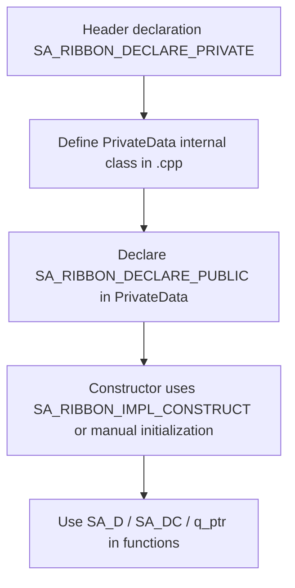

# PIMPL Development Standard

SARibbon uses the PIMPL (Private Implementation) pattern, encapsulating implementation details in an internal `PrivateData` class while exposing a public interface. This document details the PIMPL macro usage and coding conventions in SARibbon.

## Why This Standard Exists

The PIMPL pattern is a common practice in Qt projects. It provides:

- **Hidden implementation details**: Reduces header file compilation dependencies, speeds up compilation
- **Stable ABI**: Modifying private members does not affect binary compatibility
- **Encapsulated internal data**: Public interface stays clear, private implementation can change freely

## PIMPL Macro Reference

The macros required for SARibbon's PIMPL pattern live in `src/SARibbonBar/SARibbonGlobal.h`. The main macros are:

### SA_RIBBON_DECLARE_PRIVATE

Declares the PIMPL private member in the class. It generates:

- Forward declaration of the internal class `PrivateData`
- Mutual friend declaration
- `std::unique_ptr<PrivateData> d_ptr` member variable

Macro definition (SARibbonGlobal.h:83-88):

```cpp
#define SA_RIBBON_DECLARE_PRIVATE(classname)                                                                           \
    class PrivateData;                                                                                                 \
    friend class classname::PrivateData;                                                                               \
    std::unique_ptr< PrivateData > d_ptr;
```

Usage. Place in the header file class definition, immediately after `Q_OBJECT`:

```cpp
class SA_RIBBON_EXPORT SARibbonCategory : public QFrame
{
    Q_OBJECT
    SA_RIBBON_DECLARE_PRIVATE(SARibbonCategory)  // Generates d_ptr and forward declaration of PrivateData internal class
    friend class SARibbonBar;
    friend class SARibbonContextCategory;
    // ...
};
```

!!! warning "Note"
    `SA_RIBBON_DECLARE_PRIVATE` uses `std::unique_ptr<PrivateData>` rather than Qt's `QScopedPointer` or raw pointers. This means the `PrivateData` destructor must be visible in the `.cpp` file, otherwise a compilation error occurs.

### SA_RIBBON_DECLARE_PUBLIC

Declares the public member in the internal `PrivateData` class. It generates:

- Mutual friend declaration (allows PrivateData to access the owner class's private members)
- `classname* q_ptr { nullptr }` back-pointer member variable
- Deleted copy constructor and assignment operator

Macro definition (SARibbonGlobal.h:103-109):

```cpp
#define SA_RIBBON_DECLARE_PUBLIC(classname)                                                                            \
    friend class classname;                                                                                            \
    classname* q_ptr { nullptr };                                                                                      \
    PrivateData(const PrivateData&)            = delete;                                                               \
    PrivateData& operator=(const PrivateData&) = delete;
```

Usage. Place in the `.cpp` file within the `PrivateData` class definition:

```cpp
// SARibbonCategory.cpp
class SARibbonCategory::PrivateData
{
    SA_RIBBON_DECLARE_PUBLIC(SARibbonCategory)  // Generates q_ptr back-pointer
public:
    PrivateData(SARibbonCategory* p);
    // Private implementation data...
};
```

### SA_RIBBON_IMPL_CONSTRUCT

A convenience macro for constructing `PrivateData` in the constructor initializer list:

Macro definition (SARibbonGlobal.h:122-124):

```cpp
#define SA_RIBBON_IMPL_CONSTRUCT d_ptr(std::make_unique< PrivateData >(this))
```

Expanded equivalent:

```cpp
SARibbonCategory::SARibbonCategory(QWidget* p)
    : QFrame(p), d_ptr(std::make_unique<PrivateData>(this))
{
}
```

!!! note "Construction pattern in practice"
    `SA_RIBBON_IMPL_CONSTRUCT` exists in `SARibbonGlobal.h` but is **never used** in the actual codebase. All real constructors use the explicit pattern `d_ptr(new X::PrivateData(this))` instead of `std::make_unique`. Follow the actual code pattern, not the macro.

### SA_D and SA_DC

Convenience macros for obtaining the `d_ptr` pointer:

- **SA_D**: Obtains `PrivateData*` in non-const functions
- **SA_DC**: Obtains `const PrivateData*` in const functions

Macro definition (SARibbonGlobal.h:137-154):

```cpp
#define SA_D(pointerName) PrivateData* pointerName = d_ptr.get()
#define SA_DC(pointerName) const PrivateData* pointerName = d_ptr.get()
```

Usage example (SARibbonBar.cpp:1493-1496):

```cpp
void SARibbonBar::showMinimumModeButton(bool isShow)
{
    SA_D(d);  // Expands to PrivateData* d = d_ptr.get()
    if (isShow && !(d->mMinimumCategoryButtonAction)) {
        // Access private members directly through d
        d->mMinimumCategoryButtonAction = new QAction(this);
    }
}
```

Example from SARibbonMainWindow.cpp:202-207:

```cpp
SARibbonMainWindow::SARibbonMainWindow(QWidget* parent, SARibbonMainWindowStyles style, const Qt::WindowFlags flags)
    : QMainWindow(parent, flags), d_ptr(new SARibbonMainWindow::PrivateData(this))
{
    SA_D(d);  // Expands to PrivateData* d = d_ptr.get()
    d->mRibbonMainWindowStyle = style;
    d->checkMainWindowFlag();
}
```

### SA_Q and SA_QC

Convenience macros for obtaining the `q_ptr` pointer from within `PrivateData` methods:

- **SA_Q**: Obtains non-const pointer to `q_ptr`
- **SA_QC**: Obtains const pointer to `q_ptr`

Macro definition (SARibbonGlobal.h:167-184):

```cpp
#define SA_Q(pointerName) auto* pointerName = q_ptr
#define SA_QC(pointerName) const auto* pointerName = q_ptr
```

!!! note "SA_Q / SA_QC are unused"
    These macros are defined in `SARibbonGlobal.h` but have **zero usages** in the entire codebase. They are documented here for completeness. Existing code accesses the public class directly via `q_ptr`.

## Usage

### Complete PIMPL Class Structure

Below is the full class structure example using the PIMPL pattern in SARibbon, based on actual `SARibbonCategory` code:

**Header file (.h) -- SARibbonCategory.h:**

```cpp
/**
 * \if ENGLISH
 * @brief Ribbon category page containing multiple panels
 *
 * Each Category represents a tab page in the Ribbon, containing multiple panels (SARibbonPanel).
 * It acts as a container for organizing related actions and controls into logical groups.
 * \endif
 *
 * \if CHINESE
 * @brief 包含多个面板的Ribbon类别页面
 *
 * 每个Category代表Ribbon中的一个标签页，包含多个面板（SARibbonPanel）。
 * 它作为一个容器，用于将相关的操作和控件组织成逻辑组。
 * \endif
 */
class SA_RIBBON_EXPORT SARibbonCategory : public QFrame
{
    Q_OBJECT
    SA_RIBBON_DECLARE_PRIVATE(SARibbonCategory)  // PIMPL declaration
    friend class SARibbonBar;
    friend class SARibbonContextCategory;

    // Q_PROPERTY without comments!
    Q_PROPERTY(bool isCanCustomize READ isCanCustomize WRITE setCanCustomize)
    Q_PROPERTY(QString categoryName READ categoryName WRITE setCategoryName)

public:
    /// Constructor
    explicit SARibbonCategory(QWidget* p = nullptr);
    /// Constructor with name
    explicit SARibbonCategory(const QString& name, QWidget* p = nullptr);
    // Omitted...
};
```

**Source file (.cpp) -- SARibbonCategory.cpp:**

```cpp
class SARibbonCategory::PrivateData
{
    SA_RIBBON_DECLARE_PUBLIC(SARibbonCategory)  // Back-pointer declaration

public:
    PrivateData(SARibbonCategory* p);

    SARibbonPanel* addPanel(const QString& title);
    // ...other helper methods...

public:
    bool enableShowPanelTitle { true };             ///< Whether to allow panel title bar display
    int panelTitleHeight { 15 };                    ///< Default panel title bar height
    bool isContextCategory { false };               ///< Whether this is a context category
    bool isCanCustomize { true };                   ///< Whether customization is allowed
    int panelSpacing { 0 };                         ///< Panel spacing
    // ...other member variables...
};

SARibbonCategory::PrivateData::PrivateData(SARibbonCategory* p) : q_ptr(p)
{
}

// Omitted: SARibbonCategory::PrivateData function implementations

SARibbonCategory::SARibbonCategory(QWidget* p)
    : QFrame(p), d_ptr(new SARibbonCategory::PrivateData(this))  // Project convention: d_ptr(new ...) not SA_RIBBON_IMPL_CONSTRUCT
{
}

QString SARibbonCategory::categoryName() const
{
    // SA_DC(d) can be used in const functions for read-only pointer
    // This is an example; actual code also uses d_ptr-> or member variables directly
    return windowTitle();
}

void SARibbonCategory::setCategoryName(const QString& title)
{
    // SA_D(d) can be used in non-const functions to get pointer
    setWindowTitle(title);
    Q_EMIT categoryNameChanged(title);
}
```

### PIMPL Usage Flow



!!! warning "Notes"
    - `SA_D` is for non-const functions, `SA_DC` for const functions. Do not mix them
    - The variable name `d` is convention, but other names are acceptable
    - The `PrivateData` class definition lives in the `.cpp` file, never in the header. This ensures private members are fully hidden
    - Use `///<` trailing comments for member descriptions in `PrivateData` (e.g. `bool isContextCategory { false }; ///< Whether this is a context category`)

**If a class uses PIMPL, the header file must never contain private member variable definitions. All private members belong in the `PrivateData` class.**

## References

- Related standards: [Qt Integration Standard](qt-integration.md), [Code Style and Commenting Standard](coding-standards.md)
- Source location: `src/SARibbonBar/SARibbonGlobal.h` (contains all PIMPL macro definitions)
