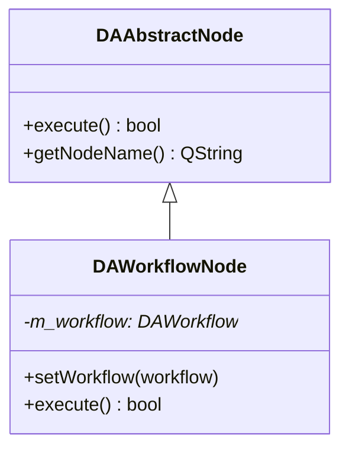
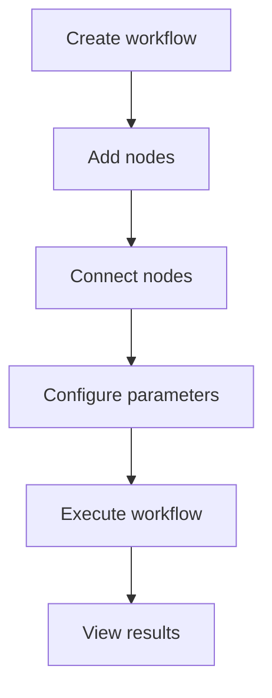
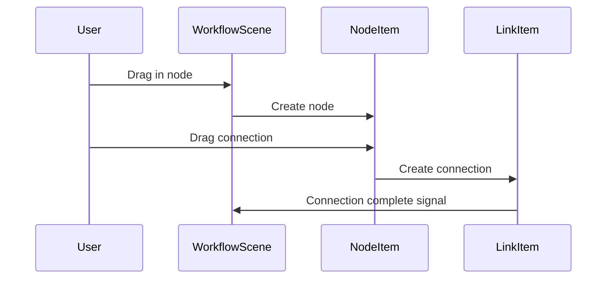

# SARibbon Documentation Writing Guide

This guide defines the writing standards for SARibbon project documentation, ensuring consistent style, complete content, and clear presentation.

Project documentation is organized with mkdocs using the [mkdocs-material](https://squidfunk.github.io/mkdocs-material/getting-started/) theme. Diagrams should prefer `mermaid` syntax.

## Documentation Directory Structure

The project uses **folder-based i18n** (handled by the `mkdocs-static-i18n` plugin), with each language in its own directory:

```
docs/
  overrides/             ← mkdocs-material template overrides (home.html landing page template)
  stylesheets/           ← Custom CSS (extra.css)
  en/                    ← English documentation (default language)
    index.md             ← English landing page (template: home.html, language selector)
    introduction.md      ← English project introduction
    doc-writing-guide.md ← This document
    build-guide/         ← Build Guide
    use-guide/           ← User Guide
    dev-guide/           ← Dev Guide (coding-standards.md, pimpl-dev-guide.md, qt-integration.md)
    faq.md
  zh/                    ← Chinese documentation
    index.md             ← Chinese homepage (includes link to English version)
    doc-writing-guide.md ← Chinese writing guide
    build-guide/         ← Build Guide (Chinese)
    use-guide/           ← User Guide (Chinese)
    dev-guide/           ← Dev Guide (Chinese)
    faq.md
  assets/               ← Image resources (screenshot/, pic/)
```

!!! warning "Important: Do NOT place .md files in the docs/ root directory"
    In `docs_structure: folder` mode, root-level `.md` files are automatically assigned as default-language files by the plugin, causing conflicts with same-name files inside language folders. All documentation content must reside under the corresponding language folder (`zh/` or `en/`).

When writing English documentation, place files under `docs/en/` in the corresponding path. Chinese documentation goes under `docs/zh/`. Both should maintain structural parity.

## MkDocs Build Commands

Preview documentation locally:

```bash
mkdocs serve
```

Build static site to `site/` directory:

```bash
mkdocs build
```

After building, access `site/en/index.html` (English) or `site/zh/index.html` (Chinese default).

Navigation is configured in the root `mkdocs.yml`, with separate `nav:` sections for `zh/` and `en/`. After adding new documents, update both language navigation sections.

## Documentation Structure Standards

### 1. Heading Levels

```markdown
# Module/Feature Name
## Main Features
## Basic Concepts
## Usage
### Sub-feature Module
#### Specific Feature Point
## API Reference
## Notes
## References
```

### 2. Required Sections

Every feature document should include the following sections:

| Section | Required? | Description |
|---------|-----------|-------------|
| Feature overview | Required | One-sentence description of the module's purpose and characteristics |
| Main features | Required | List core features with ✅ markers |
| Usage | Required | Detailed steps and code examples |
| API reference | Recommended | Tables of core classes, methods, and properties |
| Notes | Recommended | Use `!!!` syntax to mark important information |
| References | Optional | Links to related docs and example paths |

## Writing Principles

### 1. Text Description Requirements

- **Every code block must have text before and after**: Explain the code's purpose, key steps, and output
- **Avoid pure code dumps**: Text descriptions should comprise at least 60% of the document
- **Progressive guidance**: Organize in "what → why → how" logical order

### 2. Feature Introduction Format

Use feature lists with ✅ markers:

```markdown
**Features**

- ✅ **Feature name**: Brief description
- ✅ **Another feature**: Brief description
```

### 3. Code Example Standards

Code examples must include:

1. **Comments**: Key lines must have explanatory comments
2. **Runnable**: Example code should compile and run directly
3. **Effect description**: Explain the result after the code

```cpp
// Comment
code example
```

### 4. Concept Explanation Requirements

For complex concepts, use visual aids:

- **mermaid class diagrams**: Show class relationships and inheritance
- **mermaid flowcharts**: Show workflows and data flow
- **mermaid sequence diagrams**: Show interactions and signal-slot connections
- **Screenshots**: Actual runtime screenshots

### 5. Notes Format

Use mkdocs-material extended syntax for important information:

```markdown
!!! warning "Important Warning"
    Notes about potentially serious issues

!!! info "Note"
    Supplementary information

!!! tip "Tip"
    Tips and suggestions

!!! example "Example"
    Example code path: `examples/xxx`

!!! bug "Known Issue"
    Known defects and workaround methods

!!! note "Qt Version Compatibility"
    Differences between Qt5 and Qt6
```

### 6. Property/Method Description Format

Use tables to display core properties and methods:

```markdown
### Core Methods

| Method | Parameters | Return Value | Description |
|--------|------------|--------------|-------------|
| `setXXX(param)` | int* | void | One-sentence description |

### Core Properties

| Property | Type | Description |
|----------|------|-------------|
| `name` | QString | One-sentence description |
```

## Diagram Standards

### 1. mermaid Class Diagrams

Use for class inheritance and composition relationships:



Class diagrams are critical — they give readers a clear picture of the class structure.

### 2. mermaid Flowcharts

Use for usage flows and workflows:



### 3. mermaid Sequence Diagrams

Use for inter-module interactions and signal-slot connections:



### 4. Screenshots

Place runtime screenshots in the `docs/assets/` directory:

```markdown

```

Include the example location before screenshots:

```markdown
Example located at `examples/xxx`, screenshot below:


```

## mkdocs-material Syntax

### 1. Admonition Format

```markdown
!!! type "Title"
    Content content content
```

Supported types:
- `note` - Notes
- `info` - Information
- `tip` - Tips
- `warning` - Warnings
- `danger` - Danger
- `bug` - Known issues
- `example` - Examples
- `quote` - Quotes

### 2. Code Highlighting

```markdown
```cpp
// C++ code
```

```python
# Python code
```

```cmake
# CMake code
```
```

### 3. Footnotes

```markdown
This is a footnote reference[^1].

[^1]: This is the footnote content.
```

### 4. Task Lists

```markdown
- [x] Completed
- [ ] Not completed
```


### 2. Qt Signal/Slot Description Standards

Use the following format when describing signals and slots:

```markdown
### Signals

| Signal | Parameters | Trigger Condition |
|--------|------------|-------------------|
| `dataChanged()` | None | When data changes |
| `nodeAdded(node)` | DAAbstractNode* | When a node is added |

### Slots

| Slot | Parameters | Description |
|------|------------|-------------|
| `refreshData()` | None | Refresh data display |
```

### 3. CMake Configuration Example Format

```cmake
# Add module dependencies
find_package(Qt6 REQUIRED COMPONENTS Core Widgets)

# Add source files
set(SOURCES
    src/main.cpp
    src/workflow.cpp
)

# Create library
add_library(DAWorkflow ${SOURCES})
target_link_libraries(DAWorkflow
    PRIVATE
        Qt6::Core
        Qt6::Widgets
)
```

### 4. Version Compatibility Note Format

```cpp
#if QT_VERSION < QT_VERSION_CHECK(6, 0, 0)
    // Qt5 implementation
    QRegExp rx(pattern);
#else
    // Qt6 implementation
    QRegularExpression rx(pattern);
#endif
```

Version compatibility note box:

```markdown
!!! note "Qt Version Compatibility"
    This feature has different implementations in Qt5 and Qt6:
    
    - **Qt5**: Uses QRegExp
    - **Qt6**: Uses QRegularExpression
```


## Writing Workflow Suggestions

1. **Gather information**: Read class header files, source code, example code, and related docs
2. **Plan structure**: Outline document framework based on required sections
3. **Write content**:
   - Start with feature overview and feature lists
   - Then write usage methods, with text explanations for each code block
   - Add API reference tables
   - Include notes and references
4. **Add diagrams**: Draw class diagrams, flowcharts, and sequence diagrams
5. **Review and revise**: Check code runability, text fluency, and format consistency

---

## Development Guide References

SARibbon development guide documents are located in `en/dev-guide/` and `zh/dev-guide/`. When writing documentation, refer to:

| Document | Path | Content |
|----------|------|---------|
| Coding Standards | `dev-guide/coding-standards.md` | Naming conventions, Doxygen comments, Git commit format |
| PIMPL Development Guide | `dev-guide/pimpl-dev-guide.md` | Complete PIMPL macro usage, PrivateData definition |
| Qt Integration Guide | `dev-guide/qt-integration.md` | Q_PROPERTY, signals/slots, Qt macro conventions |

Chinese and English dev-guide sections should maintain consistent code examples and standard requirements, with only explanatory text translated.

---

This guide applies to all SARibbon project documentation writing.