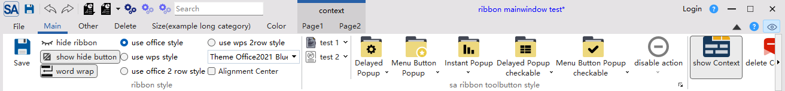

# SARibbon Introduction

[点击此处查看中文版本](../zh/index.md)

📚 **Documentation**：[https://czyt1988.github.io/SARibbon/en](https://czyt1988.github.io/SARibbon/en)

---

||Windows(latest)|Linux ubuntu(latest)|Mac(latest)|
|:-|:-|:-|:-|
|Qt5.12 LTS||||
|Qt5.14||||
|Qt5.15 LTS||||
|Qt6.2 LTS||||
|Qt6.5 LTS||||
|Qt6.8 LTS||||

---

## Project Overview

**SARibbon** is a Qt-based Ribbon UI control library designed to provide modern, Microsoft Office-like interfaces for desktop applications.

### Applicable Scenarios
- Large-scale software
- Industrial-grade software
- Complex desktop applications

### Design Philosophy
- API naming style references **MFC Ribbon**
- UI style combines the strengths of **Microsoft Office** and **WPS Office**
- Supports rapid theme customization via **QSS (Qt Style Sheets)**
- Provides rich built-in control encapsulations (e.g., [color picker button and palette](https://github.com/czyt1988/SAColorWidgets))

## Features

- Ribbon layout and display

- Supports minimize mode where only tabs are shown (double-click a tab to toggle); supports contextual tabs

- Supports quick access bar and right button group, with adaptive display under different layout modes
- Supports multiple ribbon button styles: normal button, delayed popup menu button, menu button, action menu button (action menu button is one of the key problems this library solves)

- Supports multiple layout styles

- Supports QSS-based ribbon customization and real-time theme switching; includes 6 built-in themes

Win7 theme:

Office 2013 theme:

Office 2016 theme:

Office 2021 theme:

Dark theme:

Dark2 theme:

- Provides Gallery control

- Supports long content scrolling and Option Action

- Provides center alignment mode

- Supports 4K screens and multi-monitor setups
- Supports Linux and macOS (UI not deeply adapted)

- **License**: MIT (free to use, modify, and distribute)
- **Contributions welcome**: Feel free to submit issues, PRs, or join the discussion group!

[Gitee - https://gitee.com/czyt1988/SARibbon](https://gitee.com/czyt1988/SARibbon)

[GitHub - https://github.com/czyt1988/SARibbon](https://github.com/czyt1988/SARibbon)

## Build and Usage

**Documentation is located in the docs/en folder, or visit:** [https://czyt1988.github.io/SARibbon/en](https://czyt1988.github.io/SARibbon/en)

**Doxygen documentation is deployed at:** [https://czyt1988.github.io/SARibbon/doxygen/index.html](https://czyt1988.github.io/SARibbon/doxygen/index.html)

**It is recommended to start learning SARibbon from the `example/MainWindowExample`, which you can also run directly to experience the features.**

## More Screenshots

- Screenshots of software built with SARibbon

[GitHub - https://github.com/czyt1988/data-workbench](https://github.com/czyt1988/data-workbench)

[Gitee - https://gitee.com/czyt1988/data-workbench](https://gitee.com/czyt1988/data-workbench)

Sample Ribbon generation code:

[https://github.com/czyt1988/data-workbench/blob/master/src/APP/DAAppRibbonArea.cpp](https://github.com/czyt1988/data-workbench/blob/master/src/APP/DAAppRibbonArea.cpp)

## Documentation Generation

- Use `doxygen` to generate HTML or `.qch` documentation:
  - `docs/Doxyfile-wiki-en` → Generate web documentation
  - `docs/Doxyfile-qch-en` → Generate Qt Creator help documentation
- Static documentation is built with `mkdocs` and deployed to GitHub Pages: [https://czyt1988.github.io/SARibbon/en](https://czyt1988.github.io/SARibbon/en)
