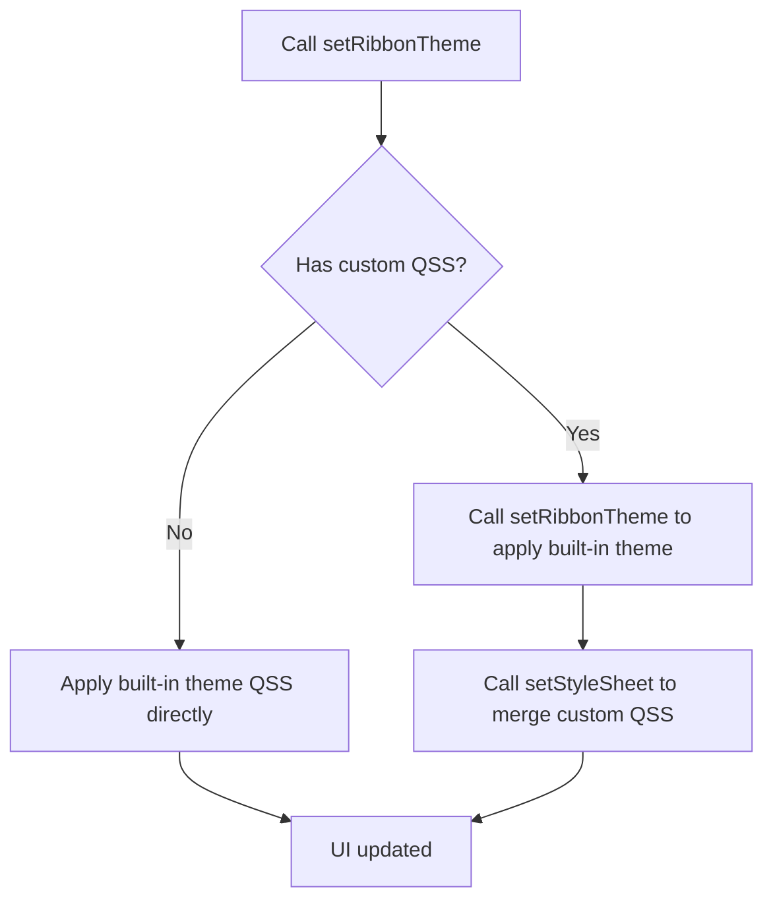

# SARibbon Theme Switching

- ✅ **10 built-in themes**: Office2013, Office2016 (Blue/Green/Dark), Office2021 (Blue/Green/Dark), Windows7, Dark, Dark2 — switch with one call
- ✅ **Runtime dynamic switching**: change themes instantly via `setRibbonTheme()`, no restart needed
- ✅ **QSS styling**: built-in theme QSS is generated from templates + palettes, see Template + Palette Architecture below
- ✅ **Fully custom themes**: write any style with QSS, see [Design Your Own Theme](./design-your-theme.md)
- ✅ **JSON palette configuration**: customize colors via palette JSON files without editing QSS, see [JSON Theme Configuration Guide](./json-theme-config.md)

## Theme Switching Flow



SARibbon ships with several built-in themes: Windows 7, Office 2013, Office 2016, dark variants, etc.  
They are defined in the `SARibbonTheme` enum:

```cpp
enum class SARibbonTheme
{
    RibbonThemeOffice2013,      ///< Office 2013 theme
    RibbonThemeOffice2016Blue,  ///< Office 2016 - Blue theme
    RibbonThemeOffice2016Green, ///< Office 2016 - Green theme  (since 1.4.0)
    RibbonThemeOffice2016Dark,  ///< Office 2016 - Dark theme   (since 1.4.0)
    RibbonThemeOffice2021Blue,  ///< Office 2021 - Blue theme
    RibbonThemeWindows7,        ///< Windows 7 theme
    RibbonThemeDark,            ///< Dark theme
    RibbonThemeDark2,           ///< Dark theme 2
    RibbonThemeOffice2021Green, ///< Office 2021 - Green theme  (since 1.4.0)
    RibbonThemeOffice2021Dark   ///< Office 2021 - Dark theme   (since 1.4.0)
};
```

`SARibbonTheme::RibbonThemeOffice2021Blue` is the **default** theme. When the operating system is in dark mode, the constructor automatically switches the default from `RibbonThemeOffice2021Blue` to `RibbonThemeDark` before the initial theme is applied.

Apply a theme through  
`SARibbonMainWindow::setRibbonTheme()` / `SARibbonWidget::setRibbonTheme()`:

```cpp
mainWindow->setRibbonTheme(SARibbonTheme::RibbonThemeDark);
```

!!! warning
    On some Qt versions calling `setRibbonTheme` inside the constructor does **not** fully take effect.  
    Defer it with a zero-timeout timer:

    ```cpp
    MainWindow::MainWindow(QWidget* par) : SARibbonMainWindow(par)
    {
        ...
        QTimer::singleShot(0, this, [this] {
            setRibbonTheme(SARibbonTheme::RibbonThemeDark);
        });
    }
    ```

Preview of each theme:

Windows 7  


Office 2013  


Office 2016 Blue  


Office 2016 Green <!-- TODO: add screenshot -->  
<!--  -->

Office 2016 Dark <!-- TODO: add screenshot -->  
<!--  -->

Office 2021 Blue  


Office 2021 Green <!-- TODO: add screenshot -->  
<!--  -->

Office 2021 Dark <!-- TODO: add screenshot -->  
<!--  -->

Dark  


Dark2  


All themes are implemented with standard **QSS**.  
If your application already applies its own style sheets, **merge** the Ribbon QSS into yours; otherwise the last sheet loaded will overwrite the previous ones.

## Theme Comparison

| Enum Value | Visual Style | Best Use Case |
|------------|--------------|---------------|
| `RibbonThemeOffice2013` | Office 2013 classic white | Clean, bright interface |
| `RibbonThemeOffice2016Blue` | Office 2016 blue accent | Business / enterprise apps |
| `RibbonThemeOffice2016Green` | Office 2016 green accent | Eco / health apps |
| `RibbonThemeOffice2016Dark` | Office 2016 dark | Low-light environments |
| `RibbonThemeOffice2021Blue` | Office 2021 blue accent | Modern UI design |
| `RibbonThemeOffice2021Green` | Office 2021 green accent | Eco / health apps |
| `RibbonThemeOffice2021Dark` | Office 2021 dark | Low-light environments |
| `RibbonThemeWindows7` | Windows 7 classic | Legacy compatibility |
| `RibbonThemeDark` | Dark theme | Extended use / night mode |
| `RibbonThemeDark2` | Dark theme (variant) | Higher contrast dark UI |

## Theme API Summary

| Method / Property | Class | Description |
|-------------------|-------|-------------|
| `setRibbonTheme(SARibbonTheme)` | SARibbonMainWindow / SARibbonWidget | Set the Ribbon theme |
| `ribbonTheme()` → `SARibbonTheme` | SARibbonMainWindow / SARibbonWidget | Get the current theme |
| `Q_PROPERTY(ribbonTheme)` | SARibbonMainWindow / SARibbonWidget | Theme property, bindable via QSS or code |

!!! note "SARibbonMainWindow vs SARibbonWidget"
    Both classes expose `setRibbonTheme()` and the `ribbonTheme` property, but there is a key behavioral difference. **SARibbonMainWindow** calls `bar->setContextCategoryColorHighLight()` per theme to adjust the context category title text highlight. **SARibbonWidget** does not call this method, which means the highlight function from the previous theme persists when switching themes.

### No themeChanged Signal

`SARibbonMainWindow` and `SARibbonWidget` do **not** emit a `themeChanged` signal. To react to theme changes in your application:

- **Override `setRibbonTheme()`** in a subclass and emit your own signal
- **Connect to the ComboBox or UI control** that triggers the theme switch (see the Dynamic Theme Switching Example below)
- **Use an event filter** on the main window to detect style changes

!!! note "Setting theme in the constructor — root cause"
    On some Qt versions, calling `setRibbonTheme()` directly in the constructor may not fully take effect. `setRibbonTheme()` performs two phases:
    
    1. **QSS application** — loads and applies the built-in theme QSS via `setStyleSheet()`
    2. **Post-QSS adjustments** — three programmatic corrections (tab margins, context category colors, baseline color) that compensate for what QSS alone cannot achieve
    
    During construction, these adjustments can fail because:
    
    - The widget tree is not fully realized — child widgets (`SARibbonTabBar`, `SARibbonBar`) may not have completed initialization
    - `setStyleSheet()` schedules an async style recomputation that may not complete until the next event loop iteration
    - Post-QSS adjustments depend on the QSS being fully applied and will not work correctly if the style engine has not processed it yet
    
    `QTimer::singleShot(0)` queues the entire theme application at the end of the current event loop cycle, ensuring all child widgets are constructed and the style engine has settled.

## Dynamic Theme Switching Example

The following code demonstrates switching themes via a ComboBox (see `example/MainWindowExample`):

```cpp
void MainWindow::onThemeChanged(int index)
{
    SARibbonTheme theme = static_cast<SARibbonTheme>(index);
    setRibbonTheme(theme);
    // If the app has custom QSS, append it after setting the theme
    if (!m_customStyleSheet.isEmpty()) {
        // setRibbonTheme automatically applies built-in theme QSS
        // Note: setStyleSheet replaces (does not append) the widget's stylesheet, so custom QSS will override built-in theme styles
        this->setStyleSheet(m_customStyleSheet);
    }
}
```

## QSS Merge Guide

SARibbon themes are QSS-based. If your window already has a stylesheet, you must merge both; otherwise the later one overwrites the earlier.

```cpp
// Option 1: Set built-in theme first, then apply custom QSS
// setRibbonTheme automatically applies built-in theme QSS to the window
setRibbonTheme(SARibbonTheme::RibbonThemeOffice2021Blue);
// Then apply custom QSS (Note: setStyleSheet replaces, not appends — custom QSS will override built-in theme QSS)
this->setStyleSheet(loadMyCustomStyleSheet());

// Option 2: Skip built-in themes entirely — use your own QSS
// See example/MatlabUI for reference
QFile file(":/theme/my-theme.qss");
if (file.open(QIODevice::ReadOnly | QIODevice::Text)) {
    this->setStyleSheet(QString::fromUtf8(file.readAll()));
}
```

!!! tip
    Use `SA::getBuiltInRibbonThemeQss(SARibbonTheme)` (declared in `SARibbonUtil.h`) to obtain the fully resolved QSS stylesheet for any built-in theme. It loads the template + default palette and returns the complete stylesheet string. This is useful for debugging or as a starting point for custom theme overrides:

    ```cpp
    QString qss = SA::getBuiltInRibbonThemeQss(SARibbonTheme::RibbonThemeOffice2021Blue);
    // qss now contains theme-base.qss + the resolved office2021 template with palette colors
    ```

!!! tip
    Built-in theme templates are in `src/SARibbonBar/resource/templates/` and palettes in `src/SARibbonBar/resource/palettes/`. Use them as a reference when writing custom themes. For full customization, see [Design Your Own Theme](./design-your-theme.md). For detailed JSON palette configuration, see [JSON Theme Configuration Guide](./json-theme-config.md).

## Post-QSS Internal Adjustment Mechanism

After `setStyleSheet()` is called, `setRibbonTheme()` performs three programmatic adjustments to compensate for what QSS alone cannot achieve:

1. **Tab margins** — `SARibbonTabBar::setTabMargin(QMargins)` overrides QSS margin directives that Qt's style engine may not correctly propagate
2. **Context category colors** — `SARibbonBar::setContextCategoryColorList()` and `setContextCategoryColorHighLight()` set runtime color palettes that cannot be expressed in QSS
3. **Baseline color** — `SARibbonBar::setTabBarBaseLineColor()` sets the tab bar underline color at runtime

### Per-Theme Adjustment Table

| Theme | Tab Margins | Context Category Colors | Highlight Function | Baseline Color |
|-------|-------------|------------------------|-------------------|----------------|
| `RibbonThemeWindows7` | `QMargins(5, 0, 0, 0)` | Reset to default (empty list) | `makeColorVibrant()` | Cleared |
| `RibbonThemeOffice2013` | `QMargins(5, 0, 0, 0)` | Reset to default (empty list) | `makeColorVibrant()` | `QColor(186, 201, 219)` |
| `RibbonThemeOffice2016Blue` | `QMargins(5, 0, 0, 0)` | `QColor(18, 64, 120)` | `QColor::darker()` | Cleared |
| `RibbonThemeOffice2016Green` | `QMargins(5, 0, 0, 0)` | `QColor(24, 96, 48)` | `QColor::darker()` | Cleared |
| `RibbonThemeOffice2016Dark` | `QMargins(5, 0, 0, 0)` | `QColor(60, 60, 60)` | `QColor::darker()` | Cleared |
| `RibbonThemeOffice2021Blue` | `QMargins(5, 0, 5, 0)` | `QColor(209, 207, 209)` | Always returns `QColor(39, 96, 167)` | Cleared |
| `RibbonThemeOffice2021Green` | `QMargins(5, 0, 5, 0)` | `QColor(180, 200, 180)` | `makeColorVibrant()` | Cleared |
| `RibbonThemeOffice2021Dark` | `QMargins(5, 0, 5, 0)` | `QColor(80, 80, 80)` | `makeColorVibrant()` | Cleared |
| `RibbonThemeDark` | `QMargins(5, 0, 0, 0)` | Reset to default (empty list) | `makeColorVibrant()` | Cleared |
| `RibbonThemeDark2` | `QMargins(5, 0, 0, 0)` | `QColor(42, 141, 181)` | `makeColorVibrant()` | Cleared |

Key observations:
- All three Office2021 variants (Blue, Green, Dark) use `QMargins(5, 0, 5, 0)` (right margin 5px); all others use `QMargins(5, 0, 0, 0)`.
- Only `RibbonThemeOffice2013` sets a baseline color; all others clear it.
- All three Office2016 variants (Blue, Green, Dark) use `QColor::darker()` as their highlight function.
- Highlight function definitions are centralized in `SARibbonThemeManager.cpp`:

```cpp
// Make colors more vibrant (used by Win7, Office2013, Dark, Dark2, Office2021Green/Dark)
static const SARibbonBar::FpContextCategoryHighlight s_csVibrantHighlight = [](const QColor& c) -> QColor {
    return SA::makeColorVibrant(c);
};
// Make colors darker (used by all Office2016 variants)
static const SARibbonBar::FpContextCategoryHighlight s_csDarkerHighlight = [](const QColor& c) -> QColor {
    return c.darker();
};
```

### Internal Mechanism Diagram

```mermaid
flowchart TD
    A[setRibbonTheme] --> B[Phase 1: Apply QSS]
    B --> B1[SA::applyRibbonTheme]
    B1 --> B2[Load palette JSON]
    B2 --> B3[Load template QSS]
    B3 --> B4[Replace {{token}} placeholders]
    B4 --> B5[theme-base.qss + resolved QSS]
    B5 --> B6[w->setStyleSheet]

    A --> C[Phase 2: Post-QSS Adjustments]
    C --> C1[updateTabBarMargins]
    C --> C2[updateContextColors]
    C --> C3[updateTabBarBaseLineColor]

    C1 --> D[UI fully updated]
    C2 --> D
    C3 --> D
```

The diagram above illustrates the two-phase flow of `setRibbonTheme()`. Phase 1 loads the palette JSON, loads the QSS template, replaces `{{token}}` placeholders with palette colors, concatenates `theme-base.qss` with the resolved template, and applies it via `setStyleSheet()`. Phase 2 applies the programmatic corrections (tab margins, context category colors, baseline color) that are specific to each theme and defined in static maps inside `SARibbonThemeManager.cpp`.

## Template + Palette Architecture

SARibbon uses a **template + palette** architecture to generate theme QSS. This system enables multiple color variants (Blue, Green, Dark) to share a single QSS template while producing visually different results through different palette JSON files.

### Templates

Templates are `.qss` files located in `src/SARibbonBar/resource/templates/` that contain CSS-like rules with `{{token}}` placeholders instead of hardcoded color values:

```css
SARibbonBar {
    background-color: {{accent}};
    color: {{text-color}};
}
```

There are 6 template files, each corresponding to a visual layout family:

| Template File | Themes that use it |
|---|---|
| `office2016.qss` | Office2016Blue, Office2016Green, Office2016Dark |
| `office2021.qss` | Office2021Blue, Office2021Green, Office2021Dark |
| `dark.qss` | Dark |
| `dark2.qss` | Dark2 |
| `win7.qss` | Windows7 |
| `office2013.qss` | Office2013 |

### Palettes

Palettes are `.json` files located in `src/SARibbonBar/resource/palettes/` that define the color tokens used to fill `{{token}}` placeholders in templates. Each palette has three sections:

- **`keyColors`** (required) — Primary design tokens: `accent`, `content-bg`, `text-color`, etc.
- **`derived`** (optional) — Colors computed from key colors via lighten/darken rules, e.g. `accent-hover` derived from `accent` by `lighten(15)`
- **`fixed`** (optional) — Absolute color values that don't depend on key colors

There are 10 palette files, one per theme:

| Palette File | Theme |
|---|---|
| `office2016-blue.json` | Office2016Blue |
| `office2016-green.json` | Office2016Green |
| `office2016-dark.json` | Office2016Dark |
| `office2021-blue.json` | Office2021Blue |
| `office2021-green.json` | Office2021Green |
| `office2021-dark.json` | Office2021Dark |
| `dark-default.json` | Dark |
| `dark2-default.json` | Dark2 |
| `win7-default.json` | Windows7 |
| `office2013-default.json` | Office2013 |

### Color Lookup

When resolving a `{{token}}` placeholder, the palette searches in this order: **derived** → **keyColors** → **fixed**. If `isDark` is `true` in the palette JSON, derived rules automatically reverse direction (darken becomes lighten and vice versa) to maintain correct contrast in dark themes.

### Public APIs

| API | Header | Description |
|---|---|---|
| `SA::getBuiltInRibbonThemeQss(SARibbonTheme)` | `SARibbonUtil.h` | Returns the fully resolved QSS string (base + template with default palette) |
| `SA::applyRibbonTheme(w, bar, theme)` | `SARibbonThemeManager.h` | Applies a built-in theme using the default palette |
| `SA::applyRibbonTheme(w, bar, theme, palette)` | `SARibbonThemeManager.h` | Applies a built-in theme with a custom palette (enables custom color variants) |

!!! example "Custom palette example"
    ```cpp
    // Load a built-in theme template but with your own palette colors
    SA::SARibbonThemePalette customPalette;
    customPalette.loadFromFile(":/my-custom-palette.json");
    SA::applyRibbonTheme(mainWindow, ribbonBar(),
                         SARibbonTheme::RibbonThemeOffice2021Blue, customPalette);
    ```