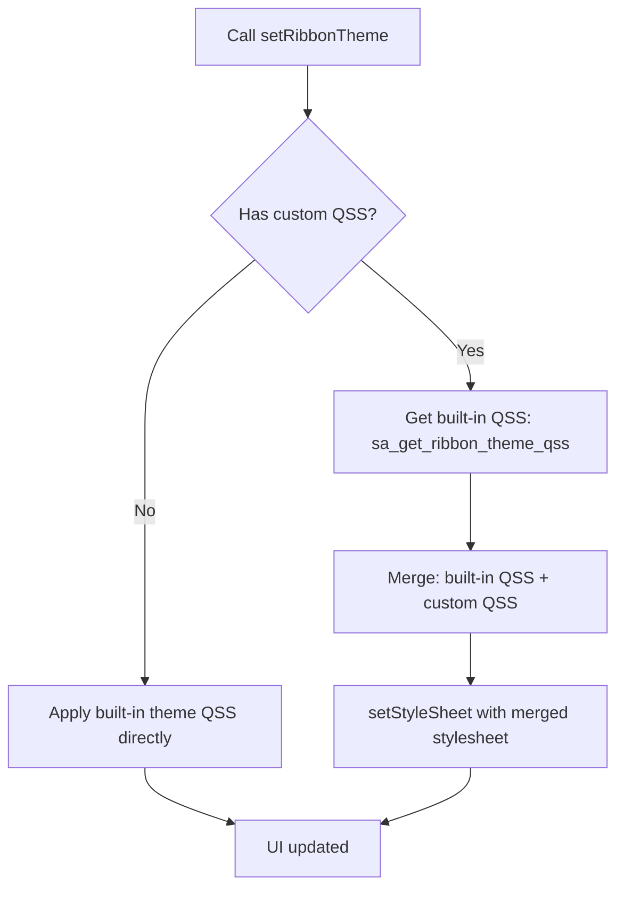

# SARibbon Theme Switching

- ✅ **6 built-in themes**: Office2013/2016/2021, Windows7, Dark/Dark2 — switch with one call
- ✅ **Runtime dynamic switching**: change themes instantly via `setRibbonTheme()`, no restart needed
- ✅ **QSS merge mechanism**: built-in theme QSS can be merged with custom stylesheets without overwriting each other
- ✅ **Fully custom themes**: write any style with QSS, see [Design Your Own Theme](./design-your-theme.md)

## Theme Switching Flow



SARibbon ships with several built-in themes: Windows 7, Office 2013, Office 2016, dark variants, etc.  
They are defined in the `SARibbonTheme` enum:

```cpp
enum class SARibbonTheme
{
    RibbonThemeOffice2013,      ///< Office 2013 look
    RibbonThemeOffice2016Blue,  ///< Office 2016 blue
    RibbonThemeOffice2021Blue,  ///< Office 2021 blue
    RibbonThemeWindows7,        ///< Windows 7 look
    RibbonThemeDark,            ///< Dark theme
    RibbonThemeDark2            ///< Dark theme #2
};
```

Apply a theme through  
`SARibbonMainWindow::setRibbonTheme()` / `SARibbonWidget::setRibbonTheme()`:

```cpp
mainWindow->setRibbonTheme(SARibbonTheme::RibbonThemeDark);
```

!!! warning
    On some Qt versions calling `setRibbonTheme` inside the constructor does **not** fully take effect.  
    Defer it with a zero-timeout timer:

    ```cpp
    MainWindow::MainWindow(QWidget* par) : SARibbonMainWindow(par)
    {
        ...
        QTimer::singleShot(0, this, [this] {
            setRibbonTheme(SARibbonTheme::RibbonThemeDark);
        });
    }
    ```

Preview of each theme:

Windows 7  


Office 2013  


Office 2016  


Office 2021  


Dark  


Dark2  


All themes are implemented with standard **QSS**.  
If your application already applies its own style sheets, **merge** the Ribbon QSS into yours; otherwise the last sheet loaded will overwrite the previous ones.

## Theme Comparison

| Enum Value | Visual Style | Best Use Case |
|------------|--------------|---------------|
| `RibbonThemeOffice2013` | Office 2013 classic white | Clean, bright interface |
| `RibbonThemeOffice2016Blue` | Office 2016 blue accent | Business / enterprise apps |
| `RibbonThemeOffice2021Blue` | Office 2021 blue accent | Modern UI design |
| `RibbonThemeWindows7` | Windows 7 classic | Legacy compatibility |
| `RibbonThemeDark` | Dark theme | Extended use / night mode |
| `RibbonThemeDark2` | Dark theme (variant) | Higher contrast dark UI |

## Theme API Summary

| Method / Property | Class | Description |
|-------------------|-------|-------------|
| `setRibbonTheme(SARibbonTheme)` | SARibbonMainWindow / SARibbonWidget | Set the Ribbon theme |
| `ribbonTheme()` → `SARibbonTheme` | SARibbonMainWindow / SARibbonWidget | Get the current theme |
| `Q_PROPERTY(ribbonTheme)` | SARibbonMainWindow / SARibbonWidget | Theme property, bindable via QSS or code |

!!! note "Setting theme in the constructor"
    On some Qt versions, calling `setRibbonTheme()` directly in the constructor may not fully take effect because QSS is not fully loaded at construction time. Use `QTimer::singleShot(0)` to defer theme setting until after the event loop starts.

## Dynamic Theme Switching Example

The following code demonstrates switching themes via a ComboBox (see `example/MainWindowExample`):

```cpp
void MainWindow::onThemeChanged(int index)
{
    SARibbonTheme theme = static_cast<SARibbonTheme>(index);
    // Merge with custom QSS if needed
    if (m_customStyleSheet.isEmpty()) {
        setRibbonTheme(theme);
    } else {
        QString ribbonQss = sa_get_ribbon_theme_qss(theme);
        QString mergedQss = ribbonQss + "\n" + m_customStyleSheet;
        this->setStyleSheet(mergedQss);
    }
}
```

## QSS Merge Guide

SARibbon themes are QSS-based. If your window already has a stylesheet, you must merge both; otherwise the later one overwrites the earlier.

```cpp
// Option 1: Get theme QSS and merge manually
QString ribbonQss = sa_get_ribbon_theme_qss(SARibbonTheme::RibbonThemeOffice2021Blue);
QString myQss = loadMyCustomStyleSheet();
this->setStyleSheet(ribbonQss + "\n" + myQss);

// Option 2: Skip built-in themes entirely — use your own QSS
// See example/MatlabUI for reference
QFile file(":/theme/my-theme.qss");
if (file.open(QIODevice::ReadOnly | QIODevice::Text)) {
    this->setStyleSheet(QString::fromUtf8(file.readAll()));
}
```

!!! tip
    Built-in theme QSS files are in `src/SARibbonBar/resource`. Use them as a reference when writing custom themes. For full customization, see [Design Your Own Theme](./design-your-theme.md).