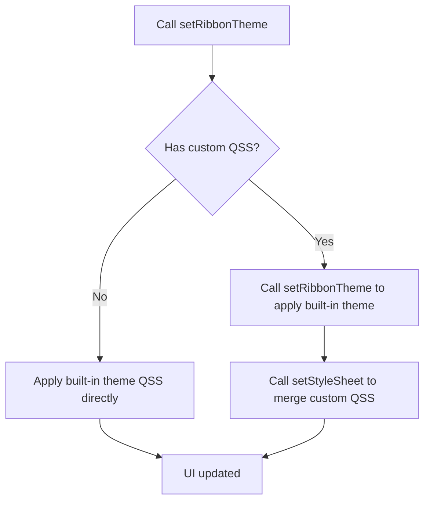
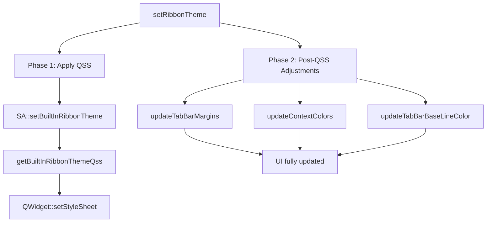

# SARibbon Theme Switching

- ✅ **6 built-in themes**: Office2013/2016/2021, Windows7, Dark/Dark2 — switch with one call
- ✅ **Runtime dynamic switching**: change themes instantly via `setRibbonTheme()`, no restart needed
- ✅ **QSS styling**: built-in theme QSS can be applied or replaced via `setStyleSheet()`, see QSS section below
- ✅ **Fully custom themes**: write any style with QSS, see [Design Your Own Theme](./design-your-theme.md)

## Theme Switching Flow



SARibbon ships with several built-in themes: Windows 7, Office 2013, Office 2016, dark variants, etc.  
They are defined in the `SARibbonTheme` enum:

```cpp
enum class SARibbonTheme
{
    RibbonThemeOffice2013,      ///< Office 2013 look
    RibbonThemeOffice2016Blue,  ///< Office 2016 blue
    RibbonThemeOffice2021Blue,  ///< Office 2021 blue
    RibbonThemeWindows7,        ///< Windows 7 look
    RibbonThemeDark,            ///< Dark theme
    RibbonThemeDark2            ///< Dark theme #2
};
```

`SARibbonTheme::RibbonThemeOffice2021Blue` is the **default** theme. When the operating system is in dark mode, the constructor automatically switches the default from `RibbonThemeOffice2021Blue` to `RibbonThemeDark` before the initial theme is applied.

Apply a theme through  
`SARibbonMainWindow::setRibbonTheme()` / `SARibbonWidget::setRibbonTheme()`:

```cpp
mainWindow->setRibbonTheme(SARibbonTheme::RibbonThemeDark);
```

!!! warning
    On some Qt versions calling `setRibbonTheme` inside the constructor does **not** fully take effect.  
    Defer it with a zero-timeout timer:

    ```cpp
    MainWindow::MainWindow(QWidget* par) : SARibbonMainWindow(par)
    {
        ...
        QTimer::singleShot(0, this, [this] {
            setRibbonTheme(SARibbonTheme::RibbonThemeDark);
        });
    }
    ```

Preview of each theme:

Windows 7  


Office 2013  


Office 2016  


Office 2021  


Dark  


Dark2  


All themes are implemented with standard **QSS**.  
If your application already applies its own style sheets, **merge** the Ribbon QSS into yours; otherwise the last sheet loaded will overwrite the previous ones.

## Theme Comparison

| Enum Value | Visual Style | Best Use Case |
|------------|--------------|---------------|
| `RibbonThemeOffice2013` | Office 2013 classic white | Clean, bright interface |
| `RibbonThemeOffice2016Blue` | Office 2016 blue accent | Business / enterprise apps |
| `RibbonThemeOffice2021Blue` | Office 2021 blue accent | Modern UI design |
| `RibbonThemeWindows7` | Windows 7 classic | Legacy compatibility |
| `RibbonThemeDark` | Dark theme | Extended use / night mode |
| `RibbonThemeDark2` | Dark theme (variant) | Higher contrast dark UI |

## Theme API Summary

| Method / Property | Class | Description |
|-------------------|-------|-------------|
| `setRibbonTheme(SARibbonTheme)` | SARibbonMainWindow / SARibbonWidget | Set the Ribbon theme |
| `ribbonTheme()` → `SARibbonTheme` | SARibbonMainWindow / SARibbonWidget | Get the current theme |
| `Q_PROPERTY(ribbonTheme)` | SARibbonMainWindow / SARibbonWidget | Theme property, bindable via QSS or code |

!!! note "SARibbonMainWindow vs SARibbonWidget"
    Both classes expose `setRibbonTheme()` and the `ribbonTheme` property, but there is a key behavioral difference. **SARibbonMainWindow** calls `bar->setContextCategoryColorHighLight()` per theme to adjust the context category title text highlight. **SARibbonWidget** does not call this method, which means the highlight function from the previous theme persists when switching themes.

### No themeChanged Signal

`SARibbonMainWindow` and `SARibbonWidget` do **not** emit a `themeChanged` signal. To react to theme changes in your application:

- **Override `setRibbonTheme()`** in a subclass and emit your own signal
- **Connect to the ComboBox or UI control** that triggers the theme switch (see the Dynamic Theme Switching Example below)
- **Use an event filter** on the main window to detect style changes

!!! note "Setting theme in the constructor — root cause"
    On some Qt versions, calling `setRibbonTheme()` directly in the constructor may not fully take effect. `setRibbonTheme()` performs two phases:
    
    1. **QSS application** — loads and applies the built-in theme QSS via `setStyleSheet()`
    2. **Post-QSS adjustments** — three programmatic corrections (tab margins, context category colors, baseline color) that compensate for what QSS alone cannot achieve
    
    During construction, these adjustments can fail because:
    
    - The widget tree is not fully realized — child widgets (`SARibbonTabBar`, `SARibbonBar`) may not have completed initialization
    - `setStyleSheet()` schedules an async style recomputation that may not complete until the next event loop iteration
    - Post-QSS adjustments depend on the QSS being fully applied and will not work correctly if the style engine has not processed it yet
    
    `QTimer::singleShot(0)` queues the entire theme application at the end of the current event loop cycle, ensuring all child widgets are constructed and the style engine has settled.

## Dynamic Theme Switching Example

The following code demonstrates switching themes via a ComboBox (see `example/MainWindowExample`):

```cpp
void MainWindow::onThemeChanged(int index)
{
    SARibbonTheme theme = static_cast<SARibbonTheme>(index);
    setRibbonTheme(theme);
    // If the app has custom QSS, append it after setting the theme
    if (!m_customStyleSheet.isEmpty()) {
        // setRibbonTheme automatically applies built-in theme QSS
        // Note: setStyleSheet replaces (does not append) the widget's stylesheet, so custom QSS will override built-in theme styles
        this->setStyleSheet(m_customStyleSheet);
    }
}
```

## QSS Merge Guide

SARibbon themes are QSS-based. If your window already has a stylesheet, you must merge both; otherwise the later one overwrites the earlier.

```cpp
// Option 1: Set built-in theme first, then append custom QSS
// setRibbonTheme automatically applies built-in theme QSS to the window
setRibbonTheme(SARibbonTheme::RibbonThemeOffice2021Blue);
// Then append custom QSS (setStyleSheet appends, does not overwrite built-in theme QSS)
this->setStyleSheet(loadMyCustomStyleSheet());

// Option 2: Skip built-in themes entirely — use your own QSS
// See example/MatlabUI for reference
QFile file(":/theme/my-theme.qss");
if (file.open(QIODevice::ReadOnly | QIODevice::Text)) {
    this->setStyleSheet(QString::fromUtf8(file.readAll()));
}
```

!!! warning
    `sa_get_ribbon_theme_qss` was mentioned in earlier documentation, but this function **does not exist** in the current codebase. The only way to apply built-in theme QSS is via `setRibbonTheme()`, which automatically applies it. There is no public API to obtain theme QSS as a string.

!!! tip
    Built-in theme QSS files are in `src/SARibbonBar/resource`. Use them as a reference when writing custom themes. For full customization, see [Design Your Own Theme](./design-your-theme.md).

## Post-QSS Internal Adjustment Mechanism

After `setStyleSheet()` is called, `setRibbonTheme()` performs three programmatic adjustments to compensate for what QSS alone cannot achieve:

1. **Tab margins** — `SARibbonTabBar::setTabMargin(QMargins)` overrides QSS margin directives that Qt's style engine may not correctly propagate
2. **Context category colors** — `SARibbonBar::setContextCategoryColorList()` and `setContextCategoryColorHighLight()` set runtime color palettes that cannot be expressed in QSS
3. **Baseline color** — `SARibbonBar::setTabBarBaseLineColor()` sets the tab bar underline color at runtime

### Per-Theme Adjustment Table

| Theme | Tab Margins | Context Category Colors | Highlight Function | Baseline Color |
|-------|-------------|------------------------|-------------------|----------------|
| `RibbonThemeWindows7` | `QMargins(5, 0, 0, 0)` | Reset to default (empty list) | `makeColorVibrant()` | Cleared |
| `RibbonThemeOffice2013` | `QMargins(5, 0, 0, 0)` | Reset to default (empty list) | `makeColorVibrant()` | `QColor(186, 201, 219)` |
| `RibbonThemeOffice2016Blue` | `QMargins(5, 0, 0, 0)` | `QColor(18, 64, 120)` | `QColor::darker()` | Cleared |
| `RibbonThemeOffice2021Blue` | `QMargins(5, 0, 5, 0)` | `QColor(209, 207, 209)` | Always returns `QColor(39, 96, 167)` | Cleared |
| `RibbonThemeDark` | `QMargins(5, 0, 0, 0)` | Reset to default (empty list) | `makeColorVibrant()` | Cleared |
| `RibbonThemeDark2` | `QMargins(5, 0, 0, 0)` | Not adjusted | None | Cleared |

Key observations:
- Only `RibbonThemeOffice2021Blue` uses `QMargins(5, 0, 5, 0)` (right margin 5px); all others use `QMargins(5, 0, 0, 0)`.
- Only `RibbonThemeOffice2013` sets a baseline color; all others clear it.
- Highlight function definitions (`SARibbonMainWindow.cpp:120-125`):

```cpp
// Make colors more vibrant
static const SARibbonBar::FpContextCategoryHighlight cs_vibrantHighlight = [](const QColor& c) -> QColor {
    return SA::makeColorVibrant(c);
};
// Make colors darker
static const SARibbonBar::FpContextCategoryHighlight cs_darkerHighlight = [](const QColor& c) -> QColor {
    return c.darker();
};
```

### Internal Mechanism Diagram



The diagram above illustrates the two-phase flow of `setRibbonTheme()`. Phase 1 applies the QSS stylesheet from Qt resources. Phase 2 applies the programmatic corrections that are specific to each theme.