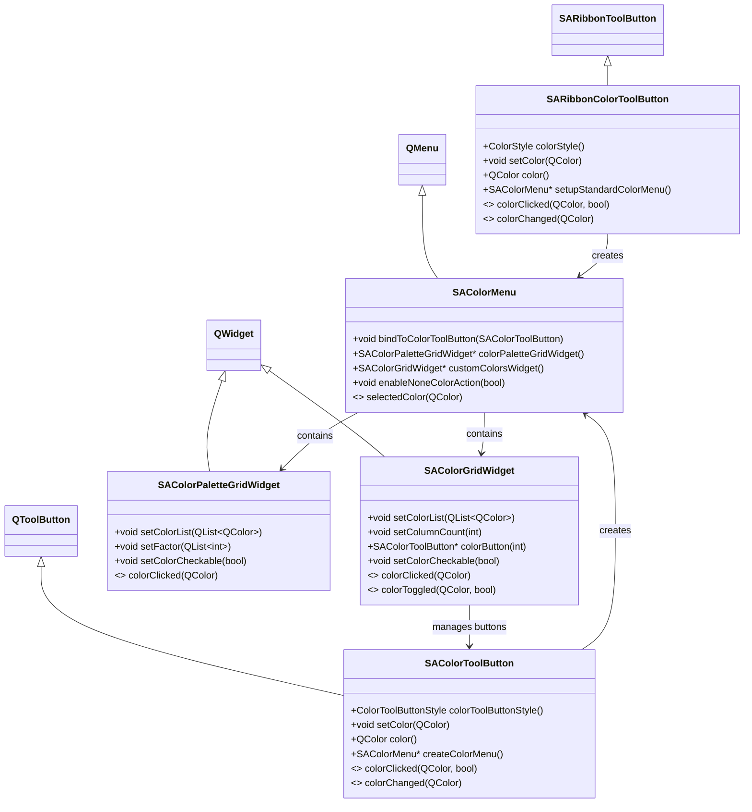

# Color Widgets

## Feature Overview

The Color Widgets sub-library provides a complete color selection solution, inspired by Microsoft Office's color picker interaction design. It includes 5 classes, covering all scenarios from basic color buttons to full color menus.

### ✅ Features

- **Ribbon Integration**: `SARibbonColorToolButton` inherits `SARibbonToolButton`, can be seamlessly added to Ribbon Panels
- **Standalone Usage**: `SAColorToolButton` inherits `QToolButton`, can be used in any Qt interface
- **Office-style Menu**: `SAColorMenu` provides a complete menu with theme color panel, custom colors, and no-color option
- **Flexible Grid Layout**: `SAColorGridWidget` supports customizable column count, row/column spacing, and checkable color grid
- **Palette Panel**: `SAColorPaletteGridWidget` provides a multi-layer structure with standard color row + light/dark color swatches

## Class Relationship Diagram



## SARibbonColorToolButton Usage

### Overview

Inherits from `SARibbonToolButton`, a color button designed specifically for Ribbon interfaces. Supports two display styles:

- **ColorUnderIcon**: Color displayed below the icon (requires setting an icon)
- **ColorFillToIcon**: Color serves as the icon itself (`setColor` automatically generates a color icon to replace the original icon)

### Code Example

```cpp
#include "SARibbonColorToolButton.h"

// Create a color button
SARibbonColorToolButton* colorButton = new SARibbonColorToolButton(panel);

// Set default color
colorButton->setColor(Qt::red);

// Set color display to fill-icon mode
colorButton->setColorStyle(SARibbonColorToolButton::ColorFillToIcon);

// Set up standard color dropdown menu
colorButton->setupStandardColorMenu();

// Connect color click signal
connect(colorButton, &SARibbonColorToolButton::colorClicked,
        this, &MainWindow::onColorButtonColorClicked);

// Add to Ribbon Panel
panel->addSmallWidget(colorButton);  // Small button
panel->addLargeWidget(colorButton);  // Large button
```

### Behavior Description

- When `ColorFillToIcon` with no icon, the button displays as a solid color block
- When `ColorFillToIcon` with an icon, the icon is replaced by a color block
- When `ColorUnderIcon`, a colored strip is displayed below the icon
- Clicking the left area of the button triggers the `colorClicked` signal; clicking the right dropdown arrow opens the color menu

### Usage Example Reference

!!! example
    For a complete usage example, see the `createCategoryColor` function in `example/MainWindowExample/mainwindow.cpp` (around line 2358), which demonstrates various style combinations

    ```cpp
    // No icon, no text - pure color block
    colorButton->setColorStyle(SARibbonColorToolButton::ColorFillToIcon);

    // With icon and text - color strip below icon
    colorButton->setIcon(QIcon(":/icon/long-text.svg"));
    colorButton->setText("have Icon have text");

    // Large button mode
    colorButton->setButtonType(SARibbonToolButton::LargeButton);
    ```

## SAColorToolButton Usage

### Overview

Inherits from `QToolButton`, a standalone color button that can be used in any Qt interface. Supports four Qt button styles (`ToolButtonIconOnly`, `ToolButtonTextBesideIcon`, `ToolButtonTextUnderIcon`, `ToolButtonTextOnly`), and includes built-in color menu functionality.

### Two Button Styles

| Style | Description |
|-------|-------------|
| `WithColorMenu` | Default style, automatically creates an `SAColorMenu` dropdown menu |
| `NoColorMenu` | No menu created, serves only as a color display button |

### Code Example

```cpp
#include "colorWidgets/SAColorToolButton.h"

// Create (with menu by default)
SAColorToolButton* btn = new SAColorToolButton(parent);
btn->setColor(Qt::blue);

// Or construct with specific style
SAColorToolButton* btn2 = new SAColorToolButton(SAColorToolButton::NoColorMenu, parent);
btn2->setColor(Qt::green);

// Set margins
btn->setMargins(QMargins(3, 3, 3, 3));

// Connect signals
connect(btn, &SAColorToolButton::colorClicked,
        this, [](const QColor& c, bool checked) {
            qDebug() << "Color clicked:" << c.name();
        });
connect(btn, &SAColorToolButton::colorChanged,
        this, [](const QColor& c) {
            qDebug() << "Color changed:" << c.name();
        });
```

### Behavior Description

- **No icon**: Color fills the entire button area
- **With icon**: Icon on top, color strip below the icon (height is 1/4 of the icon height)
- **With icon + menu**: Dropdown arrow indicator shown on the right side
- Clicking the color area triggers `colorClicked(QColor, bool)`; selecting a color from the menu triggers `colorChanged(QColor)`

## SAColorGridWidget Usage

### Overview

A QWidget that displays multiple colors in a grid layout. Internally uses `SAColorToolButton` as each color cell, supporting customizable column count, spacing, and checkable mode.

### Code Example

```cpp
#include "colorWidgets/SAColorGridWidget.h"

SAColorGridWidget* grid = new SAColorGridWidget(parent);

// Set column count (row count is auto-calculated based on color count)
grid->setColumnCount(5);

// Set color list
QList<QColor> colors;
colors << Qt::red << Qt::blue << Qt::green << Qt::yellow << Qt::cyan;
colors << Qt::magenta << Qt::gray << Qt::black << Qt::white << Qt::orange;
grid->setColorList(colors);

// Enable checkable mode
grid->setColorCheckable(true);

// Set color icon size and spacing
grid->setColorIconSize(QSize(16, 16));
grid->setSpacing(2);
grid->setHorizontalSpacing(4);
grid->setVerticalSpacing(4);

// Get currently selected color
QColor current = grid->currentCheckedColor();

// Clear checked state
grid->clearCheckedState();

// Connect signals
connect(grid, &SAColorGridWidget::colorClicked,
        this, [](const QColor& c) {
            qDebug() << "Grid color clicked:" << c.name();
        });
connect(grid, &SAColorGridWidget::colorToggled,
        this, [](const QColor& c, bool on) {
            qDebug() << "Color toggled:" << c.name() << "checked:" << on;
        });
```

### Behavior Description

!!! example
    For a complete usage example, see `src/SARibbonBar/colorWidgets/tst/Widget.cpp` (around line 37-49)

    ```cpp
    // When column count is 0, all colors are in a single row
    ui->colorGrid1->setColumnCount(0);
    ui->colorGrid1->setColorList(SA::getStandardColorList());

    // 5-column layout
    ui->colorGrid2->setColumnCount(5);
    ui->colorGrid2->setColorList(randamColors);
    ```

- When column count is set to 0, all colors are arranged in a single row
- After `setColorCheckable(true)`, clicking a color toggles its checked state and emits the `colorToggled` signal
- You can use `colorButton(index)` to retrieve the color button at a specific index for customization

## SAColorMenu Usage

### Overview

A standard color dropdown menu, inheriting from `QMenu`. Internally contains three areas:

1. **Theme Colors**: Uses `SAColorPaletteGridWidget` to display the theme color palette
2. **Custom Colors**: Selected via a color dialog, recording recently used colors into `SAColorGridWidget`
3. **No Color** (optional): Allows the user to clear the color selection

### Code Example

```cpp
#include "colorWidgets/SAColorMenu.h"

// Create menu
SAColorMenu* menu = new SAColorMenu(parent);

// Or with a title
SAColorMenu* menuWithTitle = new SAColorMenu("Font Color", parent);

// Enable no-color option
menu->enableNoneColorAction(true);

// Quick bind to SAColorToolButton
SAColorToolButton* btn = new SAColorToolButton(parent);
menu->bindToColorToolButton(btn);

// Get internal widgets
SAColorPaletteGridWidget* palette = menu->colorPaletteGridWidget();
SAColorGridWidget* customGrid = menu->customColorsWidget();
QAction* customAction = menu->customColorAction();
QAction* noneAction = menu->noneColorAction();

// Connect color selection signal
connect(menu, &SAColorMenu::selectedColor,
        this, [](const QColor& c) {
            qDebug() << "Selected color:" << c.name();
        });
```

### Behavior Description

- `bindToColorToolButton()` simplifies menu-button binding by automatically connecting `selectedColor` to the button's `setColor` slot
- The theme color palette area displays a set of base colors and their light/dark variants
- Clicking "Custom Colors" opens a `QColorDialog`; the selected color is automatically recorded in the custom colors row (up to 10 colors)
- Users can create the menu with one click via `SARibbonColorToolButton::setupStandardColorMenu()` or `SAColorToolButton::createColorMenu()`, without manually assembling `SAColorMenu`

!!! example
    See the `setupStandardColorMenu` function in `src/SARibbonBar/SARibbonColorToolButton.cpp` (around line 260) for the one-click menu creation pattern

## SAColorPaletteGridWidget Usage

### Overview

An Office-style color selection panel, containing a row of standard colors and 5 rows of color swatches below (3 rows of lighter shades + 2 rows of darker shades). Automatically generates light/dark variants based on the provided base color list.

### Code Example

```cpp
#include "colorWidgets/SAColorPaletteGridWidget.h"

// Initialize with standard color list
SAColorPaletteGridWidget* palette = new SAColorPaletteGridWidget(
    SA::getStandardColorList(), parent);

// Or use a custom color list
QList<QColor> myColors;
myColors << Qt::red << Qt::blue << Qt::green << Qt::yellow << Qt::magenta;
SAColorPaletteGridWidget* palette2 = new SAColorPaletteGridWidget(myColors, parent);

// Set light/dark variant factors (default {180, 160, 140, 75, 50})
// Values > 100 mean lighter, < 100 mean darker
palette->setFactor({75, 120});

// Enable checkable mode
palette->setColorCheckable(true);

// Set color icon size
palette->setColorIconSize(QSize(16, 16));

// Connect click signal
connect(palette, &SAColorPaletteGridWidget::colorClicked,
        this, [](const QColor& c) {
            qDebug() << "Palette color clicked:" << c.name();
        });
```

### Behavior Description

!!! example
    See the usage in `example/MainWindowExample/mainwindow.cpp` within the `createCategoryColor` function (around line 2404)

    ```cpp
    SAColorPaletteGridWidget* palette = new SAColorPaletteGridWidget(
        SA::getStandardColorList(), panel);
    palette->setFactor({75, 120});
    panel->addLargeWidget(palette);
    ```

- The standard color row displays the provided color list
- The swatches below are generated based on `setFactor` coefficients for each base color (>100 lighter, <100 darker)
- Can be used directly as a large widget in a Ribbon Panel
- Used as the theme color panel sub-widget within `SAColorMenu`

## API Reference

### SARibbonColorToolButton

| Method | Return | Description |
|--------|--------|-------------|
| `color()` | `QColor` | Get current color |
| `setColor(QColor)` | `void` | Set color, emits `colorChanged` signal |
| `colorStyle()` | `ColorStyle` | Get color display style |
| `setColorStyle(ColorStyle)` | `void` | Set color display style |
| `setupStandardColorMenu()` | `SAColorMenu*` | Set up standard color dropdown menu |

**Signals**:

| Signal | Parameters | Description |
|--------|------------|-------------|
| `colorClicked(QColor, bool)` | `color`, `checked` | Emitted when color is clicked |
| `colorChanged(QColor)` | `color` | Emitted when color changes |

### SAColorToolButton

| Method | Return | Description |
|--------|--------|-------------|
| `color()` | `QColor` | Get current color |
| `setColor(QColor)` | `void` | Set color, emits `colorChanged` signal |
| `colorToolButtonStyle()` | `ColorToolButtonStyle` | Get button style |
| `setColorToolButtonStyle(ColorToolButtonStyle)` | `void` | Set button style (WithColorMenu / NoColorMenu) |
| `createColorMenu()` | `SAColorMenu*` | Create standard color menu |
| `colorMenu()` | `SAColorMenu*` | Get color menu (may be nullptr) |
| `setMargins(QMargins)` | `void` | Set margins |
| `margins()` | `QMargins` | Get margins |
| `paintNoneColor(QPainter*, QRect)` | `static void` | Paint no-color indicator |

**Signals**:

| Signal | Parameters | Description |
|--------|------------|-------------|
| `colorClicked(QColor, bool)` | `color`, `checked` | Emitted when color is clicked |
| `colorChanged(QColor)` | `color` | Emitted when color changes |

### SAColorGridWidget

| Method | Return | Description |
|--------|--------|-------------|
| `setColorList(QList<QColor>)` | `void` | Set color list |
| `getColorList()` | `QList<QColor>` | Get color list |
| `setColumnCount(int)` | `void` | Set column count |
| `columnCount()` | `int` | Get column count |
| `setColorCheckable(bool)` | `void` | Set checkable mode |
| `isColorCheckable()` | `bool` | Check if checkable mode is enabled |
| `currentCheckedColor()` | `QColor` | Get currently checked color |
| `clearCheckedState()` | `void` | Clear checked state |
| `colorButton(int)` | `SAColorToolButton*` | Get color button by index |
| `setColorIconSize(QSize)` | `void` | Set color icon size |
| `colorIconSize()` | `QSize` | Get color icon size |
| `setSpacing(int)` | `void` | Set uniform spacing |
| `spacing()` | `int` | Get spacing |
| `setHorizontalSpacing(int)` | `void` | Set horizontal spacing |
| `setVerticalSpacing(int)` | `void` | Set vertical spacing |
| `setRowMinimumHeight(int, int)` | `void` | Set row minimum height |
| `setHorizontalSpacerToRight(bool)` | `void` | Set horizontal spacer to right side |
| `iterationColorBtns(FunColorBtn)` | `void` | Iterate over all color buttons |

**Signals**:

| Signal | Parameters | Description |
|--------|------------|-------------|
| `colorClicked(QColor)` | `c` | Emitted when color is clicked |
| `colorPressed(QColor)` | `c` | Emitted when color is pressed |
| `colorReleased(QColor)` | `c` | Emitted when color is released |
| `colorToggled(QColor, bool)` | `c`, `on` | Emitted when color toggles in checkable mode |

### SAColorMenu

| Method | Return | Description |
|--------|--------|-------------|
| `bindToColorToolButton(SAColorToolButton*)` | `void` | Quick bind to color button |
| `colorPaletteGridWidget()` | `SAColorPaletteGridWidget*` | Get theme color palette widget |
| `customColorsWidget()` | `SAColorGridWidget*` | Get custom color grid widget |
| `customColorAction()` | `QAction*` | Get custom color action |
| `noneColorAction()` | `QAction*` | Get no-color action (requires `enableNoneColorAction(true)` first) |
| `enableNoneColorAction(bool)` | `void` | Enable/disable no-color option |
| `emitSelectedColor(QColor)` | `void` | Helper slot: emits selectedColor and hides menu |
| `themeColorsPaletteAction()` | `QWidgetAction*` | Get theme color palette action |
| `getCustomColorsWidgetAction()` | `QWidgetAction*` | Get custom color action |

**Signals**:

| Signal | Parameters | Description |
|--------|------------|-------------|
| `selectedColor(QColor)` | `c` | Emitted when a color is selected |

### SAColorPaletteGridWidget

| Method | Return | Description |
|--------|--------|-------------|
| `setColorList(QList<QColor>)` | `void` | Set color list |
| `colorList()` | `QList<QColor>` | Get color list |
| `setFactor(QList<int>)` | `void` | Set light/dark factors (default {180, 160, 140, 75, 50}) |
| `factor()` | `QList<int>` | Get factor list |
| `setColorCheckable(bool)` | `void` | Set checkable mode |
| `isColorCheckable()` | `bool` | Check if checkable mode is enabled |
| `setColorIconSize(QSize)` | `void` | Set color icon size |
| `colorIconSize()` | `QSize` | Get color icon size |

**Signals**:

| Signal | Parameters | Description |
|--------|------------|-------------|
| `colorClicked(QColor)` | `c` | Emitted when color is clicked |

## Important Notes

1. **SARibbonColorToolButton vs SAColorToolButton**: The former is for Ribbon environments (inherits `SARibbonToolButton`), while the latter can be used in any Qt interface (inherits `QToolButton`). Non-Ribbon projects should use `SAColorToolButton`.

2. **ColorFillToIcon Mode Limitation**: When using `SARibbonColorToolButton::ColorFillToIcon`, `setIcon()` has no effect because `setColor()` automatically replaces the original icon with a color icon.

3. **Automatic Color Menu Creation**: It is recommended to use `SARibbonColorToolButton::setupStandardColorMenu()` or `SAColorToolButton::createColorMenu()` for one-click menu creation, without manually assembling `SAColorMenu`.

4. **Standard Color List**: You can get 10 predefined standard colors (red, orange, yellow, green, cyan, blue, purple, magenta, black, white) via `SA::getStandardColorList()`.

5. **No-Color Concept**: After `SAColorMenu::enableNoneColorAction(true)` is enabled, users can select `QColor()` (an invalid color) to clear the current color. In custom painting, use `QColor::isValid()` to check.

6. **Custom Color Recording**: `SAColorMenu` records up to 10 custom colors (`mMaxCustomColorSize`); beyond this limit, the oldest record is automatically removed.