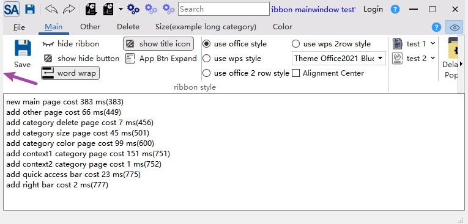
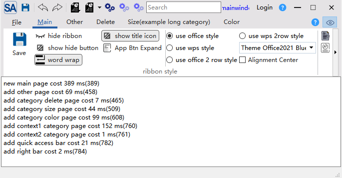

# Content Margins Settings

- ✅ **Dual-layer margin control**: SARibbonMainWindow and SARibbonBar margins set independently
- ✅ **Flexible combined effects**: Both margins stack for border, indent, and other visual effects
- ✅ **Native frame adaptation**: Use only RibbonBar margins in native frame mode
- ✅ **Default 2px left/right margins**: SARibbonMainWindow provides a thin border by default

---

SARibbon allows you to control content margins through the `setContentsMargins` methods of both `SARibbonMainWindow` and `SARibbonBar`, enabling window border effects and fine-tuning of Ribbon control positioning.

## SARibbonMainWindow Margins

The `setContentsMargins` method of `SARibbonMainWindow` sets margins for the entire main window. To create a border-like effect, set margins in the constructor:

```cpp
MainWindow::MainWindow(QWidget* par) : SARibbonMainWindow(par)
{
    setContentsMargins(5, 0, 5, 0);
}
```

Result (5px margins on left and right):



!!! info "Default Margins"
    `SARibbonMainWindow` sets 2px left and right margins by default. To remove these, call `setContentsMargins(0, 0, 0, 0)` in the constructor.

## SARibbonBar Margins

You can also set margins on `SARibbonBar` to further indent the Ribbon content:

```cpp
MainWindow::MainWindow(QWidget* par) : SARibbonMainWindow(par)
{
    setContentsMargins(2, 0, 2, 0);
    ribbonBar()->setContentsMargins(5, 0, 5, 0);
}
```

Result:



## Combined Effects and Recommended Configurations

Both margin types can be combined for different visual effects:

| Scenario | MainWindow Margins | RibbonBar Margins | Description |
|----------|-------------------|-------------------|-------------|
| Default | `(2, 0, 2, 0)` | `(0, 0, 0, 0)` | Default look with thin borders |
| Borderless | `(0, 0, 0, 0)` | `(0, 0, 0, 0)` | Completely borderless |
| Wide border | `(5, 0, 5, 0)` | `(0, 0, 0, 0)` | Wider left/right borders |
| Indented | `(2, 0, 2, 0)` | `(5, 0, 5, 0)` | Window borders + indented Ribbon content |
| Native frame | `(0, 0, 0, 0)` | `(5, 0, 5, 0)` | With native frame, only Ribbon content is indented |

!!! tip "When Using Native Frame"
    When using native frame mode (`SARibbonMainWindowStyleFlag::UseNativeFrame`), the OS draws the window border. In this case, set `SARibbonMainWindow` margins to `(0, 0, 0, 0)` and use `SARibbonBar` margins to adjust Ribbon content positioning.

!!! tip "Note"
    SARibbonMainWindow sets `2px` left and right margins by default.
