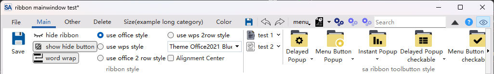

# Creating a Ribbon-style Window

## Creating a Ribbon-style MainWindow

The core of SARibbon is the `SARibbonBar` class, which can be used in both `MainWindow` and `Widget`.

If used in `MainWindow`, your main window should inherit from `SARibbonMainWindow`, which will automatically create a `SARibbonBar` for you.

Sample code for creating a Ribbon-style `MainWindow`:

```cpp
#include "mainwindow.h"
#include "SARibbon.h"

//
class MainWindow : public SARibbonMainWindow
{
    Q_OBJECT
public:
    MainWindow(QWidget* parent = nullptr) : SARibbonMainWindow(parent)
    {
        // Get the RibbonBar pointer
        SARibbonBar* ribbon = ribbonBar();
        ...
    }
};
```

!!! warning "Note:"
    If your `MainWindow` is created through Qt Designer, **be sure to delete the default `menuBar` in Designer**. Because `SARibbonMainWindow` will replace the native menu bar with its own `SARibbonBar`. If the native menu bar is retained in the `.ui` file, it will override the ribbon menu back to the native one.

The constructor of `SARibbonMainWindow` has three parameters, defined as follows:

```cpp
SARibbonMainWindow(QWidget* parent, SARibbonMainWindowStyles style, const Qt::WindowFlags flags)
```

The most critical is the second parameter. The second parameter `SARibbonMainWindowStyles` determines the overall style of the window. The commonly used combinations are the following two:

1. `SARibbonMainWindowStyleFlag::UseRibbonMenuBar|SARibbonMainWindowStyleFlag::UseRibbonFrame`

    This is the default style, using a ribbon-style menu bar and a ribbon-style frame. In this case, the window has a custom frame instead of the native frame. The interface effect is as follows:

    

2. `SARibbonMainWindowStyleFlag::UseRibbonMenuBar|SARibbonMainWindowStyleFlag::UseNativeFrame`

    This style uses a ribbon-style menu bar and a native frame. The advantage of this interface is that it supports the operating system's border effects, such as Windows 11's global window shortcuts and some border special effects.

    

When using the native frame, to better adapt to the native border, `SARibbonMainWindow` will hide the icon and set the ribbonbar style to compact mode:

```cpp
// When using the native border in ribbon mode, the icon will be hidden and the default mode will be set to compact
if (SARibbonBar* bar = ribbonBar()) {
    if (SARibbonTitleIconWidget* iconWidget = bar->titleIconWidget()) {
        // Hide the icon
        iconWidget->hide();
    }
    // Set to compact mode
    bar->setRibbonStyle(SARibbonBar::RibbonStyleCompactThreeRow);
}
```

## Creating a Ribbon-style Widget

In addition to the main window, you can also use the Ribbon interface on ordinary `QWidget` or `QDialog`, which is very useful when creating complex dialog boxes or sub-windows. For this purpose, SARibbon provides the `SARibbonWidget` class.

```cpp
#include "SARibbonWidget.h"
class MyRibbonWidget : public SARibbonWidget
{
    Q_OBJECT

public:
    explicit MyRibbonWidget(QWidget *parent = nullptr);
};
```

Implementation file:

```cpp
// myribbonwidget.cpp
#include "myribbonwidget.h"
#include "SARibbonBar.h"

MyRibbonWidget::MyRibbonWidget(QWidget *parent)
    : SARibbonWidget(parent)
{
    // 1. Get the RibbonBar
    SARibbonBar* ribbon = ribbonBar();

    // 2. Optimize for Widget mode
    ribbon->setTitleVisible(false); // Hide the title bar, as QWidget usually does not have an independent title
    ribbon->setRibbonStyle(SARibbonBar::RibbonStyleCompactThreeRow); // Use compact mode to save space
    ribbon->setApplicationButton(nullptr); // Remove the Application Button, which is usually not needed for Widget

    // Create your ribbon menu
}
```

You can embed any `QWidget` into `SARibbonWidget` through the `setWidget()` method.