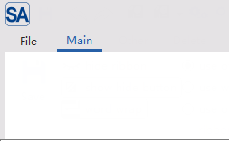
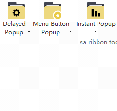
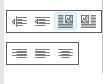
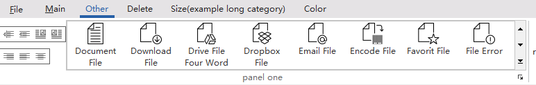
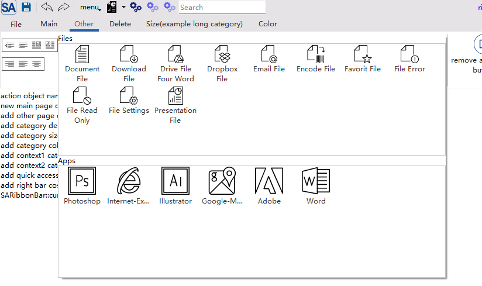
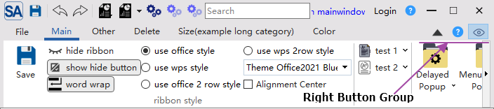

# Creating a Ribbon Interface

## Category

There are two ways to create a category page:

**Method 1: Adding via ribbonbar**

```cpp
SARibbonBar* ribbon = ribbonBar();
// Directly add a category page named "Main"
SARibbonCategory* homeCategory = ribbon->addCategoryPage("Main");
// If you need to use the ribbon interface customization tool (SARibbonCustomizeDialog), you must set an objectName for differentiation
homeCategory->setObjectName("MainCategory");
```

The above code will add a tab page named Main.



**Method 2: Create first, then add**

```cpp
// First create a category page object
SARibbonCategory* insertCategory = new SARibbonCategory(this);
insertCategory->setCategoryName("Insert");
insertCategory->setObjectName("insertCategory");

// Then add it to the RibbonBar
ribbon->addCategoryPage(insertCategory);
```

## Panel

### Creating a Panel and Adding Actions

A panel is a group of functions under a category. You can create a panel using the `addPanel` method of `Category` and add function buttons using the `addAction` series of methods.

Each category must have at least one panel.

```cpp
// Create a "File" panel under the "Home" category
SARibbonPanel* filePanel = homeCategory->addPanel("File");
filePanel->setObjectName("filePanel");

// Create an action
QAction* newAction = new QAction(QIcon(":/new.svg"), "New", this);
newAction->setObjectName("action_new");
newAction->setShortcut(QKeySequence::New);

// Add the action to the panel
// addLargeAction: Large button with icon + text
filePanel->addLargeAction(newAction);
// addSmallAction: Small button, usually only with icon
QAction* saveAction = new QAction(QIcon(":/save.svg"), "Save", this);
saveAction->setObjectName("action_save");
filePanel->addSmallAction(saveAction);

// Connect signal and slot
connect(newAction, &QAction::triggered, [] {
    qDebug() << "New document created.";
});
```

### Creating Menus

In a Ribbon interface, menus are an important way to organize complex functions. SARibbon allows you to add menus to panels in the form of buttons with different styles. The main difference lies in the button's popup mode (QToolButton::ToolButtonPopupMode), which determines how users interact with the menu.

SARibbon supports 3 main popup modes, and you can choose the most appropriate one according to functional requirements:

1. DelayedPopup:

    When the user clicks the button, the default action of the button is executed. When the user presses and holds the button, the menu pops up (hold until the menu pops up, the default action of the button will not be executed). This mode is mainly applicable when the main function of the button is to perform a common operation, and the menu provides secondary or advanced options.

2. MenuButtonPopup:

    This is the most distinctive mode of the Ribbon interface. The button is visually divided into two parts: upper and lower. Clicking the upper part (icon area) of the button executes the default action; clicking the lower part (text or drop-down arrow area) directly pops up the menu without executing the default action. When the mouse hovers, the two parts will have different highlighting effects.

    This is the most recommended mode, especially for Office-style applications. It clearly distinguishes between primary and secondary operations, providing the best user experience. For example, a "Paste" button: clicking the icon area performs standard pasting, and clicking the drop-down arrow area pops up options such as "Paste Special" and "Paste as Plain Text".

3. InstantPopup:

    When the user clicks any part of the button, the menu pops up immediately without executing the default action of the button. This mode is suitable when the function of the button is completely defined by its drop-down menu, with no single "default" operation. For example, a "Page Layout" button that, when clicked, directly pops up a menu with options for setting margins, paper orientation, etc.

There are two methods to add menus in SARibbon. The first is to call the `addXXAction` function:

```cpp
// Add an action to the panel and display it with a small icon
void addSmallAction(QAction* action, QToolButton::ToolButtonPopupMode popMode);
// Add an action to the panel and display it with a large icon
void addLargeAction(QAction* action, QToolButton::ToolButtonPopupMode popMode);
// Add an action to the panel, which will be displayed with a medium icon in three-row mode
void addMediumAction(QAction* action, QToolButton::ToolButtonPopupMode popMode);
```

Using this method, the action contains the menu, and the second parameter clearly specifies the button style.

Here is an example of using this method:

```cpp
SARibbonPanel* panelToolButtonStyle = page->addPanel(("sa ribbon toolbutton style"));

QMenu* menu = new QMenu;
//... construct the menu

// DelayedPopup mode
QAction* act = createAction(tr("Delayed\nPopup"), ":/icon/icon/folder-cog.svg");
act->setMenu(menu);
panelToolButtonStyle->addLargeAction(act, QToolButton::DelayedPopup);
connect(act, &QAction::triggered, this, &MainWindow::onDelayedPopupTriggered);

act = createAction(tr("Menu Button Popup"), ":/icon/icon/folder-star.svg");
act->setMenu(menu);
panelToolButtonStyle->addLargeAction(act, QToolButton::MenuButtonPopup);
connect(act, &QAction::triggered, this, &MainWindow::onMenuButtonPopupTriggered);

act = createAction(tr("Instant Popup"), ":/icon/icon/folder-stats.svg");
act->setMenu(menu);
panelToolButtonStyle->addLargeAction(act, QToolButton::InstantPopup);
connect(act, &QAction::triggered, this, &MainWindow::onInstantPopupTriggered);
```

The above code will create the following three menu buttons:



These three buttons share one menu.

SARibbon also provides another interface to quickly add menus (methods located in the `SARibbonPanel` class):

```cpp
// Add a menu
void addMenu(QMenu* menu,
                SARibbonPanelItem::RowProportion rowProportion,
                QToolButton::ToolButtonPopupMode popMode = QToolButton::InstantPopup);
// Add a normal large menu
void addLargeMenu(QMenu* menu, QToolButton::ToolButtonPopupMode popMode = QToolButton::InstantPopup);
// Add a normal medium button menu
void addMediumMenu(QMenu* menu, QToolButton::ToolButtonPopupMode popMode = QToolButton::InstantPopup);
// Add a normal small button menu
void addSmallMenu(QMenu* menu, QToolButton::ToolButtonPopupMode popMode = QToolButton::InstantPopup);
```

These functions actually use the menu's own action for management, so there's no need to create a separate action.

!!! warning "Note"
    These methods will modify some properties (icon/text/objectName) of `menu->menuAction()`. If you need to retain custom values, please set them in advance.

### Panel Layout Placeholder Description

SARibbon panels currently have 3 types of placeholder markers. When you call `addLargeAction`, `addMediumAction`, or `addSmallAction`, you are not only adding a button but also specifying its "placeholder size" in the grid layout.

- **Large Action**: Occupies 2 or 3 rows in height (depending on whether it's in two-row or three-row mode), displaying a large icon and text.
- **Medium Action**: Occupies 1 or 1.5 rows in the grid (depending on whether it's in two-row or three-row mode), usually displaying an icon and text.
- **Small Action**: Occupies 1 row in height.

These row proportions will have different rendering effects in different layout schemes.

SARibbonPanel supports two layout schemes: 2-row mode and 3-row mode. You can set different layout styles through the `SARibbonBar::setRibbonStyle` function.

For the 3-row mode, the effects of the above three row placeholders are as shown in the following figure:


For the 2-row mode, the effects of the above three row placeholders are as shown in the following figure:


In 2-row mode, the medium and small placeholders (`SARibbonPannelItem::RowProportion`) are the same and not distinguished.

### Adding Complex Controls (Widgets) in Panels

In addition to `QAction`, you can directly add any `QWidget` to the panel, such as combo boxes, spin boxes, or custom controls.

```cpp
SARibbonCategory* page = ribbonBar()->addCategoryPage(tr("Main"));
SARibbonPanel* panelWidgetTest = page->addPanel(tr("widget test"));

QComboBox* com1 = new QComboBox(this);
com1->setWindowTitle(tr("QComboBox test"));
for (int i = 0; i < 40; ++i) {
    com1->addItem(QString("QComboBox test%1").arg(i + 1));
}
com1->setEditable(true);
panelWidgetTest->addSmallWidget(com1);

QComboBox* com2 = new QComboBox(this);
com2->setWindowTitle("ComboBox Editable");
for (int i = 0; i < 40; ++i) {
    com2->addItem(QString("item %1").arg(i + 1));
}
panelWidgetTest->addSmallWidget(com2);


QLineEdit* lineEdit = new QLineEdit(this);
lineEdit->setText("LineEdit");
panelWidgetTest->addSmallWidget(lineEdit);

panelWidgetTest->addSeparator();

QCalendarWidget* calendarWidget = new QCalendarWidget(this);
panelWidgetTest->addLargeWidget(calendarWidget);
```

The effect of the above code is as follows:


## Using Button Groups

The button group `SARibbonButtonGroupWidget` can arrange multiple small buttons closely together, similar to `QToolBar`. It is often used for a group of similar functions, such as text alignment.

`SARibbonButtonGroupWidget` inherits from `QToolBar`. For actions in a button group, you don't need to bind signals to each action individually; you can use the `QToolBar::actionTriggered` signal.

The following code demonstrates how to create a button group and bind signals:

```cpp
// Button group 2
SARibbonButtonGroupWidget* btnGroup2 = new SARibbonButtonGroupWidget(panel1);
btnGroup2->setObjectName("SARibbonButtonGroupWidget2");

QAction* titleAlgnmentRight = createAction(tr("Align Right"), ":/icon/icon/Align-Right.svg");
titleAlgnmentRight->setProperty("align", (int)Qt::AlignRight | Qt::AlignVCenter);
btnGroup2->addAction(titleAlgnmentRight);
QAction* titleAlgnmentLeft = createAction(tr("Align Left"), ":/icon/icon/Align-Left.svg");
titleAlgnmentLeft->setProperty("align", (int)Qt::AlignLeft | Qt::AlignVCenter);
btnGroup2->addAction(titleAlgnmentLeft);
QAction* titleAlgnmentCenter = createAction(tr("Align Center"), ":/icon/icon/Align-Center.svg");
titleAlgnmentCenter->setProperty("align", (int)Qt::AlignCenter);
btnGroup2->addAction(titleAlgnmentCenter);
panel1->addWidget(btnGroup2, SARibbonPanelItem::Medium);
connect(btnGroup2, &SARibbonButtonGroupWidget::actionTriggered, this, &MainWindow::onButtonGroupActionTriggered);
```

The above code generates the following interface (for specific examples, see example/MainWindowExample/mainWindow.cpp, createCategoryOther function):



## Using Gallery

Gallery is a unique control in Ribbon, used to display icon options in a grid format. It is often used to display a large number of icon actions in limited space, such as style selection in Word.

The Gallery in SARibbon corresponds to the `SARibbonGallery` window. You can create a Gallery by using `SARibbonPanel::addGallery`, which returns a pointer to the created `SARibbonGallery`.

`SARibbonGallery` can manage multiple action groups. An action group corresponds to the `SARibbonGalleryGroup` class. You can use the `SARibbonGallery::addCategoryActions` method to quickly add action groups, whose parameters are the title of the action group and the action list of the action group.

```cpp
SARibbonGalleryGroup* addCategoryActions(const QString& title, QList< QAction* > actions);
```

The following code demonstrates how to create a Gallery and add 2 action groups:

```cpp
QAction MyRibbonMainWindow::createAction(const QString& text, const QString& iconurl){
    QAction* act = new QAction(this);
    act->setText(text);
    act->setIcon(QIcon(iconurl));
    return act;
}

void MyRibbonMainWindow::buildGalleryExample(){
    SARibbonPanel* panelWithGallery = ...;
    ...
    // Create a Gallery
    SARibbonGallery* gallery = panelWithGallery->addGallery();
    // Add action group 1
    QList< QAction* > galleryActions1;
    galleryActions1.append(createAction("Document File", ":/gallery-icon/icon/gallery/Document-File.svg"));
    galleryActions1.append(createAction("Download File", ":/gallery-icon/icon/gallery/Download-File.svg"));
    ......
    galleryActions1.append(createAction("File Settings", ":/gallery-icon/icon/gallery/File-Settings.svg"));
    galleryActions1.append(createAction("Presentation File", ":/gallery-icon/icon/gallery/Presentation-File.svg"));
    SARibbonGalleryGroup* group1 = gallery->addCategoryActions(tr("Files"), galleryActions1);
    group1->setGalleryGroupStyle(SARibbonGalleryGroup::IconWithWordWrapText);
    group1->setGridMinimumWidth(80);

    // Add action group 2
    QList< QAction* > galleryActions2;
    galleryActions2.append(createAction("Photoshop", ":/gallery-icon/icon/gallery/Photoshop.svg"));
    galleryActions2.append(createAction("Internet-Explorer", ":/gallery-icon/icon/gallery/Internet-Explorer.svg"));
    galleryActions2.append(createAction("Illustrator", ":/gallery-icon/icon/gallery/Illustrator.svg"));
    galleryActions2.append(createAction("Google-Maps", ":/gallery-icon/icon/gallery/Google-Maps.svg"));
    galleryActions2.append(createAction("Adobe", ":/gallery-icon/icon/gallery/Adobe.svg"));
    galleryActions2.append(createAction("Word", ":/gallery-icon/icon/gallery/Word.svg"));
    SARibbonGalleryGroup* group2 = gallery->addCategoryActions(tr("Apps"), galleryActions2);
    group2->setGridMinimumWidth(80);
    // Set the currently displayed group
    gallery->setCurrentViewGroup(group1);
}
```

The gallery created by the above code has the following effect:



The expanded effect of this gallery is as follows:



## Context Category

Context Category is a special type of tab page that usually appears only under specific conditions (such as when an object is selected). The most common examples are "Picture Tools" and "Table Tools" in Word, which appear when a picture or table is selected. Such conditionally displayed tabs are called context tabs.

The Context Category in SARibbon corresponds to the `SARibbonContextCategory` window. You can create a Context Category by using `SARibbonBar::addContextCategory`, which returns a pointer to the created `SARibbonContextCategory`.

`SARibbonContextCategory` is not a window (its base class is `QObject`), but a tab page manager. You need to add tab pages to `SARibbonContextCategory` by using the `SARibbonContextCategory::addCategoryPage` method to add tab pages to the corresponding Context Category.

Context Category is not displayed by default. You need to call the `SARibbonBar::showContextCategory` method to display it. To hide the context tab page, you can use `SARibbonBar::hideContextCategory`. `SARibbonContextCategory` also has `show`/`hide` slot functions to show and hide the context tab page.

The following code demonstrates how to create a Context Category and add two tab pages:

```cpp
// m_contextCategory is a member variable of MainWindow: SARibbonContextCategory* m_contextCategory;

void MainWindow::createContextCategory(){
    SARibbonBar* ribbon = ribbonBar();
    m_contextCategory    = ribbon->addContextCategory(tr("context"), QColor(), 1);

    SARibbonCategory* contextCategoryPage1 = m_contextCategory->addCategoryPage(tr("Page1"));
    // Create content for contextCategoryPage1
    createContextCategoryPage1(contextCategoryPage1);

    SARibbonCategory* contextCategoryPage2 = m_contextCategory->addCategoryPage(tr("Page2"));
    // Create content for contextCategoryPage2
    createContextCategoryPage2(contextCategoryPage2);
}
```

The Context Category created by the above code will not be displayed. If you need to display it, you need to trigger it under specific conditions:

```cpp
void MainWindow::onShowContextCategory(bool on)
{
    if (m_contextCategory == nullptr) {
        createContextCategory();
    }
    if (on) {
        m_contextCategory->show();
    } else {
        m_contextCategory->hide();
    }
}
```

The effect of the above code is as follows:


To distinguish context tab pages from ordinary tab pages, context tab pages are marked with a special color, as shown in the figure above. The color of this mark can be set via `SARibbonBar::setContextCategoryColor`.

## Application Button

The `Application Button` is the main menu button in the upper left corner of the Ribbon interface, usually used for "File" operations.

When creating a `SARibbonBar`, SARibbon will create a `SARibbonApplicationButton` instance by default as the Application Button. You can obtain a pointer to this button through the `SARibbonBar::applicationButton` method and perform operations on it, such as setting text, setting an icon, setting a shortcut key, setting a menu, etc.

For example:

```cpp
void MainWindow::createRibbonApplicationButton()
{
    SARibbonBar* ribbon = ribbonBar();
    QAbstractButton* btn = ribbon->applicationButton();
    btn->setText(("&File"));

    SARibbonApplicationButton* appBtn = qobject_cast< SARibbonApplicationButton* >(btn);
    if (appBtn) {
        QMenu* menu = new QMenu(this);
        ...
        appBtn->setMenu(menu);
    }
}
```

If you have a custom button, you can set the `Application Button` through the `SARibbonBar::setApplicationButton` method. If you don't want an `Application Button`, you can pass `nullptr`.

```cpp
ribbonBar()->setApplicationButton(nullptr); // Remove the button
```

The application button can be styled richly using QSS. The following is a QSS demonstration imitating the Win7-style ribbon:

```css
SARibbonApplicationButton{
  color:white;
  border: 1px solid #416ABD;
  border-top-left-radius: 4px;
  border-top-right-radius: 4px;
  background-color: qlineargradient(spread:pad, x1:0, y1:0, x2:0, y2:1,stop:0 #467FBD, stop:0.5 #2A5FAC,stop:0.51 #1A4088,
stop:1 #419ACF);
}

SARibbonApplicationButton:hover{
  background-color: qlineargradient(spread:pad, x1:0, y1:0, x2:0, y2:1,stop:0 #7BB2EB, stop:0.5 #477ECD,stop:0.51 #114ECF,
stop:1 #80E1FF);
}

SARibbonApplicationButton:pressed{
  background-color: qlineargradient(spread:pad, x1:0, y1:0, x2:0, y2:1,stop:0 #467BBB, stop:0.5 #2F63AE,stop:0.51 #1C438A,
stop:1 #358BC9);
}

SARibbonApplicationButton:focus{
  outline: none;
}

SARibbonApplicationButton::menu-indicator {
  /*subcontrol-position: right;*/
  width:0px;
}
```

The effect is as follows:


## Application Widget

In many modern applications (such as Microsoft Office), clicking the `Application Button` does not pop up a simple drop-down menu, but a full-screen or half-screen complex page. This page can contain rich content such as a list of recent files, template selection, account settings, and application options.

SARibbon provides `SARibbonApplicationWidget`, which can automatically help you cover the main window. Your pop-up window can inherit from `SARibbonApplicationWidget` to implement this.

`SARibbonApplicationWidget` provides a `resizeToParent` function to determine how to scale relative to the parent window. By default, it completely covers the parent window. If you want to cover half or other sizes, you can override this function.

An example of using `Application Widget` is as follows:

Inherit `SARibbonApplicationWidget` to implement your own window:

```cpp
class ApplicationWidget : public SARibbonApplicationWidget
{
    Q_OBJECT
public:
    explicit ApplicationWidget(SARibbonMainWindow* parent = nullptr);
    ~ApplicationWidget();
};
```

Create a member variable pointer `m_appWidget` of `Application Widget` in MainWindow, and bind the response of `applicationButton` during initialization:

```cpp
void MainWindow::createRibbonApplicationButton()
{
    SARibbonBar* ribbon = ribbonBar();
    if (!ribbon) {
        return;
    }
    QAbstractButton* btn = ribbon->applicationButton();
    btn->setText(("&File"));
    // This demonstrates using SARibbonApplicationWidget to implement an Office-like pop-up window
    m_appWidget = new ApplicationWidget(this);
    m_appWidget->hide();
    connect(btn, &QAbstractButton::clicked, this, [ this ](bool c) {
        Q_UNUSED(c);
        this->m_appWidget->show();
    });
}
```

The effect of the above code is as follows:


## Quick Access Bar

The Quick Access Toolbar is located at the top of the window and is used to place the most commonly used operations, such as save, undo, and redo. The class corresponding to the Quick Access Toolbar is `SARibbonQuickAccessBar`, which inherits from `QToolBar` and can be used like a toolbar.

SARibbon creates a Quick Access Toolbar by default. You can call the `SARibbonBar::quickAccessBar` function to obtain a pointer to the Quick Access Toolbar and then operate on it.

The following is an example of using the Quick Access Toolbar:

```cpp
void MainWindow::createQuickAccessBar()
{
    SARibbonQuickAccessBar* quickAccessBar = ribbonBar()->quickAccessBar();

    QAction* actionSave = new QAction(QIcon(":/icon/icon/save.svg"),"save",this);
    quickAccessBar->addAction(actionSave);
    quickAccessBar->addSeparator();

    QAction* actionUndo = new QAction(QIcon(":/icon/icon/undo.svg"),"undo",this);
    quickAccessBar->addAction(actionUndo);

    QAction* actionRedo = new QAction(QIcon(":/icon/icon/redo.svg"),"redo",this);
    quickAccessBar->addAction(actionRedo);

    quickAccessBar->addSeparator();

    QMenu* menu1 = new QMenu("Presentation File 1", this);
    menu1->setIcon(QIcon(":/icon/icon/presentationFile.svg"));
    // Create menu
    ...
    // Create QAction
    quickAccessBar->addMenuAction(menu1->menuAction());// Equivalent to quickAccessBar->addMenuAction(menu1);

    QMenu* menu2 = new QMenu("Presentation File 2", this);
    menu2->setIcon(QIcon(":/icon/icon/presentationFile.svg"));
    // Create menu
    ...
    quickAccessBar->addMenuAction(menu2, QToolButton::MenuButtonPopup);
    ...
    mSearchEditor = new QLineEdit(this);
    mSearchEditor->setMinimumWidth(150);
    mSearchEditor->setPlaceholderText("Search");
    quickAccessBar->addWidget(mSearchEditor);
}
```

The above code creates a Quick Access Toolbar with the following effect:


## Right Button Group

The `Right Button Group` is the button group in the upper right corner of the Ribbon interface, usually used for operations such as "Help", "Settings", and "About". The class corresponding to the `Right Button Group` is `SARibbonButtonGroupWidget`, which inherits from `QToolBar` and can be used like a toolbar.

SARibbon creates a `Right Button Group` by default. You can call the `SARibbonBar::rightButtonGroup` function to obtain a pointer to the `Right Button Group` and then operate on it.

The following is an example of using the `Right Button Group`:

```cpp
void MainWindow::createRightButtonGroup()
{
    SARibbonBar* ribbon = ribbonBar();
    SARibbonButtonGroupWidget* rightBar = ribbon->rightButtonGroup();
    QAction* actionHelp                 = new QAction(QIcon(":/icon/icon/help.svg"),"help",this);
    QAction* actionVisible                   = new QAction(QIcon(":/icon/icon/visible-true.svg"),"Visible",this);
    rightBar->addAction(actionHelp);
    rightBar->addAction(actionVisible);
}
```

The effect of the `Right Button Group` is as follows:



## Window Button Bar

The `Window Button Bar` is the toolbar next to the system title bar buttons in the Ribbon interface. The class name corresponding to the `Window Button Bar` is `SARibbonSystemButtonBar`. It creates the necessary maximize, minimize, and close buttons for the window by default. It automatically adjusts the display of system buttons according to the window state. `SARibbonSystemButtonBar` has a `SARibbonButtonGroupWidget` inside, which provides functions such as `addAction`, `addSeparator`, and `addWidget` for adding buttons next to the maximize and minimize buttons.

You can obtain the `SARibbonSystemButtonBar` pointer through the `windowButtonBar` function of `SARibbonMainWindow`.

!!! warning "Note"
    `SARibbonSystemButtonBar` is not a child window of `SARibbonBar`, but a child window of `SARibbonMainWindow`.

An example of using `SARibbonSystemButtonBar` is as follows:

```cpp
void MainWindow::createWindowButtonGroupBar()
{
    SARibbonSystemButtonBar* wbar = windowButtonBar();
    if (!wbar) {
        return;
    }
    QAction* actionLogin = new QAction(QIcon(), "Login",this);
    QAction* actionHelp = new QAction(QIcon(":/icon/icon/help.svg"),"help",this);
    ...
    wbar->addAction(a);
    wbar->addAction(actionHelp);
}
```

The effect of the above code is as follows:

