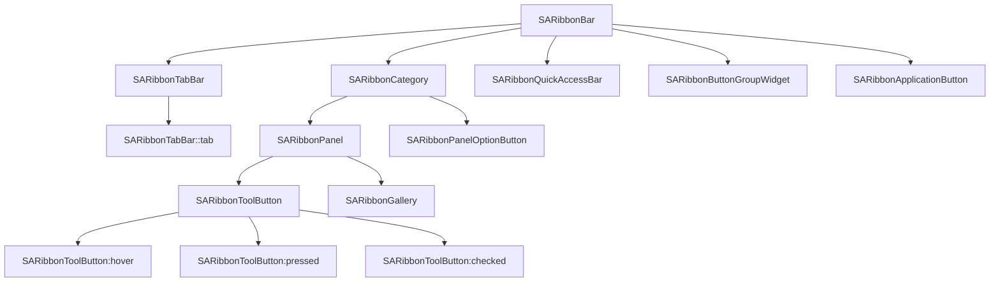

# Customize Your Theme

- ✅ **Full QSS customization**: Deeply customize all visual elements — colors, borders, fonts — via Qt StyleSheet
- ✅ **Native frame mode**: UseNativeFrame flag enables system border, suited for no-custom-titlebar scenarios
- ✅ **QSS scoping**: QSS is applied via `setStyleSheet()` on SARibbonMainWindow — calling `setRibbonTheme()` after a custom `setStyleSheet()` replaces your custom QSS (see scoping section below)
- ✅ **83 QSS selectors**: Covers every SARibbon component with per-theme availability across all 6 built-in themes
- ✅ **Built-in theme reference**: `src/SARibbonBar/resource` provides 6 complete QSS files as modification base

## QSS Selector-Component Mapping

When writing custom QSS, you need to understand the selector-to-component hierarchy:



---

`SARibbon` supports custom styling through QSS (Qt StyleSheet), allowing you to create different Ribbon interface styles. This tutorial uses the **Matlab 2024** Ribbon style as an example to demonstrate how to achieve a similar interface through QSS customization.

!!! example "Tutorial Source Code"
    The source code for this tutorial is located in `example/MatlabUI`

## Matlab 2024 Ribbon Interface Characteristics

The `Matlab 2024` Ribbon interface has these design features:

- Uses native system window frame;
- No custom title bar;
- No Office-style `Application Button`.

We will implement a consistent interface using `SARibbon` based on these characteristics.


## Implementation Steps

### 1. Enable Native Window Frame

`SARibbonMainWindow` provides the `SARibbonMainWindowStyleFlag::UseNativeFrame` flag to enable native system frames. Once enabled, `SARibbon` will not draw its own title bar.

!!! warning "Note"
    This flag must be set in the constructor and cannot be changed at runtime.

```c++ hl_lines="3 4"
MainWindow::MainWindow(QWidget* par)
    : SARibbonMainWindow(par,
                         SARibbonMainWindowStyleFlag::UseNativeFrame
                             | SARibbonMainWindowStyleFlag::UseRibbonMenuBar)
{

}
```

### 2. Set Compact Layout

The default `SARibbon` layout includes a title bar, suitable for frameless windows. In native frame mode, the title bar is redundant and a compact layout should be used.

Set `SARibbonBar::RibbonStyleCompactThreeRow` to remove the title bar and use a three-row layout:

```c++ hl_lines="8"
MainWindow::MainWindow(QWidget* par)
    : SARibbonMainWindow(par,
                         SARibbonMainWindowStyleFlag::UseNativeFrame
                             | SARibbonMainWindowStyleFlag::UseRibbonMenuBar)
{
    SARibbonBar* ribbon = ribbonBar();
    // Use compact mode to avoid blank space at the top
    ribbon->setRibbonStyle(SARibbonBar::RibbonStyleCompactThreeRow);
}
```

### 3. Remove Application Button

Matlab 2024 has no `Application Button`. SARibbon creates one by default; pass a `nullptr` to `SARibbonBar::setApplicationButton` to remove it:

```c++ hl_lines="10"
MainWindow::MainWindow(QWidget* par)
    : SARibbonMainWindow(par,
                         SARibbonMainWindowStyleFlag::UseNativeFrame
                             | SARibbonMainWindowStyleFlag::UseRibbonMenuBar)
{
    SARibbonBar* ribbon = ribbonBar();
    ribbon->setRibbonStyle(SARibbonBar::RibbonStyleCompactThreeRow);
    // Remove Application button
    ribbon->setApplicationButton(nullptr);
}
```

After these settings, you get a window like this (some buttons added for visual effect):


### 4. Adjust Left/Right Margins

`SARibbonBar` has a default 2px left/right padding, but Matlab has none. Set margins to zero:

```c++ hl_lines="8"
MainWindow::MainWindow(QWidget* par)
    : SARibbonMainWindow(par,
                         SARibbonMainWindowStyleFlag::UseNativeFrame
                             | SARibbonMainWindowStyleFlag::UseRibbonMenuBar)
{
    SARibbonBar* ribbon = ribbonBar();
    ...
    ribbon->setContentsMargins(0, 0, 0, 0);
    ...
}
```

### 5. Load Custom QSS Stylesheet

Add a `theme-matlab.qss` file to your project resources, then load and apply it in the `MainWindow` constructor:

```c++ hl_lines="13"
MainWindow::MainWindow(QWidget* par)
    : SARibbonMainWindow(par,
                         SARibbonMainWindowStyleFlag::UseNativeFrame
                             | SARibbonMainWindowStyleFlag::UseRibbonMenuBar)
{
    SARibbonBar* ribbon = ribbonBar();
    ...
    // Load theme from resource file
    QFile file(":/ribbon-theme/theme-matlab.qss");
    if (file.open(QIODevice::ReadOnly | QIODevice::Text)) {
        QString qss = QString::fromUtf8(file.readAll());
        // Apply stylesheet after construction completes
        QTimer::singleShot(0, [ this, qss ]() { this->setStyleSheet(qss); });
    }
}
```

!!! warning "Note"
    Line 13 uses `QTimer::singleShot` to defer `setStyleSheet` until after the constructor finishes, ensuring the UI is fully initialized before applying styles.

## SARibbon QSS Styling

For custom `SARibbon` themes, refer to the built-in themes located in `src/SARibbonBar/resource`.

### 1. Define Base Colors

Before writing QSS, determine the primary colors based on the Matlab 2024 interface:


| Element | Color |
|---------|-------|
| Tab bar background | `#004076` |
| Category background | `#f5f5f5` |
| Text color | `black` |
| Button default background | `#f5f5f5` |
| Button hover/selected | `#d9d9d9` |

### 2. QSS for SARibbonBar Background

```css
SARibbonBar {
  background-color: #004076;
  border: none;
  color: black;
}
```

### 3. QSS for Category Background

```css
SARibbonCategory {
  background-color: #f5f5f5;
}
```


### 4. QSS for SARibbonToolButton

!!! warning "SARibbonToolButton QSS Notes"
    Set `SARibbonToolButton`'s default background to match the Category background (e.g., `#f5f5f5`), **not transparent**. Using transparent causes visual issues in `MenuButtonPopup` mode.

```css
SARibbonToolButton {
  border: none;
  color: black;
  background-color: #f5f5f5; /* Do NOT set to transparent */
}

SARibbonToolButton:pressed {
  background-color: #d9d9d9;
}

SARibbonToolButton:checked {
  background-color: #d9d9d9;
}

SARibbonToolButton:hover {
  background-color: #d9d9d9;
}
```


### 5. QSS for Tab Bar

```css
SARibbonTabBar {
  background-color: transparent;
}

SARibbonTabBar::tab {
  color: white;
  border: 1px solid transparent;
  background: transparent;
  margin-top: 0px;
  margin-right: 0px;
  margin-left: 5px;
  margin-bottom: 0px;
  min-width: 100px;
}

SARibbonTabBar::tab:selected {
  color: black;
  background: #f5f5f5;
}

SARibbonTabBar::tab:hover:!selected {
    color: white;
    background: transparent;
    border-top:1px solid #f5f5f5;
    border-right:1px solid #f5f5f5;
    border-left:1px solid #f5f5f5;
    border-bottom:1px solid transparent;
}
```

## Final Result

After completing the above settings, you will get a Ribbon interface similar to Matlab 2024, with native frame, compact layout, no Application Button, and unified color style.


---

Tutorial source code is located in `example/MatlabUI`

## Appendix: SARibbon QSS Selector Reference

The 83 unique QSS selectors listed below span all 6 built-in themes. Theme columns show availability: ✔ = present, — = absent.

**Theme key**: 2021 = office2021-blue, 2016 = office2016-blue, 2013 = office2013, dark, dark2, win7

### Core: SARibbonBar, SARibbonApplicationButton, SARibbonApplicationWidget

| # | Selector | Description | 2021 | 2016 | 2013 | dark | dark2 | win7 |
|---|---|---|---|---|---|---|---|---|
| 1 | `SARibbonApplicationWidget` | Application widget base style | ✔ | — | — | — | — | — |
| 2 | `SARibbonBar` | Ribbon bar background/border/color | ✔ | ✔ | ✔ | ✔ | ✔ | ✔ |
| 3 | `SARibbonApplicationButton` | Application button base | ✔ | ✔ | ✔ | ✔ | ✔ | ✔ |
| 4 | `SARibbonApplicationButton:hover` | Hover state | ✔ | ✔ | ✔ | ✔ | ✔ | ✔ |
| 5 | `SARibbonApplicationButton:pressed` | Pressed pseudo-state | ✔ | — | ✔ | ✔ | ✔ | ✔ |
| 6 | `SARibbonApplicationButton::pressed` | **Quirk**: sub-control syntax, should be `:pressed` | — | ✔ | — | — | — | — |
| 7 | `SARibbonApplicationButton:focus` | Focus outline:none | ✔ | ✔ | ✔ | ✔ | ✔ | ✔ |
| 8 | `SARibbonApplicationButton::menu-indicator` | Hides menu indicator (width:0) | ✔ | ✔ | ✔ | ✔ | ✔ | ✔ |

### Category: SARibbonCategory, SARibbonCategoryScrollButton, SARibbonStackedWidget

| # | Selector | Description | 2021 | 2016 | 2013 | dark | dark2 | win7 |
|---|---|---|---|---|---|---|---|---|
| 9 | `SARibbonCategory` | Category background | ✔ | ✔ | ✔ | ✔ | ✔ | ✔ |
| 10 | `SARibbonCategory:focus` | Focus outline:none | ✔ | ✔ | ✔ | ✔ | ✔ | ✔ |
| 11 | `SARibbonCategory > SARibbonSeparatorWidget` | Category-scoped separator (color/margin) | ✔ | ✔ | ✔ | — | ✔ | ✔ |
| 12 | `SARibbonCategoryScrollButton` | Scroll button base | ✔ | ✔ | ✔ | ✔ | ✔ | ✔ |
| 13 | `SARibbonCategoryScrollButton[arrowType="3"]` | Right arrow border-right | ✔ | ✔ | ✔ | ✔ | ✔ | ✔ |
| 14 | `SARibbonCategoryScrollButton[arrowType="4"]` | Left arrow border-left | ✔ | ✔ | ✔ | ✔ | ✔ | ✔ |
| 15 | `SARibbonCategoryScrollButton:hover` | Hover state | ✔ | ✔ | ✔ | — | — | — |
| 16 | `SARibbonStackedWidget` | Stacked widget border | ✔ | ✔ | ✔ | ✔ | — | — |
| 17 | `SARibbonStackedWidget:focus` | Focus outline:none | ✔ | ✔ | ✔ | ✔ | — | ✔ |

### Panel: SARibbonPanel, SARibbonPanelLabel, SARibbonPanelOptionButton, Panel-embedded widgets

| # | Selector | Description | 2021 | 2016 | 2013 | dark | dark2 | win7 |
|---|---|---|---|---|---|---|---|---|
| 18 | `SARibbonPanel` | Panel background/border/color | ✔ | ✔ | ✔ | ✔ | ✔ | ✔ |
| 19 | `SARibbonPanel > SARibbonButtonGroupWidget` | Panel-scoped button group border | ✔ | ✔ | — | — | — | — |
| 20 | `SARibbonPanel > SARibbonSeparatorWidget` | Panel-scoped separator | — | — | — | — | ✔ | — |
| 21 | `SARibbonPanelLabel` | Panel title label | ✔ | ✔ | ✔ | ✔ | ✔ | ✔ |
| 22 | `SARibbonPanelOptionButton` | Option button base | ✔ | ✔ | ✔ | ✔ | ✔ | ✔ |
| 23 | `SARibbonPanelOptionButton:hover` | Option button hover | ✔ | ✔ | ✔ | ✔ | ✔ | ✔ |
| 24 | `SARibbonPanel > QLineEdit` | Panel-scoped line edit | ✔ | ✔ | ✔ | ✔ | ✔ | ✔ |
| 25 | `SARibbonPanel > QLineEdit:hover` | Line edit hover | ✔ | ✔ | ✔ | ✔ | ✔ | ✔ |
| 26 | `SARibbonPanel > QCheckBox` | Panel-scoped checkbox | ✔ | ✔ | ✔ | ✔ | ✔ | ✔ |
| 27 | `SARibbonPanel > QRadioButton` | Panel-scoped radio button | — | — | — | — | ✔ | — |
| 28 | `SARibbonPanel > QComboBox` | Panel-scoped combo box | ✔ | ✔ | ✔ | ✔ | ✔ | ✔ |
| 29 | `SARibbonPanel > QComboBox:hover` | Combo hover border | ✔ | ✔ | ✔ | ✔ | ✔ | ✔ |
| 30 | `SARibbonPanel > QComboBox:editable` | Editable combo style | ✔ | ✔ | ✔ | ✔ | ✔ | ✔ |
| 31 | `SARibbonPanel > QComboBox::drop-down` | Drop-down sub-control positioning | ✔ | ✔ | ✔ | ✔ | ✔ | ✔ |
| 32 | `SARibbonPanel > QComboBox::drop-down:hover` | Drop-down hover | ✔ | ✔ | ✔ | ✔ | ✔ | ✔ |
| 33 | `SARibbonPanel > QComboBox::down-arrow` | Down-arrow image | ✔ | ✔ | ✔ | ✔ | ✔ | ✔ |

### Controls: SARibbonToolButton, SARibbonButtonGroupWidget, SARibbonCtrlContainer, SARibbonQuickAccessBar

| # | Selector | Description | 2021 | 2016 | 2013 | dark | dark2 | win7 |
|---|---|---|---|---|---|---|---|---|
| 34 | `SARibbonToolButton` | Tool button base | ✔ | ✔ | ✔ | ✔ | ✔ | ✔ |
| 35 | `SARibbonToolButton:focus` | Focus border/bg | — | — | ✔ | ✔ | ✔ | ✔ |
| 36 | `SARibbonToolButton:pressed` | Pressed state | ✔ | ✔ | ✔ | ✔ | ✔ | ✔ |
| 37 | `SARibbonToolButton:hover` | Hover state | ✔ | ✔ | ✔ | ✔ | ✔ | ✔ |
| 38 | `SARibbonToolButton:checked` | Checked state | ✔ | ✔ | ✔ | ✔ | ✔ | ✔ |
| 39 | `SARibbonToolButton:checked:hover` | Checked+hover combo | ✔ | — | — | — | — | — |
| 40 | `SARibbonButtonGroupWidget` | Button group base (transparent bg) | ✔ | ✔ | ✔ | ✔ | ✔ | ✔ |
| 41 | `SARibbonButtonGroupWidget > QToolButton` | Group-scoped tool button | — | ✔ | — | ✔ | ✔ | ✔ |
| 42 | `SARibbonButtonGroupWidget > QToolButton:hover` | Group button hover | — | ✔ | — | ✔ | ✔ | ✔ |
| 43 | `SARibbonButtonGroupWidget > QToolButton:pressed` | Group button pressed | — | ✔ | — | ✔ | ✔ | ✔ |
| 44 | `SARibbonButtonGroupWidget > QToolButton:checked` | Group button checked | — | ✔ | — | ✔ | ✔ | ✔ |
| 45 | `SARibbonButtonGroupWidget > QToolButton[popupMode="1"]` | MenuButtonPopup padding | — | ✔ | — | ✔ | ✔ | ✔ |
| 46 | `SARibbonButtonGroupWidget > QToolButton[popupMode="1"]::menu-button:hover` | Menu button hover | — | ✔ | — | ✔ | ✔ | ✔ |
| 47 | `SARibbonButtonGroupWidget > QToolButton[popupMode="1"]::menu-button:pressed` | Menu button pressed | — | ✔ | — | ✔ | ✔ | ✔ |
| 48 | `SARibbonButtonGroupWidget > QToolButton[popupMode="2"]` | InstantPopup padding | — | ✔ | — | ✔ | ✔ | ✔ |
| 49 | `SARibbonButtonGroupWidget > QToolButton[popupMode="0"]` | No-popup small padding | — | ✔ | — | ✔ | ✔ | ✔ |
| 50 | `SARibbonCtrlContainer` | Ctrl container (transparent) | ✔ | ✔ | ✔ | ✔ | ✔ | ✔ |
| 51 | `SARibbonQuickAccessBar` | Quick Access Bar | — | ✔ | — | — | — | — |

### TabBar: SARibbonTabBar

| # | Selector | Description | 2021 | 2016 | 2013 | dark | dark2 | win7 |
|---|---|---|---|---|---|---|---|---|
| 52 | `SARibbonTabBar` | Tab bar background | ✔ | ✔ | ✔ | ✔ | ✔ | ✔ |
| 53 | `SARibbonTabBar::tab` | Tab base style | ✔ | ✔ | ✔ | ✔ | ✔ | ✔ |
| 54 | `SARibbonTabBar::tab:selected` | Selected tab | ✔ | ✔ | ✔ | ✔ | ✔ | ✔ |
| 55 | `SARibbonTabBar::tab:hover:!selected` | Hover on unselected tab | ✔ | ✔ | ✔ | ✔ | ✔ | ✔ |
| 56 | `SARibbonTabBar::tab:!selected` | Explicit unselected tab style | — | — | — | ✔ | ✔ | — |
| 57 | `SARibbonTabBar::tab:selected, SARibbonTabBar::tab:hover` | Combined selector, rounded corners | — | — | — | — | — | ✔ |

### Separator: SARibbonSeparatorWidget

| # | Selector | Description | 2021 | 2016 | 2013 | dark | dark2 | win7 |
|---|---|---|---|---|---|---|---|---|
| 58 | `SARibbonSeparatorWidget` | Separator base style (`color` for line, some themes also `background-color`) | ✔ | ✔ | ✔ | ✔ | ✔ | ✔ |

### Gallery: SARibbonGallery, SARibbonGalleryButton, SARibbonGalleryGroup, SARibbonGalleryViewport

| # | Selector | Description | 2021 | 2016 | 2013 | dark | dark2 | win7 |
|---|---|---|---|---|---|---|---|---|
| 59 | `SARibbonGallery` | Gallery border/bg/color | ✔ | ✔ | ✔ | ✔ | ✔ | ✔ |
| 60 | `SARibbonGalleryButton` | Gallery scroll button base | ✔ | ✔ | ✔ | ✔ | ✔ | ✔ |
| 61 | `SARibbonGalleryButton:hover` | Gallery button hover | ✔ | ✔ | — | — | — | — |
| 62 | `SARibbonGalleryGroup` | Gallery group (show-decoration-selected, border) | ✔ | ✔ | ✔ | ✔ | ✔ | ✔ |
| 63 | `SARibbonGalleryGroup::item` | Base item style | — | — | — | ✔ | ✔ | — |
| 64 | `SARibbonGalleryGroup::item:selected` | Selected item | ✔ | ✔ | ✔ | ✔ | ✔ | ✔ |
| 65 | `SARibbonGalleryGroup::item:hover` | Hovered item | ✔ | ✔ | ✔ | ✔ | ✔ | ✔ |
| 66 | `SARibbonGalleryViewport` | Gallery viewport background | ✔ | ✔ | ✔ | ✔ | ✔ | — |
| 67 | `RibbonGalleryViewport` | **Quirk**: missing `SA` prefix, should be `SARibbonGalleryViewport` | — | — | — | — | — | ✔ |

### Menu: SARibbonMenu

| # | Selector | Description | 2021 | 2016 | 2013 | dark | dark2 | win7 |
|---|---|---|---|---|---|---|---|---|
| 68 | `SARibbonMenu` | Menu background/color/border | ✔ | ✔ | ✔ | ✔ | ✔ | ✔ |
| 69 | `SARibbonMenu::item` | Menu item padding/bg | ✔ | ✔ | ✔ | ✔ | ✔ | ✔ |
| 70 | `SARibbonMenu::item:selected` | Selected menu item | ✔ | ✔ | ✔ | ✔ | ✔ | ✔ |
| 71 | `SARibbonMenu::item:hover` | Hovered menu item | ✔ | ✔ | ✔ | ✔ | ✔ | ✔ |
| 72 | `SARibbonMenu::icon` | Menu icon margin | ✔ | ✔ | ✔ | ✔ | ✔ | ✔ |

### System: SARibbonSystemToolButton, Window Control Buttons

| # | Selector | Description | 2021 | 2016 | 2013 | dark | dark2 | win7 |
|---|---|---|---|---|---|---|---|---|
| 73 | `SARibbonSystemToolButton` | System button base (transparent bg, no border) | ✔ | ✔ | ✔ | ✔ | ✔ | ✔ |
| 74 | `SARibbonSystemToolButton:focus` | Focus outline:none | ✔ | ✔ | ✔ | ✔ | ✔ | ✔ |
| 75 | `SARibbonSystemToolButton#SAMinimizeWindowButton` | Minimize button image/padding | ✔ | ✔ | ✔ | ✔ | ✔ | ✔ |
| 76 | `SARibbonSystemToolButton#SAMinimizeWindowButton:hover` | Minimize hover bg | ✔ | ✔ | ✔ | ✔ | ✔ | ✔ |
| 77 | `SARibbonSystemToolButton#SAMinimizeWindowButton:pressed` | Minimize pressed bg | ✔ | ✔ | ✔ | ✔ | ✔ | ✔ |
| 78 | `SARibbonSystemToolButton#SAMaximizeWindowButton` | Maximize button image/padding | ✔ | ✔ | ✔ | ✔ | ✔ | ✔ |
| 79 | `SARibbonSystemToolButton#SAMaximizeWindowButton:hover` | Maximize hover bg | ✔ | ✔ | ✔ | ✔ | ✔ | ✔ |
| 80 | `SARibbonSystemToolButton#SAMaximizeWindowButton:checked` | Maximize checked, shows Normal.svg icon | ✔ | ✔ | ✔ | ✔ | ✔ | ✔ |
| 81 | `SARibbonSystemToolButton#SACloseWindowButton` | Close button image/padding | ✔ | ✔ | ✔ | ✔ | ✔ | ✔ |
| 82 | `SARibbonSystemToolButton#SACloseWindowButton:hover` | Close hover, red bg (#e81123) | ✔ | ✔ | ✔ | ✔ | ✔ | ✔ |
| 83 | `SARibbonSystemToolButton#SACloseWindowButton:pressed` | Close pressed, lighter red (#f1707a) | ✔ | ✔ | ✔ | ✔ | ✔ | ✔ |

### Per-Theme Selector Counts

| Theme | File | Lines | Selectors |
|---|---|---|---|
| office2021-blue | theme-office2021-blue.qss | 404 | 66 |
| office2016-blue | theme-office2016-blue.qss | 422 | 74 |
| office2013 | theme-office2013.qss | 373 | 63 |
| dark | theme-dark.qss | 367 | 71 |
| dark2 | theme-dark2.qss | 398 | 72 |
| win7 | theme-win7.qss | 391 | 70 |

!!! tip "Tip"
    All built-in theme QSS files are located in `src/SARibbonBar/resource/`. It is recommended to base your custom theme on these files to avoid missing critical selectors.

---

## Correct QSS Scoping

Qt's `setStyleSheet()` replaces the entire style sheet for the target widget and its children. It does **not** merge with previously set styles:

```cpp
// This replaces any previously applied QSS:
w->setStyleSheet(qss1);
// Later:
w->setStyleSheet(qss2);  // qss1 is completely replaced
```

SARibbon's `setRibbonTheme()` calls `SA::setBuiltInRibbonTheme()` which internally calls `w->setStyleSheet(getBuiltInRibbonThemeQss(theme))`. This means calling `setRibbonTheme()` **replaces** any custom QSS you previously set.

!!! warning "Important"
    If you call `setRibbonTheme()` **after** applying a custom QSS via `setStyleSheet()`, your custom QSS is overwritten. The recommended patterns are:

    1. **Start from a built-in theme**: Use one of the 6 QSS files in `src/SARibbonBar/resource/` as your base and modify it directly.
    2. **Set theme first, then customize**: Call `setRibbonTheme()` first, then apply your overrides on top via `setStyleSheet()`.
    3. **Avoid calling setRibbonTheme() after customization**: If you need dynamic theme switching, re-apply your custom QSS after each `setRibbonTheme()` call.

## Post-QSS Adjustment for Custom Themes

QSS alone cannot express all visual properties. SARibbon applies three programmatic corrections after loading each built-in theme QSS:

1. **Tab margins** — `SARibbonTabBar::setTabMargin(QMargins(...))` overrides margin values that Qt's style engine may not propagate correctly from QSS.
2. **Context category colors** — `SARibbonBar::setContextCategoryColorList()` sets the runtime color palette for contextual tabs. QSS cannot express this.
3. **Baseline color** — `SARibbonBar::setTabBarBaseLineColor(QColor(...))` sets the baseline indicator below tabs. Also QSS-inexpressible.

If you create a custom theme via QSS only, you may need to replicate these adjustments in C++. For example:

```cpp
// After setting your custom QSS, apply post-QSS adjustments
SARibbonBar* bar = ribbonBar();

// 1. Tab margins (only Office2021Blue uses QMargins(5,0,5,0); most use QMargins(5,0,0,0))
SARibbonTabBar* tab = bar->findChild<SARibbonTabBar*>();
if (tab) {
    tab->setTabMargin(QMargins(5, 0, 0, 0));
}

// 2. Context category colors (empty list = default palette)
bar->setContextCategoryColorList(QList<QColor>());

// 3. Baseline color (QColor() = no baseline)
bar->setTabBarBaseLineColor(QColor());
```

For the full per-theme adjustment table, see `setRibbonTheme()` in `SRC_DIR/src/SARibbonBar/SARibbonMainWindow.cpp` or `src/SARibbonBar/SARibbonWidget.cpp`. The three adjustment groups are:

| Theme | Tab Margins | Context Colors | Baseline Color |
|---|---|---|---|
| Windows 7 | `QMargins(5,0,0,0)` | Empty (default palette) | Cleared |
| Office 2013 | `QMargins(5,0,0,0)` | Empty (default palette) | `QColor(186,201,219)` |
| Office 2016 Blue | `QMargins(5,0,0,0)` | `QColor(18,64,120)` | Cleared |
| Office 2021 Blue | `QMargins(5,0,5,0)` | `QColor(209,207,209)` | Cleared |
| Dark | `QMargins(5,0,0,0)` | Empty (default palette) | Cleared |
| Dark 2 | `QMargins(5,0,0,0)` | Not handled | Cleared |

## Adding a New Built-in Theme (Developer Guide)

To extend SARibbon with a new built-in theme, follow these 5 steps:

### Step 1: Create the QSS file

Create a `.qss` file (e.g., `theme-mytheme.qss`) in `src/SARibbonBar/resource/`. Base it on the most complete existing theme (`theme-office2016-blue.qss` with 74 selectors) to ensure full coverage.

### Step 2: Register in QRC

Add the file to `src/SARibbonBar/SARibbonResource.qrc` under the `/SARibbonTheme` prefix:

```xml
<qresource prefix="/SARibbonTheme">
    <file>resource/theme-mytheme.qss</file>
</qresource>
```

### Step 3: Add the enum value

Add a new entry to the `SARibbonTheme` enum in `src/SARibbonBar/SARibbonGlobal.h`:

```cpp
enum class SARibbonTheme {
    RibbonThemeOffice2013,
    RibbonThemeOffice2016Blue,
    RibbonThemeOffice2021Blue,
    RibbonThemeWindows7,
    RibbonThemeDark,
    RibbonThemeDark2,
    RibbonThemeMyTheme   // Add your theme here
};
```

### Step 4: Add the switch case

**QSS mapping** — Add the file path in `SA::getBuiltInRibbonThemeQss()` in `src/SARibbonBar/SARibbonUtil.cpp`:

```cpp
case SARibbonTheme::RibbonThemeMyTheme:
    return QStringLiteral(":/SARibbonTheme/resource/theme-mytheme.qss");
```

**Post-QSS adjustments** — Add a case in `setRibbonTheme()` in `src/SARibbonBar/SARibbonMainWindow.cpp`:

```cpp
case RibbonThemeMyTheme:
    tab->setTabMargin(QMargins(5, 0, 0, 0));
    bar->setContextCategoryColorList(QList<QColor>());
    bar->setTabBarBaseLineColor(QColor());
    break;
```

If the window supports `SARibbonWidget`, add the same case in `src/SARibbonBar/SARibbonWidget.cpp`.

### Step 5: (Optional) Add theme-specific images

If your theme needs custom window control button icons, add them under `src/SARibbonBar/resource/` and reference them via ID selectors (`#SAMinimizeWindowButton`, `#SAMaximizeWindowButton`, `#SACloseWindowButton`).

### Files involved (summary)

| File | Purpose |
|---|---|
| `src/SARibbonBar/resource/theme-mytheme.qss` | QSS rules |
| `src/SARibbonBar/SARibbonResource.qrc` | QRC registration |
| `src/SARibbonBar/SARibbonGlobal.h` | Enum definition |
| `src/SARibbonBar/SARibbonUtil.cpp` | QSS path mapping |
| `src/SARibbonBar/SARibbonMainWindow.cpp` | Post-QSS adjustments |
| `src/SARibbonBar/SARibbonWidget.cpp` | Post-QSS adjustments (if applicable) |

## QSS Scoping Warnings

Because SARibbon embeds standard Qt widgets inside panels, descendant selectors like `SARibbonPanel > QComboBox` target **all** `QComboBox` instances within a panel. Qt scopes QSS to the widget tree of the widget on which `setStyleSheet()` was called, so these selectors do **not** affect `QComboBox` instances outside the SARibbon main window.

Key points to watch:

- `SARibbonPanel > QComboBox` styles apply to any `QComboBox` placed in a panel via `addWidget()`, not just SARibbon-specific combos
- `SARibbonPanel > QLineEdit`, `SARibbonPanel > QCheckBox`, and `SARibbonPanel > QRadioButton` similarly target standard Qt widgets embedded in panels
- `SARibbonButtonGroupWidget > QToolButton` selectors target **all** `QToolButton` instances inside a button group, including those added via `addWidget()`
- If your application has standard Qt widgets outside the SARibbon main window, they are unaffected — but widgets **inside** panels inherit the panel-scoped style

## Note on Chinese Comments

The built-in QSS files in `src/SARibbonBar/resource/` contain Chinese comments documenting each selector block. These comments do not affect QSS parsing — they serve as inline documentation. English-speaking developers can still use these files as a structural reference: the selector names, pseudo-states, and property declarations are language-agnostic. The Chinese comments simply describe the visual purpose of each block (e.g., "tab bar bottom border color").
