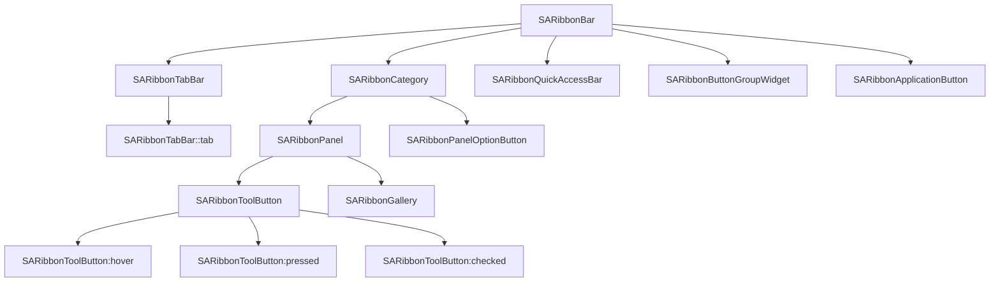
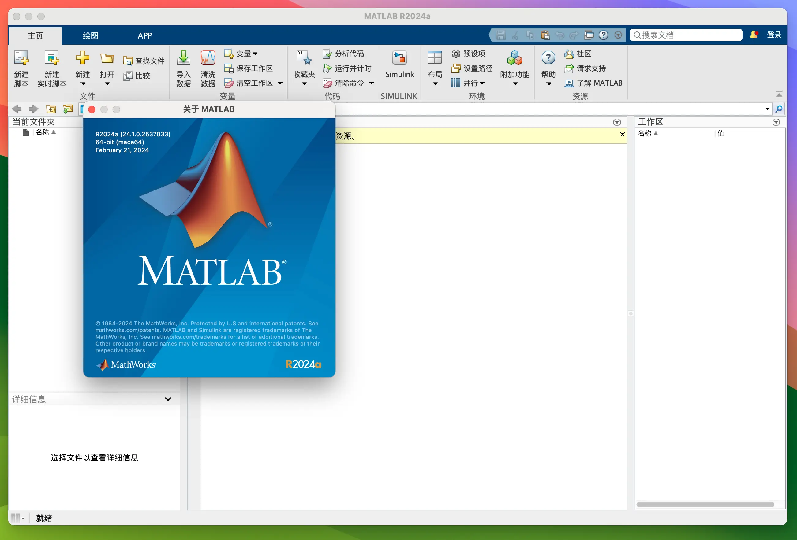
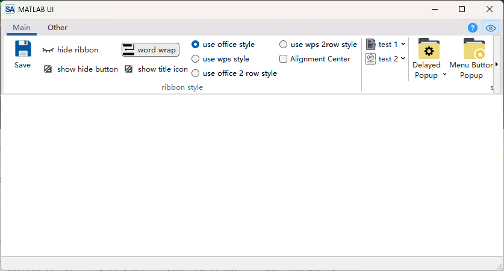
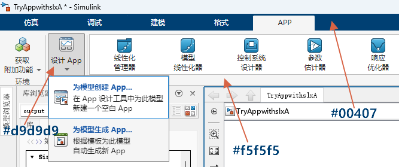
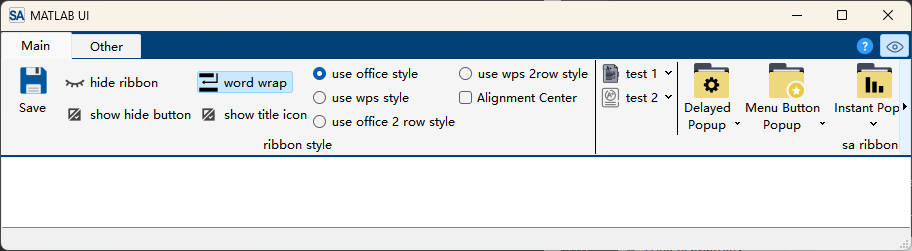
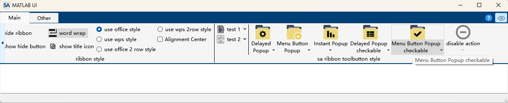
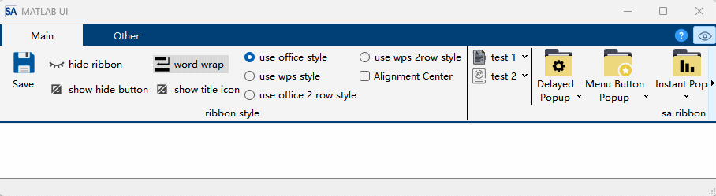

# Customize Your Theme

- ✅ **Full QSS customization**: Deeply customize all visual elements — colors, borders, fonts — via Qt StyleSheet
- ✅ **Native frame mode**: UseNativeFrame flag enables system border, suited for no-custom-titlebar scenarios
- ✅ **Style merge mechanism**: Built-in theme QSS and custom QSS merge without overwriting each other
- ✅ **15 QSS selectors**: Covers SARibbonBar/Category/Panel/ToolButton/TabBar and all core components
- ✅ **Built-in theme reference**: `src/SARibbonBar/resource` provides 6 complete QSS files as modification base

## QSS Selector-Component Mapping

When writing custom QSS, you need to understand the selector-to-component hierarchy:



---

`SARibbon` supports custom styling through QSS (Qt StyleSheet), allowing you to create different Ribbon interface styles. This tutorial uses the **Matlab 2024** Ribbon style as an example to demonstrate how to achieve a similar interface through QSS customization.

!!! example "Tutorial Source Code"
    The source code for this tutorial is located in `example/MatlabUI`

## Matlab 2024 Ribbon Interface Characteristics

The `Matlab 2024` Ribbon interface has these design features:

- Uses native system window frame;
- No custom title bar;
- No Office-style `Application Button`.

We will implement a consistent interface using `SARibbon` based on these characteristics.



## Implementation Steps

### 1. Enable Native Window Frame

`SARibbonMainWindow` provides the `SARibbonMainWindowStyleFlag::UseNativeFrame` flag to enable native system frames. Once enabled, `SARibbon` will not draw its own title bar.

!!! warning "Note"
    This flag must be set in the constructor and cannot be changed at runtime.

```c++ hl_lines="3 4"
MainWindow::MainWindow(QWidget* par)
    : SARibbonMainWindow(par,
                         SARibbonMainWindowStyleFlag::UseNativeFrame
                             | SARibbonMainWindowStyleFlag::UseRibbonMenuBar)
{

}
```

### 2. Set Compact Layout

The default `SARibbon` layout includes a title bar, suitable for frameless windows. In native frame mode, the title bar is redundant and a compact layout should be used.

Set `SARibbonBar::RibbonStyleCompactThreeRow` to remove the title bar and use a three-row layout:

```c++ hl_lines="8"
MainWindow::MainWindow(QWidget* par)
    : SARibbonMainWindow(par,
                         SARibbonMainWindowStyleFlag::UseNativeFrame
                             | SARibbonMainWindowStyleFlag::UseRibbonMenuBar)
{
    SARibbonBar* ribbon = ribbonBar();
    // Use compact mode to avoid blank space at the top
    ribbon->setRibbonStyle(SARibbonBar::RibbonStyleCompactThreeRow);
}
```

### 3. Remove Application Button

Matlab 2024 has no `Application Button`. SARibbon creates one by default; pass a `nullptr` to `SARibbonBar::setApplicationButton` to remove it:

```c++ hl_lines="10"
MainWindow::MainWindow(QWidget* par)
    : SARibbonMainWindow(par,
                         SARibbonMainWindowStyleFlag::UseNativeFrame
                             | SARibbonMainWindowStyleFlag::UseRibbonMenuBar)
{
    SARibbonBar* ribbon = ribbonBar();
    ribbon->setRibbonStyle(SARibbonBar::RibbonStyleCompactThreeRow);
    // Remove Application button
    ribbon->setApplicationButton(nullptr);
}
```

After these settings, you get a window like this (some buttons added for visual effect):



### 4. Adjust Left/Right Margins

`SARibbonBar` has a default 3px left/right padding, but Matlab has none. Set margins to zero:

```c++ hl_lines="8"
MainWindow::MainWindow(QWidget* par)
    : SARibbonMainWindow(par,
                         SARibbonMainWindowStyleFlag::UseNativeFrame
                             | SARibbonMainWindowStyleFlag::UseRibbonMenuBar)
{
    SARibbonBar* ribbon = ribbonBar();
    ...
    ribbon->setContentsMargins(0, 0, 0, 0);
    ...
}
```

### 5. Load Custom QSS Stylesheet

Add a `theme-matlab.qss` file to your project resources, then load and apply it in the `MainWindow` constructor:

```c++ hl_lines="13"
MainWindow::MainWindow(QWidget* par)
    : SARibbonMainWindow(par,
                         SARibbonMainWindowStyleFlag::UseNativeFrame
                             | SARibbonMainWindowStyleFlag::UseRibbonMenuBar)
{
    SARibbonBar* ribbon = ribbonBar();
    ...
    // Load theme from resource file
    QFile file(":/ribbon-theme/theme-matlab.qss");
    if (file.open(QIODevice::ReadOnly | QIODevice::Text)) {
        QString qss = QString::fromUtf8(file.readAll());
        // Apply stylesheet after construction completes
        QTimer::singleShot(0, [ this, qss ]() { this->setStyleSheet(qss); });
    }
}
```

!!! warning "Note"
    Line 13 uses `QTimer::singleShot` to defer `setStyleSheet` until after the constructor finishes, ensuring the UI is fully initialized before applying styles.

## SARibbon QSS Styling

For custom `SARibbon` themes, refer to the built-in themes located in `src/SARibbonBar/resource`.

### 1. Define Base Colors

Before writing QSS, determine the primary colors based on the Matlab 2024 interface:



| Element | Color |
|---------|-------|
| Tab bar background | `#004076` |
| Category background | `#f5f5f5` |
| Text color | `black` |
| Button default background | `#f5f5f5` |
| Button hover/selected | `#d9d9d9` |

### 2. QSS for SARibbonBar Background

```css
SARibbonBar {
  background-color: #004076;
  border: none;
  color: black;
}
```

### 3. QSS for Category Background

```css
SARibbonCategory {
  background-color: #f5f5f5;
}
```



### 4. QSS for SARibbonToolButton

!!! warning "SARibbonToolButton QSS Notes"
    Set `SARibbonToolButton`'s default background to match the Category background (e.g., `#f5f5f5`), **not transparent**. Using transparent causes visual issues in `MenuButtonPopup` mode.

```css
SARibbonToolButton {
  border: none;
  color: black;
  background-color: #f5f5f5; /* Do NOT set to transparent */
}

SARibbonToolButton:pressed {
  background-color: #d9d9d9;
}

SARibbonToolButton:checked {
  background-color: #d9d9d9;
}

SARibbonToolButton:hover {
  background-color: #d9d9d9;
}
```



### 5. QSS for Tab Bar

```css
SARibbonTabBar {
  background-color: transparent;
}

SARibbonTabBar::tab {
  color: white;
  border: 1px solid transparent;
  background: transparent;
  margin-top: 0px;
  margin-right: 0px;
  margin-left: 5px;
  margin-bottom: 0px;
  min-width: 100px;
}

SARibbonTabBar::tab:selected {
  color: black;
  background: #f5f5f5;
}

SARibbonTabBar::tab:hover:!selected {
    color: white;
    background: transparent;
    border-top:1px solid #f5f5f5;
    border-right:1px solid #f5f5f5;
    border-left:1px solid #f5f5f5;
    border-bottom:1px solid transparent;
}
```

## Final Result

After completing the above settings, you will get a Ribbon interface similar to Matlab 2024, with native frame, compact layout, no Application Button, and unified color style.



---

Tutorial source code is located in `example/MatlabUI`

## Appendix: SARibbon QSS Selector Reference

| QSS Selector | Component | Common Properties |
|-------------|-----------|------------------|
| `SARibbonBar` | Main Ribbon bar | `background-color`, `border` |
| `SARibbonCategory` | Category page | `background-color` |
| `SARibbonPanel` | Panel | `background-color`, `border` |
| `SARibbonToolButton` | Ribbon tool button | `background-color`, `color`, `border` |
| `SARibbonToolButton:hover` | Button hover state | `background-color` |
| `SARibbonToolButton:pressed` | Button pressed state | `background-color` |
| `SARibbonToolButton:checked` | Button checked state | `background-color` |
| `SARibbonTabBar` | Tab bar | `background-color` |
| `SARibbonTabBar::tab` | Individual tab | `color`, `background`, `margin-*`, `min-width` |
| `SARibbonTabBar::tab:selected` | Selected tab | `color`, `background` |
| `SARibbonApplicationButton` | Application button | `background-color`, `border-radius`, `color` |
| `SARibbonQuickAccessBar` | Quick access bar | `background-color` |
| `SARibbonButtonGroupWidget` | Button group | `background-color`, `border` |
| `SARibbonGallery` | Gallery widget | `background-color`, `border` |

!!! tip "Tip"
    Built-in theme QSS files are located in `src/SARibbonBar/resource`. It is recommended to base your custom theme on these files to avoid missing critical selectors.
