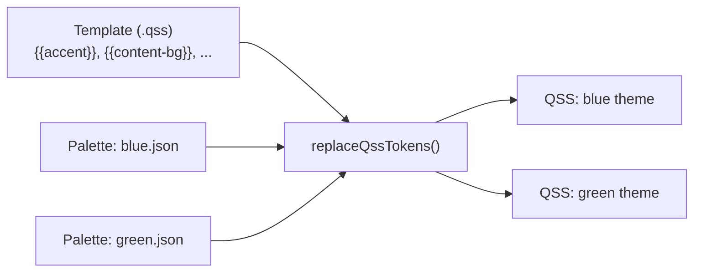

# JSON Theme Configuration Guide

- ✅ **Template + Palette architecture**: `.qss` templates contain `{{token}}` placeholders, `.json` palettes supply the actual colors
- ✅ **One template → many variants**: change colors without copying QSS — just provide a different palette JSON
- ✅ **Three color layers**: `keyColors` (primary tokens), `derived` (computed from rules), `fixed` (absolute values)
- ✅ **Gradient support**: `qlineargradient(...)` values in palettes produce gradient backgrounds in QSS
- ✅ **Dark mode reversal**: `isDark` flag auto-reverses derivation rules for correct contrast
- ✅ **Programmatic overrides**: C++ setters (`setAccentColor`, etc.) recalculate derived colors dynamically

For the theme switching API and built-in theme overview, see [SARibbon Theme Switching](./SARibbon-theme.md). For full QSS customization beyond palettes, see [Customize Your Theme](./design-your-theme.md).

## 1. Introduction

SARibbon uses a **template + palette** architecture to generate theme QSS. The core idea:

- **Templates** (`.qss` files) define the visual structure — which selectors exist, what properties they set — but use `{{token}}` placeholders instead of hardcoded colors
- **Palettes** (`.json` files) define the color values that fill those placeholders

This separation means **one template can produce many visually different themes** simply by swapping the palette. For example, `office2016.qss` + `office2016-blue.json` produces the blue Office 2016 theme, while the same template + `office2016-green.json` produces the green variant — no QSS duplication needed.



This guide covers the complete JSON palette schema, all value formats (including gradients), color layer semantics, dark mode behavior, and practical workflows for creating custom palettes.

## 2. JSON Palette Schema Reference

### 2.1 Top-level Fields

A palette JSON file has the following structure:

```json
{
  "name": "My Theme",
  "version": "1.0",
  "isDark": false,
  "keyColors": { ... },
  "derived": { ... },
  "fixed": { ... },
  "comments": { ... }
}
```

| Field | Type | Required | Default | Description |
|-------|------|----------|---------|-------------|
| `name` | string | No | `""` | Human-readable label, not used by the engine |
| `version` | string | No | — | Schema version for tracking |
| `isDark` | bool | No | `false` | Dark mode flag: reverses derivation rules when `true` |
| `keyColors` | object | **Yes** | — | Primary design tokens (name → hex color string or `qlineargradient(...)`) |
| `derived` | object | No | — | Colors computed from keyColors via lighten/darken rules |
| `fixed` | object | No | — | Absolute colors not derived from key colors |
| `comments` | object | No | — | Human documentation only (not parsed by the engine) |

!!! note
    The `comments` field is present in some built-in palettes (e.g., `office2021-blue.json`, `dark-default.json`) but absent in others (`win7-default.json`, `office2013-default.json`). It maps token names to UI descriptions and is purely informational.

### 2.2 Color Value Formats

#### Hex Color (standard)

```json
"accent": "#225497"
```

Six-digit hex with `#` prefix is the most common format. The engine uses `QColor(string)` for parsing, so all formats Qt supports are valid: `#RRGGBB`, `#RGB` (shorthand), `#AARRGGBB` (with alpha). The `#` prefix is optional — `QColor` handles both.

#### Named Colors

```json
"text-color": "transparent"
```

Qt named colors (`transparent`, `white`, `black`, `red`, etc.) are valid as long as `QColor(string)` can parse them. Use these sparingly — hex values are preferred for precision.

#### qlineargradient (Win7-style gradients)

```json
"app-btn-bg": "qlineargradient(spread:pad, x1:0, y1:0, x2:0, y2:1, stop:0 #467FBD, stop:0.5 #2A5FAC, stop:0.51 #1A4088, stop:1 #419ACF)"
```

**Gradient format reference:**

```
qlineargradient(spread:<method>, x1:<float>, y1:<float>, x2:<float>, y2:<float>, stop:<float> <color> [, stop:<float> <color> ...])
```

| Parameter | Values | Description |
|-----------|--------|-------------|
| `spread` | `pad`, `repeat`, `reflect` | How gradient extends beyond bounds |
| `x1, y1` | float (usually 0-1) | Start point (relative coordinates) |
| `x2, y2` | float (usually 0-1) | End point (relative coordinates) |
| `stop` | `<position> <color>` | Color stop. Position 0 = start, 1 = end. Color in hex. |

**Common gradient patterns illustrated with Win7 examples:**

*Vertical gradient (top to bottom):*

```
x1:0, y1:0, x2:0, y2:1   →   top → bottom
```

Used in: `app-btn-bg`, `app-btn-hover-bg`, `app-btn-pressed-bg`, `gallery-selected-bg`

*Win7 Application Button gradient breakdown (as a tutorial example):*

```json
"app-btn-bg": "qlineargradient(spread:pad, x1:0, y1:0, x2:0, y2:1,
    stop:0    #467FBD,
    stop:0.5  #2A5FAC,
    stop:0.51 #1A4088,
    stop:1    #419ACF)"
```

Explanation of each stop:

- `stop:0`: Top of button = lighter blue `#467FBD`
- `stop:0.5`: 50% down = medium blue `#2A5FAC`
- `stop:0.51`: 51% down = darker blue `#1A4088` (creates a sharp color break for 3D effect)
- `stop:1`: Bottom = bright cyan blue `#419ACF`

*How to create your own gradient variant:*

```json
"app-btn-bg": "qlineargradient(spread:pad, x1:0, y1:0, x2:0, y2:1,
    stop:0    #BF4646,
    stop:0.5  #AC2A2A,
    stop:0.51 #881A1A,
    stop:1    #CF4141)"
```

This replaces the blue gradient with a red one while keeping the same stop structure.

!!! note "Hard color breaks"
    The `stop:0.5` and `stop:0.51` technique (stops 1% apart) creates a visible horizontal line in the gradient, simulating the Windows 7 "split button" 3D effect.

**How gradients are handled internally:**

When `loadFromJson()` encounters a value in `fixed` that `QColor()` cannot parse (e.g., `qlineargradient(...)`), it stores the value as a raw string in the internal `m_rawStrings` map. The `rawValue()` method returns it directly, and `replaceQssTokens()` writes it verbatim into the QSS output — no color conversion is applied.

!!! note "Opacity modifier"
    `replaceQssTokens()` supports an `{{token|opacity(value)}}` syntax that converts a hex color to `#AARRGGBB` format with the specified alpha channel. For example, `{{accent|opacity(0.5)}}` produces `#80225497` (50% transparent accent). This feature exists in the engine but is currently unused by any built-in template.

### 2.3 Dark Theme: `isDark` Field

| `isDark` | `"fn": "lighten"` | `"fn": "darken"` |
|----------|-------------------|------------------|
| `false` (default) | `QColor::lighter(100 + amount)` | `QColor::darker(100 + amount)` |
| `true` | `QColor::darker(100 + amount)` | `QColor::lighter(100 + amount)` |

This reversal ensures contrast correctness: in a dark theme, you want hover states to be *lighter* than the background, not darker.

**Example:**

```json
{
  "isDark": true,
  "keyColors": {
    "content-bg": "#2d2d2d"
  },
  "derived": {
    "content-hover-bg": { "fn": "darken", "base": "content-bg", "amount": 15 }
  }
}
```

With `isDark: true`, `"fn": "darken"` is reversed to `lighter(115)`, so `content-hover-bg` becomes `#3a3a3a` — lighter than `#2d2d2d`, which is the correct behavior for a dark theme hover state.

## 3. The Three Color Layers: keyColors / derived / fixed

### 3.1 keyColors (Primary Design Tokens)

The most impactful colors. Changing these propagates to derived colors automatically.

**Convention across all built-in themes:**

| Token | Role | Changed for color variants? |
|-------|------|---------------------------|
| `accent` | Ribbon bar + tab bar background, selected tab underline (some templates) | **Yes** — defines the theme's identity |
| `content-bg` | Category/Panel/ToolButton/Menu/Gallery background | **Yes** — the "canvas" color |
| `text-color` | All primary text (buttons, menus, gallery) | **Yes** — must contrast with `content-bg` |
| `subtitle` | Panel titles, secondary text | Optional |
| `*` | (token set varies per template) | Depends on template |
| `tab-accent` | Selected tab text + underline (office2021 only) | Fixed value, not inherited by color variants |

!!! note "Template-Specific Tokens"
    Some tokens exist only in specific templates to address visual differentiation needs. For example, `office2021.qss` uses `tab-accent` (fixed) and `tab-accent-hover` (derived) to specify highlight colors for selected/hover tabs independently from `accent`, preventing the selected tab from being invisible when `accent` is a light gray background color. Other templates (e.g., office2016, win7) use generic tokens like `accent` or `white` directly.

**Built-in palette comparison (shows how variants differ):**

| Token | office2016-blue | office2016-green | office2016-dark | office2021-blue | office2021-green | office2021-dark | dark-default |
|-------|----------------|-----------------|-----------------|-----------------|-----------------|-----------------|--------------|
| `accent` | `#225497` | `#2d7d46` | `#1e1e1e` | `#e5e3e5` | `#dce8d6` | `#1e1e1e` | `#1e1e1e` |
| `content-bg` | `#f1f1f1` | `#f1f1f1` | `#2d2d2d` | `#ffffff` | `#ffffff` | `#2d2d2d` | `#2d2d2d` |
| `text-color` | `#333333` | `#333333` | `#e0e0e0` | `#242424` | `#242424` | `#e0e0e0` | `#e0e0e0` |
| `tab-accent` | — | — | — | `#2760a7` | `#3d9141` | `#6a9eff` | — |

This table demonstrates: same template (`office2016.qss`), three different palettes → three visually distinct themes. This is the core concept of the palette system.

!!! note "Two palette design patterns"
    Built-in themes use two approaches for hover/pressed colors:

    1. **Derived rules** (e.g., `office2021-blue.json`): `accent-hover` is derived from `accent` via `"fn": "darken", "base": "accent", "amount": 10`. This propagates automatically when key colors change.
    2. **Direct keyColors** (e.g., `dark-default.json`): `accent-hover` and `content-hover-bg` are listed directly in `keyColors` as fixed hex values. This gives precise control but requires manual updates when key colors change.

    Both patterns are valid. Derived rules are recommended for maintainability; direct keyColors are useful when the exact computed value doesn't match your design intent.

    Additionally, template-specific tokens (e.g., `tab-accent`) may use a **combined derived+fixed pattern**: `tab-accent` is defined in fixed as a theme-variant-specific highlight color (Blue: `#2760a7`, Green: `#3d9141`, Dark: `#6a9eff`), while `tab-accent-hover` is derived from `accent` so that the hover color automatically follows palette changes.

### 3.2 derived (Computed Colors)

Each derived entry has three fields:

```json
"token-name": {
    "fn": "lighten" | "darken",
    "base": "<keyColor token name>",
    "amount": <integer>
}
```

**`amount` semantics:**

- Source color intensity = 100 (unchanged)
- `lighten(15)` → `lighter(100 + 15 = 115)` → 15% lighter
- `darken(10)` → `darker(100 + 10 = 110)` → 10% darker

**Recalculation on setter calls:**

When `setAccentColor()`, `setContentBgColor()`, or `setTextColor()` is called, all derived colors are automatically recalculated from the stored rules and current key colors. This means you can use the C++ setters instead of editing JSON:

```cpp
palette.loadFromFile(":/SARibbonTheme/resource/palettes/office2021-blue.json");
palette.setAccentColor(QColor("#d93025"));  // Any derived from "accent" auto-updates
```

!!! note "Three hardcoded setter token names"
    `setAccentColor()` writes to `"accent"`, `setContentBgColor()` writes to `"content-bg"`, and `setTextColor()` writes to `"text-color"`. Each of these triggers `recalculateDerived()`. For other token updates, modify `keyColors` directly in the JSON or access the internal map.

### 3.3 fixed (Absolute Colors)

For colors that should NOT change when key colors change. Examples:

- `"white": "#ffffff"` — pure white is always pure white
- `"black": "#000000"` — pure black is always pure black
- `"close-bg": "#e81123"` — close button red (branded, not derived)
- `"qlineargradient(...)"` — gradients (only meaningful as fixed values)

!!! important
    `qlineargradient(...)` values can **only** appear in `fixed`. They are not valid `QColor` strings, so `loadFromJson()` detects them and stores them in the internal `m_rawStrings` map rather than `m_fixedColors`. The `rawValue()` method checks `m_rawStrings` first, ensuring gradients are returned verbatim instead of being converted to a hex color.

### 3.4 Color Lookup Priority

When `color("tokenName")` or `rawValue("tokenName")` is called:

**`color()` lookup order:**

| Priority | Layer | Description |
|----------|-------|-------------|
| 1 (highest) | `derived` | Computed colors from rules. Override keyColors/fixed with the same name. |
| 2 | `keyColors` | Primary design tokens |
| 3 (lowest) | `fixed` | Absolute values |

**`rawValue()` lookup order:**

| Priority | Layer | Description |
|----------|-------|-------------|
| 1 (highest) | `m_rawStrings` | Non-color strings (gradients, etc.) — checked before all color layers |
| 2 | `derived` | Computed colors → returned as hex name (e.g., `#225497`) |
| 3 | `keyColors` | Primary design tokens → returned as hex name |
| 4 (lowest) | `fixed` | Absolute values → returned as hex name |

!!! note "rawValue() vs variables() difference"
    `rawValue()` checks `m_rawStrings` first (gradients win over colors). `variables()` inserts `m_rawStrings` last (colors win over gradients). This is intentional — gradients aren't colors and shouldn't appear under "color" lookups, but when producing the final QSS output, gradients need to take priority over any color with the same token name.

## 4. Win7 Gradient Configuration (Deep Dive)

This section walks through the Win7 palette's gradient usage as a tutorial for creating gradient-based themes.

### 4.1 Why Win7 uses gradients

Windows 7's native ribbon uses gradient backgrounds for the application button and gallery selection to create a 3D "glass" effect. This cannot be expressed as a single flat color, so `qlineargradient` is used.

### 4.2 All four gradient tokens in Win7

| Token | UI element | Gradient description |
|-------|-----------|---------------------|
| `app-btn-bg` | Application button (default) | Smooth bright blue to cyan vertical gradient |
| `app-btn-hover-bg` | Application button (hover) | Lighter variant with brighter endpoints |
| `app-btn-pressed-bg` | Application button (pressed) | Darker, more subdued variant |
| `gallery-selected-bg` | Gallery selected item | Golden-yellow gradient for selection highlight |

These are the **only 4 tokens** in the entire palette system that use `qlineargradient`. All other tokens use flat hex colors.

### 4.3 How gradients appear in QSS

In `win7.qss`, these tokens are used just like color tokens:

```css
SARibbonApplicationButton {
    background-color: {{app-btn-bg}};  /* Resolves to qlineargradient(...) */
}
SARibbonApplicationButton:hover {
    background-color: {{app-btn-hover-bg}};
}
```

Qt's QSS engine handles `qlineargradient(...)` natively as a `background-color` value — the gradient is rendered directly by Qt's style system.

### 4.4 Creating a custom Win7 color variant with gradients

Complete example: change Win7's blue gradients to green:

```json
{
  "name": "Windows 7 Green",
  "version": "1.0",
  "isDark": false,
  "keyColors": {
    "accent":     "#e3e8e4",
    "content-bg": "#ffffff",
    "text-color": "#444444",
    "subtitle":   "#666666"
  },
  "derived": {},
  "fixed": {
    "white": "#ffffff",
    "black": "#000000",
    "hover-bg": "#e4fde3",
    "hover-border": "#70d760",
    "tab-hover-border": "#3dc050",
    "border-color": "#c2c4c0",
    "separator": "#c0c2be",
    "focus-border": "#50e050",
    "focus-bg": "#64f36a",
    "tab-selected-border": "#bac9c0",
    "selection-bg": "#9bf7a0",
    "menu-bg": "#fcfcfc",
    "menu-border": "#84a692",
    "menu-btn-hover": "#80ff8a",
    "scroll-border": "#c5d2c8",
    "sys-button-hover": "#f5f6f5",
    "sys-button-pressed": "#cacbca",
    "close-bg": "#e81123",
    "close-bg-pressed": "#f1707a",
    "app-btn-bg": "qlineargradient(spread:pad, x1:0, y1:0, x2:0, y2:1, stop:0 #46BF76, stop:0.5 #2AAC52, stop:0.51 #1A8832, stop:1 #41CF80)",
    "app-btn-hover-bg": "qlineargradient(spread:pad, x1:0, y1:0, x2:0, y2:1, stop:0 #7BEB8A, stop:0.5 #47CD66, stop:0.51 #11CF3E, stop:1 #80FF8A)",
    "app-btn-pressed-bg": "qlineargradient(spread:pad, x1:0, y1:0, x2:0, y2:1, stop:0 #46BB72, stop:0.5 #2FAE50, stop:0.51 #1C8A36, stop:1 #35C976)",
    "gallery-selected-bg": "qlineargradient(spread:pad, x1:0, y1:0, x2:0, y2:1, stop:0 #FDEEB3, stop:0.1282 #FDE38A, stop:0.8333 #FCE58C, stop:1 #FDFDEB)"
  }
}
```

Usage:

```cpp
SA::SARibbonThemePalette palette;
palette.loadFromFile(":/my-palettes/win7-green.json");
SA::applyRibbonTheme(this, ribbonBar(), SARibbonTheme::RibbonThemeWindows7, palette);
```

### 4.5 Gradient design tips

1. **Keep the stop structure identical** when changing colors — the `stop:x` positions define the gradient shape; only change the `#colors`
2. **Match contrast across stops** — if the original gradient goes `#light → #medium → #dark`, keep the same luminance progression in your variant
3. **Use the `0.5`/`0.51` trick for 3D breaks** — a 1% gap creates a visible line that simulates the Windows 7 "split button" look
4. **Test with `SA::getBuiltInRibbonThemeQss()`** — print the generated QSS to verify gradient syntax before loading

## 5. Practical Cookbook

### 5.1 Create a green variant of any Office theme

```bash
# Copy the blue palette as a starting point
cp office2021-blue.json office2021-green.json
# Edit: change accent from neutral-white to green tint
#   "accent": "#e5e3e5" → "#dce8d6"
#   "input-focus": "#269bf4" → "#3d9141"
#   "selection-bg": "#9bbbf7" → "#a8dba8"
#   etc.
```

### 5.2 Create a dark variant of a light theme

```json
{
  "isDark": true,
  "keyColors": {
    "accent": "#1a1a1a",
    "content-bg": "#2d2d2d",
    "text-color": "#e0e0e0",
    "subtitle": "#999999"
  }
  // derived rules auto-reverse when isDark is true
  // ... add more tokens as needed
}
```

### 5.3 Debug a palette: verify all tokens are resolved

```cpp
SA::SARibbonThemePalette palette;
palette.loadFromFile(":/my-palettes/custom.json");

// Load the template and resolve tokens
QFile templateFile(":/SARibbonTheme/resource/templates/office2016.qss");
templateFile.open(QIODevice::ReadOnly | QIODevice::Text);
QString result = SA::replaceQssTokens(
    QString::fromUtf8(templateFile.readAll()), palette);

if (result.contains("{{")) {
    qWarning() << "UNREPLACED TOKENS in generated QSS!";
    qDebug() << result;
}
```

Unreplaced tokens indicate missing entries in your palette. `replaceQssTokens()` also logs a `qWarning` for each unreplaced token at runtime.

### 5.4 Use programmatic setters for dynamic adjustments

```cpp
palette.loadFromFile(":/SARibbonTheme/resource/palettes/office2021-blue.json");
palette.setAccentColor(userSelectedColor);          // Propagates to derived colors
SA::applyRibbonTheme(this, ribbonBar(), SARibbonTheme::RibbonThemeOffice2021Blue, palette);
```

The three setters (`setAccentColor`, `setContentBgColor`, `setTextColor`) each trigger `recalculateDerived()`, so any derived color that references the changed base token will update automatically.

## 6. Complete Win7 Token → UI Mapping Table

Map every token in `win7-default.json` to the QSS selector(s) it influences:

**keyColors:**

| Token | Value | QSS selector(s) | Controls |
|-------|-------|-----------------|----------|
| `accent` | `#e3e6e8` | `SARibbonBar`, `SARibbonApplicationWidget` | Ribbon bar background, application menu background |
| `content-bg` | `#ffffff` | `SARibbonCategory` | Category background |
| `text-color` | `#444444` | `SARibbonToolButton`, `SARibbonButtonGroupWidget > QToolButton`, `SARibbonMenu`, etc. | All body text |
| `subtitle` | `#666666` | `SARibbonPanelLabel` | Panel title labels |

**fixed (flat colors):**

| Token | Value | QSS selector(s) | Controls |
|-------|-------|-----------------|----------|
| `white` | `#ffffff` | `SARibbonTabBar::tab:selected` (background), `SARibbonGalleryViewport`, `SARibbonToolButton` | White backgrounds |
| `black` | `#000000` | `SARibbonTabBar::tab:selected` (color), `SARibbonToolButton:hover` (color) | Black text on selected/hover |
| `hover-bg` | `#fdeeb3` | Most `:hover` pseudo-states for buttons, tool buttons, button groups | Hover background (golden-yellow) |
| `hover-border` | `#ffd700` | `SARibbonButtonGroupWidget > QToolButton:pressed/checked` border | Hover/pressed border |
| `tab-hover-border` | `#ecbc3d` | `SARibbonTabBar::tab:hover:!selected` border | Tab hover border |
| `border-color` | `#c0c2c4` | `SARibbonPanel > SARibbonButtonGroupWidget`, `SARibbonPanel > QLineEdit`, `SARibbonPanel > QComboBox` | Border color for panels and inputs |
| `separator` | `#bec0c2` | `SARibbonSeparatorWidget` | Separator line color |
| `focus-border` | `#fcbf21` | `SARibbonToolButton:focus` | Focus ring border |
| `focus-bg` | `#fcd364` | `SARibbonToolButton:focus` (background) | Focus background |
| `tab-selected-border` | `#bac9db` | `SARibbonTabBar::tab:selected` | Selected tab border |
| `selection-bg` | `#9bbbf7` | `SARibbonPanel > QLineEdit`, `SARibbonPanel > QComboBox:editable` | Text selection highlight |
| `menu-bg` | `#fcfcfc` | `SARibbonMenu` | Menu background |
| `menu-border` | `#8492a6` | `SARibbonMenu` | Menu border |
| `menu-btn-hover` | `#ffe580` | `SARibbonButtonGroupWidget > QToolButton[popupMode="1"]::menu-button:hover` | Menu button popup hover |
| `scroll-border` | `#c5d2e0` | `SARibbonCategoryScrollButton` | Category scroll button border |
| `sys-button-hover` | `#f5f6f6` | `#SAMinimizeWindowButton:hover`, `#SAMaximizeWindowButton:hover`, `SARibbonCategoryScrollButton:hover` | System button hover |
| `sys-button-pressed` | `#cacacb` | `#SAMinimizeWindowButton:pressed` | System button pressed |
| `close-bg` | `#e81123` | `#SACloseWindowButton:hover` | Close button hover (red) |
| `close-bg-pressed` | `#f1707a` | `#SACloseWindowButton:pressed` | Close button pressed (light red) |

**fixed (gradients / raw strings):**

| Token | Value type | QSS selector | Controls |
|-------|-----------|--------------|----------|
| `app-btn-bg` | `qlineargradient(...)` | `SARibbonApplicationButton` | Application button background (blue gradient) |
| `app-btn-hover-bg` | `qlineargradient(...)` | `SARibbonApplicationButton:hover` | Application button hover (brighter gradient) |
| `app-btn-pressed-bg` | `qlineargradient(...)` | `SARibbonApplicationButton:pressed` | Application button pressed (darker gradient) |
| `gallery-selected-bg` | `qlineargradient(...)` | `SARibbonGalleryGroup::item:selected` | Gallery selected item highlight (gold gradient) |

## 7. Appendix: All Built-in Palette Files

| Resource Path | Theme | `isDark` |
|---|---|---|
| `:/SARibbonTheme/resource/palettes/office2016-blue.json` | Office 2016 Blue | `false` |
| `:/SARibbonTheme/resource/palettes/office2016-green.json` | Office 2016 Green | `false` |
| `:/SARibbonTheme/resource/palettes/office2016-dark.json` | Office 2016 Dark | `true` |
| `:/SARibbonTheme/resource/palettes/office2021-blue.json` | Office 2021 Blue | `false` |
| `:/SARibbonTheme/resource/palettes/office2021-green.json` | Office 2021 Green | `false` |
| `:/SARibbonTheme/resource/palettes/office2021-dark.json` | Office 2021 Dark | `true` |
| `:/SARibbonTheme/resource/palettes/dark-default.json` | Dark | `true` |
| `:/SARibbonTheme/resource/palettes/dark2-default.json` | Dark2 | `true` |
| `:/SARibbonTheme/resource/palettes/win7-default.json` | Windows 7 | `false` |
| `:/SARibbonTheme/resource/palettes/office2013-default.json` | Office 2013 | `false` |

Source files on disk are in `src/SARibbonBar/resource/palettes/`.

## 8. Appendix: All Built-in Template Files

| Resource Path | Themes that use it |
|---|---|
| `:/SARibbonTheme/resource/templates/office2016.qss` | Office2016Blue, Office2016Green, Office2016Dark |
| `:/SARibbonTheme/resource/templates/office2021.qss` | Office2021Blue, Office2021Green, Office2021Dark |
| `:/SARibbonTheme/resource/templates/dark.qss` | Dark |
| `:/SARibbonTheme/resource/templates/dark2.qss` | Dark2 |
| `:/SARibbonTheme/resource/templates/win7.qss` | Windows7 |
| `:/SARibbonTheme/resource/templates/office2013.qss` | Office2013 |

Additionally, `:/SARibbonTheme/resource/theme-base.qss` is always prepended to every template output. It contains shared selectors (transparent backgrounds, none borders, generic sizes) that don't have token placeholders.

Source files on disk are in `src/SARibbonBar/resource/templates/`.