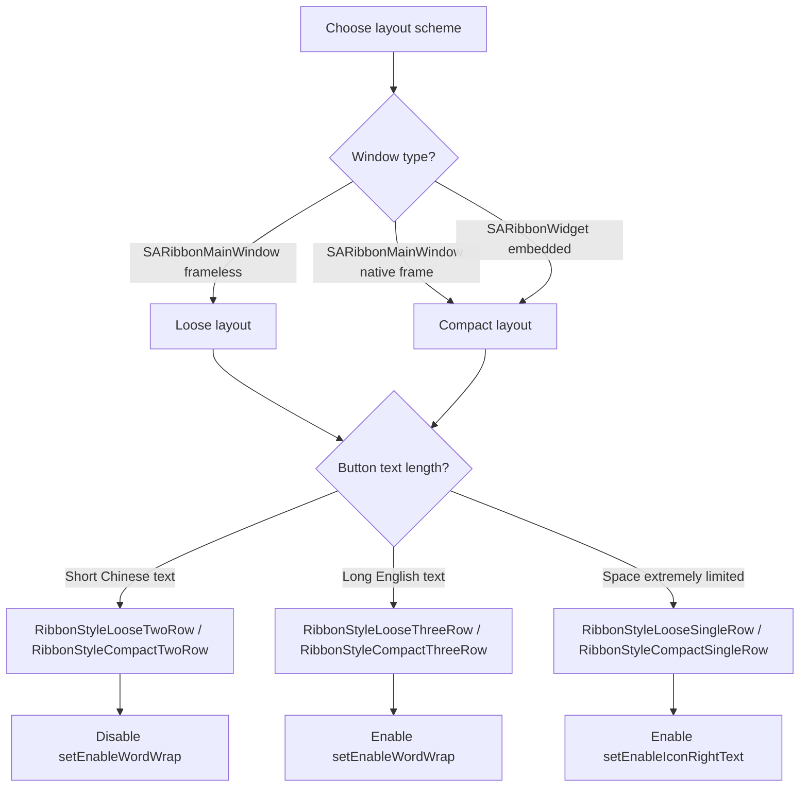

# SARibbon Layout Methods

- ✅ **Six layout schemes**: Loose 3-row, Loose 2-row, Compact 3-row, Compact 2-row, Loose Single-row, Compact Single-row, switchable at runtime
- ✅ **Combinatorial control**: setTabOnTitle + setEnableShowPanelTitle + setPanelLayoutMode + setEnableWordWrap + setEnableIconRightText
- ✅ **Panel three row proportions**: Large/Medium/Small, all effective in 3-row mode, Medium equals Small in 2-row, all equal Small in single-row
- ✅ **Word-wrap control**: setEnableWordWrap toggles button text wrapping, recommended off in 2-row mode
- ✅ **Icon-right-text control**: setEnableIconRightText enables horizontal layout with icon on left, text on right in single-row mode
- ✅ **Layout recommendations**: Loose for frameless, Compact for native frame/embedded, SingleRow for space-constrained scenarios

## Layout Selection Decision Flow

Choose the appropriate layout scheme based on your window type and requirements:



---

SARibbon supports six layout schemes: loose three-row, loose two-row, compact three-row, compact two-row, loose single-row, and compact single-row. You can dynamically switch between these modes.

## Layout Scheme Quick Reference

| Layout Scheme | Enum Value | Characteristics | Recommended Scenario |
|--------------|-----------|-----------------|---------------------|
| Loose 3-row | `RibbonStyleLooseThreeRow` | Separate title bar + Tab bar + 3-row Panel | Traditional Office style, many function buttons |
| Loose 2-row | `RibbonStyleLooseTwoRow` | Separate title bar + Tab bar + 2-row Panel | Limited screen height but need title bar |
| Compact 3-row | `RibbonStyleCompactThreeRow` | Tab bar merged with title + 3-row Panel | WPS style, saves vertical space |
| Compact 2-row | `RibbonStyleCompactTwoRow` | Tab bar merged with title + 2-row Panel | Most compact, for embedded or small windows |
| Loose Single-row | `RibbonStyleLooseSingleRow` | Separate title bar + Tab bar + 1-row Panel | Space extremely limited, icon + text horizontal |
| Compact Single-row | `RibbonStyleCompactSingleRow` | Tab bar merged with title + 1-row Panel | Minimal layout, Panel only one row of buttons |

!!! tip "How to choose a layout scheme"
    - **SARibbonMainWindow** with frameless mode: use Loose layout, since the title bar is drawn by SARibbon
    - **SARibbonMainWindow** with native frame (`UseNativeFrame`): use Compact layout, to avoid title bar whitespace
    - **SARibbonWidget** embedded in other windows: use Compact layout
    - **Space extremely limited** (embedded devices, small windows): use SingleRow layout, combined with `setEnableIconRightText`

The style enumeration definitions of SARibbon are as follows (located in SARibbonBar):

```cpp
enum RibbonStyleFlag
{
    RibbonStyleLoose    = 0x0001,  // bit:0000 0001
    RibbonStyleCompact  = 0x0002,  // bit:0000 0010
    RibbonStyleThreeRow = 0x0010,  // bit:0001 0000
    RibbonStyleTwoRow   = 0x0020,  // bit:0010 0000
    RibbonStyleSingleRow = 0x0040, // bit:0100 0000

    RibbonStyleLooseThreeRow   = RibbonStyleLoose | RibbonStyleThreeRow,    ///< Loose structure, 3-row mode
    RibbonStyleCompactThreeRow = RibbonStyleCompact | RibbonStyleThreeRow,  ///< Compact structure, 3-row mode
    RibbonStyleLooseTwoRow     = RibbonStyleLoose | RibbonStyleTwoRow,      ///< Loose structure, 2-row mode
    RibbonStyleCompactTwoRow   = RibbonStyleCompact | RibbonStyleTwoRow,    ///< Compact structure, 2-row mode
    RibbonStyleLooseSingleRow   = RibbonStyleLoose | RibbonStyleSingleRow,  ///< Loose structure, 1-row mode
    RibbonStyleCompactSingleRow = RibbonStyleCompact | RibbonStyleSingleRow ///< Compact structure, 1-row mode
};
```

The layout of each control in loose mode is shown in the following figure:


In SARibbon, the layout that combines the title bar and tab is called compact layout (Compact). The layout of each control in compact mode is shown in the following figure:


When using SARibbonWidget, it is recommended to use the compact mode to avoid large blank spaces in the title bar.

When using the native border (`SARibbonMainWindowStyleFlag::UseRibbonMenuBar|SARibbonMainWindowStyleFlag::UseNativeFrame`), it is recommended to use the compact mode to avoid large blank spaces in the title bar.

You can run the `example/MainWindowExample` example, which allows you to set different styles to observe different ribbon styles and layouts.


SARibbon provides the `SARibbonBar::setRibbonStyle` function, which can define the current layout scheme. The enumeration `SARibbonBar::RibbonStyle` defines six layout schemes:

- `SARibbonBar::RibbonStyleLooseThreeRow`: Loose structure, 3-row mode (equivalent to `SARibbonBar::OfficeStyle` in v0.x version)


- `SARibbonBar::RibbonStyleLooseTwoRow`: Loose structure, 2-row mode (equivalent to `SARibbonBar::OfficeStyleTwoRow` in v0.x version) (with text wrapping effect)


- `SARibbonBar::RibbonStyleCompactThreeRow`: Compact structure, 3-row mode (equivalent to `SARibbonBar::WpsLiteStyle` in v0.x version)


- `SARibbonBar::RibbonStyleCompactTwoRow`: Compact structure, 2-row mode (equivalent to `SARibbonBar::WpsLiteStyleTwoRow` in v0.x version) (with text wrapping effect)


As can be seen above, in the 2-row mode, text wrapping will cause the icons to be very small. Therefore, it is recommended not to use text wrapping in 2-row mode. You can set whether to wrap text through the `SARibbonBar::setEnableWordWrap` function.

- `SARibbonBar::RibbonStyleLooseSingleRow`: Loose structure, 1-row mode, buttons arranged horizontally with icon on left and text on right

- `SARibbonBar::RibbonStyleCompactSingleRow`: Compact structure, 1-row mode, Tab bar merged with title, buttons arranged horizontally

Single-row mode characteristics:

- All buttons (Large, Medium, Small) behave as Small horizontal layout with icon on left, text on right
- Panel titles are hidden by default, can be forced to show via `setEnableShowPanelTitle(true)`
- Text does not wrap
- Most height-efficient, suitable for embedded devices or windows with extremely limited space
- Recommended to enable `SARibbonBar::setEnableIconRightText(true)` to ensure all buttons use horizontal icon-left, text-right layout

The `setRibbonStyle` function is actually a combination of layout control functions. Its approximate implementation is as follows:

```cpp
void SARibbonBar::setRibbonStyle(SARibbonBar::RibbonStyles v)
{
    setEnableWordWrap(isThreeRowStyle(v));
    setTabOnTitle(isCompactStyle());
    setEnableShowPanelTitle(isThreeRowStyle(v));
    setPanelLayoutMode(isThreeRowStyle(v) ? SARibbonPanel::ThreeRowMode
                     : isSingleRowStyle(v) ? SARibbonPanel::SingleRowMode
                     : SARibbonPanel::TwoRowMode);
    if (isSingleRowStyle(v)) {
        setEnableIconRightText(true);   // Single-row mode enables icon-right-text by default
    }
    ...
}
```

As you can see, the SARibbonBar layout is mainly controlled through the combination of these five functions: `setTabOnTitle`, `setEnableShowPanelTitle`, `setPanelLayoutMode`, `setEnableWordWrap`, and `setEnableIconRightText`.

These five functions have the following main purposes:

- `SARibbonBar::setTabOnTitle`: Set whether to place tab bar buttons on the title bar
- `SARibbonBar::setEnableShowPanelTitle`: Set whether to show the panel title at the bottom
- `SARibbonBar::setPanelLayoutMode`: Set the panel layout mode (3-row, 2-row, or single-row)
- `SARibbonBar::setEnableWordWrap`: Set whether button text can wrap
- `SARibbonBar::setEnableIconRightText`: Set whether buttons use horizontal layout with icon on left, text on right; enabled by default in single-row mode

## Panel Layout Schemes

`SARibbonPanel` provides three layout modes through `PanelLayoutMode`:

```cpp
enum PanelLayoutMode
{
    ThreeRowMode,   ///< 3-row mode
    TwoRowMode,     ///< 2-row mode
    SingleRowMode   ///< Single-row mode
};
```

### 3-row Mode

The 3-row mode is the traditional panel layout method. It has three row proportions: Large, Medium, and Small. Panel titles are shown by default.

### 2-row Mode

In the 2-row mode, Medium and Small row proportions are the same and not distinguished. Panel titles are hidden by default.

!!! warning "2-row Mode Notes"
    By default in 2-row mode, panels do not show titles, but you can enable panel title display through the `SARibbonBar::setEnableShowPanelTitle` function. Similarly, in 3-row mode you can also hide titles through this function.

### Single-row Mode

Single-row mode is a new layout scheme introduced in v2.8.0. All buttons are arranged in a single horizontal row with icon on the left and text on the right, suitable for space-constrained scenarios.

In single-row mode, Large, Medium, and Small row proportions all behave as Small, with no distinction. All buttons use horizontal layout (icon-left, text-right).

!!! warning "Single-row Mode Notes"
    - Panel titles are hidden by default in single-row mode
    - It is recommended to enable `SARibbonBar::setEnableIconRightText(true)` to ensure all buttons use horizontal icon-left, text-right layout
    - Text does not wrap in single-row mode; long text buttons will be truncated

## Dynamic Layout Switching Example

```cpp
void MainWindow::switchRibbonStyle(int styleIndex)
{
    SARibbonBar* ribbon = ribbonBar();
    switch (styleIndex) {
    case 0:
        ribbon->setRibbonStyle(SARibbonBar::RibbonStyleLooseThreeRow);
        break;
    case 1:
        ribbon->setRibbonStyle(SARibbonBar::RibbonStyleCompactThreeRow);
        break;
    case 2:
        ribbon->setRibbonStyle(SARibbonBar::RibbonStyleLooseTwoRow);
        break;
    case 3:
        ribbon->setRibbonStyle(SARibbonBar::RibbonStyleCompactTwoRow);
        break;
    case 4:
        ribbon->setRibbonStyle(SARibbonBar::RibbonStyleLooseSingleRow);
        break;
    case 5:
        ribbon->setRibbonStyle(SARibbonBar::RibbonStyleCompactSingleRow);
        break;
    }
}
```

You can also combine the five underlying functions for more flexible custom layouts:

```cpp
// Example: Compact single-row + no panel title + icon-right-text
SARibbonBar* ribbon = ribbonBar();
ribbon->setTabOnTitle(true);                    // Tab bar on title bar
ribbon->setEnableShowPanelTitle(false);         // No panel title
ribbon->setPanelLayoutMode(SARibbonPanel::SingleRowMode);  // Single-row mode
ribbon->setEnableIconRightText(true);           // Icon-left, text-right horizontal layout
ribbon->setEnableWordWrap(false);               // No text wrapping
```