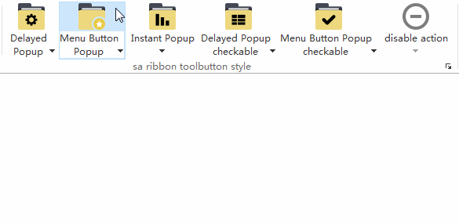
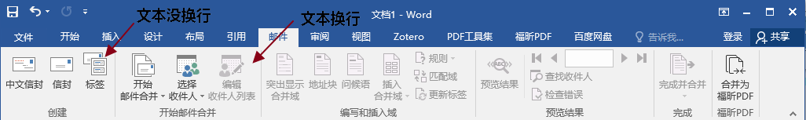
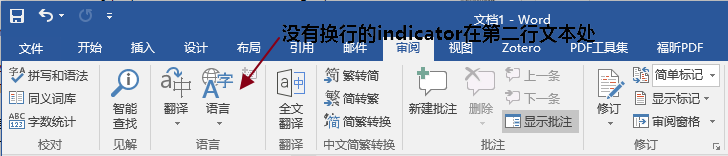
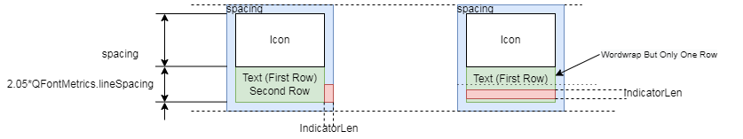

# Ribbon Button Layout Guide

The Ribbon UI cannot be implemented with a simple `QTabBar + QToolButton` combination mainly because ribbon buttons are rendered in a special way. They differ significantly from classic menu buttons. The difference is obvious when a **menu is present**, especially in `MenuPopup` mode: classic toolbars split the button **horizontally** (icon | arrow), while **Ribbon splits it vertically** (icon on top, text + arrow at the bottom).



`SARibbon` uses `SARibbonToolButton`, a subclass of `QToolButton` with custom painting.  
Each button is divided into **three rectangles**:

1. Icon area  
2. Text area  
3. Indicator (drop-down arrow) area  

There are **two layout strategies**, chosen automatically according to **word-wrap** mode.

---

## Word-Wrap Mode (Office Word style)

When word-wrap is **on**, the text area occupies **two lines**.



- If the text **fits on one line**, the second line stays **blank** (first panel above).  
- If the text **wraps**, it fills the second line (second panel).  
- When a **menu is present**, the arrow is placed at the **right end of the second line**, even if the text is short.



Layout in `SARibbonToolButton`:



Enable / disable wrapping globally:

```cpp
ribbonBar()->setEnableWordWrap(true);   // or false
```

**Automatic line-break algorithm**  
For long **English** labels the button first tries to break at **½** of the single-line width.  
If that is still too wide it increases the trial width to ½ + ⅓, then ½ + ⅓ + ¼.  
After **three failed attempts** the original single-line text is kept.

!!! warning
    You can **force** a break by inserting `\n` in the text.  
    If `\n` is present, the automatic algorithm is **skipped**.

!!! tips
    In **single-line mode** any `\n` characters are **ignored**.

---

## Non-Wrap Mode (WPS style)

WPS keeps **everything on one line**; the arrow sits at the far right.


This mode is perfect for **short Chinese** labels, but may truncate **long English** words.  
If your UI is mainly English, prefer **word-wrap** mode; for Chinese, non-wrap looks cleaner.

Layout in `SARibbonToolButton`:


---

## Building a Visually Pleasing Ribbon

When **all labels are short** and **no menus** are attached, word-wrap mode leaves an **empty second line** on almost every button.  
Too much blank space can look unbalanced:


Remedies:

1. **Mix button sizes** – e.g. two large buttons + three small ones in the same row.  
2. **Force a break** with `\n`, especially for 4-character titles (two + two).# Ribbon Button Layout Guide
