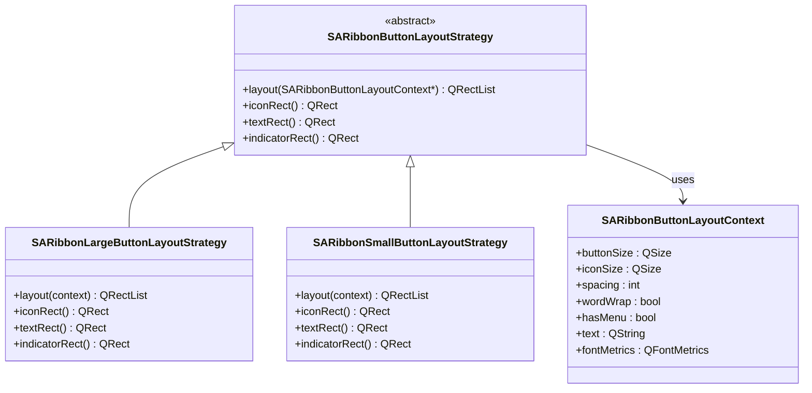

# Ribbon Button Layout Guide

- ✅ **Strategy Pattern architecture**: v2.7.0+ introduces SARibbonButtonLayoutStrategy hierarchy, clean layout logic separation
- ✅ **Two layout schemes**: Word-wrap (Office style) and non-wrap (WPS style), choose by language context
- ✅ **Three button sizes**: Large(32×32)/Medium/Small(20×20), icon size auto-adapts to button mode
- ✅ **Single-row horizontal layout**: v2.8.0 adds enableIconRightText property, icon-left text-right horizontal arrangement
- ✅ **Binary search line-break**: Long text auto-wraps with up to 10 iterations for optimal width
- ✅ **MenuButtonPopup vertical split**: Ribbon-specific button mode, top half executes default action, bottom pops menu

---

The Ribbon UI cannot be implemented with a simple `QTabBar + QToolButton` combination mainly because ribbon buttons are rendered in a special way. They differ significantly from classic menu buttons. The difference is obvious when a **menu is present**, especially in `MenuPopup` mode: classic toolbars split the button **horizontally** (icon | arrow), while **Ribbon splits it vertically** (icon on top, text + arrow at the bottom).


`SARibbon` uses `SARibbonToolButton`, a subclass of `QToolButton` with custom painting.  
Each button is divided into **three rectangles**:

1. Icon area  
2. Text area  
3. Indicator (drop-down arrow) area  

There are **two layout strategies**, chosen automatically according to **word-wrap** mode.

## Layout Strategy Architecture (v2.7.0+)

Starting from v2.7.0, the layout calculation of `SARibbonToolButton` has been refactored using the **Strategy Pattern**, introducing the `SARibbonButtonLayoutStrategy` class hierarchy:


```mermaid
classDiagram
    class SARibbonButtonLayoutStrategy {
        <<abstract>>
        +layout(SARibbonButtonLayoutContext*) QRectList
        +iconRect() QRect
        +textRect() QRect
        +indicatorRect() QRect
    }
    class SARibbonLargeButtonLayoutStrategy {
        +layout(context) QRectList
        +iconRect() QRect
        +textRect() QRect
        +indicatorRect() QRect
    }
    class SARibbonSmallButtonLayoutStrategy {
        +layout(context) QRectList
        +iconRect() QRect
        +textRect() QRect
        +indicatorRect() QRect
    }
    class SARibbonButtonLayoutContext {
        +buttonSize : QSize
        +iconSize : QSize
        +spacing : int
        +wordWrap : bool
        +hasMenu : bool
        +text : QString
        +fontMetrics : QFontMetrics
    }
    SARibbonButtonLayoutStrategy <|-- SARibbonLargeButtonLayoutStrategy
    SARibbonButtonLayoutStrategy <|-- SARibbonSmallButtonLayoutStrategy
    SARibbonButtonLayoutStrategy --> SARibbonButtonLayoutContext : uses
```

This design enables:

- Cleaner separation of layout logic
- Easy extension for new button type layouts
- Better unit test support

The layout context `SARibbonButtonLayoutContext` encapsulates all parameters needed for layout calculation, including spacing, icon sizes, and word-wrap settings.

## Button Icon Settings

Ribbon buttons come in three sizes: large, medium, and small. Large button icons are 32x32, while medium and small button icons are 20x20.

`SARibbonBar` provides the following functions for setting icon sizes for large and small buttons:

```cpp
// Large button icon size
void setPanelLargeIconSize(const QSize& largeSize);
// Small button icon size
void setPanelSmallIconSize(const QSize& smallSize);
// Set panel button icon sizes, first parameter is small icon size, second is large icon size
void setPanelToolButtonIconSize(const QSize& smallSize, const QSize& largeSize);
```

These functions allow you to set your own icon sizes when customizing the layout.

!!! example "Example"
    You can run the `example/MainWindowExample` and manually adjust the sizes for testing.

---

## Word-Wrap Mode (Office Word style)

When word-wrap is **on**, the text area occupies **two lines**.


- If the text **fits on one line**, the second line stays **blank** (first panel above).  
- If the text **wraps**, it fills the second line (second panel).  
- When a **menu is present**, the arrow is placed at the **right end of the second line**, even if the text is short.


Layout in `SARibbonToolButton`:


Enable / disable wrapping globally:

```cpp
ribbonBar()->setEnableWordWrap(true);   // or false
```

**Automatic line-break algorithm (Optimized in v2.7.0)**  
For long **English** labels, the button uses a **binary search** algorithm (up to 10 iterations) to find the optimal width, which is more efficient than the previous linear approach.

Algorithm logic:

1. Start by halving the text width (1/2)
2. Use binary search within the [1/2, original width] range
3. Ensure the text fits within two lines

!!! warning
    You can **force** a break by inserting `\n` in the text.  
    If `\n` is present, the automatic algorithm is **skipped**.

!!! tip
    In **single-line mode** any `\n` characters are **ignored**.

---

## Non-Wrap Mode (WPS style)

WPS keeps **everything on one line**; the arrow sits at the far right.


This mode is perfect for **short Chinese** labels, but may truncate **long English** words.  
If your UI is mainly English, prefer **word-wrap** mode; for Chinese, non-wrap looks cleaner.

Layout in `SARibbonToolButton`:


---

## Building a Visually Pleasing Ribbon

When **all labels are short** and **no menus** are attached, word-wrap mode leaves an **empty second line** on almost every button.  
Too much blank space can look unbalanced:


Remedies:

1. **Mix button sizes** – e.g. two large buttons + three small ones in the same row.  
2. **Force a break** with `\n`, especially for 4-character titles (two + two).

## Button Layout Best Practices

The following table summarizes recommended layout approaches for different scenarios:

| Scenario | Recommended Approach | Description |
|----------|---------------------|-------------|
| Chinese interface | Non-wrap mode | Chinese characters are concise, single-line display works well, use `setEnableWordWrap(false)` |
| English interface | Word-wrap mode | English words are longer, wrapping ensures full display, use `setEnableWordWrap(true)` |
| Space extremely limited | Single-row mode + enableIconRightText | Icon-left text-right horizontal layout, use `RibbonStyleCompactSingleRow` + `setEnableIconRightText(true)` |
| Important features | Large buttons | Large icon + text, immediately visible |
| Common features | Medium buttons | Moderate size, occupies 2 rows in 3-row mode |
| Auxiliary features | Small buttons | Small icons, saves space |
| Related operations group | ButtonGroup | Use `SARibbonButtonGroupWidget` for tight grouping, e.g. alignment button group |
| Short text without menu | Mix button sizes | 2 Large + 3 Small to avoid blank lines |
| Four-character Chinese button | Manual line break | Use `\n` to force line breaks in pairs, e.g. `"File\nManage"` |

---

## Single-row Mode Button Rendering (v2.8.0+)

Starting from v2.8.0, SARibbon adds the single-row layout mode (`SingleRowMode`). In this mode:

- All buttons (Large/Medium/Small) use Small horizontal layout: icon on the left, text on the right
- `SARibbonBar::setEnableIconRightText(true)` forces all buttons to use horizontal icon-left, text-right layout (also usable in non-single-row modes)
- Text does not wrap; long text will be truncated

How to enable:

```cpp
// Method 1: Auto cascade via setRibbonStyle
ribbonBar()->setRibbonStyle(SARibbonBar::RibbonStyleCompactSingleRow);
// setRibbonStyle automatically enables enableIconRightText in SingleRow mode

// Method 2: Enable enableIconRightText separately (works in any mode)
ribbonBar()->setEnableIconRightText(true);
```
