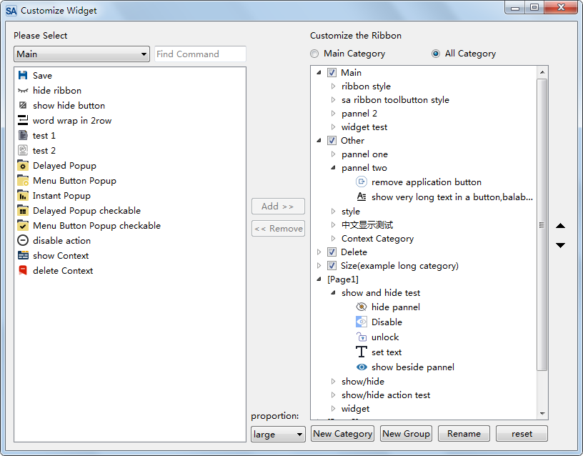

# User Configuration of Ribbon

## Customization Features of SARibbon

The customization of the ribbon is a distinctive feature of SARibbon. Referencing the custom interfaces of Office and WPS, users can define a great deal of content for their own ribbons, and can even create a completely different interface from the original one.

The following is the custom interface of Office:


SARibbon refers to the interfaces of Office and WPS and encapsulates user-friendly `SARibbonCustomize**` classes, including the following 5 classes:

> - SARibbonCustomizeDialog
> - SARibbonCustomizeWidget
> - SARibbonCustomizeData
> - SARibbonActionsManager
> - SARibbonActionsManagerModel

In actual use, users will only deal with `SARibbonActionsManager` and `SARibbonCustomizeDialog`/`SARibbonCustomizeWidget`; the other classes are not normally used by users.

`SARibbonActionsManager` is used to manage `QAction`. Add the `QAction`s that you want to customize to `SARibbonActionsManager` for management, and you can classify the `QAction`s for display in `SARibbonCustomizeDialog`/`SARibbonCustomizeWidget`.

`SARibbonCustomizeDialog`/`SARibbonCustomizeWidget` are the specific display windows. `SARibbonCustomizeDialog` encapsulates `SARibbonCustomizeWidget` as a dialog box. If you want to integrate it into a configuration dialog box like Office, you can use `SARibbonCustomizeWidget`. The effect of `SARibbonCustomizeDialog` is as shown in the following figure:



## Adding Customization Features to the Interface

Here is a demonstration of how to add customization features.

First, define `SARibbonActionsManager` as a member variable of MainWindow.

```cpp
// Define member variables in MainWindow.h
SARibbonActionsManager* m_ribbonActionMgr;///< Used to manage all actions
```

During the initialization of MainWindow, a large number of `QAction`s need to be created, with the parent object of `QAction` specified as MainWindow. In addition, ribbon layouts will be generated, such as adding categories, adding panels, etc. After the above operations are completed, add the following steps to automatically let `SARibbonActionsManager` manage all `QAction`s.

```cpp
// Initialization of MainWindow, generating QActions
// Generate ribbon layout
m_ribbonActionMgr = new SARibbonActionsManager(mainWinowPtr);
m_ribbonActionMgr->autoRegisteActions(mainWinowPtr);
```

The key function `autoRegisteActions` of `SARibbonActionsManager` can traverse all child objects under `SARibbonMainWindow`, find and register actions, and traverse all `SARibbonCategory` to classify the actions under `SARibbonCategory` by the title name of `SARibbonCategory`. This function will also register the actions under `SARibbonMainWindow` that are not in any category with the NotInRibbonCategoryTag label, and the default name will be "not in ribbon".

Perform the following operations where `SARibbonCustomizeDialog` needs to be called:

```cpp
QString cfgpath = "customization.xml";
SARibbonCustomizeDialog dlg(this, this);

dlg.setupActionsManager(m_ribbonActionMgr);
dlg.fromXml(cfgpath);// This step is to load the existing custom steps so that they can be appended to when saving
if (QDialog::Accepted == dlg.exec()) {
    dlg.applys();// Apply custom steps
    dlg.toXml(cfgpath);// Save custom steps to a file
}
```

The customized content needs to be loaded before MainWindow is generated, so the following statement should be added at the end of the constructor:

```cpp
// At the end of MainWindow's constructor
sa_apply_customize_from_xml_file("customization.xml", this, m_ribbonActionMgr);
```

`sa_apply_customize_from_xml_file` is a function provided in `SARibbonCustomizeWidget.h`, which directly applies the customized content in the configuration file to MainWindow.

In this way, the software will load according to the configuration file every time it starts.