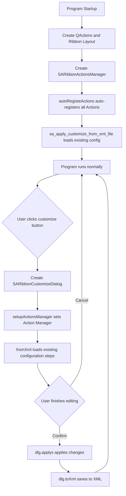

# User Configuration of Ribbon

- ✅ **Office-style customization**: SARibbonCustomizeDialog provides a full customization dialog like Office
- ✅ **Action auto-registration**: autoRegisteActions traverses and registers all QActions, classified by Category
- ✅ **XML persistence**: Custom config saved as XML, auto-loaded on startup to restore user interface
- ✅ **Widget embedding mode**: SARibbonCustomizeWidget can be embedded into your own settings page
- ✅ **Complete workflow**: Create → Register → Load → Edit → Apply → Save, one-stop closed loop

---

## Customization Features of SARibbon

The customization of the ribbon is a distinctive feature of SARibbon. Referencing the custom interfaces of Office and WPS, users can define a great deal of content for their own ribbons, and can even create a completely different interface from the original one.

The following is the custom interface of Office:


SARibbon refers to the interfaces of Office and WPS and encapsulates user-friendly `SARibbonCustomize**` classes:

## Core Class Description

| Class | Purpose | Used directly by user? |
|-------|---------|----------------------|
| `SARibbonActionsManager` | Manages all QActions, supports classification by Category | Yes |
| `SARibbonCustomizeDialog` | Customization dialog (wraps Widget) | Yes |
| `SARibbonCustomizeWidget` | Customization widget, embeddable in other dialogs | Optional |
| `SARibbonCustomizeData` | Stores a single customization operation data | Internal |
| `SARibbonActionsManagerModel` | Data model for the Widget | Internal |

In actual use, users will only deal with `SARibbonActionsManager` and `SARibbonCustomizeDialog`/`SARibbonCustomizeWidget`; the other classes are not normally used.

`SARibbonActionsManager` manages `QAction`s that you want to customize, and allows categorizing them for display in `SARibbonCustomizeDialog`/`SARibbonCustomizeWidget`:


## Adding Customization Features to the Interface

Here is a demonstration of how to add customization features.

First, define `SARibbonActionsManager` as a member variable of MainWindow.

```cpp
// Define member variables in MainWindow.h
SARibbonActionsManager* m_ribbonActionMgr;///< Used to manage all actions
```

During the initialization of MainWindow, a large number of `QAction`s need to be created, with the parent object of `QAction` specified as MainWindow. In addition, ribbon layouts will be generated, such as adding categories, adding panels, etc. After the above operations are completed, add the following steps to automatically let `SARibbonActionsManager` manage all `QAction`s.

```cpp
// Initialization of MainWindow, generating QActions
// Generate ribbon layout
m_ribbonActionMgr = new SARibbonActionsManager(ribbonBar());
m_ribbonActionMgr->autoRegisteActions(ribbonBar());
```

The key function `autoRegisteActions` of `SARibbonActionsManager` can traverse all child objects under `SARibbonMainWindow`, find and register actions, and traverse all `SARibbonCategory` to classify the actions under `SARibbonCategory` by the title name of `SARibbonCategory`. This function will also register the actions under `SARibbonMainWindow` that are not in any category with the NotInRibbonCategoryTag label, and the default name will be "not in ribbon".

Perform the following operations where `SARibbonCustomizeDialog` needs to be called:

```cpp
QString cfgpath = "customization.xml";
SARibbonCustomizeDialog dlg(this, this);

dlg.setupActionsManager(m_ribbonActionMgr);
dlg.fromXml(cfgpath);// This step is to load the existing custom steps so that they can be appended to when saving
if (QDialog::Accepted == dlg.exec()) {
    dlg.applys();// Apply custom steps
    dlg.toXml(cfgpath);// Save custom steps to a file
}
```

The customized content needs to be loaded before MainWindow is generated, so the following statement should be added at the end of the constructor:

```cpp
// At the end of MainWindow's constructor
sa_apply_customize_from_xml_file("customization.xml", ribbonBar(), m_ribbonActionMgr);
```

`sa_apply_customize_from_xml_file` is a function provided in `SARibbonCustomizeWidget.h`, which directly applies the customized content in the configuration file to MainWindow.

In this way, the software will load according to the configuration file every time it starts.

## Complete Workflow


```mermaid
flowchart TD
    A[Program Startup] --> B[Create QActions and Ribbon Layout]
    B --> C[Create SARibbonActionsManager]
    C --> D[autoRegisteActions auto-registers all Actions]
    D --> E[sa_apply_customize_from_xml_file loads existing config]
    E --> F[Program runs normally]
    F --> G{User clicks customize button}
    G --> H[Create SARibbonCustomizeDialog]
    H --> I[setupActionsManager sets Action Manager]
    I --> J[fromXml loads existing configuration steps]
    J --> K{User finishes editing}
    K -->|Confirm| L[dlg.applys applies changes]
    L --> M[dlg.toXml saves to XML]
    M --> F
    K -->|Cancel| F
```

## Complete Example Code

Below is a complete example of integrating the customization feature into a MainWindow (reference `example/MainWindowExample`):

```cpp
// === MainWindow.h ===
class MainWindow : public SARibbonMainWindow
{
    Q_OBJECT
public:
    MainWindow(QWidget* par = nullptr);
private Q_SLOTS:
    void onActionCustomizeTriggered();
private:
    void initRibbon();
    SARibbonActionsManager* m_ribbonActionMgr { nullptr };
};

// === MainWindow.cpp ===
MainWindow::MainWindow(QWidget* par) : SARibbonMainWindow(par)
{
    initRibbon();
    
    // Create ActionsManager and auto-register (SARibbonActionsManager and autoRegisteActions require SARibbonBar*, use ribbonBar() to get it)
    m_ribbonActionMgr = new SARibbonActionsManager(ribbonBar());
    m_ribbonActionMgr->autoRegisteActions(ribbonBar());
    
    // Load existing custom configuration
    sa_apply_customize_from_xml_file("customization.xml", ribbonBar(), m_ribbonActionMgr);
}

void MainWindow::onActionCustomizeTriggered()
{
    QString cfgpath = "customization.xml";
    SARibbonCustomizeDialog dlg(this, this);
    dlg.setupActionsManager(m_ribbonActionMgr);
    dlg.fromXml(cfgpath);  // Load existing steps
    
    if (QDialog::Accepted == dlg.exec()) {
        dlg.applys();        // Apply customization
        dlg.toXml(cfgpath);  // Save configuration
    }
}
```

!!! warning "Note"
    `autoRegisteActions` must be called after all Categories, Panels, and Actions have been created, otherwise it will not be able to register all Actions.

!!! tip "Tip"
    If you want to embed the customization dialog into your own settings page, you can use `SARibbonCustomizeWidget` instead of `SARibbonCustomizeDialog`. The APIs are essentially the same.