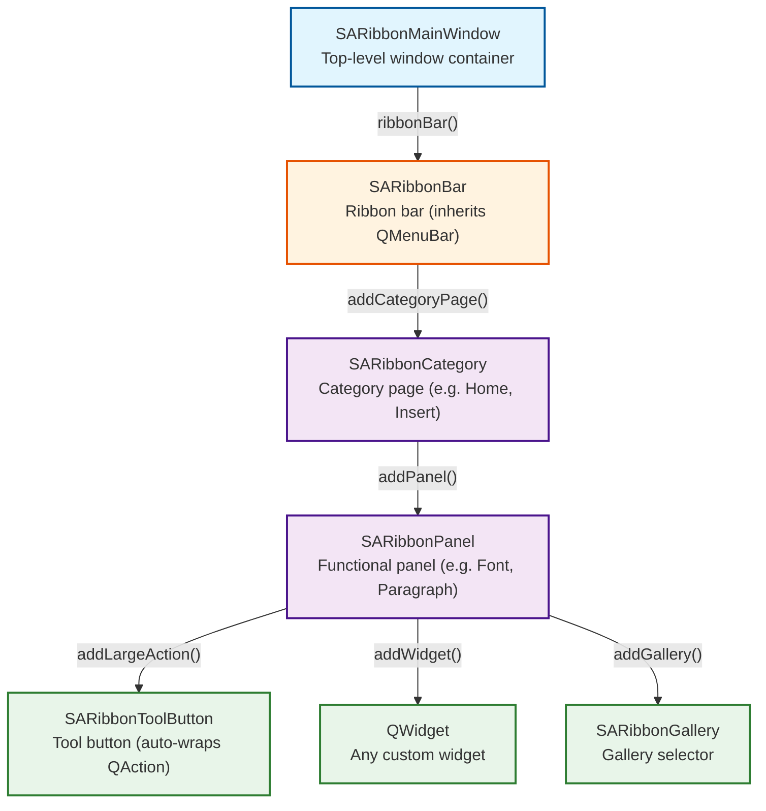
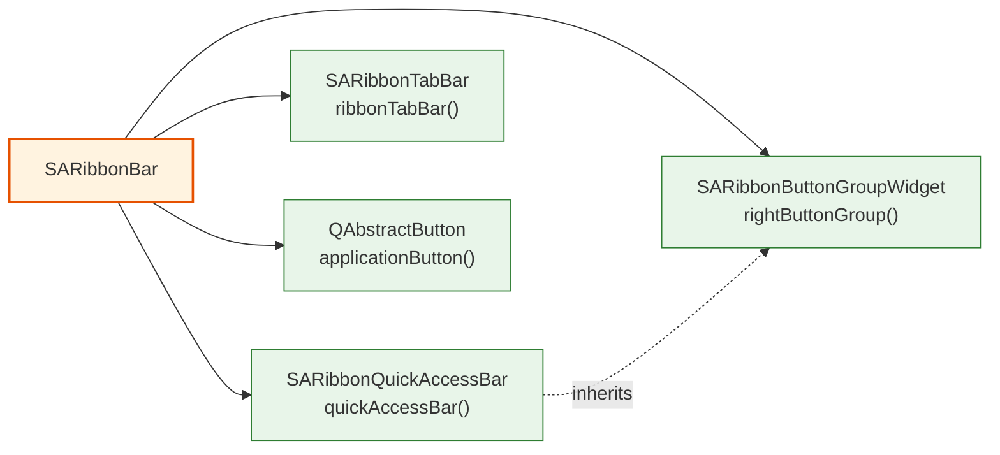
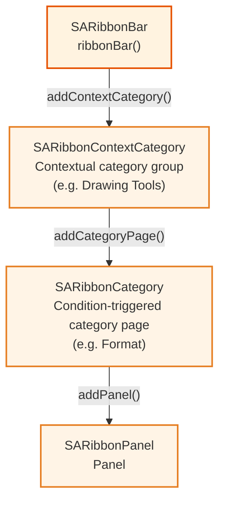

# Ribbon Interface Hierarchy

Understanding the SARibbon hierarchy is the foundation for building interfaces. Ribbon follows a strict four-layer nesting model: **RibbonBar → Category → Panel → ToolButton/Widget**, where each layer has well-defined responsibilities and APIs.

## Key Features

**Features**

- ✅ **Four-layer nesting layout**: SARibbonBar manages Categories, Categories manage Panels, Panels manage ToolButtons and Widgets
- ✅ **Contextual categories**: SARibbonContextCategory supports condition-based show/hide of specific tab groups (e.g., a "Picture Tools" tab appears when an image is selected)
- ✅ **Gallery widget**: SARibbonGallery provides a grid-style option selector with popup group browsing
- ✅ **Quick Access Bar & Right Button Group**: Built-in SARibbonQuickAccessBar and SARibbonButtonGroupWidget for one-click access to high-frequency operations
- ✅ **Multi-level navigation lookup**: Locate components across layers by name, index, or ObjectName

## Hierarchy Diagram

The relationship between SARibbon components consists of two dimensions: inheritance (what each class extends) and containment (what each class holds). Inheritance is straightforward; containment is the key to understanding how Ribbon interfaces are assembled.

### Inheritance (Simplified)

`SARibbonBar` inherits `QMenuBar`; all other SARibbon components inherit `QWidget` or one of its direct subclasses (`QFrame`, `QTabBar`, `QToolBar`, etc.). This design is intentional: `SARibbonBar` replaces the traditional menu bar, while every other element is a standard widget you can place, style, and compose freely.

### Containment Hierarchy

SARibbon organizes its interface through a strict **four-layer containment model**. For clarity, the containment relationships are split into three sub-diagrams.

#### 1. Main Chain — Four-Layer Containment

The core containment chain from window to button:



#### 2. SARibbonBar Auxiliary Components

Besides managing Categories, `SARibbonBar` also directly contains these auxiliary components:



#### 3. Contextual Category — Condition-Triggered Tab Pages

`SARibbonContextCategory` is a special category manager that dynamically shows/hides tab pages based on conditions:



Contextual categories are hidden by default; visibility is controlled via `showContextCategory()` / `hideContextCategory()`.

**Legend**:
- Solid arrows = **containment** (parent owns and manages the child)
- Dashed arrows = **inheritance** (only appears in the auxiliary component diagram)
- Orange nodes = contextual category chain (condition-triggered, hidden by default)
- Blue → Orange → Purple → Green corresponds to the four containment layers (layer 1 → layer 4)

The containment relationships trace the Ribbon construction direction: start from `SARibbonMainWindow`, obtain `SARibbonBar`, progressively add Category pages and auxiliary components, then populate each Category with Panels, and finally fill Panels with Action buttons, galleries, or custom widgets.

## Component Lookup Table

The table below lists each core component in the Ribbon hierarchy with its class name, responsibility, and creation/access method:

| Layer | Class | Responsibility | Creation/Access Method |
|-------|-------|---------------|------------------------|
| Window container | `SARibbonMainWindow` | Top-level window for Ribbon applications, replacing QMainWindow | Inherit this class as the main window |
| Ribbon bar | `SARibbonBar` | Top-level manager, replacing QMenuBar | `ribbonBar()` obtained from main window |
| Tab bar | `SARibbonTabBar` | Navigation bar displaying Category tabs | `ribbonTabBar()` to obtain |
| Category page | `SARibbonCategory` | A functional scenario (e.g., "Home", "Insert") | `addCategoryPage()` to add |
| Contextual category | `SARibbonContextCategory` | Condition-triggered category group (e.g., "Chart Tools") | `addContextCategory()` to add |
| Panel | `SARibbonPanel` | Functional grouping container within a Category | `category->addPanel()` to add |
| Tool button | `SARibbonToolButton` | Ribbon-specific button hosting a QAction | Auto-created by `panel->addLargeAction()` etc. |
| Gallery | `SARibbonGallery` | Grid-style option selector | `panel->addGallery()` to add |
| Quick Access Bar | `SARibbonQuickAccessBar` | Top high-frequency command toolbar | `quickAccessBar()` to obtain |
| Right Button Group | `SARibbonButtonGroupWidget` | Top-right functional button group | `rightButtonGroup()` to obtain |
| Application button | `QAbstractButton` | Top-left application menu entry | `applicationButton()` to obtain |

## Hierarchy Text Description

### Four-Layer Containment Model

SARibbon organizes its interface through a strict four-layer containment chain:

1. **SARibbonBar** (layer 1) . The top-level manager, obtained via `ribbonBar()`. It replaces the traditional `QMenuBar` and serves as the container for everything else. Alongside the main Category chain, `SARibbonBar` also holds auxiliary components: `SARibbonQuickAccessBar`, `SARibbonButtonGroupWidget` (right button group), `SARibbonTabBar`, and the application menu button.

2. **SARibbonCategory** (layer 2) . Each Category is a tab page visible to the user, corresponding to a functional scenario such as "Home", "Insert", or "Design". Categories are added to `SARibbonBar` with `addCategoryPage()` and displayed as tabs via `SARibbonTabBar`. Switching between active Categories is handled internally by `SARibbonStackedWidget`. A special variant, `SARibbonContextCategory`, manages a group of Categories that appear only under certain conditions (for instance, "Picture Tools" appears after selecting an image). Contextual categories are hidden by default and must be shown programmatically.

3. **SARibbonPanel** (layer 3) . Each Panel is a named section within a Category, such as "Font" or "Paragraph". Panels are added with `category->addPanel()`. They act as functional grouping containers and support both two-row (WPS compact style) and three-row (Office spacious style) layouts.

4. **SARibbonToolButton / QAction / QWidget / SARibbonGallery** (layer 4) . The innermost layer. Actions are added to a Panel via `addLargeAction()`/`addSmallAction()` and automatically wrapped into `SARibbonToolButton` instances. Arbitrary `QWidget` subclasses can be embedded with `addWidget()`. A `SARibbonGallery` provides a grid-style option selector within the Panel.

Developers build the Ribbon interface by moving down these layers: obtain the bar, create categories, add panels, and populate with buttons or widgets. Lookup methods (`categoryByName`, `panelByIndex`, `actionToRibbonToolButton`, etc.) allow navigation in the reverse direction, as documented in the tables below.

## Navigation Methods at Each Level

SARibbon provides lookup methods by name, by index, and by ObjectName at every level, making it easy to locate components in complex interfaces.

### SARibbonBar Level Lookup

| Method | Return Value | Description |
|--------|-------------|-------------|
| `categoryByIndex(int index)` | `SARibbonCategory*` | Get Category by index; returns nullptr if out of bounds |
| `categoryByName(const QString& title)` | `SARibbonCategory*` | Find Category by name |
| `categoryByObjectName(const QString& objname)` | `SARibbonCategory*` | Find Category by ObjectName |
| `categoryIndex(const SARibbonCategory* c)` | `int` | Get Category index in the tab bar |
| `categoryPages(bool getAll)` | `QList<SARibbonCategory*>` | Get list of all Categories |
| `iterateCategory(FpCategoryIterate fp)` | `bool` | Iterate all Categories; stops when callback returns false |
| `iteratePanel(FpPanelIterate fp)` | `bool` | Iterate all Panels across Categories |

### SARibbonCategory Level Lookup

| Method | Return Value | Description |
|--------|-------------|-------------|
| `panelByIndex(int index)` | `SARibbonPanel*` | Get Panel by index; returns nullptr if out of bounds |
| `panelByName(const QString& title)` | `SARibbonPanel*` | Find Panel by name |
| `panelByObjectName(const QString& objname)` | `SARibbonPanel*` | Find Panel by ObjectName |
| `panelIndex(SARibbonPanel* p)` | `int` | Get Panel index within the Category |
| `panelList()` | `QList<SARibbonPanel*>` | Get list of all Panels |
| `panelCount()` | `int` | Get number of Panels |
| `iteratePanel(FpPanelIterate fp)` | `bool` | Iterate all Panels |

### SARibbonPanel Level Lookup

| Method | Return Value | Description |
|--------|-------------|-------------|
| `actionToRibbonToolButton(QAction* action)` | `SARibbonToolButton*` | Find the ToolButton corresponding to a QAction |
| `actionIndex(QAction* act)` | `int` | Get the layout index of an Action within the Panel |
| `ribbonToolButtons()` | `QList<SARibbonToolButton*>` | Get list of all buttons |
| `iterateButton(FpRibbonToolButtonIterate fp)` | `bool` | Iterate all buttons |
| `lastAddActionButton()` | `SARibbonToolButton*` | Get the most recently added button |

!!! info "Navigation Tip"

    The buttons returned by `SARibbonPanel` methods (such as `actionToRibbonToolButton`) are auto-created and managed by the Panel. Developers do not need to manually instantiate these buttons — simply create a QAction and add it to the Panel via `addLargeAction`/`addSmallAction` etc.

## Complete Code Example

The following demonstrates how to build a complete Ribbon interface layer by layer, starting from a main window that inherits `SARibbonMainWindow`:

```cpp
// mainwindow.h
#include "SARibbonMainWindow.h"
class MainWindow : public SARibbonMainWindow
{
    Q_OBJECT
public:
    explicit MainWindow(QWidget* parent = nullptr);
private:
    void setupRibbon();
};
```

The header file declares the main window class. It must inherit `SARibbonMainWindow`, which is a prerequisite for using SARibbon.

```cpp
// mainwindow.cpp
#include "mainwindow.h"
#include "SARibbonBar.h"
#include "SARibbonCategory.h"
#include "SARibbonPanel.h"
#include "SARibbonGallery.h"
#include "SARibbonButtonGroupWidget.h"
#include "SARibbonQuickAccessBar.h"
#include "SARibbonContextCategory.h"
#include <QAction>
#include <QToolBar>

MainWindow::MainWindow(QWidget* parent) : SARibbonMainWindow(parent)
{
    setupRibbon();
}
```

The constructor calls `setupRibbon()` directly to initialize the Ribbon interface.

```cpp
void MainWindow::setupRibbon()
{
    // Step 1: Obtain RibbonBar (first layer)
    SARibbonBar* ribbon = ribbonBar();
    ribbon->setRibbonStyle(SARibbonBar::RibbonStyleLooseThreeRow);
    ribbon->setWindowTitleAligment(Qt::AlignCenter);

    // Step 2: Create Category pages (second layer)
    SARibbonCategory* categoryHome = ribbon->addCategoryPage(tr("Home"));
    categoryHome->setObjectName("categoryHome");

    SARibbonCategory* categoryInsert = ribbon->addCategoryPage(tr("Insert"));
    categoryInsert->setObjectName("categoryInsert");

    // Step 3: Create Panels within the "Home" Category (third layer)
    SARibbonPanel* panelFile = categoryHome->addPanel(tr("File"));
    SARibbonPanel* panelEdit = categoryHome->addPanel(tr("Edit"));

    // Step 4: Add Action buttons in Panels (fourth layer)
    QAction* actNew = new QAction(QIcon(":/icons/new.svg"), tr("New"), this);
    actNew->setObjectName("actNew");
    panelFile->addLargeAction(actNew);

    QAction* actOpen = new QAction(QIcon(":/icons/open.svg"), tr("Open"), this);
    actOpen->setObjectName("actOpen");
    panelFile->addLargeAction(actOpen);

    QAction* actSave = new QAction(QIcon(":/icons/save.svg"), tr("Save"), this);
    actSave->setObjectName("actSave");
    panelFile->addMediumAction(actSave);

    QAction* actUndo = new QAction(QIcon(":/icons/undo.svg"), tr("Undo"), this);
    actUndo->setObjectName("actUndo");
    panelEdit->addSmallAction(actUndo);

    QAction* actRedo = new QAction(QIcon(":/icons/redo.svg"), tr("Redo"), this);
    actRedo->setObjectName("actRedo");
    panelEdit->addSmallAction(actRedo);

    // Step 5: Add Gallery widget
    SARibbonGallery* gallery = panelInsert->addGallery();
    QList<QAction*> galleryActions;
    // ... add galleryActions ...
    gallery->addCategoryActions(tr("Styles"), galleryActions);

    // Step 6: Configure Quick Access Bar
    SARibbonQuickAccessBar* quickBar = ribbon->quickAccessBar();
    quickBar->addAction(actSave);
    quickBar->addAction(actUndo);

    // Step 7: Configure Right Button Group
    SARibbonButtonGroupWidget* rightGroup = ribbon->rightButtonGroup();
    QAction* actHelp = new QAction(QIcon(":/icons/help.svg"), tr("Help"), this);
    rightGroup->addAction(actHelp);

    // Step 8: Create contextual category (condition-triggered display)
    SARibbonContextCategory* ctxCategory = ribbon->addContextCategory(
        tr("Drawing Tools"), QColor(255, 100, 50));
    SARibbonCategory* ctxPage = ctxCategory->addCategoryPage(tr("Format"));
    SARibbonPanel* ctxPanel = ctxPage->addPanel(tr("Shapes"));
    // ... add actions to ctxPanel ...
    ribbon->hideContextCategory(ctxCategory);  // Hidden by default
}
```

The code above demonstrates the full workflow from obtaining `SARibbonBar` to creating Categories, Panels, and adding Actions. Each step corresponds to one level in the Ribbon hierarchy.

!!! tip "Best Practices"

    - Set `setObjectName` for each Category and QAction to enable quick component lookup via methods like `categoryByObjectName`
    - Contextual categories are hidden by default after creation; use `showContextCategory()` or `hideContextCategory()` to control visibility
    - `setRibbonStyle` can be called dynamically at runtime; switching automatically re-layouts all Panels and buttons
    - Gallery widgets are suited for scenarios requiring grid display of multiple options, such as "Style Selection" or "Theme Preview"

## Core API Method Summary

### SARibbonBar Core Methods

| Method | Return Value | Description |
|--------|-------------|-------------|
| `addCategoryPage(const QString& title)` | `SARibbonCategory*` | Create and add a new category page |
| `insertCategoryPage(const QString& title, int index)` | `SARibbonCategory*` | Insert a category page at the specified index |
| `removeCategory(SARibbonCategory* category)` | `void` | Remove and delete a category page |
| `addContextCategory(...)` | `SARibbonContextCategory*` | Create a contextual category group |
| `showContextCategory(...)` / `hideContextCategory(...)` | `void` | Control contextual category visibility |
| `setRibbonStyle(RibbonStyles v)` | `void` | Set Ribbon layout style |
| `quickAccessBar()` | `SARibbonQuickAccessBar*` | Get Quick Access Bar |
| `rightButtonGroup()` | `SARibbonButtonGroupWidget*` | Get Right Button Group |
| `ribbonTabBar()` | `SARibbonTabBar*` | Get tab bar |
| `applicationButton()` | `QAbstractButton*` | Get application button |

### SARibbonCategory Core Methods

| Method | Return Value | Description |
|--------|-------------|-------------|
| `addPanel(const QString& title)` | `SARibbonPanel*` | Create and add a panel |
| `insertPanel(const QString& title, int index)` | `SARibbonPanel*` | Insert a panel at the specified position |
| `removePanel(SARibbonPanel* panel)` | `bool` | Remove and delete a panel |
| `panelByIndex(int index)` | `SARibbonPanel*` | Get panel by index |
| `panelByName(const QString& title)` | `SARibbonPanel*` | Find panel by name |
| `panelList()` | `QList<SARibbonPanel*>` | Get list of all panels |
| `isContextCategory()` | `bool` | Check whether this is a contextual category |

### SARibbonPanel Core Methods

| Method | Return Value | Description |
|--------|-------------|-------------|
| `addLargeAction(QAction* action)` | `void` | Add a large-size button |
| `addMediumAction(QAction* action)` | `void` | Add a medium-size button (three-row mode) |
| `addSmallAction(QAction* action)` | `void` | Add a small-size button |
| `addWidget(QWidget* w, RowProportion rp)` | `QAction*` | Add a custom widget |
| `addGallery(bool expanding)` | `SARibbonGallery*` | Add a Gallery widget |
| `addSeparator()` | `QAction*` | Add a separator line |
| `actionToRibbonToolButton(QAction* action)` | `SARibbonToolButton*` | Get the corresponding button from an Action |

!!! note "Qt Version Compatibility"

    SARibbon supports both Qt 5.12+ and Qt 6.x. In Qt 5, use `QOverload` to connect signals; in Qt 6, function pointer syntax can be used directly. SARibbon handles version differences internally, so user code requires no additional adaptation.

## References

- Complete example project: `example/MainWindowExample/mainwindow.cpp`
- SARibbonBar class reference: `src/SARibbonBar/SARibbonBar.h`
- SARibbonCategory class reference: `src/SARibbonBar/SARibbonCategory.h`
- SARibbonPanel class reference: `src/SARibbonBar/SARibbonPanel.h`
- SARibbonToolButton class reference: `src/SARibbonBar/SARibbonToolButton.h`
- SARibbonContextCategory class reference: `src/SARibbonBar/SARibbonContextCategory.h`
- SARibbonGallery class reference: `src/SARibbonBar/SARibbonGallery.h`
- Ribbon interface layout guide: [layout-of-SARibbon.md](../use-guide/layout-of-SARibbon.md)
- Ribbon button layout guide: [layout-of-ribbonbutton.md](../use-guide/layout-of-ribbonbutton.md)