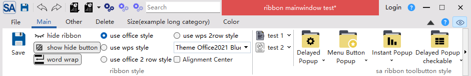

# Title-Bar Customisation

The SARibbon title bar is the top-most strip of the Ribbon interface and displays the application’s `windowTitle`.  
You can change:

* height (via style sheet or `SARibbonBar` properties)  
* text colour  
* background colour  
* alignment  

Office applications often colour the title bar to signal state (e.g. red when un-registered).  
`SARibbonBar` provides the following API:

```cpp
// text colour
void setWindowTitleTextColor(const QColor& clr);
QColor windowTitleTextColor() const;

// show / hide the title label
void setTitleVisible(bool on = false);
bool isTitleVisible() const;

// background brush (solid, gradient, image, etc.)
void setWindowTitleBackgroundBrush(const QBrush& bk);
QBrush windowTitleBackgroundBrush() const;

// horizontal alignment
void setWindowTitleAlignment(Qt::Alignment al);
Qt::Alignment windowTitleAlignment() const;
```

Example: turn the title bar red and the text white

```cpp
void MainWindow::setWindowTitleColor()
{
    SARibbonBar* ribbon = ribbonBar();
    if (!ribbon) return;

    ribbon->setWindowTitleBackgroundBrush(QColor(222, 79, 79)); // red
    ribbon->setWindowTitleTextColor(Qt::white);                 // white text
    ribbon->update();                                           // repaint
}
```

Result:

