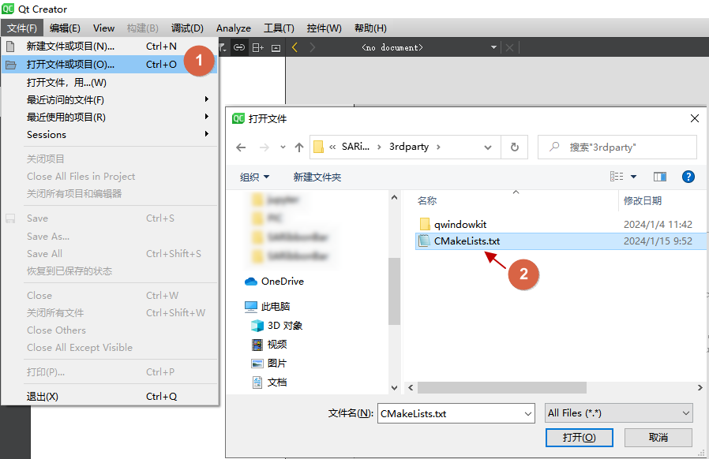
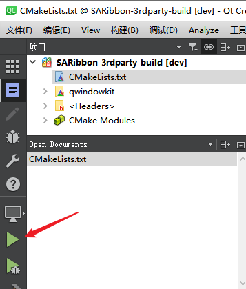
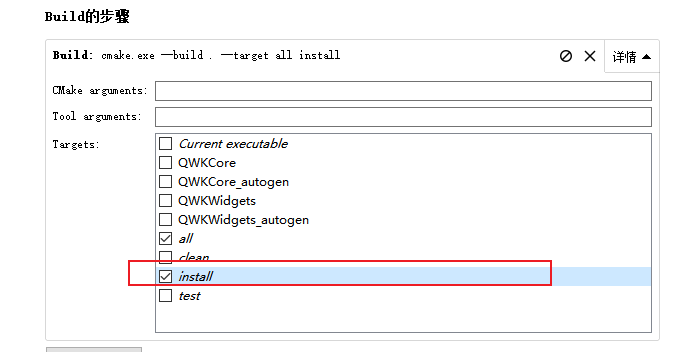
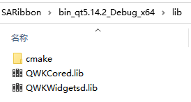
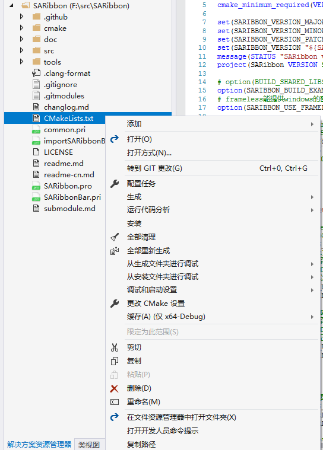
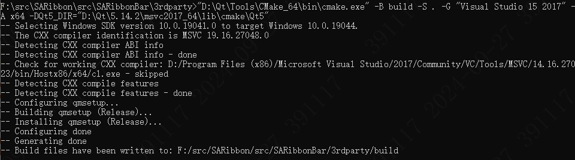

# 第三方库编译

!!! warning "注意"
    如果不开启QWindowkit,可以跳过此文档。

!!! tips "提示"
    QWindowkit提供了更好的无边框方案，能适配操作系统原生的交互，能支持多屏幕多分辨率的移动。


## QWindowkit库编译

`QWindowkit`库仅提供CMake的编译方式，必须使用CMake进行编译。

为简化操作，在`src/SARibbonBar/3rdparty`下提供了一个`CMakeLists.txt`文件，已对该库的必要配置进行了设置。你可以直接调用该文件进行编译。

使用Qt Creator和Visual Studio进行构建和安装的方式基本相同。

### 使用Qt Creator构建和安装QWindowkit库

1. 使用Qt Creator打开`src/SARibbonBar/3rdparty/CMakeLists.txt`文件。



2. 点击运行（Ctrl+R）。



3. 切换到项目模式（Ctrl+5）。

4. 在Build步骤中选择`install`（有些版本的Qt Creator无法同时选中`all`和`install`，此时可先选`all`，编译完成后再选`install`进行安装）。



5. 再次点击运行（Ctrl+R）。

此时，你会在SARibbon根目录下看到形如`bin_qt5.14.2_MSVC_x64`的安装目录，`QWindowkit`库已自动安装在此目录下。



至此，`QWindowkit`库的编译和安装已完成。

### 使用visual studio构建和安装QWindowkit库

1. 使用Visual Studio打开CMake项目，选择`src/SARibbonBar/3rdparty/CMakeLists.txt`文件。


2. 在CMake菜单中选择“全部生成”（有些版本没有CMake菜单，可在`CMakeLists.txt`上点击右键）。


3. 在CMake菜单中选择“安装”（有些版本没有CMake菜单，可在`CMakeLists.txt`上点击右键）。


!!! tips "说明"
    不同版本的Visual Studio操作可能略有不同，没有CMake菜单的，可以在`CMakeLists.txt`上点击右键。



此时，你会在SARibbon根目录下看到形如`bin_qt5.14.2_MSVC_x64`的安装目录，`QWindowkit`库已自动安装在此目录下。


至此，`QWindowkit`库的编译和安装已完成。

### 使用命令行构建(适用Qt5及vs2019以下)

由于`QWindowkit`库要求的CMake版本较高，VS2019及以下版本内置的CMake版本可能无法满足需求。因此，需要通过命令行对`QWindowkit`库进行构建。以下是在Windows下通过CMD命令行构建`QWindowkit`库的步骤：

1. 安装一个高版本的`CMake`工具，并确认其路径（例如：`C:\Program Files (x86)\cmake3.27.9\bin\cmake.exe`）。

2. 确认你的Qt版本路径和编译器。以Qt5.14.2 MSVC 2017版本为例。

3. 找到Qt安装路径下`Qt5Config.cmake`所在的文件夹（例如：`C:\Qt\Qt5.14.2\5.14.2\msvc2017_64\lib\cmake\Qt5`）。

4. 打开命令行，切换到`src/SARibbonBar/3rdparty`目录，执行以下命令：

   ```shell
   "C:\Program Files (x86)\cmake3.27.9\bin\cmake.exe" -B build -S . -G "Visual Studio 15 2017" -A x64 -DQt5_DIR="C:\Qt\Qt5.14.2\5.14.2\msvc2017_64\lib\cmake\Qt5"
   ```

   如果`cmake.exe`不在环境变量中，需指定完整路径。如果在环境变量中，则只需输入`cmake`即可。

5. 执行完成后，会看到相应的输出。

   

6. 接着执行以下两个命令：

```shell
"C:\Program Files (x86)\cmake3.27.9\bin\cmake.exe" --build build --target install --config Debug
"C:\Program Files (x86)\cmake3.27.9\bin\cmake.exe" --build build --target install --config Release
```
