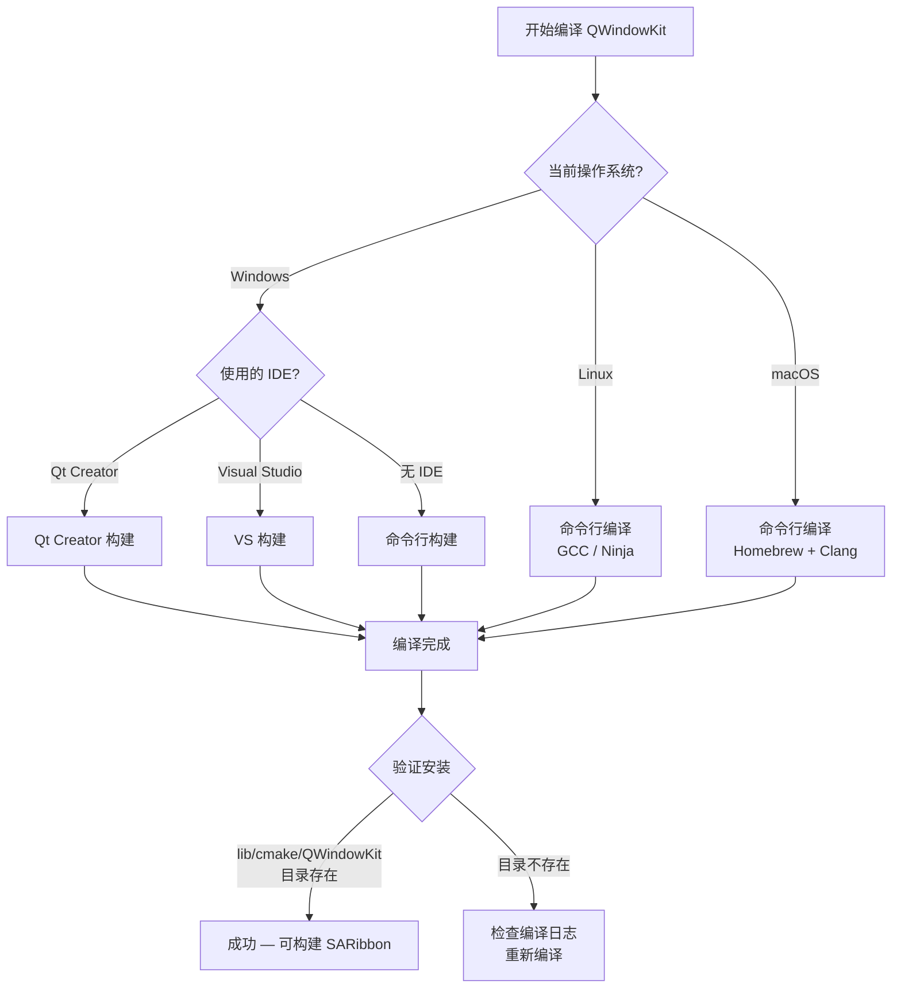
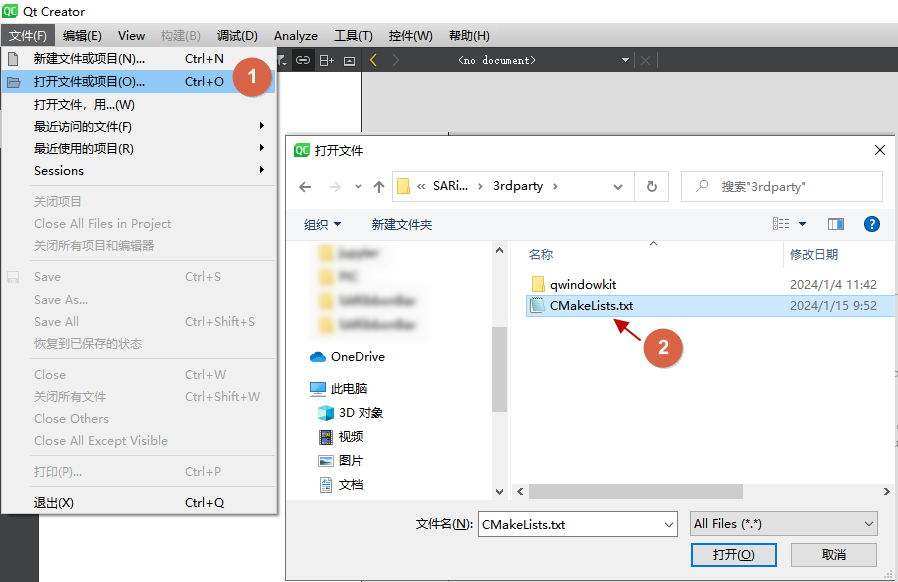
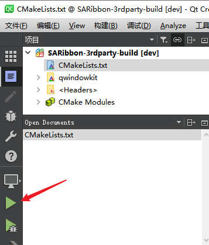
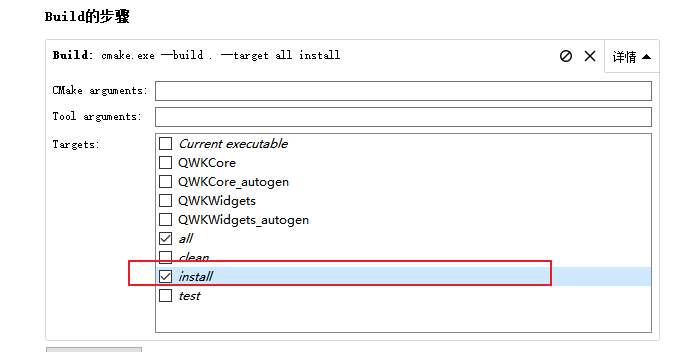
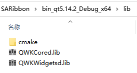
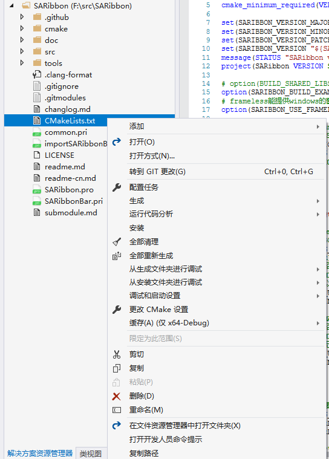
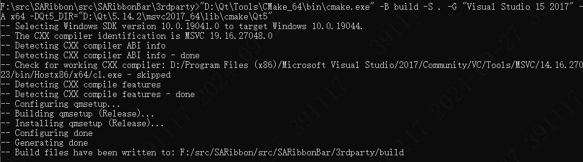

# 第三方库编译

- **QWindowKit原生窗口**：支持Windows贴边/Snap Layout和多屏幕移动
- **多IDE支持**：Qt Creator、Visual Studio和命令行三种编译方式
- **跨平台编译**：覆盖 Windows、Linux (Ubuntu/Debian) 和 macOS
- **自动本地安装**：编译后自动安装到与SARibbon一致的版本隔离目录

!!! warning "注意"
    如果不开启QWindowkit,可以跳过此文档。

!!! tip "提示"
    QWindowkit提供了更好的无边框方案，能适配操作系统原生的交互，能支持多屏幕多分辨率的移动。

## 选择编译方式


```mermaid
flowchart TD
    A[开始编译 QWindowKit] --> B{当前操作系统?}
    B -->|Windows| C{使用的 IDE?}
    B -->|Linux| L[命令行编译<br/>GCC / Ninja]
    B -->|macOS| M[命令行编译<br/>Homebrew + Clang]
    C -->|Qt Creator| D[Qt Creator 构建]
    C -->|Visual Studio| E[VS 构建]
    C -->|无 IDE| F[命令行构建]
    D --> G[编译完成]
    E --> G
    F --> G
    L --> G
    M --> G
    G --> H{验证安装}
    H -->|lib/cmake/QWindowKit<br/>目录存在| I[成功 — 可构建 SARibbon]
    H -->|目录不存在| J[检查编译日志<br/>重新编译]
```

---

## QWindowkit库编译

`QWindowkit`库仅提供CMake的编译方式，必须使用CMake进行编译。

为简化操作，在`src/SARibbonBar/3rdparty`下提供了一个`CMakeLists.txt`文件，已对该库的必要配置进行了设置。你可以直接调用该文件进行编译。

使用Qt Creator和Visual Studio进行构建和安装的方式基本相同。

### 使用Qt Creator构建和安装QWindowkit库

1. 使用Qt Creator打开`src/SARibbonBar/3rdparty/CMakeLists.txt`文件。



2. 点击运行（Ctrl+R）。



3. 切换到项目模式（Ctrl+5）。

4. 在Build步骤中选择`install`（有些版本的Qt Creator无法同时选中`all`和`install`，此时可先选`all`，编译完成后再选`install`进行安装）。



5. 再次点击运行（Ctrl+R）。

此时，你会在SARibbon根目录下看到形如`bin_qt5.14.2_MSVC_x64`的安装目录，`QWindowkit`库已自动安装在此目录下。



至此，`QWindowkit`库的编译和安装已完成。

### 使用visual studio构建和安装QWindowkit库

1. 使用Visual Studio打开CMake项目，选择`src/SARibbonBar/3rdparty/CMakeLists.txt`文件。


2. 在CMake菜单中选择"全部生成"（有些版本没有CMake菜单，可在`CMakeLists.txt`上点击右键）。


3. 在CMake菜单中选择"安装"（有些版本没有CMake菜单，可在`CMakeLists.txt`上点击右键）。


!!! tip "说明"
    不同版本的Visual Studio操作可能略有不同，没有CMake菜单的，可以在`CMakeLists.txt`上点击右键。



此时，你会在SARibbon根目录下看到形如`bin_qt5.14.2_MSVC_x64`的安装目录，`QWindowkit`库已自动安装在此目录下。


至此，`QWindowkit`库的编译和安装已完成。

### 使用命令行构建(适用Qt5及vs2019以下)

由于`QWindowkit`库要求的CMake版本较高，VS2019及以下版本内置的CMake版本可能无法满足需求。因此，需要通过命令行对`QWindowkit`库进行构建。以下是在Windows下通过CMD命令行构建`QWindowkit`库的步骤：

1. 安装一个高版本的`CMake`工具，并确认其路径（例如：`C:\Program Files (x86)\cmake3.27.9\bin\cmake.exe`）。

2. 确认你的Qt版本路径和编译器。以Qt5.14.2 MSVC 2017版本为例。

3. 找到Qt安装路径下`Qt5Config.cmake`所在的文件夹（例如：`C:\Qt\Qt5.14.2\5.14.2\msvc2017_64\lib\cmake\Qt5`）。

4. 打开命令行，切换到`src/SARibbonBar/3rdparty`目录，执行以下命令：

   ```shell
   "C:\Program Files (x86)\cmake3.27.9\bin\cmake.exe" -B build -S . -G "Visual Studio 15 2017" -A x64 -DQt5_DIR="C:\Qt\Qt5.14.2\5.14.2\msvc2017_64\lib\cmake\Qt5"
   ```

   如果`cmake.exe`不在环境变量中，需指定完整路径。如果在环境变量中，则只需输入`cmake`即可。

5. 执行完成后，会看到相应的输出。

   

6. 接着执行以下两个命令：

```shell
"C:\Program Files (x86)\cmake3.27.9\bin\cmake.exe" --build build --target install --config Debug
"C:\Program Files (x86)\cmake3.27.9\bin\cmake.exe" --build build --target install --config Release
```

---

## Linux (Ubuntu/Debian) 下编译 QWindowKit

在 Linux 环境下，QWindowKit 使用 GCC 和 CMake 命令行编译，无需 IDE。

### 前置依赖安装

首先需要安装编译所需的工具链和 Qt 开发包：

```shell
# Ubuntu 24.04 — 安装 Qt6 开发环境和编译工具
sudo apt update
sudo apt install qt6-base-dev qt6-base-dev-tools qt6-svg-dev \
    qt6-tools-dev cmake ninja-build build-essential git
```

如果使用 Qt5，替换为对应的开发包：

```shell
# Ubuntu 22.04 — 安装 Qt5 开发环境
sudo apt install qtbase5-dev qttools5-dev libqt5svg5-dev \
    cmake ninja-build build-essential git
```

确认 CMake 和编译器版本满足要求：

```shell
cmake --version    # 需要 3.5+
g++ --version      # 需要 GCC 9+
```

### 编译与安装

切换到 SARibbon 的 `src/SARibbonBar/3rdparty` 目录，执行以下步骤：

1. 配置 CMake 项目（以 Qt6 为例，apt 安装的 Qt6 无需手动指定路径）：

```shell
# 进入 3rdparty 目录
cd src/SARibbonBar/3rdparty

# 使用 Ninja 生成器配置 — Release 模式
cmake -B build -S . -G Ninja -DCMAKE_BUILD_TYPE=Release
```

如果 CMake 无法自动找到 Qt，手动指定路径：

```shell
# Qt6 — 通常不需要，但自定义安装路径时需要
cmake -B build -S . -G Ninja -DCMAKE_BUILD_TYPE=Release \
    -DCMAKE_PREFIX_PATH="/opt/Qt/6.7.3/gcc_64"

# Qt5
cmake -B build -S . -G Ninja -DCMAKE_BUILD_TYPE=Release \
    -DQt5_DIR="/usr/lib/x86_64-linux-gnu/cmake/Qt5"
```

2. 编译并安装：

```shell
# 编译并安装到 SARibbon 的版本隔离目录
cmake --build build --target install
```

3. 编译完成后，QWindowKit 会自动安装到 SARibbon 根目录下的 `bin_qt{版本}_{编译器}_x{架构}/` 目录。

!!! tip "提示"
    Linux 下通常只需编译 Release 版本。如果需要调试 QWindowKit 本身，可以额外编译 Debug 版本：将 `-DCMAKE_BUILD_TYPE=Release` 改为 `Debug`，重新配置并编译。

---

## macOS 下编译 QWindowKit

macOS 下使用 Homebrew 管理依赖，通过 CMake 命令行编译。

### 前置依赖安装

使用 Homebrew 安装 Qt 和 CMake：

```shell
# 安装 Qt6（推荐）和 CMake
brew install qt@6 cmake ninja

# 如果需要 Qt5
brew install qt@5
```

确认安装路径。Homebrew 安装的 Qt 通常在以下位置：

```shell
# Qt6 — Apple Silicon Mac
/opt/homebrew/opt/qt@6

# Qt6 — Intel Mac
/usr/local/opt/qt@6

# Qt5
/opt/homebrew/opt/qt@5
```

确认工具版本：

```shell
cmake --version    # 需要 3.5+
clang++ --version  # 需要 Apple Clang 12+（支持 C++17）
```

### 编译与安装

1. 配置 CMake 项目：

```shell
cd src/SARibbonBar/3rdparty

# Qt6 — Apple Silicon
cmake -B build -S . -G Ninja -DCMAKE_BUILD_TYPE=Release \
    -DCMAKE_PREFIX_PATH="/opt/homebrew/opt/qt@6"

# Qt6 — Intel Mac
cmake -B build -S . -G Ninja -DCMAKE_BUILD_TYPE=Release \
    -DCMAKE_PREFIX_PATH="/usr/local/opt/qt@6"

# Qt5
cmake -B build -S . -G Ninja -DCMAKE_BUILD_TYPE=Release \
    -DCMAKE_PREFIX_PATH="/opt/homebrew/opt/qt@5"
```

2. 编译并安装：

```shell
cmake --build build --target install
```

3. 安装完成后，QWindowKit 库位于 SARibbon 根目录下的版本隔离目录中。

!!! warning "注意"
    macOS 下 QWindowKit 依赖 Xcode Command Line Tools。如果未安装，先运行 `xcode-select --install`。

---

## 验证安装成功

无论使用哪种编译方式，安装完成后都应验证 QWindowKit 是否已正确安装。

### 检查安装目录

在 SARibbon 根目录下查找版本隔离安装目录：

```shell
# Windows — 在 SARibbon 根目录下查找
dir bin_qt*

# Linux / macOS
ls -d bin_qt*
```

应该看到形如 `bin_qt6.7.3_MSVC_x64`、`bin_qt6.4.2_GCC_x64`、`bin_qt6.7.3_Clang_arm64` 的目录。

### 确认 CMake 配置文件存在

进入安装目录，检查 QWindowKit 的 CMake 配置文件是否存在：

```shell
# Windows
dir bin_qt*\lib\cmake\QWindowKit

# Linux / macOS
ls bin_qt*/lib/cmake/QWindowKit/
```

应该看到以下文件：

```
QWindowKitConfig.cmake
QWindowKitConfigVersion.cmake
QWindowKitTargets.cmake
QWindowKitTargets-release.cmake
```

!!! note "说明"
    如果 `lib/cmake/QWindowKit/` 目录不存在，说明编译或安装步骤有问题。检查编译日志中是否有错误输出，并确保 `install` 目标已成功执行。

### 在 SARibbon 构建中验证

最终验证方式是直接构建 SARibbon 项目并启用 QWindowKit：

```shell
# 回到 SARibbon 根目录
cmake -S . -B build -DSARIBBON_USE_FRAMELESS_LIB=ON

# 如果 CMake 配置阶段未报 QWindowKit 相关错误，说明安装成功
```

如果 CMake 仍然找不到 QWindowKit，手动指定路径：

```shell
# 将 <安装目录> 替换为实际的 bin_qt* 目录名
cmake -S . -B build -DSARIBBON_USE_FRAMELESS_LIB=ON \
    -DQWindowKit_DIR="<安装目录>/lib/cmake/QWindowKit"
```
