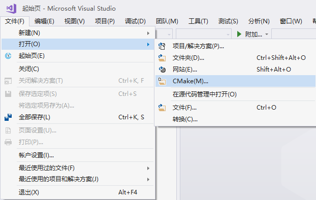
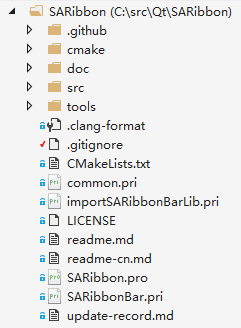
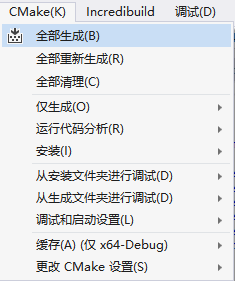
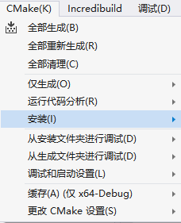
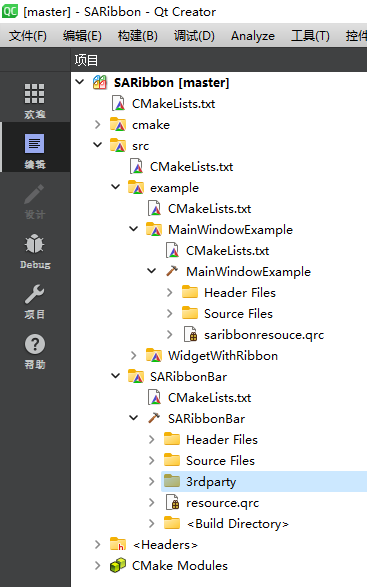
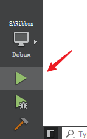

# SARibbon库构建

`SARibbon`库提供`CMake`和`QMake`两种方式构建，推荐使用`CMake`

!!! warning "注意"
    Qt6之后不再维护`QMake`，逐渐转向`CMake`。SARibbon的未来版本将会移除`QMake`支持。

## 使用CMake构建SARibbon库

### CMake构建选项

| 编译选项名称               | 默认值                                  | 描述                                                                 | 备注                                                                                     |
|----------------------------|-----------------------------------------|----------------------------------------------------------------------|------------------------------------------------------------------------------------------|
| `SARIBBON_BUILD_STATIC_LIBS` | `OFF`                                   | 控制SARibbon库的构建模式，`ON`为静态库，`OFF`为动态库               | 静态库模式下强制`BUILD_SHARED_LIBS=OFF`，动态库模式下强制`BUILD_SHARED_LIBS=ON`          |
| `SARIBBON_BUILD_EXAMPLES`   | `ON`                                    | 控制是否构建`example`目录下的示例程序（如`MainWindowExample`等）     | 关闭可加快编译速度，仅编译库本身                                                         |
| `SARIBBON_USE_FRAMELESS_LIB` | `OFF`                                   | 是否使用`QWindowKit`库作为无边框窗口解决方案                         | 需Qt 5.14+、Qt 6.2+版本；启用后强制使用C++17标准，依赖`QWindowKit`库                     |
| `SARIBBON_ENABLE_SNAPLAYOUT` | `OFF`                                   | 是否启用Windows 11的Snap Layout（窗口磁吸布局）效果                  | 仅当`SARIBBON_USE_FRAMELESS_LIB=ON`时有效，不同Qt版本可能存在兼容性问题                   |
| `SARIBBON_INSTALL_IN_CURRENT_DIR` | Windows为`ON`，其他系统为`OFF` | 控制库的安装路径，`ON`安装到项目根目录下的版本区分文件夹，`OFF`使用系统默认路径 | 本地安装文件夹命名格式：`bin_qt<Qt版本>_<编译器>_x<架构>`（如`bin_qt5.14.2_msvc_x64`） |

!!! tips "注意"
    Qt 版本兼容性：
    SARIBBON_USE_FRAMELESS_LIB 对 Qt 版本有严格要求（Qt 5.14+、Qt 6.2+），低版本 Qt 会自动禁用该选项并切换到 C++14 标准
    其他功能最低支持 Qt 5.8 版本。

!!! tips "注意"
    启用 SARIBBON_USE_FRAMELESS_LIB 时，强制使用 C++17 标准；否则使用 C++14 标准（MSVC 下会自动添加对应编译 flags）。

!!! tips "注意"
    第三方依赖：
    若启用 SARIBBON_USE_FRAMELESS_LIB，需确保 QWindowKit 库已正确编译并可被 CMake 找到（可通过 -DQWindowKit_DIR 指定路径）。

### 使用vs下构建

1. 如果要启用`QWindowKit`，在`CMakeLists.txt`中将`SARIBBON_USE_FRAMELESS_LIB`的选项改为ON。

2. 打开CMake项目，选中`CMakeLists.txt`。

   

3. 将会形成如下的构建树。

   

4. 直接在CMake菜单中选择“全部生成”（有些版本没有CMake菜单，可在`CMakeLists.txt`上点击右键）。

   

5. 全部生成完成后，在CMake菜单中选择“安装”->“SARibbon”（有些版本没有CMake菜单，可在`CMakeLists.txt`上点击右键）。

   

此时，你会在源码根目录下看到一个新文件夹，文件夹命名格式为`bin_qt{version}_[MSVC/GNU]_x[64/86]`（你可以使用默认安装位置，将`SARIBBON_INSTALL_IN_CURRENT_DIR`变量设置为OFF即可：`SARIBBON_INSTALL_IN_CURRENT_DIR=OFF`）。

   

### 使用Qt Creator构建

点击文件->打开文件或项目选中CMakeLists.txt，加载完成后形成如下的构建树

Qt Creator可以在界面修改`SARIBBON_USE_FRAMELESS_LIB`值，也可以手动修改，在Qt Creator中，点击左侧边，切换到项目模式（Ctrl+5），在Current Configuration中设置`SARIBBON_USE_FRAMELESS_LIB`为ON即可开启`QWindowKit`，前提是要先编译`QWindowKit`

点击运行按钮

运行结束，会弹出例子窗口，点击左侧边栏的项目标签，Build的步骤，选中install

再次点击运行按钮，这时候你会看到源码的根目录下多出一个文件夹,文件夹命名方式为`bin_qt{version}_[MSVC/GNU]_x[64/86]`（前提是你没有改变CMAKE_INSTALL_PREFIX）

使用SARibbon的所有内容都在这个文件夹下

## 使用QMake构建SARibbonBar

qmake构建SARibbon只需使用Qt Creator打开`SARibbon.pro`文件即可

!!! warning "注意"
    果使用Qt Creator打开`SARibbon.pro`文件过程报错，那么你的账户可能是没有足够的写权限，不同版本的Qt Creator在不同操作系统由不一样的表现，建议使用cmake
