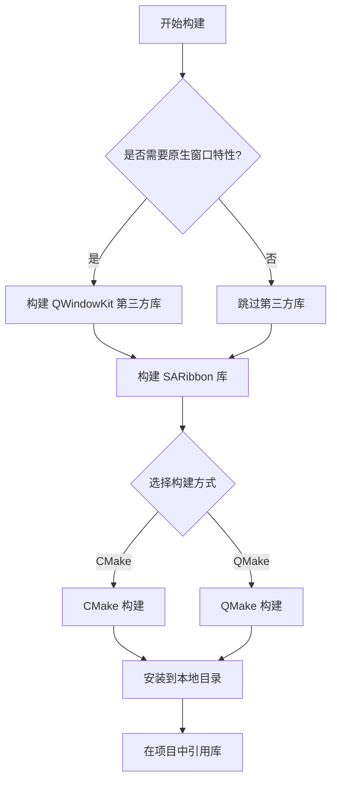
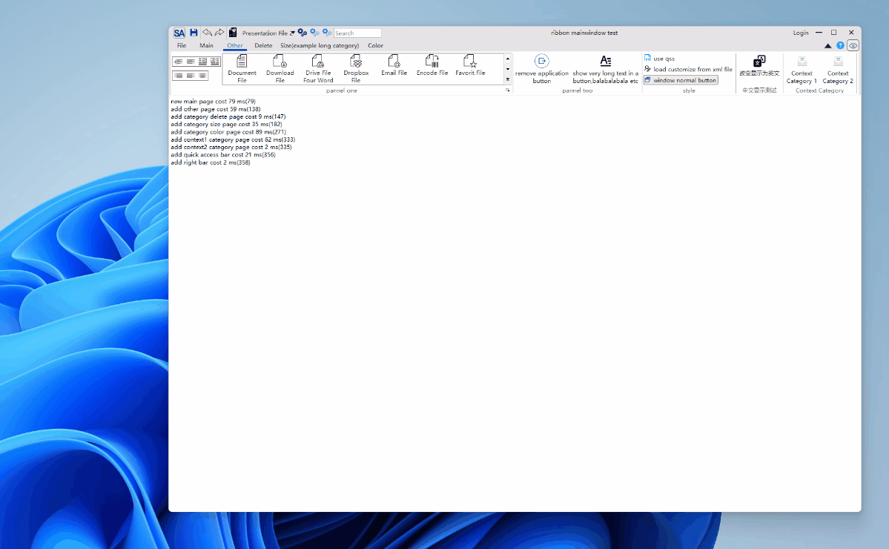

# SARibbon构建说明

!!! tip "提示"
    你不需要编译SARibbon，只需把`SARibbon.h`和`SARibbon.cpp`（这两个文件位于src目录下）引入你的工程即可

此文详细介绍如何构建SARibbon为**动态库**。如果你不熟悉C++的构建流程，只需把 `SARibbon.h` 和 `SARibbon.cpp` 引入你的工程即可使用。

## 构建流程总览

SARibbon 的构建分为两个部分：第三方依赖库（可选）和 SARibbon 本身。下面的流程图展示了构建的整体路线：



!!! warning "注意"
    SARibbon在v2.6.3版本后移除了qmake构建方式，仅支持cmake构建方式，如果你需要使用qmake构建方式，请使用v2.6.2及以下版本。

## QWindowKit 第三方库

SARibbon 采用 [QWindowKit](https://github.com/stdware/qwindowkit) 作为无边框窗口方案，同时也支持简单的无边框设置。如果你需要操作系统原生的窗口特性，如 Windows 7 及以后版本的贴边处理，或 Windows 11 的 Snap Layout 效果，建议启用 [QWindowKit](https://github.com/stdware/qwindowkit) 库。该库还能有效解决多屏幕移动问题。

启用 QWindowKit 后，你将能实现如下效果：



若要启用 [QWindowKit](https://github.com/stdware/qwindowkit)，需先编译该库。详细步骤请参阅 [第三方库构建](./build-3rdparty.md)。

!!! warning "注意"
    作为SARibbon项目的子模块，如果你在`git clone`时没有使用`--recursive`参数，需执行`submodule update`命令：
    ```shell
    git submodule update --init --recursive
    ```

## 构建 SARibbon 库

SARibbon 支持 CMake 和 QMake 两种构建方式，详细的构建步骤和配置选项请参阅 [SARibbon库构建](./build-SARibbon.md)。

如果在构建过程中遇到问题，请参阅 [构建常见错误](./common-build-errors.md)。

## 关于安装位置

通过 CMake 构建完成后，使用 `install` 命令可以安装所有依赖。引用库时，只需通过 `find_package` 命令，即可将所有依赖和预定义宏等配置一并引入，这是目前最推荐的做法。

然而，在程序开发过程中，可能会遇到不同编译器（如MSVC、MinGW）和不同Qt版本的编译问题。如果使用默认的安装位置（Windows下为C:\Program Files），则只能安装一个版本的库。

为了区分不同编译器和Qt版本，`SARibbon` 默认使用本地安装。本地安装会根据编译器和Qt版本生成一个安装文件夹，文件夹命名格式为 `bin_qt{version}_[MSVC/GNU]_x[64/86]`。

通过 CMake 的 `SARIBBON_INSTALL_IN_CURRENT_DIR` 选项可以配置是否根据编译器和Qt版本安装到本地，该选项默认为 `ON`，即会根据编译器和Qt版本生成一个本地文件夹进行安装。
