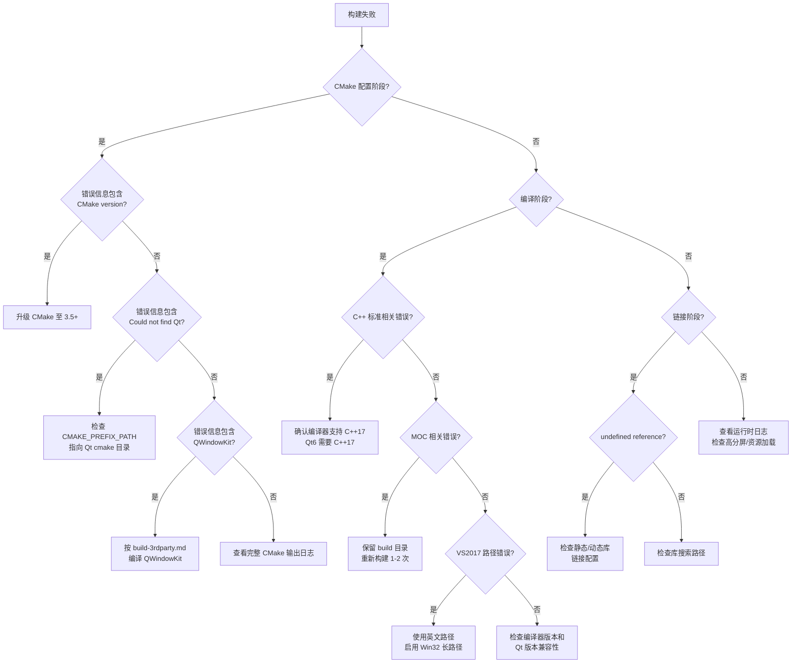

# 构建过程常见错误

- **CMake版本问题**：CMake 版本过低导致配置失败
- **Qt未找到**：`CMAKE_PREFIX_PATH` 未正确设置
- **C++17编译错误**：Qt6 项目缺少 C++17 标准支持
- **QWindowKit找不到**：无边框方案依赖库缺失
- **链接错误**：静态/动态库混用导致的 undefined reference
- **VS2017路径问题**：中文路径和长路径限制的解决方案
- **MOC编译异常**：首次构建批量MOC操作失败的简单修复
- **高分屏图标模糊**：运行时图标不清晰的解决方案
- **资源文件未加载**：amalgamate 版本 `Q_INIT_RESOURCE` 问题

| 错误现象 | 原因 | 解决方案 |
|----------|------|----------|
| `CMake 3.5 or higher is required` | CMake 版本过低 | 升级 CMake 至 3.5+ |
| `Could not find a package configuration file provided by Qt6/Qt5` | `CMAKE_PREFIX_PATH` 未设置 | 指定 Qt 安装路径下的 cmake 目录 |
| `error C2039: 'xxx' is not a member of 'std'` | 编译器未启用 C++17 | 升级编译器或手动设置 C++ 标准 |
| `Could not find QWindowKit` | 未编译或安装 QWindowKit | 先编译 QWindowKit 或指定路径 |
| `undefined reference to _imp__xxx` | 静态/动态库链接不匹配 | 添加 `SA_RIBBON_BAR_NO_EXPORT` 宏定义 |
| `error D8050: 无法执行 c1xx.dll` | 构建路径含中文或超过260字符限制 | 设置英文构建路径，启用Win32长路径 |
| MOC相关编译错误 | 首次构建批量MOC操作异常 | 保留build目录，重新构建1-2次 |
| 运行时图标模糊 | 未正确初始化高DPI支持 | 在 `QApplication` 创建前调用 `initHighDpi()` |
| 资源文件未加载 | amalgamate 版本资源初始化问题 | 手动调用 `Q_INIT_RESOURCE` |

## 构建失败排查决策树



---

!!! bug "CMake 版本过低"

> CMake Error at CMakeLists.txt:1 (cmake_minimum_required):
>   CMake 3.5 or higher is required.  You are running version 3.0.2

SARibbon 的 CMakeLists.txt 要求 CMake 3.5 或更高版本。如果系统自带的 CMake 版本过低（如 Ubuntu 16.04 默认仅 3.5.1、部分旧版 VS 内置 CMake 低于 3.5），配置阶段会直接失败。

**解决方案：**

1. 通过 pip 安装最新版 CMake（跨平台通用）：

```shell
# 使用 pip 安装最新 CMake，自动加入 PATH
pip install cmake --upgrade
```

2. Windows 用户可从 [CMake 官网](https://cmake.org/download/) 下载 MSI 安装包，安装时勾选 "Add CMake to the system PATH"。

3. Linux 用户可从 Kitware APT 仓库安装：

```shell
# 添加 Kitware 签名密钥和仓库（Ubuntu 22.04 示例）
wget -O - https://apt.kitware.com/keys/kitware-archive-latest.asc 2>/dev/null | gpg --dearmor - | sudo tee /etc/apt/trusted.gpg.d/kitware.gpg >/dev/null
sudo apt-add-repository 'deb https://apt.kitware.com/ubuntu/ jammy main'
sudo apt update && sudo apt install cmake
```

4. 验证安装版本：

```shell
cmake --version
# 输出应显示 3.5 或更高版本号
```

---

!!! bug "Qt 未找到 — Could not find a package configuration file"

> Could not find a package configuration file provided by "Qt6" (requested
> version 6.2) with any of the following names:
>
>   Qt6Config.cmake
>   qt6-config.cmake

CMake 通过 `CMAKE_PREFIX_PATH` 变量查找 Qt 的安装路径。如果该变量未指向 Qt 的 cmake 配置目录，CMake 无法定位 `Qt6Config.cmake`（Qt6）或 `Qt5Config.cmake`（Qt5），从而报错。

**解决方案：**

1. 在 CMake 命令行中指定 Qt 路径（推荐）：

```shell
# Qt6 示例 — 路径指向 Qt 安装根目录即可
cmake -S . -B build -DCMAKE_PREFIX_PATH="C:/Qt/6.7.3/msvc2019_64"

# Qt5 示例
cmake -S . -B build -DCMAKE_PREFIX_PATH="C:/Qt/5.14.2/msvc2017_64"
```

2. Linux 通过 apt 安装的 Qt6 通常位于系统默认搜索路径中，无需手动指定：

```shell
# Ubuntu 24.04 — apt 安装的 Qt6 自动在 /usr/lib/cmake 下
sudo apt install qt6-base-dev qt6-base-dev-tools
cmake -S . -B build
```

3. 如果同时安装了多个 Qt 版本，务必精确指定目标版本的 cmake 目录：

```shell
# 指定到 Qt5Config.cmake 所在的上级目录
cmake -S . -B build -DQt5_DIR="C:/Qt/5.14.2/msvc2017_64/lib/cmake/Qt5"
```

!!! tip "提示"
    在 Qt Creator 中构建时，`CMAKE_PREFIX_PATH` 会自动根据所选 Kit 的 Qt 版本填充，通常不需要手动设置。

---

!!! bug "C++17 编译错误 — 'xxx' is not a member of 'std'"

> error C2039: 'optional': is not a member of 'std'
> error: 'string_view' is not a member of 'std'

SARibbon 在使用 Qt6 时要求 C++17 标准，在使用 Qt5 且未启用 `SARIBBON_USE_FRAMELESS_LIB` 时要求 C++14。如果编译器默认标准过低（如 MSVC 默认 C++14、旧版 GCC 默认 C++14），部分 C++17 特性（`std::optional`、`std::string_view`、`if constexpr` 等）会导致编译失败。

**原因分析：**

- MSVC 2017 默认 C++14，需显式指定 `/std:c++17`
- GCC 9+ 默认 C++17，但 GCC 8 及以下默认 C++14
- SARibbon 的 CMakeLists.txt 会根据 Qt 版本和选项自动设置标准，但如果项目中手动覆盖了 `CMAKE_CXX_STANDARD`，可能导致冲突

**解决方案：**

1. 确认编译器版本满足最低要求：

| 构建场景 | 最低编译器版本 | C++ 标准 |
|----------|---------------|----------|
| Qt6 | MSVC 2019 / GCC 9 | C++17 |
| Qt5 + 无 frameless | MSVC 2017 / GCC 7 | C++14 |
| Qt5 + QWindowKit | MSVC 2019 / GCC 9 | C++17 |

2. 正常情况下无需手动设置，SARibbon 的 CMakeLists.txt 会自动处理。如果需要强制指定：

```shell
# 在 CMake 命令行中强制 C++17
cmake -S . -B build -DCMAKE_CXX_STANDARD=17
```

3. 如果使用 MSVC 2017 且遇到 C++17 错误，建议升级到 VS 2019 或更高版本。

---

!!! bug "QWindowKit 找不到"

> Could not find a package configuration file provided by "QWindowKit"
> with any of the following names:
>
>   QWindowKitConfig.cmake
>   qwindowkit-config.cmake

当构建时启用了 `SARIBBON_USE_FRAMELESS_LIB=ON`，CMake 需要找到 QWindowKit 库。如果该库未编译安装，或安装路径不在 CMake 搜索范围内，就会报此错误。

**QWindowKit 的查找路径有三种：**

1. **SARibbon 自动安装目录** — 按 [第三方库编译](./build-3rdparty.md) 文档编译后，QWindowKit 会自动安装到 SARibbon 根目录下的 `bin_qt{版本}_{编译器}_x{架构}/` 目录，CMake 能自动找到。

2. **系统全局安装路径** — 如果 QWindowKit 安装到了 `/usr/local` 或 `C:\Program Files` 等系统路径，CMake 默认搜索即可。

3. **手动指定路径** — 通过 CMake 变量显式指定：

```shell
# 指向 QWindowKitConfig.cmake 所在目录
cmake -S . -B build -DSARIBBON_USE_FRAMELESS_LIB=ON -DQWindowKit_DIR="D:/libs/QWindowKit/lib/cmake/QWindowKit"
```

!!! tip "提示"
    如果不需要无边框窗口功能，将 `SARIBBON_USE_FRAMELESS_LIB` 设为 `OFF` 即可跳过 QWindowKit 依赖。

---

!!! bug "链接错误 — undefined reference / LNK2019"

> undefined reference to `_imp___ZN12SARibbonBarC1EP7QWidget'
> LNK2019: unresolved external symbol "__declspec(dllimport) ..."

这类链接错误通常发生在以下场景：

**场景一：静态库与动态库混用**

当 SARibbon 以动态库方式编译（默认），但使用者的项目以静态链接方式引用时，由于 DLL 导出符号与静态库符号不兼容，会导致链接失败。反之亦然。

**解决方案：**

确保 SARibbon 库的编译方式与使用方式一致。如果 SARibbon 编译为静态库，使用者项目需添加 `SA_RIBBON_BAR_NO_EXPORT` 宏定义：

```cmake
# 使用者项目的 CMakeLists.txt 中添加
add_definitions(-DSA_RIBBON_BAR_NO_EXPORT)
```

或者在编译 SARibbon 时启用静态库模式：

```shell
cmake -S . -B build -DSARIBBON_BUILD_STATIC_LIBS=ON
```

**场景二：未链接 SARibbon 库**

使用 SARibbon 的项目未正确链接 SARibbon 的导入库（`.lib` / `.a`）：

```cmake
# 确保链接了 SARibbon 库
target_link_libraries(your_target PRIVATE SARibbon)
```

**场景三：DLL 路径不在搜索范围内（Windows）**

运行时找不到 SARibbon 的 DLL 文件，需要将 DLL 所在目录加入 PATH 或将 DLL 复制到可执行文件旁边。

---

!!! bug "VS2017编译器构建出错"

> error D8050: 无法执行 xxx/c1xx.dll  未能将命令行放入调试记录中

如果你的vs正确安装，但出现这个错误，有两种情况：你的构建目录可能存在中文，例如你的用户名就是中文，早期版本的vs，例如vs2017，会把构建目录放到用户的临时文件夹下面，这时就会导致构建出错，解决方法是定义

```json
{
  "configurations": [
    {
      "name": "x64-Debug",
      "generator": "Ninja",
      "configurationType": "Debug",
      "inheritEnvironments": [ "msvc_x64" ],
      "buildRoot": "${workspaceRoot}\\build\\x64-Debug",
      "cmakeCommandArgs": "",
      "ctestCommandArgs": ""
    },
    {
      "name": "x64-Release",
      "generator": "Ninja",
      "configurationType": "Release",
      "inheritEnvironments": [ "msvc_x64" ],
      "buildRoot": "${workspaceRoot}\\build\\x64-Release"
    }
  ]
}
```

另外还有一种情况就是你的操作系统最大路径没有放开，只支持255长度，这样非常容易出现问题，你可以通过修改组策略编辑器，把路径的最大长度设置为8192

```txt
按 Win + R 输入 gpedit.msc。

导航到：
计算机配置 > 管理模板 > 系统 > 文件系统
启用 启用 Win32 长路径。

重启系统。
```

如果还是不行，把项目移动到其他目录下，比如D盘，或者C盘，这样路径长度就变短了，这样问题就解决啦

---

!!! bug "构建过程中出现MOC错误"

在编译输出中看到moc相关的错误时，只需要再多几次构建即可。这个问题尤其发生在第一次构建的时候，大批量的moc操作有时会出现异常，只要保留build目录，继续构建即可。

---

!!! bug "高分屏图标模糊"

在高分辨率显示器（如 4K 屏幕、Retina 显示屏）上运行时，Ribbon 工具栏的图标显示模糊、不清晰。

**原因分析：**

Qt 应用程序需要在创建 `QApplication` 实例**之前**设置高 DPI 缩放策略。如果在 `QApplication` 构造之后才设置，部分图标和字体已经按照默认 DPI 加载，无法重新渲染。

**解决方案：**

1. 在 `main()` 函数中，确保 `QApplication` 创建前调用高 DPI 初始化：

```cpp
#include <QApplication>

int main(int argc, char* argv[])
{
    // Qt 5.14+ 推荐方式 — 必须在 QApplication 之前调用
    QGuiApplication::setHighDpiScaleFactorRoundingPolicy(
        Qt::HighDpiScaleFactorRoundingPolicy::PassThrough);

    QApplication app(argc, argv);
    // ...
}
```

2. Qt 5.6 ~ 5.13 需要额外设置属性：

```cpp
// Qt 5.6+ 兼容方式
QCoreApplication::setAttribute(Qt::AA_EnableHighDpiScaling);
QCoreApplication::setAttribute(Qt::AA_UseHighDpiPixmaps);
```

3. 也可以通过环境变量启用（不需要修改代码）：

```shell
# Windows — 设置环境变量后运行程序
set QT_ENABLE_HIGHDPI_SCALING=1
your_app.exe

# Linux
QT_ENABLE_HIGHDPI_SCALING=1 ./your_app
```

---

!!! bug "资源文件未加载（amalgamate 版本）"

使用 amalgamate 合并版本（`src/SARibbon.cpp` + `src/SARibbon.h`）时，Ribbon 控件的图标、样式等资源未正确加载，界面显示为无图标的空白按钮。

**原因分析：**

SARibbon 的资源文件（`.qrc`）在正常构建时通过 CMake 的 `qt_add_resources` 自动编译链接。但 amalgamate 版本是单文件形式，Qt 的资源系统不会自动初始化——需要在应用程序代码中显式调用 `Q_INIT_RESOURCE`。

**解决方案：**

在使用 SARibbon 的 `main()` 函数中（`QApplication` 创建之后），手动初始化资源：

```cpp
#include "SARibbon.h"

int main(int argc, char* argv[])
{
    QApplication app(argc, argv);

    // 初始化 SARibbon 的 Qt 资源 — amalgamate 版本必须调用
    Q_INIT_RESOURCE(SARibbon);

    // ... 创建主窗口等
    return app.exec();
}
```

!!! warning "注意"
    如果通过 CMake 正常构建（非 amalgamate），资源会自动链接，无需手动调用 `Q_INIT_RESOURCE`。仅在直接使用 amalgamate 合并文件时才需要此步骤。
