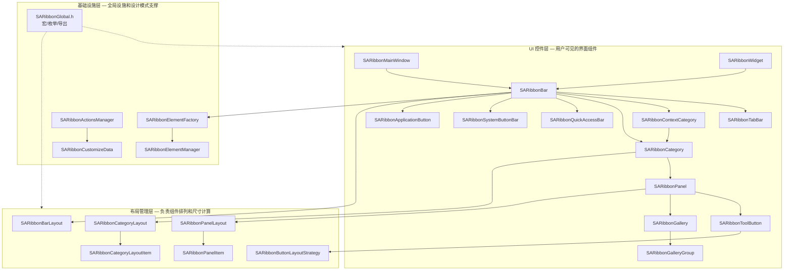
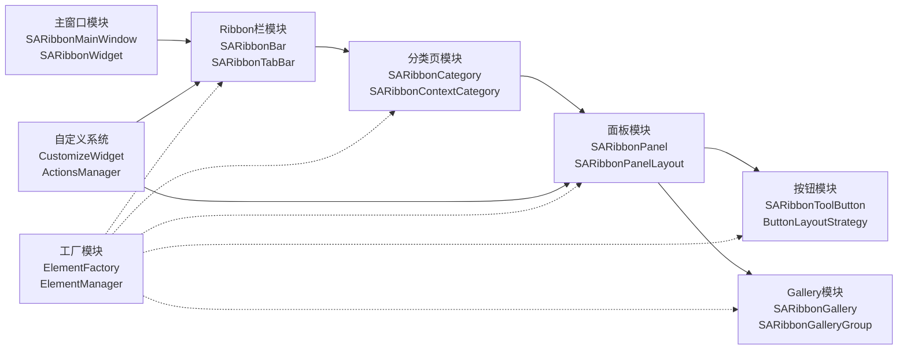
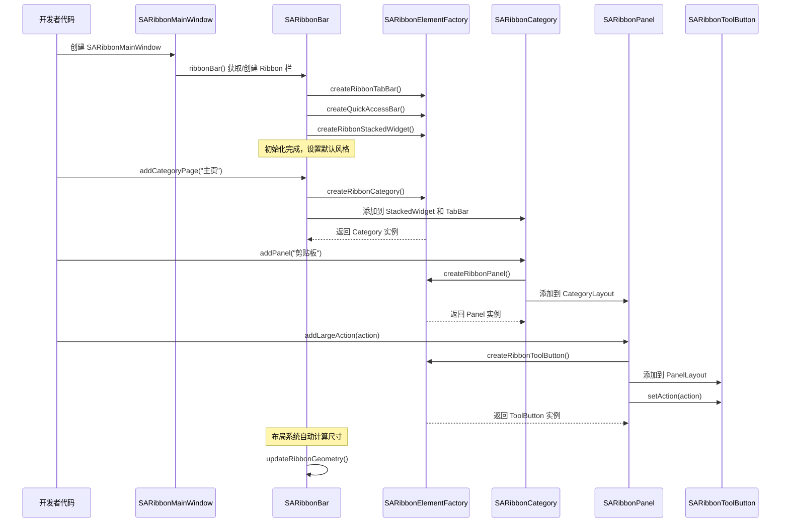
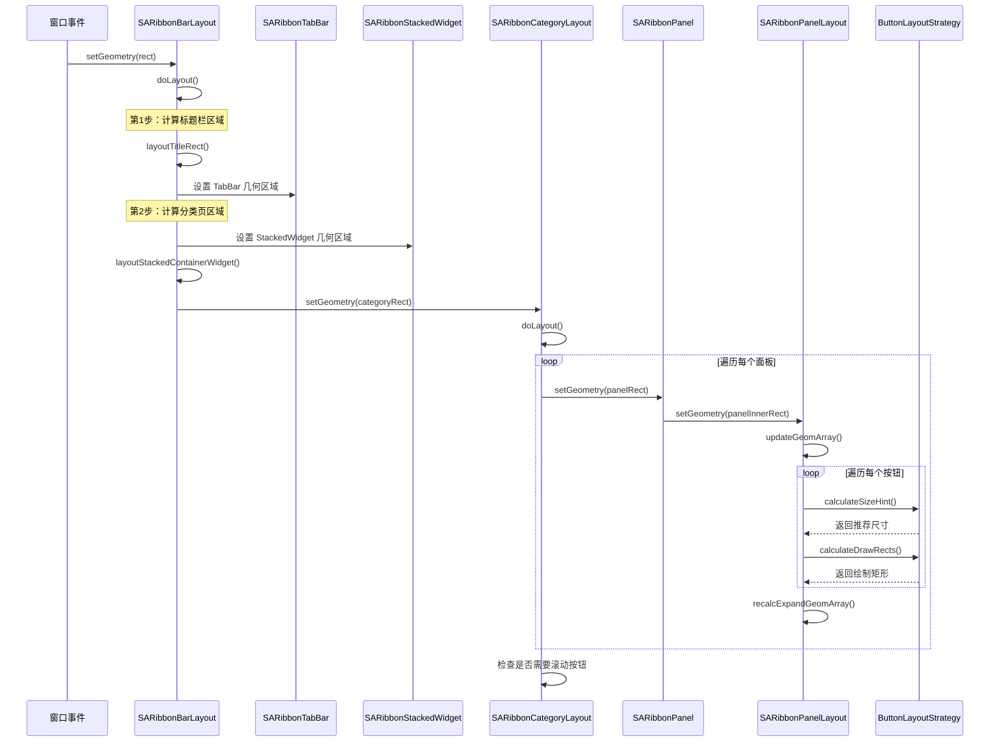
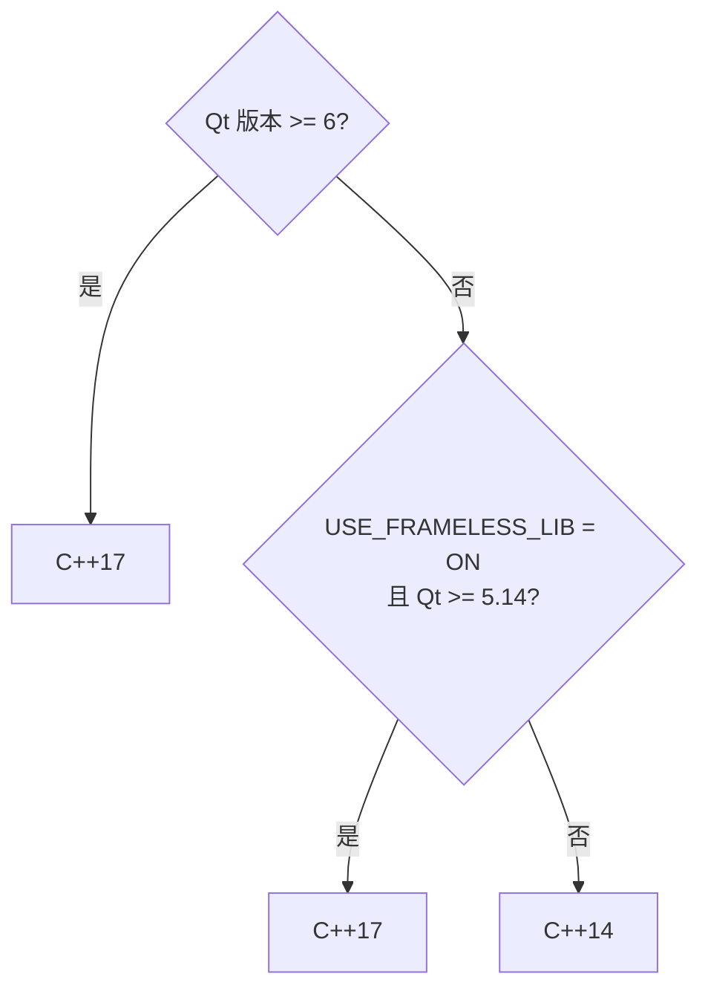

# 架构设计文档

- **分层架构**: UI 控件层 / 布局管理层 / 基础设施层三层分离，职责清晰
- **依赖方向**: 严格的自上而下依赖，下层模块不依赖上层，保证独立可测试性
- **扩展友好**: 工厂模式 + 策略模式提供无侵入式扩展点
- **ABI 兼容**: PIMPL 模式确保二进制接口稳定，修改私有成员不影响外部使用者
- **多风格支持**: 6 种 Ribbon 风格（Loose/Compact x ThreeRow/TwoRow/SingleRow）统一架构
- **主题系统**: 内置 6 种主题（Office 2013/2016/2021、Windows 7、Dark/Dark2），QSS 可扩展

## 整体架构

SARibbon 采用三层架构设计，从上到下分别为 UI 控件层、布局管理层和基础设施层。每一层只与相邻层交互，形成清晰的依赖链。



三层之间通过 `SARibbonGlobal.h` 中定义的全局宏和枚举进行通信，避免了层间的直接耦合。UI 控件层通过工厂模式获取子组件实例，布局管理层通过 Qt 的 QLayout 体系自动参与尺寸协商，基础设施层提供跨层共享的基础能力。

## 各层职责详解

### UI 控件层

UI 控件层包含所有用户可见的界面组件，按照从外到内的嵌套关系组织：

| 组件 | 继承自 | 职责 | 关键文件 |
|------|--------|------|----------|
| `SARibbonMainWindow` | `QMainWindow` | 替换 MenuBar 为 Ribbon，管理无边框窗口 | `SARibbonMainWindow.h/.cpp` |
| `SARibbonWidget` | `QWidget` | QWidget 版本的 Ribbon 容器 | `SARibbonWidget.h/.cpp` |
| `SARibbonBar` | `QMenuBar` | Ribbon 核心管理类，组合标签栏和分类页 | `SARibbonBar.h/.cpp` |
| `SARibbonTabBar` | `QTabBar` | 标签栏，管理 Tab 页签的显示和切换 | `SARibbonTabBar.h/.cpp` |
| `SARibbonContextCategory` | `QObject` | 上下文标签组，管理临时出现的相关 Tab | `SARibbonContextCategory.h/.cpp` |
| `SARibbonCategory` | `QFrame` | 分类页容器，包含多个面板 | `SARibbonCategory.h/.cpp` |
| `SARibbonPanel` | `QFrame` | 面板容器，管理按钮的布局和分组 | `SARibbonPanel.h/.cpp` |
| `SARibbonToolButton` | `QToolButton` | Ribbon 按钮，支持大/小两种模式 | `SARibbonToolButton.h/.cpp` |
| `SARibbonGallery` | `QFrame` | 下拉选择控件，类似 Office 的样式库 | `SARibbonGallery.h/.cpp` |
| `SARibbonGalleryGroup` | `QListView` | Gallery 内的选项组 | `SARibbonGalleryGroup.h/.cpp` |
| `SARibbonQuickAccessBar` | `SARibbonButtonGroupWidget` | 快速访问栏（保存、撤销等） | `SARibbonQuickAccessBar.h/.cpp` |
| `SARibbonSystemButtonBar` | `SARibbonButtonGroupWidget` | 最小/最大/关闭按钮 | `SARibbonSystemButtonBar.h/.cpp` |
| `SARibbonApplicationButton` | `QPushButton` | 左上角应用按钮（如 Office 的"文件"） | `SARibbonApplicationButton.h/.cpp` |

### 布局管理层

布局管理层使用 Qt 的 `QLayout` 体系实现自动尺寸协商和组件排列。每种容器控件都有对应的布局类：

| 布局类 | 管理的容器 | 核心算法 | 特殊能力 |
|--------|-----------|---------|---------|
| `SARibbonBarLayout` | `SARibbonBar` | 计算标题栏/标签栏/分类页的高度分配 | 支持 Loose/Compact 两种排列风格 |
| `SARibbonCategoryLayout` | `SARibbonCategory` | 水平排列面板，计算面板间距 | 支持滚动和动画滚动 |
| `SARibbonPanelLayout` | `SARibbonPanel` | 按大/中/小比例排列按钮 | 支持 ThreeRow/TwoRow/SingleRow 模式 |
| `SARibbonButtonLayoutStrategy` | `SARibbonToolButton` | 计算图标/文字/指示器的绘制矩形 | 策略模式，大/小按钮分别实现 |

`SARibbonPanelItem` 和 `SARibbonCategoryLayoutItem` 是布局项的包装类，记录每个组件在布局中的几何信息和属性（如行占比 `RowProportion`）。

### 基础设施层

基础设施层提供跨模块共享的基础能力：

- **SARibbonGlobal.h**：定义全局宏（PIMPL 宏、导出宏）、枚举（`SARibbonAlignment`、`SARibbonTheme`、`SARibbonMainWindowStyleFlag`）和工具宏（`sa_as_const`）
- **SARibbonElementFactory + SARibbonElementManager**：工厂模式 + 单例，控制所有 UI 组件的创建
- **SARibbonActionsManager**：管理所有 QAction 的注册、标签分类和搜索
- **SARibbonCustomizeData**：描述自定义操作的序列化数据结构，支持 XML 读写

## 模块分解

### 模块概览

| 模块 | 文件数量 | 核心职责 | 依赖的上层模块 |
|------|---------|---------|---------------|
| 主窗口 | 4 | 窗口管理、无边框支持 | 无 |
| Ribbon 栏 | 6 | 整体布局、标签管理、风格切换 | 主窗口 |
| 分类页 | 4 | Tab 页容器、面板管理、滚动 | Ribbon 栏 |
| 面板 | 8 | 按钮排列、布局计算、Action 管理 | 分类页 |
| 按钮 | 6 | 大小按钮绘制、布局策略 | 面板 |
| Gallery | 6 | 下拉选择、图标列表、视口管理 | 面板 |
| 自定义系统 | 6 | 用户自定义界面、XML 序列化 | Ribbon 栏、面板 |
| 辅助组件 | 10+ | 分隔线、堆叠窗口、颜色按钮等 | 各模块按需 |

### 模块依赖关系



工厂模块通过虚线连接其他模块，表示它创建这些模块的实例但不被它们依赖。自定义系统依赖 Ribbon 栏和面板模块，因为它需要操作这些模块的结构。

## 核心数据流

### 用户创建 Ribbon 界面的流程

开发者使用 SARibbon 构建界面时，调用链从上到下传递，最终形成完整的 Ribbon 控件树：



这个流程展示了从顶层到底层的创建链。每个步骤都通过工厂创建组件实例，然后由父容器管理其生命周期和布局。开发者只需关注业务逻辑（创建 QAction、连接信号槽），UI 组件的创建和布局由框架自动处理。

### Ribbon 布局计算流程

当窗口尺寸改变或 Ribbon 风格切换时，布局系统从外到内逐层重新计算：



布局计算的关键特点：

1. **自上而下传递**：外层布局确定内层的可用区域，内层在此区域内自行排列
2. **QLayout 标准接口**：每层都实现 `sizeHint()`、`minimumSize()` 和 `setGeometry()`，与 Qt 布局系统完全集成
3. **惰性计算**：`SARibbonPanelLayout` 使用 `mDirty` 标志避免不必要的重新计算，只在布局失效时触发 `updateGeomArray()`

## 关键设计决策

### 决策 1：PIMPL 选型——std::unique_ptr 而非 QScopedPointer

**选择**：使用 `std::unique_ptr<PrivateData>` 管理 PIMPL 私有数据。

**背景**：Qt 项目传统上使用 `QScopedPointer` 实现 PIMPL。SARibbon 选择 `std::unique_ptr` 的原因：

- **标准库优先**：`std::unique_ptr` 是 C++11 标准库的一部分，语义明确，无需额外依赖 Qt 头文件
- **移动语义**：`std::unique_ptr` 的移动语义更清晰，符合现代 C++ 实践
- **最低要求 C++14**：项目最低要求 C++14，`std::unique_ptr` 在此标准下完全可用

**权衡**：放弃了与 Qt 风格的完全一致性，但获得了更清晰的语义和更好的标准库兼容性。项目中 `SARibbonElementManager` 仍使用 `QScopedPointer` 管理工厂实例，属于历史遗留。

### 决策 2：工厂模式——虚方法工厂而非注册表工厂

**选择**：`SARibbonElementFactory` 使用 17 个虚方法而非类型注册表来创建组件。

**背景**：组件创建可以有两种实现方式：
1. **虚方法工厂**：每种组件对应一个虚方法，子类重写方法返回自定义类型
2. **注册表工厂**：用 `std::map<TypeID, Creator>` 注册创建函数，通过 ID 查找创建

**选择虚方法的理由**：

- **类型安全**：每个方法有明确的返回类型，编译时检查
- **IDE 友好**：虚方法可以被 IDE 自动补全和跳转，注册表需要运行时查找
- **数量可控**：Ribbon 的子组件类型固定且数量少（17 种），不需要动态注册
- **Qt 风格一致**：Qt 自身的 `QStyle`、`QStyleFactory` 也采用类似模式

**权衡**：添加新的组件类型需要修改工厂基类（添加新的虚方法），违反了开闭原则。但由于 Ribbon 组件体系相对稳定，这个代价可以接受。

### 决策 3：无边框方案——QWindowKit vs 原生方案

**选择**：通过 CMake 选项 `SARIBBON_USE_FRAMELESS_LIB` 控制是否使用 QWindowKit 库作为无边框方案。默认关闭。

**背景**：Ribbon 主窗口通常需要自定义标题栏，这需要去掉操作系统的原生窗口边框。有两种方案：

| 方案 | 优势 | 劣势 |
|------|------|------|
| **原生方案（默认）** | 无额外依赖，兼容性好 | 高分屏多屏幕支持有限，缺少 Windows 窗口特效 |
| **QWindowKit** | 支持边缘吸附、高分屏多屏幕 | 额外依赖，需要 C++17，版本兼容性有限 |

**选择策略**：

- 默认使用原生方案，确保零依赖可用
- 当 `SARIBBON_USE_FRAMELESS_LIB=ON` 时启用 QWindowKit
- CMakeLists 自动检测 Qt 版本兼容性：Qt 5.14/5.15 和 Qt 6.2+ 才支持 QWindowKit
- 如果指定了 QWindowKit 但找不到库，自动回退到原生方案并输出 WARNING

**版本兼容限制**：Qt 5.12/5.13 和 Qt 6.0/6.1 不支持 QWindowKit，即使设置 `ON` 也会被自动降为 `OFF`。

## 扩展点

### 如何添加新控件类型

SARibbon 提供了三个层次的扩展点来添加新控件：

**1. 继承现有控件（最常见）**

继承 `SARibbonToolButton` 或 `SARibbonPanel` 等现有类，重写虚方法。参考 `SARibbonColorToolButton` 的做法——它继承 `SARibbonToolButton` 并添加了颜色选择功能。

**2. 通过工厂替换组件**

继承 `SARibbonElementFactory`，重写对应的 `create*` 方法。这样所有通过工厂创建的组件都会使用你的自定义实现。

```cpp
class MyFactory : public SARibbonElementFactory
{
public:
    // 替换所有面板为自定义面板
    SARibbonPanel* createRibbonPanel(QWidget* parent) override
    {
        return new MyPanel(parent);
    }
};

// 在 main() 中设置
SARibbonElementManager::instance()->setupFactory(new MyFactory);
```

**3. 通过 QSS 样式定制**

所有核心控件都支持 QSS 样式表定制。通过 `setStyleSheet()` 或加载 `.qss` 文件即可改变外观，无需修改 C++ 代码。

### 如何自定义布局策略

`SARibbonButtonLayoutStrategy` 提供了按钮布局计算的扩展点。你可以：

1. 继承 `SARibbonLargeButtonLayoutStrategy` 或 `SARibbonSmallButtonLayoutStrategy`
2. 重写 `calculateDrawRects()`、`calculateSizeHint()` 和 `calculateTextHeight()`
3. 修改 `SARibbonButtonLayoutStrategyFactory::createStrategy()` 返回你的自定义策略

`SARibbonPanelLayout` 中的 `mButtonMaximumAspectRatio`（默认 1.4）和 `mEnableWordWrap`（默认 true）是两个常用的布局参数，可通过 `SARibbonBar` 的对应 setter 全局调整。

### 如何扩展主题系统

主题扩展涉及三个步骤：

1. **添加枚举值**：在 `SARibbonGlobal.h` 的 `SARibbonTheme` 枚举中添加新主题

```cpp
enum class SARibbonTheme
{
    // ... 现有主题 ...
    RibbonThemeMyCustom  ///< 自定义主题
};
```

2. **编写 QSS**：为新主题编写完整的 QSS 样式表，覆盖所有 Ribbon 组件

3. **处理集成**：在 `SARibbonBar` 的 `setRibbonStyle()` 或主题切换逻辑中添加新主题的处理分支

!!! warning "QSS 尺寸限制"
    自定义 QSS 主题时，部分尺寸信息（如 TabBar 的 margin）无法在 C++ 代码中自动获取。需要手动将这些尺寸设置到 `SARibbonTabBar` 中，否则 `SARibbonContextCategory` 的绘制会出现偏差。

## 构建系统架构

### CMake 文件结构

```
CMakeLists.txt              ← 顶层配置：版本号、选项定义、Qt 查找、C++ 标准选择
├── cmake/
│   └── WinResource.cmake   ← Windows 资源文件处理
├── src/
│   ├── CMakeLists.txt      ← 库目标定义、源文件列表、安装规则
│   └── SARibbonBar/
│       └── CMakeLists.txt  ← 子模块源文件列表
├── example/
│   └── CMakeLists.txt      ← 示例程序构建
└── tests/
    └── CMakeLists.txt      ← 测试程序构建
```

### 构建选项影响范围

| CMake 选项 | 默认值 | 影响范围 | 说明 |
|-----------|--------|---------|------|
| `SARIBBON_BUILD_STATIC_LIBS` | OFF | 库类型、导出宏 | ON 时构建静态库，自动定义 `SA_RIBBON_BAR_NO_EXPORT` |
| `SARIBBON_USE_FRAMELESS_LIB` | OFF | C++ 标准、依赖 | ON 时需要 QWindowKit 库和 C++17 |
| `SARIBBON_ENABLE_SNAPLAYOUT` | OFF | Windows 窗口行为 | 仅在 `USE_FRAMELESS_LIB=ON` 时有效 |
| `SARIBBON_BUILD_EXAMPLES` | ON | 构建目标 | 控制是否编译示例程序 |
| `BUILD_TESTS` | OFF | 构建目标、CTest | 启用单元测试（Qt Test 框架） |
| `SARIBBON_INSTALL_IN_CURRENT_DIR` | ON(Win)/OFF(Linux) | 安装路径 | Windows 下安装到 `bin_qt{版本}_{编译器}_x{架构}/` |

### C++ 标准自动选择逻辑

CMakeLists.txt 根据 Qt 版本和构建选项自动选择 C++ 标准：



这意味着使用 Qt 5.12/5.13 时只能使用 C++14，不能启用 QWindowKit。Qt 6 始终要求 C++17。

### 版本管理

项目版本号定义在顶层 `CMakeLists.txt` 中：

```cmake
set(SARIBBON_VERSION_MAJOR 2)
set(SARIBBON_VERSION_MINOR 8)
set(SARIBBON_VERSION_PATCH 0)
```

版本号通过 `configure_file` 自动生成 `SARibbonBarVersionInfo.h`，源码通过 `SARibbonBar::versionString()` 静态方法获取版本信息。

## 延伸阅读

| 文档 | 内容 |
|------|------|
| [新贡献者开发指南](./developer-guide.md) | 环境搭建、开发工作流、代码模板 |
| [模块详解](./module-breakdown.md) | 各模块的业务逻辑和 API 参考 |
| [编码规范](./coding-standards.md) | 命名规范、注释规范、Git 提交 |
| [PIMPL 开发规范](./pimpl-dev-guide.md) | PIMPL 宏完整用法 |
| [Qt 集成规范](./qt-integration.md) | Q_PROPERTY、信号槽、Qt 宏 |
