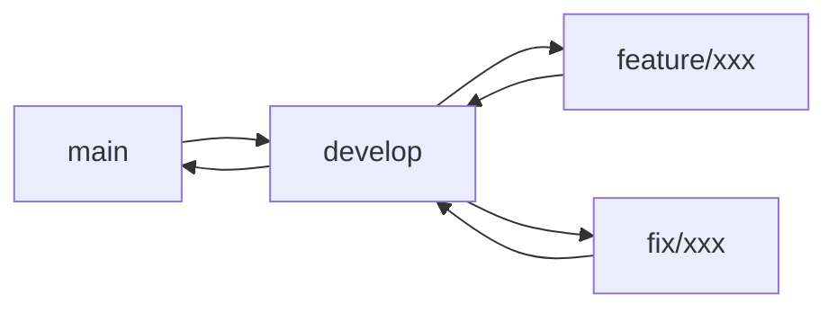

# 贡献指南

感谢你考虑为 SARibbon 做出贡献！本文档说明如何参与项目开发。

- **Git 工作流**: 分支策略、Commit Message 格式、PR 提交流程
- **代码规范**: 编码标准快速参考、PIMPL 模式要求、Qt 宏使用规范
- **Issue 提交**: Bug Report 和 Feature Request 的撰写指南
- **代码审查**: PR 审查重点和合并要求
- **联系方式**: QQ 交流群和 GitHub Issues

---

## 开发环境搭建

详细的构建步骤请参考 [编码规范](coding-standards.md) 和项目根目录的 `AGENTS.md`。简要步骤如下：

```bash
# Linux / WSL
cmake -S . -B build -G Ninja -DCMAKE_BUILD_TYPE=Release
cmake --build build --parallel

# Windows (Visual Studio)
cmake -S . -B build -G "Visual Studio 16 2019" -A x64 -DCMAKE_PREFIX_PATH="<Qt路径>"
cmake --build build --config Release
```

启用单元测试需添加 `-DBUILD_TESTS=ON`。

## 分支策略

建议采用以下 Git 工作流：



| 分支 | 用途 |
|------|------|
| `main` | 稳定发布分支，仅接受 develop 合并 |
| `develop` | 日常开发集成分支 |
| `feature/<名称>` | 新功能开发，从 develop 拉出，完成后合并回 develop |
| `fix/<名称>` | Bug 修复，从 develop 拉出，完成后合并回 develop |

## 代码修改流程

1. **Fork 仓库**：在 GitHub 上 Fork `https://github.com/czyt1988/SARibbon`
2. **创建分支**：从 `develop` 分支创建你的功能或修复分支
3. **编码**：遵循项目编码规范（见下方快速参考）
4. **测试**：确保 `BUILD_TESTS=ON` 下的单元测试全部通过
5. **提交**：使用规范的 Commit Message 格式提交代码
6. **发起 PR**：向原仓库的 `develop` 分支发起 Pull Request

## 代码审查流程

- 所有代码变更必须通过 Pull Request 合并，不允许直接推送
- 至少需要一位维护者审核通过后方可合并
- 审查重点：编码规范合规性、PIMPL 模式正确性、Qt 版本兼容性、单元测试覆盖

## Commit Message 格式

```
类型：简要描述

- 详细说明修改了什么
- 相关文件：列出涉及的文件
- 关联计划：关联的设计计划或 Issue 编号
```

类型可选：`修复`、`新增`、`优化`、`文档`、`重构`。

示例：

```
修复：SARibbonCategory布局计算错误

- 修复了在紧凑模式下面板高度计算不正确的问题
- 相关文件：SARibbonCategory.cpp, SARibbonCategoryLayout.cpp
- 关联计划：Ribbon布局优化计划
```

## Issue 提交指南

提交 Bug Report 时请包含以下信息：

1. **环境信息**：操作系统、Qt 版本、编译器版本、SARibbon 版本
2. **复现步骤**：最小可复现代码或操作步骤
3. **期望行为**：你认为应该发生什么
4. **实际行为**：实际发生了什么，附截图或日志
5. **附加信息**：是否与特定 Qt 版本/平台相关

!!! tip "提示"
    提供一个最小可复现示例（Minimal Reproducible Example）能大幅加快问题定位速度。

## PR 提交指南

- PR 目标分支为 `develop`，不要直接向 `main` 提交
- 描述中说明修改动机和影响范围
- 如涉及 API 变更，需同步更新文档和示例
- 确保 CI 构建通过后再请求审查
- 一个 PR 只做一件事，避免混合不相关的改动

## 编码规范快速参考

完整规范请参阅 [编码规范](coding-standards.md)、[PIMPL 开发指南](pimpl-dev-guide.md) 和 [Qt 集成指南](qt-integration.md)。

核心要点：

- 使用 `Q_SLOTS` / `Q_SIGNALS` / `Q_EMIT`，禁止 `slots` / `signals` / `emit`
- 头文件 public 函数仅用单行英文 `///` 注释，禁止双语 Doxygen
- 类注释仅使用 `@brief` / `@details` / `@note` / `@see`，禁止 `@param` / `@class`
- 核心类使用 PIMPL 模式，`PrivateData` 定义在 `.cpp` 中
- 4 空格缩进，120 字符行宽，指针靠左（`QWidget* p`）
- 源码修改仅在 `src/SARibbonBar/` 目录下进行，禁止触碰合并文件 `src/SARibbon.h` / `src/SARibbon.cpp`

## 联系我们

- QQ 交流群：**785294806**、**434014314**
- GitHub Issues：[https://github.com/czyt1988/SARibbon/issues](https://github.com/czyt1988/SARibbon/issues)
