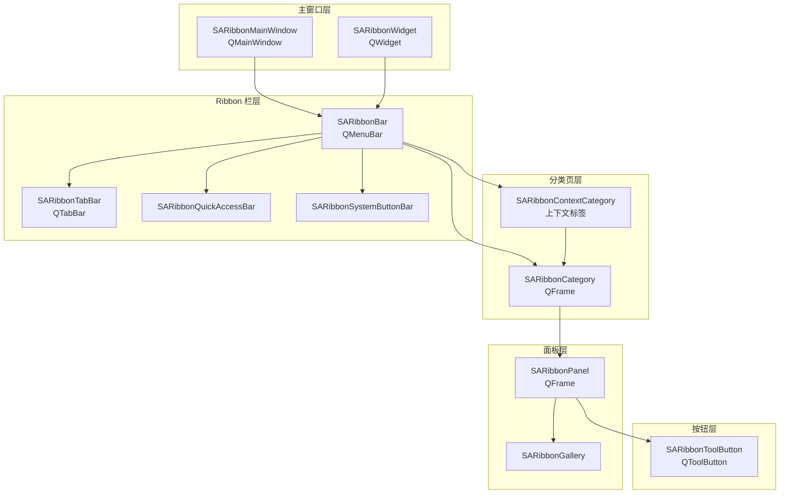
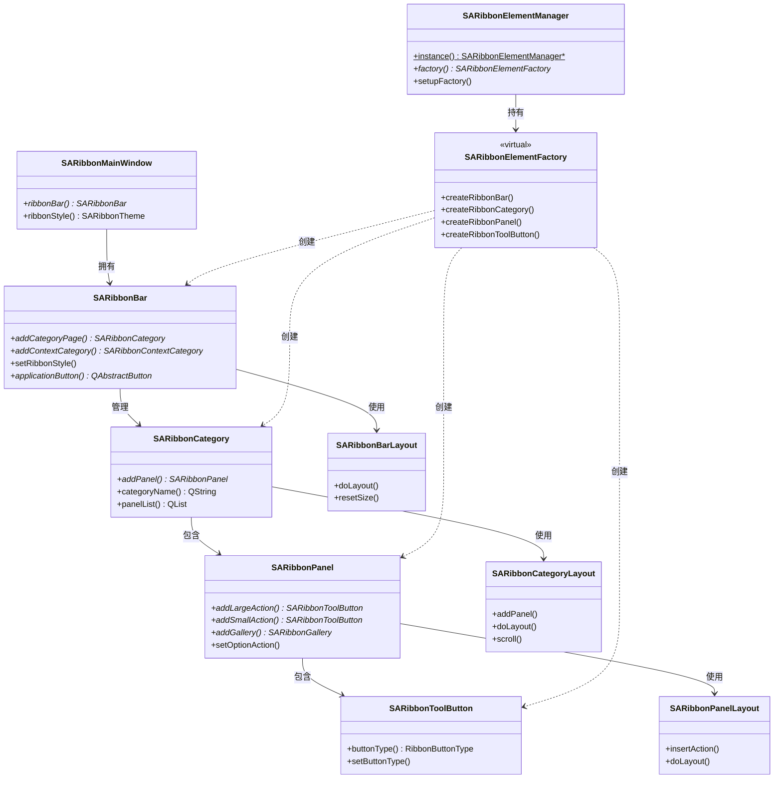
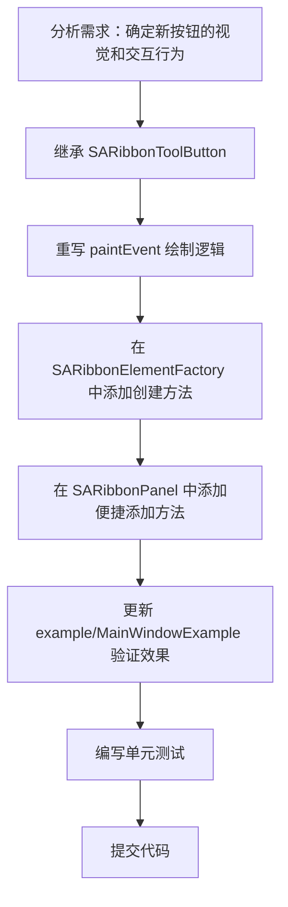
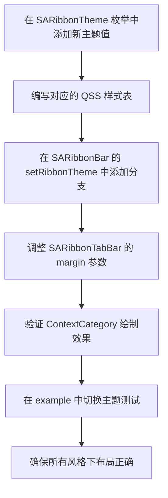
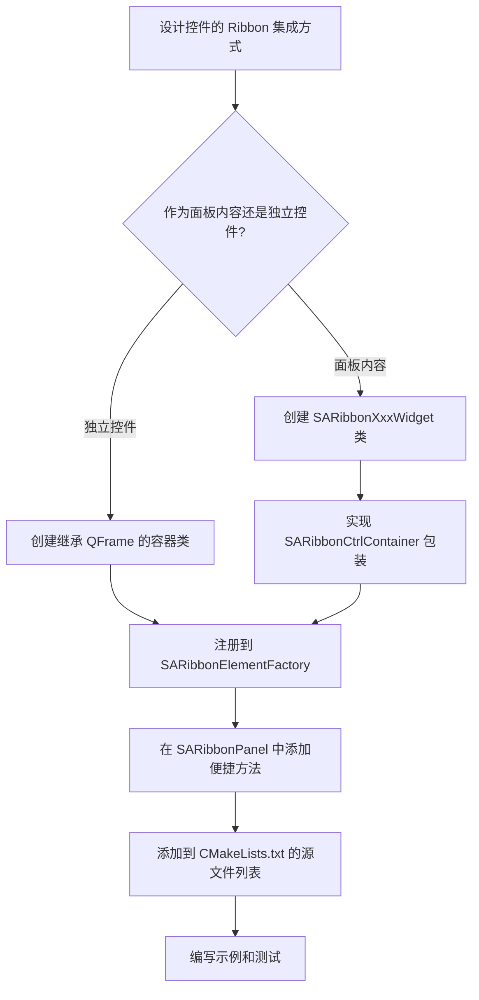

# 新贡献者开发指南

- **完整开发路径**: 从零到高效开发的完整引导，涵盖环境搭建、架构理解、编码实践
- **架构概览**: 通过 Mermaid 图表快速理解项目层次结构和模块关系
- **设计模式详解**: PIMPL、工厂模式、策略模式、单例模式的实际用法与代码示例
- **开发工作流**: 添加按钮类型、新主题、新控件等典型场景的分步流程图
- **代码模板**: 可直接复制使用的 .h/.cpp 新类模板
- **禁止事项速查**: 明确列出不可修改的文件和必须遵守的编码规则
- **调试与提交**: 调试技巧、Git 工作流、commit message 格式规范

## 项目概述

SARibbon 是一个基于 Qt 框架的 Ribbon 界面控件库，为 C++ 桌面应用提供类似 Microsoft Office 的功能区（Ribbon）界面。项目版本号 2.8.0，采用 MIT 开源协议，支持 Qt 5.12 及以上版本（包括 Qt 5 和 Qt 6），最低要求 C++14 标准。

该项目解决的核心问题是：传统 Qt 应用的菜单栏（QMenuBar）和工具栏（QToolBar）是平级结构，无法实现 Office 风格的层级式 Ribbon 界面——即"标签页 → 面板 → 按钮"的三级组织结构。SARibbon 通过继承 QMenuBar 的 SARibbonBar 实现了这一层级关系，同时保持了与 Qt 现有 QAction/QMenu 体系的完全兼容。

技术栈选型理由：选择 Qt 作为基础框架是因为其跨平台能力和成熟的 Widget 体系；使用 PIMPL 模式确保 ABI 兼容性和编译隔离；工厂模式（SARibbonElementFactory）允许用户替换任意子组件的实现；CMake 构建系统同时支持 Visual Studio 和 Ninja 生成器。

## 快速开发环境搭建

### 环境要求

| 组件 | Windows | Linux / WSL |
|------|---------|-------------|
| 编译器 | Visual Studio 2019 (MSVC 14.29+) | GCC 9+（推荐 GCC 13+） |
| CMake | 3.15+ | 3.15+ |
| Qt 版本 | Qt 6.7+ 或 Qt 5.12+ | Qt 6.x（apt）或 Qt 5.12+ |
| C++ 标准 | C++14（Qt5）/ C++17（Qt6） | 自动根据 Qt 版本选择 |
| 构建工具 | Visual Studio 或 Ninja | Ninja |

### 构建命令

**Windows（Visual Studio 生成器，推荐）：**

```powershell
# 配置项目，根据实际 Qt 路径调整 CMAKE_PREFIX_PATH
cmake -S . -B build -G "Visual Studio 16 2019" -A x64 -DCMAKE_PREFIX_PATH="C:/Qt/6.7.3/msvc2019_64"

# 编译 Release 版本
cmake --build build --config Release
```

**Windows（Ninja 生成器）：**

```powershell
# 先初始化 MSVC 环境变量
cmd /c '"C:\Program Files (x86)\Microsoft Visual Studio\2019\Community\VC\Auxiliary\Build\vcvarsall.bat" x64 & set' | ForEach-Object {
    if ($_ -match '^([^=]+)=(.*)$') {
        [Environment]::SetEnvironmentVariable($matches[1], $matches[2], 'Process')
    }
}

# 配置并编译
cmake -S . -B build -G Ninja -DCMAKE_BUILD_TYPE=Release -DCMAKE_PREFIX_PATH="C:/Qt/6.7.3/msvc2019_64"
cmake --build build
```

**Linux / WSL：**

```bash
# Ubuntu 24.04 安装 Qt6 依赖
sudo apt install qt6-base-dev qt6-base-dev-tools qt6-svg-dev qt6-tools-dev ninja-build

# 配置并编译（apt 安装的 Qt6 无需指定 CMAKE_PREFIX_PATH）
cmake -S . -B build-linux -G Ninja -DCMAKE_BUILD_TYPE=Release
cmake --build build-linux --parallel
```

### 运行测试

```bash
# 在 CMake 配置时启用测试
cmake -S . -B build -DBUILD_TESTS=ON

# 编译并运行测试
cmake --build build --config Release
cd build && ctest --output-on-failure
```

### 运行示例程序

编译完成后，示例程序位于 `build/bin/` 目录下，最主要的是 `MainWindowExample`：

```bash
# Windows
.\build\bin\MainWindowExample.exe

# Linux
./build/bin/MainWindowExample
```

## 项目目录结构

```
SARibbon/
├── src/
│   ├── SARibbonBar/              ← 所有源码（.h/.cpp），唯一应编辑的目录
│   │   ├── SARibbonGlobal.h      ← 全局宏定义（PIMPL宏、导出宏、枚举）
│   │   ├── SARibbonBar.h/.cpp    ← Ribbon 栏核心类
│   │   ├── SARibbonCategory.h/.cpp    ← 分类页（Tab 页）
│   │   ├── SARibbonPanel.h/.cpp       ← 面板（功能分组）
│   │   ├── SARibbonToolButton.h/.cpp  ← Ribbon 按钮
│   │   ├── SARibbonGallery.h/.cpp     ← Gallery 控件
│   │   ├── SARibbonElementFactory.h/.cpp  ← 工厂类
│   │   ├── SARibbonElementManager.h/.cpp  ← 工厂单例管理器
│   │   ├── SARibbonCustomizeWidget.h/.cpp ← 自定义界面
│   │   ├── SARibbonActionsManager.h/.cpp  ← Action 管理器
│   │   ├── colorWidgets/         ← SAColorWidgets 子模块
│   │   ├── 3rdparty/             ← 第三方代码
│   │   ├── i18n/                 ← 翻译文件 (.ts/.qm)
│   │   └── resource/             ← 资源文件
│   ├── SARibbon.cpp              ← 合并文件，禁止修改
│   └── SARibbon.h                ← 合并文件，禁止修改
├── example/
│   └── MainWindowExample/        ← 主要示例程序
├── tests/                        ← 单元测试（Qt Test 框架）
├── tools/                        ← Amalgamate 合并工具
├── docs/
│   └── zh/
│       ├── dev-guide/            ← 开发规范文档（本目录）
│       └── build-guide/          ← 构建指引
├── CMakeLists.txt                ← 顶层 CMake 配置
└── AGENTS.md                     ← AI Agent 开发指引
```

### 各目录职责

| 目录 | 职责 | 编辑频率 |
|------|------|----------|
| `src/SARibbonBar/` | 所有核心源码，包含全部 .h 和 .cpp 文件 | 高频 |
| `src/SARibbonBar/colorWidgets/` | 颜色选择器子模块 | 低频 |
| `src/SARibbonBar/3rdparty/` | 第三方代码，通常不需要修改 | 极低 |
| `example/` | 示例程序，用于验证和演示功能 | 中频 |
| `tests/` | 单元测试，需 `BUILD_TESTS=ON` 启用 | 中频 |
| `tools/` | Amalgamate 合并工具，用于生成单文件版本 | 极低 |
| `docs/` | 文档目录 | 低频 |

## 禁止修改的文件和目录

!!! danger "严格禁止修改的文件"
    以下文件和目录**绝对禁止**修改，任何改动都将导致构建问题或与合并工具冲突：

    - **`src/SARibbon.cpp`** 和 **`src/SARibbon.h`**：这两个文件由 `tools/` 下的 Amalgamate 工具自动生成，将 `src/SARibbonBar/` 下的所有源文件合并为单文件。手动修改会在下次生成时被覆盖。
    - **`src/SARibbonBar/SARibbonBarVersionInfo.h`**：由 CMake 的 `configure_file` 从 `.h.in` 模板自动生成，记录版本号信息。

    所有源码改动必须在 **`src/SARibbonBar/`** 目录下进行。

## 核心架构概览

SARibbon 的架构遵循 Qt Widget 的层级组合模式，从顶层主窗口到底层按钮形成清晰的树状结构。



整个架构分为五个层次，每个层次的类只与相邻层次直接交互：

1. **主窗口层**：`SARibbonMainWindow` 继承 `QMainWindow`，负责将 `SARibbonBar` 替换原有的 `QMenuBar`，管理窗口边框和标题栏。`SARibbonWidget` 是 QWidget 版本，用于不需要 QMainWindow 的场景。

2. **Ribbon 栏层**：`SARibbonBar` 继承 `QMenuBar`，是 Ribbon 的核心管理类。它组合了 `SARibbonTabBar`（标签栏）、`SARibbonQuickAccessBar`（快速访问栏）和 `SARibbonSystemButtonBar`（系统按钮栏），并通过 `SARibbonBarLayout` 管理整体布局。

3. **分类页层**：`SARibbonCategory` 对应一个 Tab 页面，`SARibbonContextCategory` 管理上下文相关的标签组（如 Office 中选中表格时出现的"表格工具"标签）。

4. **面板层**：`SARibbonPanel` 是 Category 内的功能分组容器，通过 `SARibbonPanelLayout` 管理内部按钮的排列。`SARibbonGallery` 是一种特殊的面板内容，提供下拉选择列表。

5. **按钮层**：`SARibbonToolButton` 是最终的用户交互控件，管理 `QAction`，支持大按钮和小按钮两种显示模式。

## 模块关系图



**依赖方向说明**：依赖关系严格自上而下——主窗口拥有 Ribbon 栏，Ribbon 栏管理分类页，分类页包含面板，面板包含按钮。布局类与对应的控件类一一配对。工厂类通过单例管理器全局可访问，用于创建所有子组件。下层模块不依赖上层模块，这保证了各层可以独立测试和替换。

## 新功能开发工作流

### 场景一：添加新的 Ribbon 按钮类型

当需要在现有面板中添加一种新的按钮样式（例如带颜色选择的按钮）时：



关键步骤说明：

1. **继承 SARibbonToolButton**：在 `src/SARibbonBar/` 下新建 `SARibbonMyButton.h` 和 `.cpp`，继承 `SARibbonToolButton`，重写 `paintEvent`、`sizeHint` 等方法。参考现有的 `SARibbonColorToolButton` 实现。

2. **工厂注册**：在 `SARibbonElementFactory` 中添加虚方法 `virtual SARibbonMyButton* createRibbonMyButton(QWidget* parent)`，默认实现返回标准实例。

3. **面板集成**：在 `SARibbonPanel` 中添加 `addMyButton()` 便捷方法，内部通过 `RibbonSubElementFactory` 创建实例。

### 场景二：添加新主题

当需要添加一个新的 Ribbon 主题（如深色 Office 2024 风格）时：



关键注意事项：

- 在 `SARibbonGlobal.h` 的 `SARibbonTheme` 枚举中添加新值（如 `RibbonThemeOffice2024Dark`）
- 主题的 QSS 尺寸信息无法在 C++ 代码中自动获取，需要手动设置 margin 参数到 `SARibbonTabBar`
- 测试时需要覆盖所有 `RibbonStyles`（Loose/Compact x ThreeRow/TwoRow/SingleRow）

### 场景三：添加新控件

当需要向 Ribbon 系统添加全新类型的控件（如日期选择器、滑块等）时：



关键设计原则：

- 如果新控件是嵌入面板内的（如 ComboBox），继承 `SARibbonCtrlContainer` 包装
- 如果新控件是独立容器（如新的 Gallery 变体），继承 `QFrame` 并使用 PIMPL 模式
- 务必在 `SARibbonElementFactory` 中添加对应的虚创建方法，保持工厂模式的完整性
- 新文件必须加入 `src/SARibbonBar/CMakeLists.txt` 的 `SARIBBON_HEADERS` 和 `SARIBBON_SOURCES` 列表

## 设计模式与约定

### 核心设计模式

| 模式 | 应用类 | 目的 | 代码位置 |
|------|--------|------|----------|
| PIMPL | 所有核心类 | 隐藏实现细节，保持 ABI 稳定 | `SARibbonGlobal.h` 宏定义 |
| 工厂方法 | `SARibbonElementFactory` | 允许替换任意子组件实现 | 17 个虚创建方法 |
| 策略模式 | `SARibbonButtonLayoutStrategy` | 大/小按钮不同布局算法 | 抽象基类 + 两个具体策略 |
| 单例 | `SARibbonElementManager` | 全局访问工厂实例 | `instance()` 静态方法 |

### PIMPL 模式详解

项目使用自定义宏实现 PIMPL，基于 `std::unique_ptr`（非 Qt 的 QScopedPointer）。完整用法参见 [PIMPL 开发规范](./pimpl-dev-guide.md)。

**头文件中——紧跟 Q_OBJECT 之后声明：**

```cpp
class SA_RIBBON_EXPORT SARibbonCategory : public QFrame
{
    Q_OBJECT
    SA_RIBBON_DECLARE_PRIVATE(SARibbonCategory)  // 生成 d_ptr + PrivateData 前置声明
public:
    explicit SARibbonCategory(QWidget* p = nullptr);
    ~SARibbonCategory();
    // Get the category name
    QString categoryName() const;
};
```

**源文件中——定义 PrivateData 内部类：**

```cpp
// PrivateData 定义在 .cpp 中，不在 .h 中
class SARibbonCategory::PrivateData
{
    SA_RIBBON_DECLARE_PUBLIC(SARibbonCategory)  // 生成 q_ptr 反向指针
public:
    PrivateData(SARibbonCategory* p);
    bool enableShowPanelTitle { true };  ///< 行尾注释标记成员
    int panelTitleHeight { 15 };
};

// 构造函数——项目惯用 d_ptr(new ...) 而非 SA_RIBBON_IMPL_CONSTRUCT
SARibbonCategory::SARibbonCategory(QWidget* p)
    : QFrame(p), d_ptr(new SARibbonCategory::PrivateData(this))
{
}

// 函数体中获取 d 指针
QString SARibbonCategory::categoryName() const
{
    SA_DC(d);  // const 函数用 SA_DC
    return d->name;
}
```

### 工厂模式详解

`SARibbonElementFactory` 提供 17 个虚方法，覆盖所有子组件的创建。通过 `SARibbonElementManager` 单例全局访问：

```cpp
// 在 main 函数中替换自定义工厂
class MyRibbonElementFactory : public SARibbonElementFactory
{
public:
    // 只重写需要替换的组件
    SARibbonPanel* createRibbonPanel(QWidget* parent) override
    {
        return new MyCustomPanel(parent);  // 返回自定义面板实现
    }
};

int main(int argc, char* argv[])
{
    QApplication app(argc, argv);
    // 在创建任何 Ribbon 窗口之前设置工厂
    SARibbonElementManager::instance()->setupFactory(new MyRibbonElementFactory);
    // ...
}
```

工厂内部的便捷宏：

```cpp
// 在任何地方通过宏创建子组件
SARibbonPanel* panel = RibbonSubElementFactory->createRibbonPanel(parent);
// RibbonSubElementFactory 等价于 SARibbonElementManager::instance()->factory()
```

### 策略模式详解

`SARibbonButtonLayoutStrategy` 定义了按钮布局计算的接口，大按钮和小按钮使用不同的策略实现：

```cpp
// 抽象策略基类
class SARibbonButtonLayoutStrategy
{
public:
    virtual void calculateDrawRects(...) const = 0;   // 计算绘制区域
    virtual QSize calculateSizeHint(...) const = 0;   // 计算推荐尺寸
    virtual int calculateTextHeight(...) const = 0;    // 计算文本高度
};

// 具体策略
class SARibbonLargeButtonLayoutStrategy : public SARibbonButtonLayoutStrategy { ... };
class SARibbonSmallButtonLayoutStrategy : public SARibbonButtonLayoutStrategy { ... };

// 通过工厂创建策略
auto strategy = SARibbonButtonLayoutStrategyFactory::createStrategy(SARibbonButtonType::LargeButton);
```

## 命名约定速查表

| 类别 | 规范 | 示例 |
|------|------|------|
| 类名 | `SARibbon` 前缀 + 大驼峰 | `SARibbonBar`, `SARibbonCategory` |
| 方法名 | 小驼峰，Qt 风格 | `setRibbonStyle()`, `addCategoryPage()` |
| 属性名 | 小驼峰，Qt 风格 | `ribbonStyle`, `categoryName`, `panelName` |
| 信号 | `xxxChanged` 模式 | `ribbonStyleChanged()`, `categoryNameChanged()` |
| 私有数据类 | `PrivateData` | 定义在 .cpp 中的内部类 |
| 枚举 | 大驼峰，值用大驼峰 | `RibbonStyleFlag::RibbonStyleLooseThreeRow` |
| 宏 | `SA_RIBBON_` 前缀 + 大写 | `SA_RIBBON_EXPORT`, `SA_RIBBON_DECLARE_PRIVATE` |
| 私有成员变量 | `m` 前缀 + 大驼峰 | `mRibbonStyle`, `mCurrentRibbonMode` |
| 文件命名 | 与主类名一致 | `SARibbonBar.h`, `SARibbonBar.cpp` |

## 新类/文件模板

### 头文件模板 (.h)

```cpp
#ifndef SARIBBONMYWIDGET_H
#define SARIBBONMYWIDGET_H
#include "SARibbonGlobal.h"
#include <QFrame>

/**
 * \if ENGLISH
 * @brief Brief description of the widget in English
 *
 * Detailed description explaining the purpose and usage of this widget.
 * @note Uses the PIMPL pattern via SA_RIBBON_DECLARE_PRIVATE for encapsulation.
 * @see SARibbonBar, SARibbonPanel
 * \endif
 *
 * \if CHINESE
 * @brief 控件的中文简要描述
 *
 * 详细说明此控件的用途和使用方式。
 * @note 通过SA_RIBBON_DECLARE_PRIVATE采用PIMPL模式实现封装。
 * @see SARibbonBar, SARibbonPanel
 * \endif
 */
class SA_RIBBON_EXPORT SARibbonMyWidget : public QFrame
{
    Q_OBJECT
    SA_RIBBON_DECLARE_PRIVATE(SARibbonMyWidget)
    // Q_PROPERTY 不加注释
    Q_PROPERTY(QString widgetName READ widgetName WRITE setWidgetName)
public:
    /// Constructor
    explicit SARibbonMyWidget(QWidget* parent = nullptr);
    /// Destructor
    ~SARibbonMyWidget();

    /// Get the widget name
    QString widgetName() const;
    /// Set the widget name
    void setWidgetName(const QString& name);

Q_SIGNALS:
    /**
     * \if ENGLISH
     * @brief Signal emitted when widget name changes
     * @param name New widget name
     * \endif
     *
     * \if CHINESE
     * @brief 控件名称改变时发出的信号
     * @param name 新的控件名称
     * \endif
     */
    void widgetNameChanged(const QString& name);

protected:
    void paintEvent(QPaintEvent* e) override;
};

#endif  // SARIBBONMYWIDGET_H
```

### 源文件模板 (.cpp)

```cpp
#include "SARibbonMyWidget.h"
#include <QPainter>
#include <QPaintEvent>

class SARibbonMyWidget::PrivateData
{
    SA_RIBBON_DECLARE_PUBLIC(SARibbonMyWidget)
public:
    PrivateData(SARibbonMyWidget* p);
    QString widgetName;  ///< 控件名称
};

SARibbonMyWidget::PrivateData::PrivateData(SARibbonMyWidget* p) : q_ptr(p)
{
}

/**
 * \if ENGLISH
 * @brief Constructor
 * @param parent Parent widget
 * \endif
 *
 * \if CHINESE
 * @brief 构造函数
 * @param parent 父控件
 * \endif
 */
SARibbonMyWidget::SARibbonMyWidget(QWidget* parent)
    : QFrame(parent), d_ptr(new SARibbonMyWidget::PrivateData(this))
{
}

SARibbonMyWidget::~SARibbonMyWidget()
{
}

/**
 * \if ENGLISH
 * @brief Get the widget name
 * @return Widget name string
 * \endif
 *
 * \if CHINESE
 * @brief 获取控件名称
 * @return 控件名称字符串
 * \endif
 */
QString SARibbonMyWidget::widgetName() const
{
    SA_DC(d);  // const 函数使用 SA_DC
    return d->widgetName;
}

/**
 * \if ENGLISH
 * @brief Set the widget name
 * @param name New widget name
 * \endif
 *
 * \if CHINESE
 * @brief 设置控件名称
 * @param name 新的控件名称
 * \endif
 */
void SARibbonMyWidget::setWidgetName(const QString& name)
{
    SA_D(d);  // 非 const 函数使用 SA_D
    if (d->widgetName != name) {
        d->widgetName = name;
        Q_EMIT widgetNameChanged(name);  // 使用 Q_EMIT，禁止 emit
    }
}

void SARibbonMyWidget::paintEvent(QPaintEvent* e)
{
    QFrame::paintEvent(e);
    // 自定义绘制逻辑
}
```

!!! warning "模板使用注意事项"
    - 新建的 `.h` 和 `.cpp` 文件必须加入 `src/SARibbonBar/CMakeLists.txt` 的源文件列表
    - 文件换行格式必须为 **CRLF**，LF 会导致 `SARibbonAlignment` 枚举编译错误
    - `.h` 中 public 函数只用单行英文 `///` 注释，双语 Doxygen 写在 `.cpp` 中

## 调试指南

### 常用调试手段

**1. 启用调试打印宏**

`SARibbonBar.cpp` 内置了调试绘制辅助宏，可以显示布局计算的矩形区域：

```cpp
// 在 SARibbonBar.cpp 顶部启用
#define SARIBBONBAR_DEBUG_PRINT 1

// 编译后运行时会在界面上看到红色虚线框标记各区域
```

**2. 布局调试**

当布局出现问题时，可以在 `SARibbonBarLayout::doLayout()`、`SARibbonCategoryLayout::doLayout()` 或 `SARibbonPanelLayout::doLayout()` 中设置断点，检查各组件的 geometry 计算值。

**3. 样式表调试**

使用 Qt 内置的 QSS 调试方法：

```cpp
// 在代码中打印控件的样式
qDebug() << "Style:" << widget->styleSheet();
// 或使用 Qt Creator 的 QML Debugger 检查运行时样式
```

**4. 运行时检查**

```cpp
// 检查 Ribbon 当前风格和状态
SARibbonBar* bar = ribbonMainWindow->ribbonBar();
qDebug() << "Style:" << bar->currentRibbonStyle();
qDebug() << "Mode:" << bar->currentRibbonState();
qDebug() << "Category count:" << bar->categoryPages().count();

// 遍历所有面板和按钮
bar->iteratePanel([](SARibbonPanel* panel) -> bool {
    qDebug() << "Panel:" << panel->panelName()
             << "Geometry:" << panel->geometry()
             << "Button count:" << panel->ribbonToolButtons().count();
    return true;  // 返回 true 继续遍历
});
```

### 常见编译错误

| 错误现象 | 原因 | 解决方案 |
|----------|------|----------|
| "成员声明的限定名称非法" | 文件换行为 LF | 将文件换行改为 CRLF |
| `PrivateData` 不完整类型 | 析构函数在 .h 中定义 | 将析构函数移到 .cpp 中定义 |
| 未定义的 `SA_RIBBON_EXPORT` | 缺少头文件引用 | 确保 `#include "SARibbonGlobal.h"` |
| `emit`/`signals`/`slots` 编译错误 | 使用了禁止的关键字 | 改用 `Q_EMIT`/`Q_SIGNALS`/`Q_SLOTS` |

## 代码提交规范

### Git 工作流

1. 在 `main` 分支上保持最新：`git pull origin main`
2. 创建功能分支：`git checkout -b feature/my-new-feature`
3. 开发、测试、提交到功能分支
4. 创建 Pull Request 合并回 `main`

### Commit Message 格式

采用中文描述，包含任务类型、内容摘要、相关文件和关联信息：

```
类型：简要描述

- 具体修改内容1
- 具体修改内容2
- 相关文件：文件1.cpp, 文件2.h
- 关联计划：相关计划名称（如有）
```

**类型关键字**：`修复`（Bug 修复）、`实现`（新功能）、`优化`（性能/代码质量）、`文档`（文档更新）、`重构`（代码重构）

**示例：**

```
修复：SARibbonCategory布局计算错误

- 修复了在紧凑模式下面板高度计算不正确的问题
- 调整了SARibbonCategoryLayout中的minimumSizeHint计算
- 相关文件：SARibbonCategory.cpp, SARibbonCategoryLayout.cpp
- 关联计划：Ribbon布局优化计划
```

## 开发者 FAQ

### Q1: 如何替换 Ribbon 中某个子控件的实现？

通过继承 `SARibbonElementFactory` 并重写对应的虚方法来实现。在 `main()` 函数中、创建任何 Ribbon 窗口之前，调用 `SARibbonElementManager::instance()->setupFactory(new MyFactory)` 设置自定义工厂。这样所有通过工厂创建的子组件都会使用你的自定义实现。

### Q2: 为什么不能直接修改 src/SARibbon.h 和 src/SARibbon.cpp？

这两个文件由 `tools/` 目录下的 Amalgamate 工具自动从 `src/SARibbonBar/` 下的源文件合并生成。任何手动修改会在下次执行合并工具时被覆盖。所有改动必须在 `src/SARibbonBar/` 目录下的原始源文件中进行。

### Q3: PIMPL 模式下，为什么析构函数必须在 .cpp 中定义？

因为 `SA_RIBBON_DECLARE_PRIVATE` 使用 `std::unique_ptr<PrivateData>` 管理私有数据。`unique_ptr` 的析构需要看到 `PrivateData` 的完整定义，而 `PrivateData` 的完整定义仅在 `.cpp` 文件中可见。如果析构函数在头文件中定义（编译器生成默认实现），会导致"不完整类型"编译错误。

### Q4: 如何让新增的文件参与编译？

在 `src/SARibbonBar/CMakeLists.txt` 中将新的 `.h` 文件加入 `SARIBBON_HEADERS` 列表，`.cpp` 文件加入 `SARIBBON_SOURCES` 列表。然后重新执行 CMake 配置命令。

### Q5: Ribbon 的风格切换后布局不正确怎么办？

调用 `SARibbonBar::updateRibbonGeometry()` 强制重新计算布局。如果问题仍然存在，检查 `SARibbonBarLayout::doLayout()` 中对应风格的分支（`resizeInLooseStyle()` 或 `resizeInCompactStyle()`）。另外确认 `SARibbonTabBar` 的 margin 信息是否与 QSS 样式一致。

### Q6: SARibbonAlignment 枚举编译报错"成员声明的限定名称非法"？

这是文件换行格式问题。`SARibbonGlobal.h` 中 `SARibbonAlignment` 枚举的定义要求文件使用 CRLF 换行。如果你的编辑器保存为 LF 换行，编译器会报此错误。将文件换行格式改为 CRLF 即可解决。

### Q7: 如何在不使用 SARibbonMainWindow 的情况下使用 Ribbon？

可以使用 `SARibbonWidget`（继承自 QWidget）代替 `SARibbonMainWindow`。`SARibbonWidget` 提供相同的 Ribbon 功能，但不包含 QMainWindow 特有的菜单栏替换逻辑。

## 延伸阅读

| 文档 | 内容 |
|------|------|
| [编码规范](./coding-standards.md) | 命名规范、Doxygen 注释、Git 提交格式 |
| [PIMPL 开发规范](./pimpl-dev-guide.md) | PIMPL 宏完整用法和代码示例 |
| [Qt 集成规范](./qt-integration.md) | Q_PROPERTY、信号槽、Qt 宏使用规范 |
| [构建指引](../build-guide/build-SARibbon.md) | CMake 构建选项详解 |
| [架构设计](./architecture.md) | 项目整体架构分析和设计决策 |
| [模块详解](./module-breakdown.md) | 各模块的业务逻辑和 API 参考 |
| [贡献指南](./contributing.md) | 贡献流程和协作规范 |
