# 模块业务逻辑详解

- **SARibbonBar**: Ribbon 栏管理——布局计算、6 种风格切换、Tab 管理、上下文标签
- **SARibbonCategory**: 分类页——面板容器、滚动动画、上下文标签集成
- **SARibbonPanel**: 面板——Action 添加（大/中/小）、ThreeRow/TwoRow/SingleRow 布局、Option 按钮
- **SARibbonToolButton**: 按钮——大小按钮策略模式、绘制扩展点、布局系数微调
- **Gallery 体系**: Gallery -> GalleryGroup -> GalleryItem 三层协作、弹出视口、QActionGroup 管理
- **自定义系统**: CustomizeWidget/Dialog + ActionsManager + XML 序列化、步骤式自定义
- **工厂与管理器**: ElementFactory 的 17 个虚方法 + ElementManager 单例的协作模式

## SARibbonBar 模块

### 模块概述

SARibbonBar 继承自 `QMenuBar`，是整个 Ribbon 界面的核心管理类。它在 SARibbonMainWindow 中替换原有的 QMenuBar，负责组合标签栏、快速访问栏、系统按钮栏和分类页，管理 Ribbon 的风格切换和整体布局。

**在系统中的位置**：位于主窗口层和分类页层之间，是 UI 控件树的第一级子节点。

**关键文件**：`SARibbonBar.h/.cpp`、`SARibbonBarLayout.h/.cpp`、`SARibbonTabBar.h/.cpp`、`SARibbonStackedWidget.h/.cpp`

### 文件结构表

| 文件 | 类 | 职责 |
|------|---|------|
| `SARibbonBar.h/.cpp` | `SARibbonBar` | Ribbon 栏核心：风格/模式管理、Tab/Category 管理、信号转发 |
| `SARibbonBarLayout.h/.cpp` | `SARibbonBarLayout` | Ribbon 栏布局：标题栏/标签栏/分类页的几何计算 |
| `SARibbonTabBar.h/.cpp` | `SARibbonTabBar` | 标签栏：Tab 页签显示、baseline 绘制 |
| `SARibbonStackedWidget.h/.cpp` | `SARibbonStackedWidget` | 堆叠窗口：管理 Category 的显示/隐藏切换 |
| `SARibbonApplicationButton.h/.cpp` | `SARibbonApplicationButton` | 应用按钮：左上角"文件"按钮 |
| `SARibbonQuickAccessBar.h/.cpp` | `SARibbonQuickAccessBar` | 快速访问栏：保存/撤销等快捷操作 |
| `SARibbonSystemButtonBar.h/.cpp` | `SARibbonSystemButtonBar` | 系统按钮栏：最小/最大/关闭窗口按钮 |
| `SARibbonButtonGroupWidget.h/.cpp` | `SARibbonButtonGroupWidget` | 按钮组基类：QuickAccessBar 和 SystemButtonBar 的父类 |
| `SARibbonTitleIconWidget.h/.cpp` | `SARibbonTitleIconWidget` | 标题栏图标控件 |

### 核心类关系

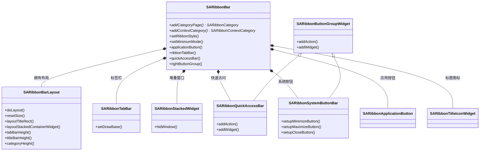

### 业务流程

Ribbon 风格切换是 SARibbonBar 最核心的业务流程。当调用 `setRibbonStyle()` 时，整个 Ribbon 栏会重新计算布局：

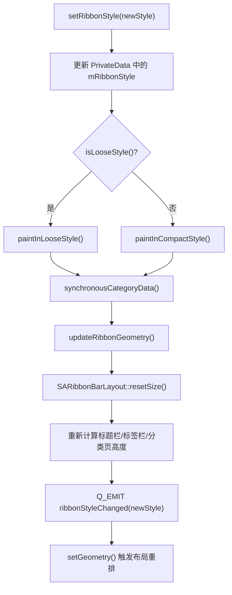

风格由两个正交维度组合而成：

| | ThreeRow（三行） | TwoRow（两行） | SingleRow（单行） |
|---|---|---|---|
| **Loose（宽松）** | `RibbonStyleLooseThreeRow` | `RibbonStyleLooseTwoRow` | `RibbonStyleLooseSingleRow` |
| **Compact（紧凑）** | `RibbonStyleCompactThreeRow` | `RibbonStyleCompactTwoRow` | `RibbonStyleCompactSingleRow` |

- **Loose vs Compact**：Loose 使用独立的标题栏区域（Office 风格），Compact 将 Tab 放在标题栏内（WPS 风格），节省高度
- **ThreeRow vs TwoRow vs SingleRow**：决定面板内小按钮的排列行数，ThreeRow 最大，SingleRow 最小

### 核心 API 表

| 方法 | 说明 | 关键参数 |
|------|------|----------|
| `addCategoryPage(title)` | 添加分类页 | 返回新建的 Category 指针 |
| `insertCategoryPage(title, index)` | 在指定位置插入分类页 | index 为 Tab 索引 |
| `addContextCategory(title, color, id)` | 添加上下文标签组 | color 为高亮颜色 |
| `showContextCategory(context)` | 显示上下文标签 | 将 Tab 页签添加到 TabBar |
| `setMinimumMode(bool)` | 切换最小化模式 | true=只显示Tab，隐藏面板 |
| `setRibbonStyle(style)` | 设置 Ribbon 风格 | 触发完整布局重算 |
| `iterateCategory(fp)` | 遍历所有分类页 | fp 返回 false 停止 |
| `iteratePanel(fp)` | 遍历所有面板 | 跨分类页遍历 |
| `allActions()` | 获取所有面板中的 Action | 用于自定义系统 |

### 内部状态管理

| 状态变量 | 类型 | 默认值 | 说明 |
|----------|------|--------|------|
| `mRibbonStyle` | `RibbonStyles` | `RibbonStyleLooseThreeRow` | 当前 Ribbon 风格 |
| `mCurrentRibbonMode` | `RibbonMode` | `NormalRibbonMode` | 正常/最小化模式 |
| `mRibbonAlignment` | `SARibbonAlignment` | `AlignLeft` | Tab 和面板对齐方式 |
| `mTitleAligment` | `Qt::Alignment` | `AlignCenter` | 标题文字对齐 |
| `mIsTitleVisible` | `bool` | `true` | 标题栏是否可见 |
| `mEnableWordWrap` | `bool` | `true` | 按钮文字是否换行 |
| `mTabBarBaseLineColor` | `QColor` | `(186,201,219)` | TabBar 底线颜色 |
| `mCurrentShowingContextCategory` | `QList` | 空 | 当前显示的上下文标签 |
| `mHidedCategory` | `QList` | 空 | 被隐藏的分类页数据 |

### 修改指南

- **安全区域**：添加新的信号、添加新的 Q_PROPERTY、修改 `paintEvent` 中的绘制逻辑、调整 PrivateData 中的默认值
- **谨慎区域**：修改 `setRibbonStyle()` 的逻辑（影响所有风格）、修改 `onCurrentRibbonTabChanged()`（影响 Tab 切换）、修改 `SARibbonBarLayout::doLayout()`（影响整体布局）
- **禁止修改**：`SARibbonBar` 与 `SARibbonMainWindow` 的 `friend class` 关系（涉及初始化链路）

---

## SARibbonCategory 模块

### 模块概述

SARibbonCategory 继承自 `QFrame`，代表 Ribbon 中的一个标签页（Tab）。每个 Category 包含多个 SARibbonPanel，通过 `SARibbonCategoryLayout` 进行水平排列。Category 支持内容超出宽度时的滚动和动画效果。

**在系统中的位置**：位于 SARibbonBar 之下，SARibbonPanel 之上。由 SARibbonBar 创建和管理，一个 Tab 对应一个 Category。

**关键文件**：`SARibbonCategory.h/.cpp`、`SARibbonCategoryLayout.h/.cpp`

### 文件结构表

| 文件 | 类 | 职责 |
|------|---|------|
| `SARibbonCategory.h/.cpp` | `SARibbonCategory` | 分类页核心：面板管理、属性传递、滚动控制 |
| `SARibbonCategory.h/.cpp` | `SARibbonCategoryScrollButton` | 滚动按钮：内容超出宽度时的左右箭头 |
| `SARibbonCategoryLayout.h/.cpp` | `SARibbonCategoryLayout` | 分类页布局：面板水平排列、滚动位置、动画 |
| `SARibbonCategoryLayout.h/.cpp` | `SARibbonCategoryLayoutItem` | 布局项：包装面板及其分隔线 |
| `SARibbonSeparatorWidget.h/.cpp` | `SARibbonSeparatorWidget` | 面板分隔线 |

### 核心类关系

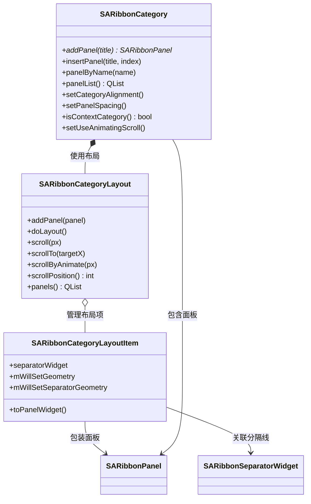

### 业务流程

面板添加到 Category 的流程：

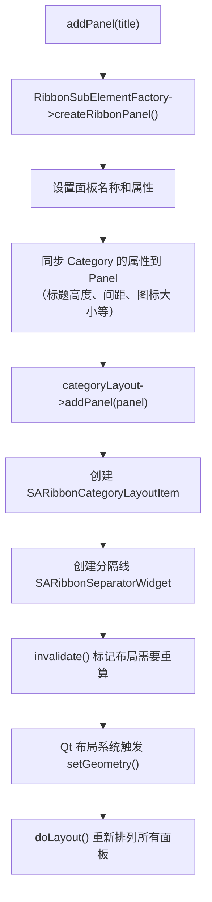

滚动是 Category 的一个关键特性。当面板总宽度超出 Category 可用宽度时，左右滚动按钮会出现。`SARibbonCategoryLayout` 管理滚动位置，支持平滑动画：

- `scroll(px)` — 立即滚动指定像素
- `scrollByAnimate(px)` — 使用 QPropertyAnimation 平滑滚动
- `scrollPosition` 属性 — 当前滚动偏移量，支持 QSS 动画

### 核心 API 表

| 方法 | 说明 | 返回值 |
|------|------|--------|
| `addPanel(title)` | 创建并添加面板 | 新面板指针 |
| `insertPanel(title, index)` | 在指定位置插入面板 | 新面板指针 |
| `panelByName(title)` | 按名称查找面板 | 面板指针或 nullptr |
| `panelByObjectName(objname)` | 按 objectName 查找 | 面板指针或 nullptr |
| `movePanel(from, to)` | 移动面板位置 | void |
| `removePanel(panel)` | 移除并删除面板 | bool |
| `takePanel(panel)` | 脱离管理但不删除 | bool |
| `iteratePanel(fp)` | 遍历所有面板 | bool（false=停止） |
| `updateItemGeometry()` | 刷新布局 | void |

### 内部状态管理

| 状态变量 | 类型 | 默认值 | 说明 |
|----------|------|--------|------|
| `enableShowPanelTitle` | `bool` | `true` | 是否显示面板标题 |
| `panelTitleHeight` | `int` | `15` | 面板标题高度 |
| `isContextCategory` | `bool` | `false` | 是否为上下文标签 |
| `isCanCustomize` | `bool` | `true` | 是否允许自定义 |
| `panelSpacing` | `int` | `0` | 面板间距 |

### 修改指南

- **安全区域**：添加新的 Q_PROPERTY、修改 `wheelEvent` 的滚动行为、调整 `sizeHint()` 计算
- **谨慎区域**：修改 `SARibbonCategoryLayout::doLayout()` 的面板排列逻辑、修改滚动动画参数
- **禁止修改**：`markIsContextCategory()` 的调用时机（由 SARibbonBar 和 SARibbonContextCategory 控制）

---

## SARibbonPanel 模块

### 模块概述

SARibbonPanel 继承自 `QFrame`，是 Ribbon 面板容器，负责在 Category 内组织和管理按钮。面板根据布局模式（ThreeRow/TwoRow/SingleRow）自动将 QAction 排列成大按钮和小按钮的组合。面板支持 Option 按钮（右下角的小按钮，点击后弹出更多选项）。

**在系统中的位置**：位于 SARibbonCategory 之下，SARibbonToolButton 之上。

**关键文件**：`SARibbonPanel.h/.cpp`、`SARibbonPanelLayout.h/.cpp`、`SARibbonPanelItem.h/.cpp`、`SARibbonPanelOptionButton.h/.cpp`

### 文件结构表

| 文件 | 类 | 职责 |
|------|---|------|
| `SARibbonPanel.h/.cpp` | `SARibbonPanel` | 面板核心：Action 添加、布局模式、属性管理 |
| `SARibbonPanel.h/.cpp` | `SARibbonPanelLabel` | 面板标题标签（支持 QSS） |
| `SARibbonPanelLayout.h/.cpp` | `SARibbonPanelLayout` | 面板布局：按行占比排列按钮、标题和 Option 按钮 |
| `SARibbonPanelItem.h/.cpp` | `SARibbonPanelItem` | 布局项：记录 Action 的行占比和 Widget 指针 |
| `SARibbonPanelOptionButton.h/.cpp` | `SARibbonPanelOptionButton` | Option 按钮：面板右下角的更多选项按钮 |

### 核心类关系

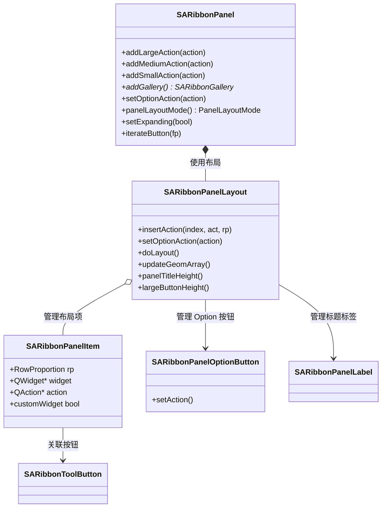

### 业务流程

添加 Action 到面板的核心流程：

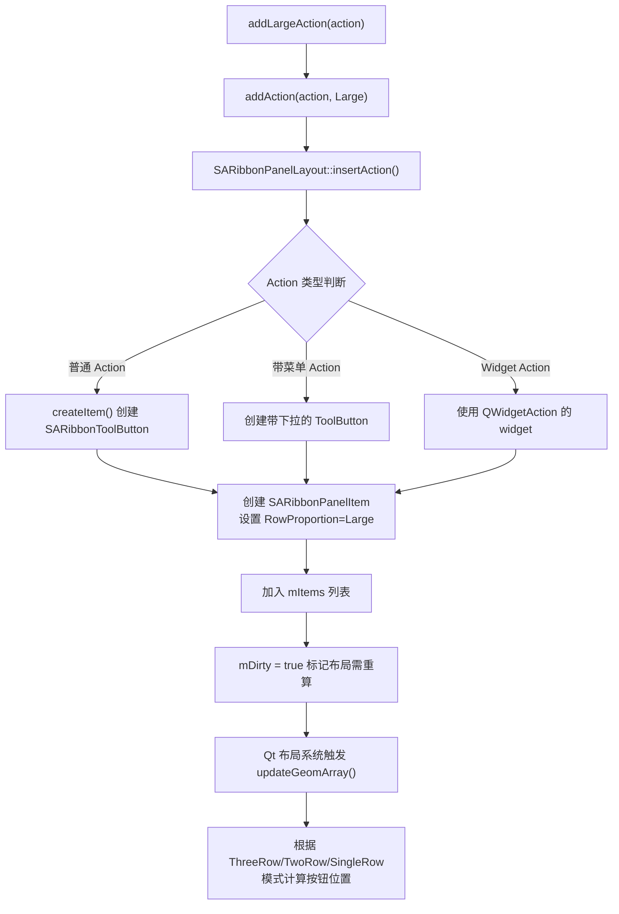

面板的布局模式决定了小按钮的排列方式：

- **ThreeRowMode**：小按钮排 3 行（每列 3 个），中按钮排 2 行，大按钮占满高度
- **TwoRowMode**：小按钮和中按钮都排 2 行，大按钮占满高度
- **SingleRowMode**：所有按钮排 1 行，面板标题默认隐藏

### 核心 API 表

| 方法 | 说明 | 参数 |
|------|------|------|
| `addLargeAction(action)` | 添加大按钮 | 创建全高按钮 |
| `addMediumAction(action)` | 添加中按钮 | ThreeRow 下占 2 行 |
| `addSmallAction(action)` | 添加小按钮 | 占 1 行 |
| `addGallery(expanding)` | 添加 Gallery 控件 | expanding=true 时水平扩展 |
| `setOptionAction(action)` | 设置 Option 按钮 | nullptr 则移除 |
| `addWidget(w, rp)` | 添加自定义控件 | rp 指定行占比 |
| `addSeparator()` | 添加分隔线 | 返回 Action 指针 |
| `actionToRibbonToolButton(action)` | 获取 Action 对应的按钮 | 返回按钮或 nullptr |

### 内部状态管理

| 状态变量 | 类型 | 默认值 | 说明 |
|----------|------|--------|------|
| `mDirty` | `bool` | `true` | 布局是否需要重算 |
| `mColumnCount` | `int` | `0` | 当前列数 |
| `mTitleHeight` | `int` | `15` | 标题区域高度 |
| `mEnableShowTitle` | `bool` | `true` | 是否显示标题 |
| `mSmallToolButtonIconSize` | `QSize` | `(22,22)` | 小按钮图标尺寸 |
| `mLargeToolButtonIconSize` | `QSize` | `(32,32)` | 大按钮图标尺寸 |
| `mEnableWordWrap` | `bool` | `true` | 文字是否换行 |
| `mButtonMaximumAspectRatio` | `qreal` | `1.4` | 按钮最大宽高比 |

### 修改指南

- **安全区域**：添加新的 `addXxxAction()` 便捷方法、调整 `SARibbonPanelItem::RowProportion` 枚举、修改 `sizeHint()` 计算
- **谨慎区域**：修改 `SARibbonPanelLayout::updateGeomArray()` 的列计算逻辑、修改 `mButtonMaximumAspectRatio` 的默认值
- **禁止修改**：`SARibbonPanelLayout::addItem()` 中的 `Q_DECL_OVERRIDE`（SARibbonPanelLayout 不支持直接 addItem，必须通过 insertAction）

---

## SARibbonToolButton 模块

### 模块概述

SARibbonToolButton 继承自 `QToolButton`，是 Ribbon 界面中的按钮控件。它支持大按钮（LargeButton）和小按钮（SmallButton）两种显示模式，图标尺寸根据按钮尺寸动态调整。大按钮模式下支持文字自动换行以优化空间利用。布局计算通过策略模式委托给 `SARibbonButtonLayoutStrategy`。

**在系统中的位置**：位于 SARibbonPanel 之下，是最底层的用户交互控件。

**关键文件**：`SARibbonToolButton.h/.cpp`、`SARibbonButtonLayoutStrategy.h/.cpp`

### 文件结构表

| 文件 | 类 | 职责 |
|------|---|------|
| `SARibbonToolButton.h/.cpp` | `SARibbonToolButton` | 按钮核心：绘制、事件处理、类型切换 |
| `SARibbonButtonLayoutStrategy.h/.cpp` | `SARibbonButtonLayoutStrategy` | 抽象策略基类：布局计算接口 |
| `SARibbonButtonLayoutStrategy.h/.cpp` | `SARibbonLargeButtonLayoutStrategy` | 大按钮布局策略 |
| `SARibbonButtonLayoutStrategy.h/.cpp` | `SARibbonSmallButtonLayoutStrategy` | 小按钮布局策略 |
| `SARibbonButtonLayoutStrategy.h/.cpp` | `SARibbonButtonLayoutStrategyFactory` | 策略工厂 |
| `SARibbonButtonLayoutStrategy.h/.cpp` | `SARibbonButtonLayoutRects` | 布局矩形集合（icon/text/indicator） |
| `SARibbonButtonLayoutStrategy.h/.cpp` | `SARibbonButtonLayoutContext` | 布局上下文（间距/图标尺寸/系数） |

### 核心类关系

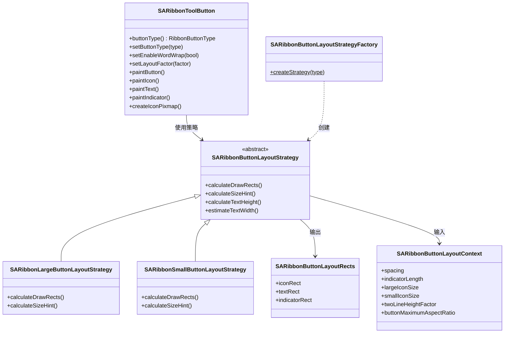

### 业务流程

按钮绘制流程（每次 `paintEvent` 触发）：

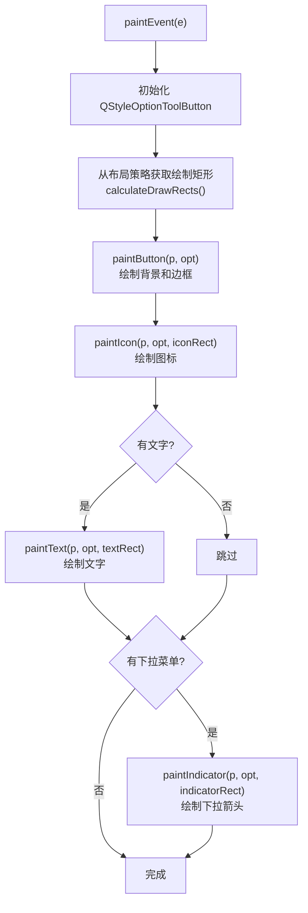

绘制扩展点：`paintButton()`、`paintIcon()`、`paintText()` 和 `paintIndicator()` 都是虚方法，子类可以重写任意一个来定制外观。`createIconPixmap()` 也是一个扩展点，允许子类自定义图标的绘制方式。

### 核心 API 表

| 方法 | 说明 | 备注 |
|------|------|------|
| `setButtonType(type)` | 设置大/小按钮模式 | 触发布局重算 |
| `setEnableWordWrap(bool)` | 启用/禁用文字换行 | 仅大按钮有效 |
| `setLayoutFactor(factor)` | 设置布局系数 | 微调按钮外观 |
| `setButtonMaximumAspectRatio(v)` | 设置最大宽高比 | 默认 1.4 |
| `updateRect()` | 强制更新内部布局矩形 | 参数变化后调用 |
| `invalidateSizeHint()` | 使缓存的 sizeHint 失效 | 触发重新计算 |
| `paintButton()` | 虚方法：绘制背景 | 扩展点 |
| `paintIcon()` | 虚方法：绘制图标 | 扩展点 |
| `paintText()` | 虚方法：绘制文字 | 扩展点 |
| `createIconPixmap()` | 虚方法：创建图标 pixmap | 扩展点 |

### 布局系数说明

`SARibbonToolButton::LayoutFactor` 结构体提供了微调按钮外观的系数：

| 系数 | 默认值 | 说明 | 调整效果 |
|------|--------|------|----------|
| `twoLineHeightFactor` | 2.05 | 两行文本高度系数 | 增大→文字区域更高，图标更小 |
| `oneLineHeightFactor` | 1.2 | 单行文本高度系数 | 增大→文字行高更大 |
| `buttonMaximumAspectRatio` | 1.4 | 最大宽高比 | 增大→按钮可以更宽 |

### 修改指南

- **安全区域**：重写 `paintButton()`/`paintIcon()`/`paintText()` 虚方法、调整 `LayoutFactor` 系数、添加新的按钮类型枚举值
- **谨慎区域**：修改 `SARibbonLargeButtonLayoutStrategy::calculateDrawRects()` 的矩形计算逻辑、修改 `sizeHint()` 的计算
- **禁止修改**：`SARibbonToolButton` 的 `setIconSize()` 不应被调用（图标尺寸是动态计算的）

---

## Gallery 体系

### 模块概述

Gallery 体系实现类似 Office 中的下拉选择列表（如"样式库"）。它由三层组成：`SARibbonGallery` 是顶层容器，`SARibbonGalleryGroup` 是一个选项组（继承 QListView），`SARibbonGalleryItem` 是单个选项项。弹出视口 `SARibbonGalleryViewport` 在用户点击"更多"时展示所有选项组。

**在系统中的位置**：嵌入在 SARibbonPanel 内，通过 `SARibbonPanel::addGallery()` 创建。

**关键文件**：`SARibbonGallery.h/.cpp`、`SARibbonGalleryGroup.h/.cpp`、`SARibbonGalleryItem.h/.cpp`

### 文件结构表

| 文件 | 类 | 职责 |
|------|---|------|
| `SARibbonGallery.h/.cpp` | `SARibbonGallery` | Gallery 容器：管理选项组和弹出视口 |
| `SARibbonGallery.h/.cpp` | `SARibbonGalleryButton` | Gallery 的上下翻页按钮 |
| `SARibbonGallery.h/.cpp` | `SARibbonGalleryViewport` | 弹出视口：展示所有选项组 |
| `SARibbonGalleryGroup.h/.cpp` | `SARibbonGalleryGroup` | 选项组：继承 QListView，管理选项 |
| `SARibbonGalleryGroup.h/.cpp` | `SARibbonGalleryGroupModel` | 选项组的 Model（QAbstractListModel） |
| `SARibbonGalleryGroup.h/.cpp` | `SARibbonGalleryGroupItemDelegate` | 选项组的绘制代理 |
| `SARibbonGalleryItem.h/.cpp` | `SARibbonGalleryItem` | 单个选项项：包含 Action 和显示属性 |

### 核心类关系

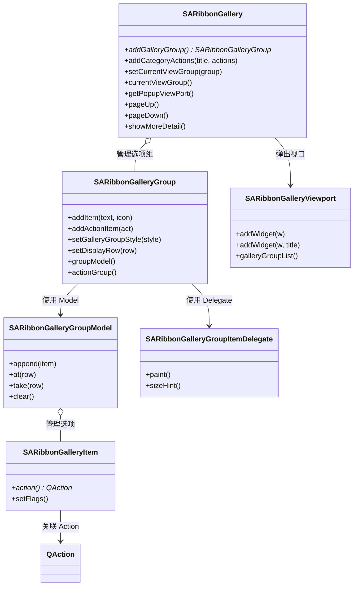

### 业务流程

Gallery 的典型使用流程——以 Office 的"样式库"为例：

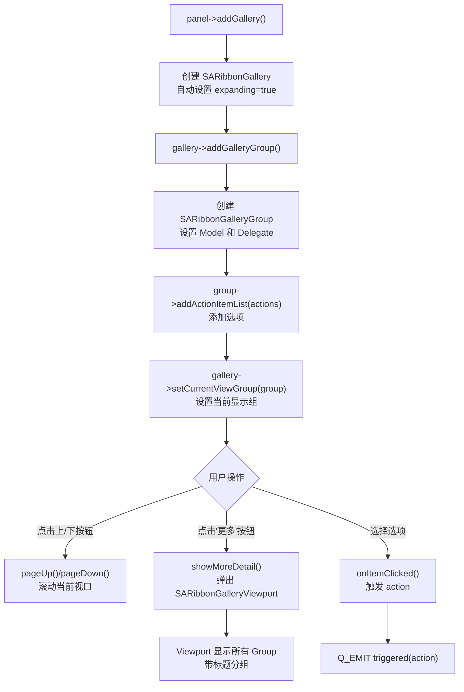

### 核心 API 表

**SARibbonGallery:**

| 方法 | 说明 |
|------|------|
| `addGalleryGroup()` | 创建并添加空白选项组 |
| `addCategoryActions(title, actions)` | 快速创建带标题的选项组 |
| `setCurrentViewGroup(group)` | 设置当前显示的选项组 |
| `setSingleRowMode(on)` | 设置单行显示模式 |
| `pageUp()/pageDown()` | 翻页操作 |
| `showMoreDetail()` | 弹出详细视口 |

**SARibbonGalleryGroup:**

| 方法 | 说明 |
|------|------|
| `setGalleryGroupStyle(style)` | 设置显示样式（IconOnly/IconWithText/IconWithWordWrapText） |
| `setDisplayRow(row)` | 设置显示行数（1-3行） |
| `addItem(text, icon)` | 添加选项 |
| `addActionItem(act)` | 添加 Action 作为选项 |
| `setGridMinimumWidth(w)` | 设置网格最小宽度 |
| `recalcGridSize()` | 重新计算网格尺寸 |

### 内部状态管理

| 状态变量 | 所属类 | 说明 |
|----------|--------|------|
| 当前显示的 Group | `SARibbonGallery` | 通过 `setCurrentViewGroup` 设置 |
| Group 列表 | `SARibbonGallery` | 所有添加的选项组 |
| 弹出视口 | `SARibbonGalleryViewport` | 惰性创建，首次 `showMoreDetail` 时初始化 |
| QActionGroup | `SARibbonGalleryGroup` | 管理所有 Action 的互斥选择 |
| 显示样式 | `SARibbonGalleryGroup` | IconOnly/IconWithText/IconWithWordWrapText |
| 显示行数 | `SARibbonGalleryGroup` | 1-3 行 |

### 修改指南

- **安全区域**：修改 `SARibbonGalleryGroupItemDelegate::paint()` 的绘制逻辑、添加新的 `GalleryGroupStyle`、修改弹出视口的外观
- **谨慎区域**：修改 `SARibbonGalleryGroupModel` 的数据管理逻辑、修改 `SARibbonGalleryViewport` 的尺寸计算
- **禁止修改**：`SARibbonGalleryGroup` 的 `QListView` 继承关系（改为其他基类会破坏 Model/View 体系）

---

## 自定义系统

### 模块概述

自定义系统允许用户在运行时修改 Ribbon 的布局——添加/删除/重排 Tab 页和面板，将 Action 从一个面板移到另一个。修改结果可以序列化为 XML 文件保存，下次启动时自动加载。整个自定义过程是基于"步骤"（SARibbonCustomizeData）的，每一步描述一个原子操作。

**在系统中的位置**：独立于核心 UI 层级，通过操作 SARibbonBar 和 SARibbonPanel 的接口来实现自定义。

**关键文件**：`SARibbonCustomizeWidget.h/.cpp`、`SARibbonCustomizeDialog.h/.cpp`、`SARibbonActionsManager.h/.cpp`、`SARibbonCustomizeData.h/.cpp`

### 文件结构表

| 文件 | 类 | 职责 |
|------|---|------|
| `SARibbonCustomizeWidget.h/.cpp` | `SARibbonCustomizeWidget` | 自定义界面 Widget：树形显示 Ribbon 结构 |
| `SARibbonCustomizeDialog.h/.cpp` | `SARibbonCustomizeDialog` | 自定义对话框：包装 CustomizeWidget |
| `SARibbonActionsManager.h/.cpp` | `SARibbonActionsManager` | Action 管理器：注册/标签/搜索 |
| `SARibbonActionsManager.h/.cpp` | `SARibbonActionsManagerModel` | Action 管理器的 ListModel |
| `SARibbonCustomizeData.h/.cpp` | `SARibbonCustomizeData` | 自定义步骤数据：描述一个原子操作 |

### 核心类关系

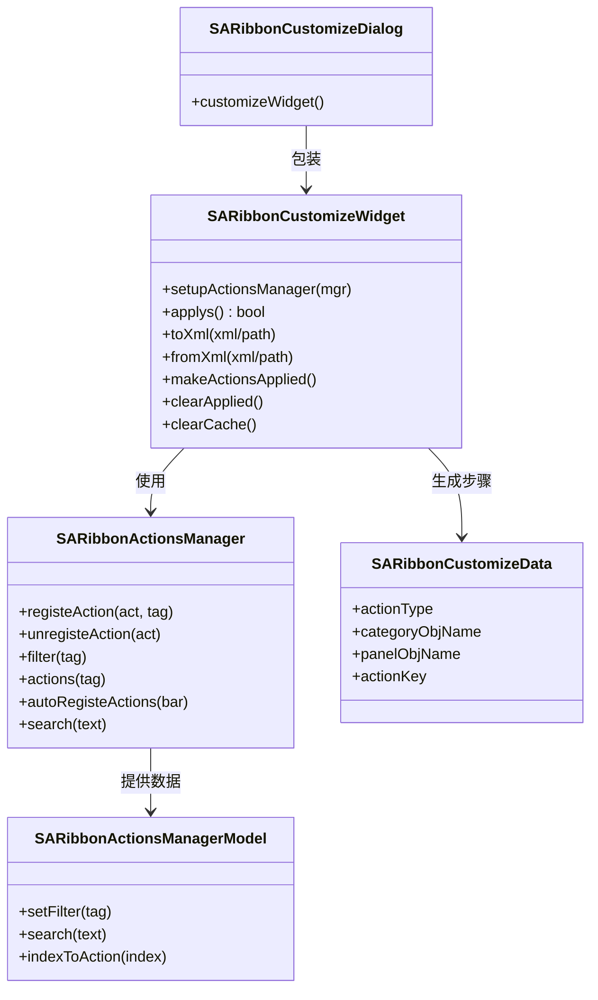

### 业务流程

自定义操作的完整工作流：

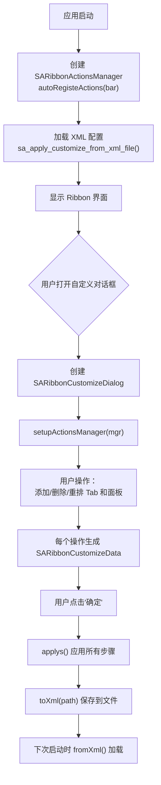

步骤的序列化格式（XML）支持以下操作类型：

- 添加/删除/重命名 Category
- 添加/删除/重命名 Panel
- 在 Panel 中添加/移除 Action
- 移动 Category/Panel 的位置

### 核心 API 表

**SARibbonCustomizeWidget:**

| 方法 | 说明 |
|------|------|
| `setupActionsManager(mgr)` | 关联 Action 管理器 |
| `applys()` | 应用所有自定义步骤 |
| `toXml(path)` | 序列化到 XML 文件 |
| `fromXml(path)` | 从 XML 文件加载 |
| `makeActionsApplied()` | 标记已应用的步骤 |
| `clear()` | 清除所有步骤 |

**SARibbonActionsManager:**

| 方法 | 说明 |
|------|------|
| `registeAction(act, tag, key)` | 注册 Action |
| `autoRegisteActions(bar)` | 自动注册 Bar 中的所有 Action |
| `filter(tag)` | 按标签过滤 |
| `search(text)` | 按文字搜索 |
| `action(key)` | 通过 key 获取 Action |

### 内部状态管理

| 状态变量 | 所属类 | 说明 |
|----------|--------|------|
| Action 注册表 | `SARibbonActionsManager` | key -> QAction* 的映射 |
| 标签到 Action 列表 | `SARibbonActionsManager` | tag -> QList<QAction*> |
| 自定义步骤列表 | `SARibbonCustomizeWidget` | QList<SARibbonCustomizeData> |
| 已应用步骤 | `SARibbonCustomizeWidget` | 标记哪些步骤已经生效 |
| Ribbon 树 Model | `SARibbonCustomizeWidget` | QStandardItemModel |

### 修改指南

- **安全区域**：修改 `SARibbonCustomizeWidget` 的 UI 布局、添加新的 `ActionTag` 标签类型、扩展 XML 格式
- **谨慎区域**：修改 `SARibbonCustomizeData` 的序列化格式（会导致旧配置文件不兼容）、修改 `sa_customize_datas_apply()` 的应用逻辑
- **禁止修改**：`SARibbonCustomizeWidget` 中 `ItemRole` 枚举的数值（与 QStandardItem 的 Role 对应，改变会破坏数据读取）

---

## 工厂与管理器

### 模块概述

工厂模块由 `SARibbonElementFactory`（工厂类）和 `SARibbonElementManager`（单例管理器）组成。工厂定义了 17 个虚方法，覆盖所有 Ribbon 子组件的创建。管理器持有工厂实例，提供全局单例访问。这种设计允许用户通过继承工厂类来替换任意子组件的实现，而无需修改框架代码。

**在系统中的位置**：基础设施层，被所有 UI 模块间接使用。

**关键文件**：`SARibbonElementFactory.h/.cpp`、`SARibbonElementManager.h/.cpp`

### 文件结构表

| 文件 | 类 | 职责 |
|------|---|------|
| `SARibbonElementFactory.h/.cpp` | `SARibbonElementFactory` | 工厂类：17 个虚创建方法 |
| `SARibbonElementManager.h/.cpp` | `SARibbonElementManager` | 单例管理器：持有和访问工厂 |

### 核心类关系

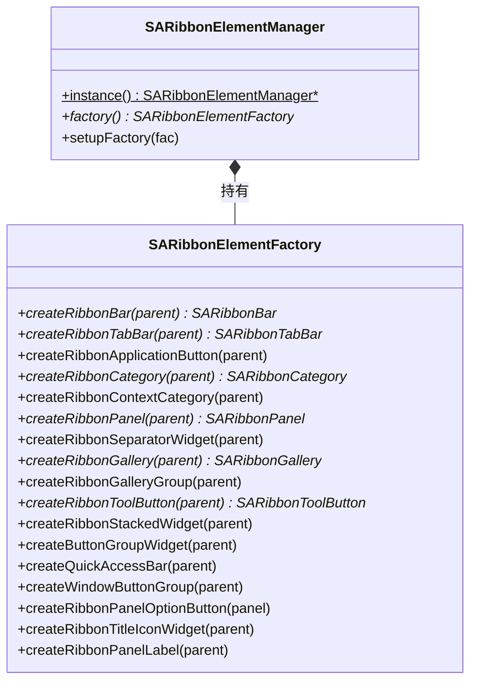

### 业务流程

工厂的使用流程和组件创建链路：

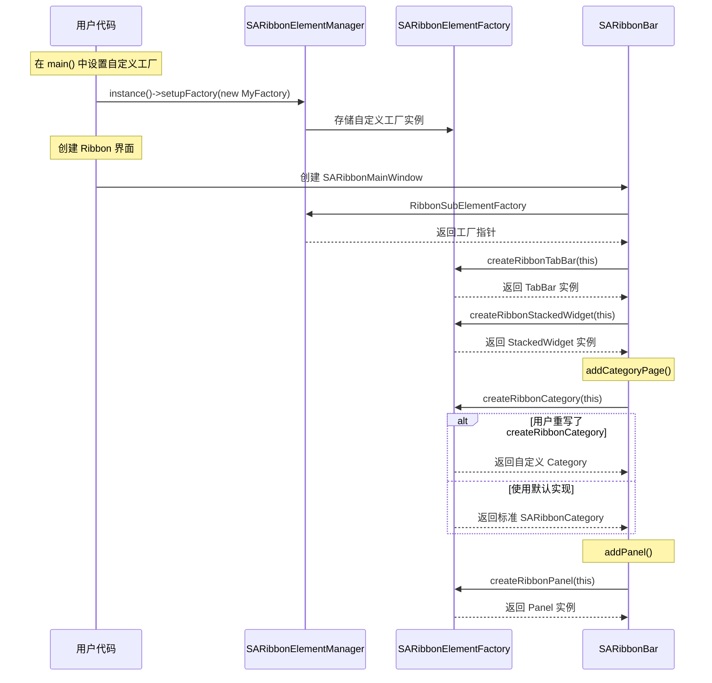

### 17 个工厂方法一览

| 方法 | 创建的组件 | 典型重写场景 |
|------|-----------|-------------|
| `createRibbonBar` | `SARibbonBar` | 自定义整体 Ribbon 行为 |
| `createRibbonTabBar` | `SARibbonTabBar` | 自定义 Tab 外观 |
| `createRibbonApplicationButton` | `SARibbonApplicationButton` | 自定义应用按钮 |
| `createRibbonCategory` | `SARibbonCategory` | 自定义分类页行为 |
| `createRibbonContextCategory` | `SARibbonContextCategory` | 自定义上下文标签 |
| `createRibbonPanel` | `SARibbonPanel` | 自定义面板外观/行为 |
| `createRibbonSeparatorWidget` | `SARibbonSeparatorWidget` | 自定义分隔线样式 |
| `createRibbonGallery` | `SARibbonGallery` | 自定义 Gallery 控件 |
| `createRibbonGalleryGroup` | `SARibbonGalleryGroup` | 自定义选项组 |
| `createRibbonToolButton` | `SARibbonToolButton` | 自定义按钮绘制 |
| `createRibbonStackedWidget` | `SARibbonStackedWidget` | 自定义页面切换动画 |
| `createButtonGroupWidget` | `SARibbonButtonGroupWidget` | 自定义按钮组 |
| `createQuickAccessBar` | `SARibbonQuickAccessBar` | 自定义快速访问栏 |
| `createWindowButtonGroup` | `SARibbonSystemButtonBar` | 自定义系统按钮 |
| `createRibbonPanelOptionButton` | `SARibbonPanelOptionButton` | 自定义 Option 按钮 |
| `createRibbonTitleIconWidget` | `SARibbonTitleIconWidget` | 自定义标题图标 |
| `createRibbonPanelLabel` | `SARibbonPanelLabel` | 自定义面板标签 |

### 核心 API 表

**SARibbonElementManager:**

| 方法 | 说明 | 线程安全 |
|------|------|----------|
| `instance()` | 获取单例实例 | 是（Meyers 单例） |
| `factory()` | 获取当前工厂 | 是 |
| `setupFactory(fac)` | 设置自定义工厂 | 否（应在主线程初始化时调用） |

**便捷宏：**

| 宏 | 展开 | 用途 |
|---|------|------|
| `RibbonSubElementMgr` | `SARibbonElementManager::instance()` | 获取管理器 |
| `RibbonSubElementFactory` | `SARibbonElementManager::instance()->factory()` | 获取工厂 |

### 内部状态管理

| 状态变量 | 所属类 | 说明 |
|----------|--------|------|
| `mFactory` | `SARibbonElementManager` | QScopedPointer 管理的工厂实例 |

### 修改指南

- **安全区域**：在 `SARibbonElementFactory` 中添加新的虚创建方法、重写现有方法返回自定义类型
- **谨慎区域**：修改现有工厂方法的默认实现（影响所有未重写的用户）、修改 `SARibbonElementManager` 的单例模式
- **禁止修改**：删除或重命名现有的 17 个工厂方法（破坏 ABI 兼容性）

## 延伸阅读

| 文档 | 内容 |
|------|------|
| [新贡献者开发指南](./developer-guide.md) | 环境搭建、开发工作流、代码模板 |
| [架构设计文档](./architecture.md) | 整体架构分析、设计决策 |
| [编码规范](./coding-standards.md) | 命名规范、注释规范 |
| [PIMPL 开发规范](./pimpl-dev-guide.md) | PIMPL 宏完整用法 |
| [Qt 集成规范](./qt-integration.md) | Q_PROPERTY、信号槽 |
