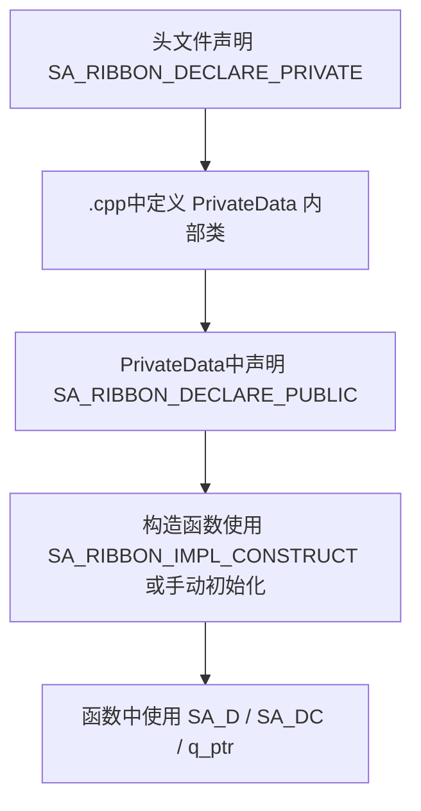

# PIMPL开发规范

SARibbon使用PIMPL（Private Implementation）模式，将实现细节封装在 `PrivateData` 内部类中，对外提供接口在 `public` 成员中。本文档详细说明 SARibbon 的 PIMPL 宏使用方式和代码规范。

## 为什么需要这个规范

PIMPL模式是 Qt 项目的常见实践，它可以：

- **隐藏实现细节**：减少头文件编译依赖，加快编译速度
- **保持ABI稳定**：修改私有成员不影响二进制兼容性
- **封装内部数据**：公开接口清晰，私有实现自由变更

## PIMPL宏说明

SARibbon的PIMPL模式所需的宏位于 `src/SARibbonBar/SARibbonGlobal.h`，主要涉及以下宏：

### SA_RIBBON_DECLARE_PRIVATE

在类中声明PIMPL的私有成员，它会生成：

- 内部类 `PrivateData` 的前置声明
- 互为友元的声明
- `std::unique_ptr<PrivateData> d_ptr` 成员变量

宏定义（SARibbonGlobal.h:83-88）：

```cpp
#define SA_RIBBON_DECLARE_PRIVATE(classname)                                                                           \
    class PrivateData;                                                                                                 \
    friend class classname::PrivateData;                                                                               \
    std::unique_ptr< PrivateData > d_ptr;
```

使用方式——在头文件类中，紧跟 `Q_OBJECT` 之后声明：

```cpp
class SA_RIBBON_EXPORT SARibbonCategory : public QFrame
{
    Q_OBJECT
    SA_RIBBON_DECLARE_PRIVATE(SARibbonCategory)  // 生成 d_ptr 和 PrivateData 内部类前置声明
    friend class SARibbonBar;
    friend class SARibbonContextCategory;
    // ...
};
```

!!! warning "注意"
    `SA_RIBBON_DECLARE_PRIVATE` 使用 `std::unique_ptr<PrivateData>` 而非 Qt 的 `QScopedPointer` 或原始指针。这意味着 `PrivateData` 的析构必须在 `.cpp` 文件中可见，否则会编译错误。

### SA_RIBBON_DECLARE_PUBLIC

在内部类 `PrivateData` 中声明PIMPL的公有成员，它会生成：

- 互为友元的声明（允许 PrivateData 访问属主类的私有成员）
- `classname* q_ptr { nullptr }` 反向指针成员变量
- 删除拷贝构造和赋值运算符

宏定义（SARibbonGlobal.h:103-109）：

```cpp
#define SA_RIBBON_DECLARE_PUBLIC(classname)                                                                            \
    friend class classname;                                                                                            \
    classname* q_ptr { nullptr };                                                                                      \
    PrivateData(const PrivateData&)            = delete;                                                               \
    PrivateData& operator=(const PrivateData&) = delete;
```

使用方式——在 `.cpp` 文件的 `PrivateData` 类定义中声明：

```cpp
// SARibbonCategory.cpp
class SARibbonCategory::PrivateData
{
    SA_RIBBON_DECLARE_PUBLIC(SARibbonCategory)  // 生成 q_ptr 反向指针
public:
    PrivateData(SARibbonCategory* p);
    // 私有实现数据...
};
```

### SA_RIBBON_IMPL_CONSTRUCT

在构造函数初始化列表中快捷构建 `PrivateData` 的宏：

宏定义（SARibbonGlobal.h:122-124）：

```cpp
#define SA_RIBBON_IMPL_CONSTRUCT d_ptr(std::make_unique< PrivateData >(this))
```

等效展开为：

```cpp
SARibbonCategory::SARibbonCategory(QWidget* p)
    : QFrame(p), d_ptr(std::make_unique<PrivateData>(this))
{
}
```

### SA_D 和 SA_DC

用于获取 `d_ptr` 指针的便捷宏：

- **SA_D**：在非const函数中获取 `PrivateData*`
- **SA_DC**：在const函数中获取 `const PrivateData*`

宏定义（SARibbonGlobal.h:137-154）：

```cpp
#define SA_D(pointerName) PrivateData* pointerName = d_ptr.get()
#define SA_DC(pointerName) const PrivateData* pointerName = d_ptr.get()
```

使用示例（SARibbonBar.cpp:1493-1496）：

```cpp
void SARibbonBar::showMinimumModeButton(bool isShow)
{
    SA_D(d);  // 扩展为 PrivateData* d = d_ptr.get()
    if (isShow && !(d->mMinimumCategoryButtonAction)) {
        // 直接通过 d 访问私有成员
        d->mMinimumCategoryButtonAction = new QAction(this);
    }
}
```

SARibbonMainWindow.cpp:202-207 中的示例：

```cpp
SARibbonMainWindow::SARibbonMainWindow(QWidget* parent, SARibbonMainWindowStyles style, const Qt::WindowFlags flags)
    : QMainWindow(parent, flags), d_ptr(new SARibbonMainWindow::PrivateData(this))
{
    SA_D(d);  // 扩展为 PrivateData* d = d_ptr.get()
    d->mRibbonMainWindowStyle = style;
    d->checkMainWindowFlag();
}
```

### SA_Q 和 SA_QC

用于在 `PrivateData` 方法中获取 `q_ptr` 指针的便捷宏：

- **SA_Q**：获取 `q_ptr` 的非const指针
- **SA_QC**：获取 `q_ptr` 的const指针

宏定义（SARibbonGlobal.h:167-184）：

```cpp
#define SA_Q(pointerName) auto* pointerName = q_ptr
#define SA_QC(pointerName) const auto* pointerName = q_ptr
```

## 使用方法

### 完整PIMPL类结构

以下是 SARibbon 中使用 PIMPL 模式的完整类结构示例，基于 `SARibbonCategory` 真实代码：

**头文件 (.h) — SARibbonCategory.h：**

```cpp
/**
 * \if ENGLISH
 * @brief Ribbon category page containing multiple panels
 *
 * Each Category represents a tab page in the Ribbon, containing multiple panels (SARibbonPanel).
 * It acts as a container for organizing related actions and controls into logical groups.
 * \endif
 *
 * \if CHINESE
 * @brief 包含多个面板的Ribbon类别页面
 *
 * 每个Category代表Ribbon中的一个标签页，包含多个面板（SARibbonPanel）。
 * 它作为一个容器，用于将相关的操作和控件组织成逻辑组。
 * \endif
 */
class SA_RIBBON_EXPORT SARibbonCategory : public QFrame
{
    Q_OBJECT
    SA_RIBBON_DECLARE_PRIVATE(SARibbonCategory)  // PIMPL声明
    friend class SARibbonBar;
    friend class SARibbonContextCategory;

    // Q_PROPERTY 不加注释！
    Q_PROPERTY(bool isCanCustomize READ isCanCustomize WRITE setCanCustomize)
    Q_PROPERTY(QString categoryName READ categoryName WRITE setCategoryName)

public:
    /// Constructor
    explicit SARibbonCategory(QWidget* p = nullptr);
    /// Constructor with name
    explicit SARibbonCategory(const QString& name, QWidget* p = nullptr);
    // 省略...
};
```

**源文件 (.cpp) — SARibbonCategory.cpp：**

```cpp
class SARibbonCategory::PrivateData
{
    SA_RIBBON_DECLARE_PUBLIC(SARibbonCategory)  // 反向指针声明

public:
    PrivateData(SARibbonCategory* p);

    SARibbonPanel* addPanel(const QString& title);
    // ...其他辅助方法...

public:
    bool enableShowPanelTitle { true };             ///< 是否运行panel的标题栏显示
    int panelTitleHeight { 15 };                    ///< panel的标题栏默认高度
    bool isContextCategory { false };               ///< 标记是否是上下文标签
    bool isCanCustomize { true };                   ///< 标记是否可以自定义
    int panelSpacing { 0 };                         ///< panel的spacing
    // ...其他成员变量...
};

SARibbonCategory::PrivateData::PrivateData(SARibbonCategory* p) : q_ptr(p)
{
}

// 省略SARibbonCategory::PrivateData的函数实现

SARibbonCategory::SARibbonCategory(QWidget* p)
    : QFrame(p), d_ptr(std::make_unique<PrivateData>(this))  // SA_RIBBON_IMPL_CONSTRUCT
{
}

QString SARibbonCategory::categoryName() const
{
    // const函数中可使用 SA_DC(d) 获取只读指针
    // 此处为示例，实际代码也直接使用 d_ptr-> 或成员变量
    return windowTitle();
}

void SARibbonCategory::setCategoryName(const QString& title)
{
    // 非const函数中可使用 SA_D(d) 获取指针
    setWindowTitle(title);
    Q_EMIT categoryNameChanged(title);
}
```

### PIMPL使用流程



!!! warning "注意事项"
    - `SA_D` 用于非const函数，`SA_DC` 用于const函数，不可混用
    - 变量名使用 `d` 是惯例，也可以使用其他名称
    - `PrivateData` 类定义在 `.cpp` 文件中，不在头文件中声明——这样确保私有成员完全隐藏
    - `PrivateData` 使用 `///<` 行尾注释标记成员说明（如 `bool isContextCategory { false }; ///< 标记是否是上下文标签`）

**如果这个类使用了PIMPL，不要在类的头文件中出现私有成员变量的定义，私有成员变量都应该在`PrivateData`类中**

## 参考

- 相关规范：[Qt集成规范](qt-integration.md)、[代码风格与注释规范](coding-standards.md)
- 源码位置：`src/SARibbonBar/SARibbonGlobal.h`（包含所有PIMPL宏定义）