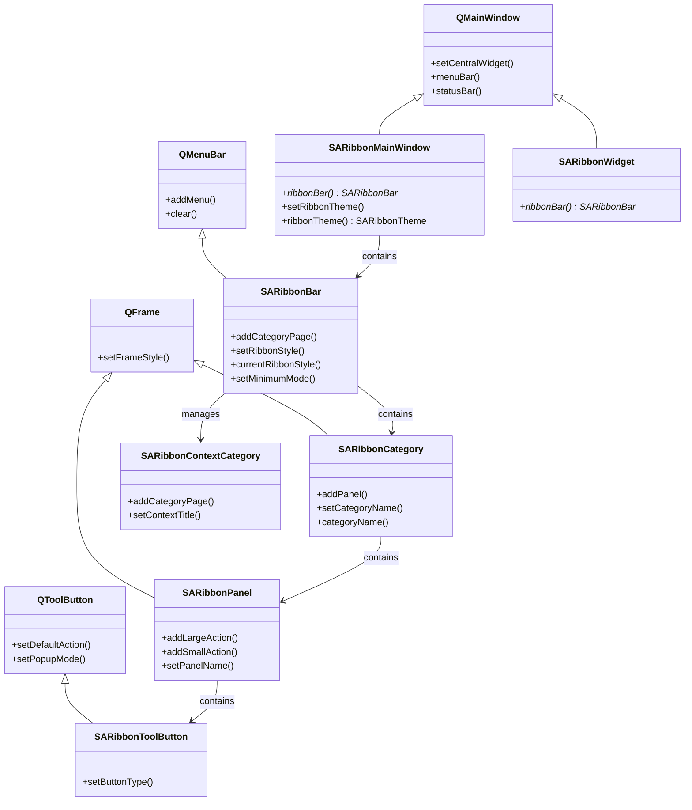
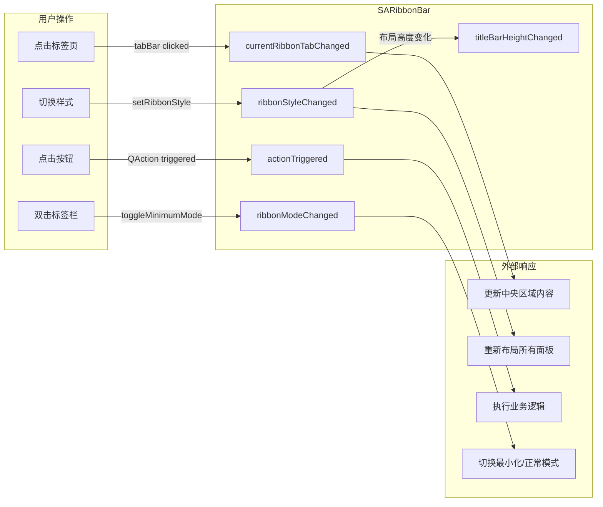

# Qt集成规范

- **原生继承**: 所有核心类直接继承 Qt Widgets 基类（QMainWindow、QMenuBar、QFrame、QToolButton），零外部依赖
- **信号槽驱动**: 所有 UI 交互通过 Qt 信号槽机制通讯，状态变化均触发对应 `*Changed` 信号
- **Q_PROPERTY 暴露**: 关键配置属性通过 Qt 元对象系统暴露，支持 QSS 样式设置和动态绑定
- **Qt 宏规范**: 强制使用 `Q_OBJECT`/`Q_SIGNALS`/`Q_SLOTS`/`Q_EMIT` 大写宏，兼容 `QT_NO_KEYWORDS` 编译
- **PIMPL 封装**: 核心类采用 `std::unique_ptr` + PIMPL 模式，ABI 稳定且编译隔离
- **枚举安全**: 布局风格、模式等通过 `Q_ENUM` 注册，支持 Qt 元对象反射和字符串转换

SARibbon是一个Qt Ribbon UI控件库，直接继承自Qt Widgets类（QMenuBar、QFrame、QToolButton等），为Qt应用程序提供类似Microsoft Office的Ribbon界面。本文档描述SARibbon如何与Qt框架集成。

## 核心类继承关系



## 核心信号流转

下图展示了用户操作触发信号在核心组件间的传播路径：



## 概述

SARibbon充分发挥Qt框架的信号槽机制、属性系统和元对象系统，所有UI交互都使用Qt原生的方式进行事件通讯。类继承关系如下：

- `SARibbonBar` 继承 `QMenuBar`
- `SARibbonCategory` 继承 `QFrame`
- `SARibbonPanel` 继承 `QFrame`
- `SARibbonToolButton` 继承 `QToolButton`
- `SARibbonMainWindow` 继承 `QMainWindow`

## 信号槽设计

### 设计原则

SARibbon充分发挥Qt信号槽机制，所有UI交互使用信号和槽进行事件通讯。每个重要的状态变化都触发对应的信号，使外部对象能够监听并响应。

### 信号命名规范

SARibbon的信号命名遵循Qt惯例，使用描述性名称反映事件类型：

| 信号 | 说明 |
|------|------|
| `currentRibbonTabChanged(int index)` | 标签页变化 |
| `ribbonModeChanged(SARibbonBar::RibbonMode nowState)` | Ribbon模式变化（最小化/正常） |
| `ribbonStyleChanged(SARibbonBar::RibbonStyles nowStyle)` | Ribbon样式变化 |
| `applicationButtonClicked()` | 应用按钮点击 |
| `actionTriggered(QAction* action)` | Action触发 |
| `titleBarHeightChanged(int oldHeight, int newHeight)` | 标题栏高度变化 |
| `categoryNameChanged(const QString& n)` | Category名称变化 |
| `panelNameChanged(const QString& n)` | Panel名称变化 |

### 实际代码示例

```cpp
class SA_RIBBON_EXPORT SARibbonBar : public QMenuBar
{
    Q_OBJECT
    // ...
Q_SIGNALS:
    /**
     * \if ENGLISH
     * @brief Application button click response - left upper corner button
     * \endif
     *
     * \if CHINESE
     * @brief 应用按钮点击响应 - 左上角的按钮
     * \endif
     */
    void applicationButtonClicked();

    /**
     * \if ENGLISH
     * @brief Signal triggered when tab page changes
     * @param index New tab index
     * \endif
     *
     * \if CHINESE
     * @brief 标签页变化触发的信号
     * @param index 新的标签页索引
     * \endif
     */
    void currentRibbonTabChanged(int index);

    /**
     * \if ENGLISH
     * @brief Signal triggered when ribbon state changes
     * @param nowState New ribbon state after change
     * \endif
     *
     * \if CHINESE
     * @brief ribbon的状态发生了变化后触发此信号
     * @param nowState 变更之后的ribbon状态
     * \endif
     */
    void ribbonModeChanged(SARibbonBar::RibbonMode nowState);

    /**
     * \if ENGLISH
     * @brief Signal triggered when ribbon style changes
     * @param nowStyle New ribbon style after change
     * \endif
     *
     * \if CHINESE
     * @brief ribbon的样式发生了变化后触发此信号
     * @param nowStyle 变更之后的ribbon样式
     * \endif
     */
    void ribbonStyleChanged(SARibbonBar::RibbonStyles nowStyle);

    /**
     * \if ENGLISH
     * @brief Signal triggered when title bar height changes
     * @param oldHeight Old title bar height
     * @param newHeight New title bar height
     * \endif
     *
     * \if CHINESE
     * @brief 标题栏高度发生了变化的信号
     * @param oldHeight 旧的标题栏高度
     * @param newHeight 新的标题栏高度
     * \endif
     */
    void titleBarHeightChanged(int oldHeight, int newHeight);

    /**
     * \if ENGLISH
     * @brief Signal triggered when an action is triggered (similar to QToolBar::actionTriggered)
     * @param action The triggered action
     * \endif
     *
     * \if CHINESE
     * @brief 参考QToolBar::actionTriggered的信号
     * @param action 触发的action
     * \endif
     */
    void actionTriggered(QAction* action);
};
```

## Q_PROPERTY属性暴露

### 设计原则

SARibbon的类使用 `Q_PROPERTY` 暴露配置属性，使属性可以通过Qt元对象系统（QMetaObject）访问，支持QSS样式设置和潜在的未来QML集成。

### 属性声明模式

**SARibbonBar中的属性：**

```cpp
class SA_RIBBON_EXPORT SARibbonBar : public QMenuBar
{
    Q_OBJECT
    Q_PROPERTY(RibbonStyles ribbonStyle READ currentRibbonStyle WRITE setRibbonStyle)
    Q_PROPERTY(bool minimumMode READ isMinimumMode WRITE setMinimumMode)
    Q_PROPERTY(QColor windowTitleTextColor READ windowTitleTextColor WRITE setWindowTitleTextColor)
    Q_PROPERTY(Qt::Alignment windowTitleAligment READ windowTitleAligment WRITE setWindowTitleAligment)
    Q_PROPERTY(bool enableWordWrap READ isEnableWordWrap WRITE setEnableWordWrap)
    Q_PROPERTY(SARibbonPanel::PanelLayoutMode panelLayoutMode READ panelLayoutMode WRITE setPanelLayoutMode)
    // ...
};
```

**SARibbonCategory中的属性：**

```cpp
class SA_RIBBON_EXPORT SARibbonCategory : public QFrame
{
    Q_OBJECT
    Q_PROPERTY(bool isCanCustomize READ isCanCustomize WRITE setCanCustomize)
    Q_PROPERTY(QString categoryName READ categoryName WRITE setCategoryName)
    // ...
};
```

**SARibbonPanel中的属性：**

```cpp
class SA_RIBBON_EXPORT SARibbonPanel : public QFrame
{
    Q_OBJECT
    Q_PROPERTY(bool isCanCustomize READ isCanCustomize WRITE setCanCustomize)
    Q_PROPERTY(bool isExpanding READ isExpanding WRITE setExpanding)
    Q_PROPERTY(QString panelName READ panelName WRITE setPanelName)
    // ...
};
```

**SARibbonMainWindow中的属性：**

```cpp
class SA_RIBBON_EXPORT SARibbonMainWindow : public QMainWindow
{
    Q_OBJECT
    Q_PROPERTY(SARibbonTheme ribbonTheme READ ribbonTheme WRITE setRibbonTheme)
    // ...
};
```

### 属性命名规范

SARibbon的属性命名遵循Qt惯例：

| 属性类型 | getter | setter | 信号 |
|----------|--------|--------|------|
| 通用属性（QColor等） | `windowTitleTextColor()` | `setWindowTitleTextColor()` | 无直接signal |
| 布尔属性 | `isMinimumMode()` | `setMinimumMode()` | `ribbonModeChanged()` |
| 枚举属性 | `currentRibbonStyle()` | `setRibbonStyle()` | `ribbonStyleChanged()` |
| 字符串属性 | `categoryName()` | `setCategoryName()` | `categoryNameChanged()` |
| 对齐属性 | `windowTitleAligment()` | `setWindowTitleAligment()` | 无直接signal |

!!! tip "布尔属性命名"
    SARibbon的布尔属性getter使用 `is*` 前缀：
    - `isMinimumMode()`
    - `isCanCustomize()`
    - `isExpanding()`
    - `isEnableWordWrap()`
    - `isTabOnTitle()`

## Qt信号槽宏使用规范

### 强制规则

**禁止使用小写Qt信号槽宏**，必须使用大写版本：

| 禁止（小写） | 必须使用（大写） | 说明 |
|-------------|----------------|------|
| `slots` | `Q_SLOTS` | 槽声明区域 |
| `signals` | `Q_SIGNALS` | 信号声明区域 |
| `emit` | `Q_EMIT` | 发射信号 |

### 示例

```cpp
class SA_RIBBON_EXPORT SARibbonBar : public QMenuBar
{
    Q_OBJECT

protected Q_SLOTS:  // 正确：使用大写宏
    /// Slot for window title changed
    void onWindowTitleChanged(const QString& title);

Q_SIGNALS:  // 正确：使用大写宏
    void currentRibbonTabChanged(int index);
};

void SARibbonBar::onWindowTitleChanged(const QString& title)
{
    // ...
    Q_EMIT currentRibbonTabChanged(currentIndex());  // 正确：使用大写宏
}
```

### Q_SLOTS可见性模式

SARibbon使用不同的Q_SLOTS可见性：

```cpp
// SARibbonContextCategory.h
class SA_RIBBON_EXPORT SARibbonContextCategory : public QObject
{
    Q_OBJECT
public Q_SLOTS:  // 公开槽
    void hide();
    void show();
};

// SARibbonGallery.h
class SA_RIBBON_EXPORT SARibbonGallery : public QFrame
{
    Q_OBJECT
public Q_SLOTS:  // 公开槽
    virtual void pageUp();
    virtual void pageDown();
    virtual void showMoreDetail();
protected Q_SLOTS:  // 保护槽
    void onItemClicked(const QModelIndex& index);
    virtual void onTriggered(QAction* action);
};

// SARibbonBar.h
class SA_RIBBON_EXPORT SARibbonBar : public QMenuBar
{
    Q_OBJECT
protected Q_SLOTS:  // 保护槽
    void onWindowTitleChanged(const QString& title);
    void onWindowIconChanged(const QIcon& i);
    void onCategoryWindowTitleChanged(const QString& title);
    virtual void onCurrentRibbonTabChanged(int index);
    void onStackWidgetHided();
    void onCurrentRibbonTabClicked();
    void onCurrentRibbonTabDoubleClicked();
    void onContextsCategoryPageAdded();
    void onContextsCategoryCategoryNameChanged();
    void onTabMoved(int from, int to);
};
```

!!! warning "禁止"
    ```cpp
    slots:      // 错误：禁止使用小写
    signals:    // 错误：禁止使用小写
    emit xxx(); // 错误：禁止使用小写
    ```

## 参考

- [代码风格与注释规范](coding-standards.md)
- [PIMPL开发规范](pimpl-dev-guide.md)
