# SARibbon简介

[Click here for English](../en/index.md)

**QQ 交流群**：755294806（群2）、434014314（已满）  

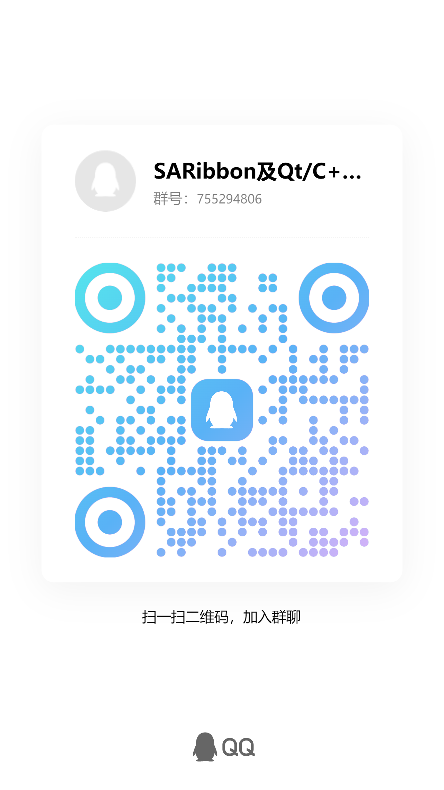

📚 **项目文档**：[https://czyt1988.github.io/SARibbon/zh](https://czyt1988.github.io/SARibbon/zh)

---

||Windows(latest)|Linux ubuntu(latest)|Mac(latest)|
|:-|:-|:-|:-|
|Qt5.12 LTS||||
|Qt5.14||||
|Qt5.15 LTS||||
|Qt6.2 LTS||||
|Qt6.5 LTS||||
|Qt6.8 LTS||||

---

## 项目概述

**SARibbon** 是一个基于 **Qt** 的 Ribbon 界面控件库，旨在为桌面应用程序提供类似 Microsoft Office 系列软件的现代化操作界面。

### 适用场景
- 大型软件
- 工业级软件
- 功能复杂的桌面应用

### 设计理念
- 接口命名风格参考 **MFC Ribbon**
- 界面样式融合 **Microsoft Office** 与 **WPS Office** 的优点
- 支持通过 **QSS（Qt 样式表）** 快速自定义主题风格
- 提供丰富的内置控件封装（如 [颜色选择按钮与调色板](https://github.com/czyt1988/SAColorWidgets)）

## 功能特点

- 针对Ribbon的布局和显示

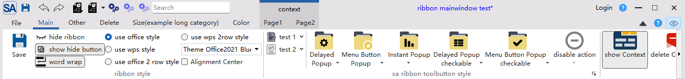

- 支持最小化模式，ribbon只显示标签（默认双击标签会进行切换）,支持上下文标签tab

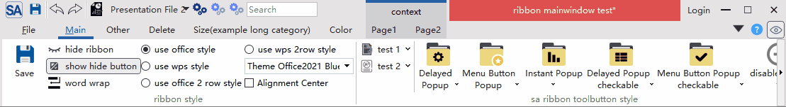

- 支持quickAccessBar（word快速菜单）和rightButtonGroup，在不同布局模式下会有不同的显示效果
- 支持多种不同风格的ribbon button，普通按钮，延迟弹出菜单按钮，菜单按钮，action菜单按钮（action菜单按钮是此ribbon控件最主要解决的问题之一）

- 支持多种不同风格的布局样式

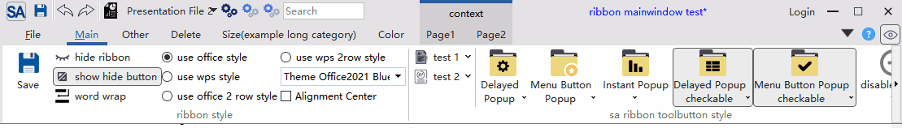

- 支持qss对ribbon进行自定义设置，可实时切换主题,内置了6种不同风格的主题

win7主题：
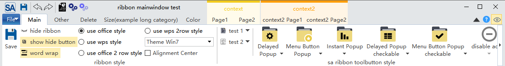
office2013主题：
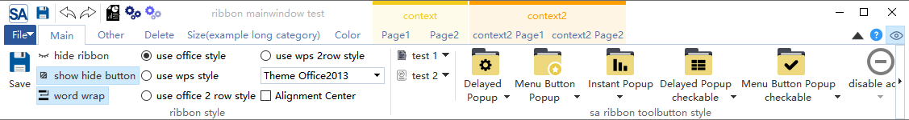
office2016主题：
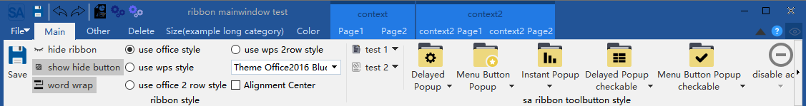
office2021主题：
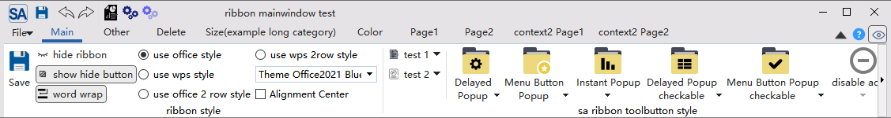
dark主题：

dark2主题：
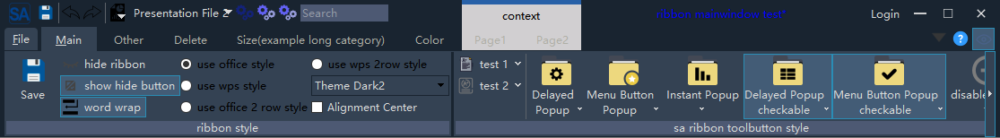

- 提供Gallery控件

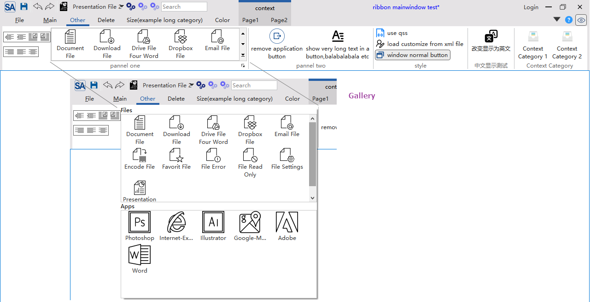

- 支持超长滚动和Option Action

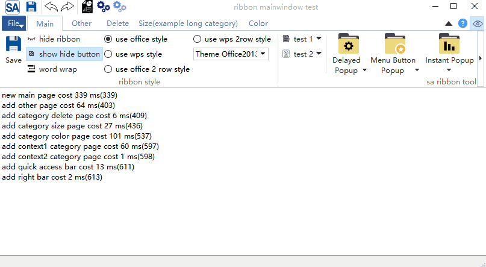

- 提供居中对齐模式

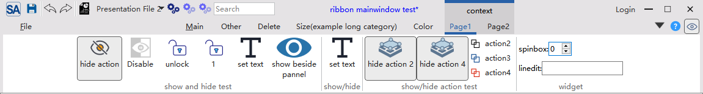

- 支持4K屏和多屏幕扩展
- 支持linux和MacOS（界面未做深度适配）

- **协议**：MIT（自由使用、修改、分发）
- **欢迎贡献**：欢迎提交 Issue、PR 或加入交流群讨论！

[gitee(码云) - https://gitee.com/czyt1988/SARibbon](https://gitee.com/czyt1988/SARibbon)

[github - https://github.com/czyt1988/SARibbon](https://github.com/czyt1988/SARibbon)

## 构建及使用

**项目文档位于 docs/zh文件夹下，你可以直接点击此链接：**[https://czyt1988.github.io/SARibbon/zh](https://czyt1988.github.io/SARibbon/zh)

**项目的doxygen文档部署于：**[https://czyt1988.github.io/SARibbon/doxygen/index.html](https://czyt1988.github.io/SARibbon/doxygen/index.html)

**推荐从 `example/MainWindowExample` 入手学习 SARibbon 的使用方式，你也可以直接运行该示例，体验各项功能**

## 更多截图

- 这是使用SARibbon构建的软件截图

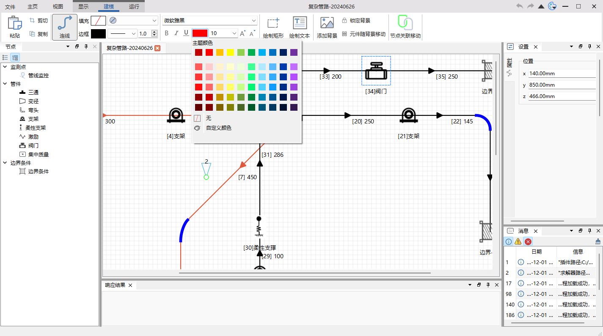

[github - https://github.com/czyt1988/data-workbench](https://github.com/czyt1988/data-workbench)

[gitee - https://gitee.com/czyt1988/data-workbench](https://gitee.com/czyt1988/data-workbench)

具体Ribbon的生成代码可见：

[https://github.com/czyt1988/data-workbench/blob/master/src/APP/DAAppRibbonArea.cpp](https://github.com/czyt1988/data-workbench/blob/master/src/APP/DAAppRibbonArea.cpp)

## 文档生成

- 使用 `doxygen` 生成 HTML 或 `.qch` 格式文档：
  - `docs/Doxyfile-wiki-cn` → 生成网页版文档
  - `docs/Doxyfile-qch-cn` → 生成 Qt Creator 可集成的帮助文档
- 项目静态文档通过 `mkdocs` 构建并部署于 GitHub Pages，你可以通过此链接来访问：[https://czyt1988.github.io/SARibbon/zh](https://czyt1988.github.io/SARibbon/zh)

## 给我一个鼓励❤️

如果 SARibbon 对你的项目有所帮助，欢迎扫码赞赏支持！

    

