# SARibbon简介

[Click here for English](https://czyt1988.github.io/SARibbon/)

<div align="center">
<p>


</p>
<p>


</p>
</div>

**QQ 交流群**：755294806（群2）、434014314（已满）  

<div align="center">
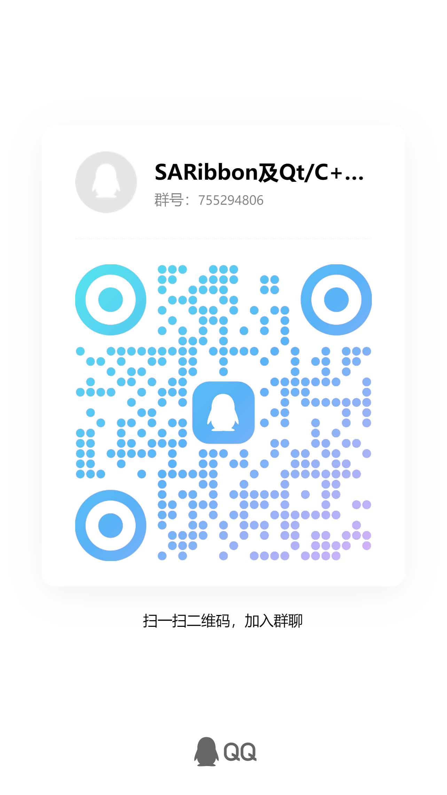
</div>

📚 **项目文档**：[https://czyt1988.github.io/SARibbon/zh](https://czyt1988.github.io/SARibbon/zh)

---

||Windows(latest)|Linux ubuntu(latest)|Mac(latest)|
|:-|:-|:-|:-|
|Qt5.12 LTS|[](https://github.com/czyt1988/SARibbon/actions/workflows/cmake-win-qt5.12.yml)|[](https://github.com/czyt1988/SARibbon/actions/workflows/cmake-linux-qt5.12.yml)|[](https://github.com/czyt1988/SARibbon/actions/workflows/cmake-mac-qt5.12.yml)|
|Qt5.14|[](https://github.com/czyt1988/SARibbon/actions/workflows/cmake-win-qt5.14.yml)|[](https://github.com/czyt1988/SARibbon/actions/workflows/cmake-linux-qt5.14.yml)|[](https://github.com/czyt1988/SARibbon/actions/workflows/cmake-mac-qt5.14.yml)|
|Qt5.15 LTS|[](https://github.com/czyt1988/SARibbon/actions/workflows/cmake-win-qt5.15.yml)|[](https://github.com/czyt1988/SARibbon/actions/workflows/cmake-linux-qt5.15.yml)|[](https://github.com/czyt1988/SARibbon/actions/workflows/cmake-mac-qt5.15.yml)|
|Qt6.2 LTS|[](https://github.com/czyt1988/SARibbon/actions/workflows/cmake-win-qt6.2.yml)|[](https://github.com/czyt1988/SARibbon/actions/workflows/cmake-linux-qt6.2.yml)|[](https://github.com/czyt1988/SARibbon/actions/workflows/cmake-mac-qt6.2.yml)|
|Qt6.5 LTS|[](https://github.com/czyt1988/SARibbon/actions/workflows/cmake-win-qt6.5.yml)|[](https://github.com/czyt1988/SARibbon/actions/workflows/cmake-linux-qt6.5.yml)|[](https://github.com/czyt1988/SARibbon/actions/workflows/cmake-mac-qt6.5.yml)|
|Qt6.8 LTS|[](https://github.com/czyt1988/SARibbon/actions/workflows/cmake-win-qt6.8.yml)|[](https://github.com/czyt1988/SARibbon/actions/workflows/cmake-linux-qt6.8.yml)|[](https://github.com/czyt1988/SARibbon/actions/workflows/cmake-mac-qt6.8.yml)|

---

## 项目概述

**SARibbon** 是一个基于 **Qt** 的 Ribbon 界面控件库，旨在为桌面应用程序提供类似 Microsoft Office 系列软件的现代化操作界面。

### 适用场景
- 大型软件
- 工业级软件
- 功能复杂的桌面应用

### 设计理念
- 接口命名风格参考 **MFC Ribbon**
- 界面样式融合 **Microsoft Office** 与 **WPS Office** 的优点
- 支持通过 **QSS（Qt 样式表）** 快速自定义主题风格
- 提供丰富的内置控件封装（如 [颜色选择按钮与调色板](https://github.com/czyt1988/SAColorWidgets)）

## 功能特点

- ✅ **四层嵌套布局**：RibbonBar → Category → Panel → ToolButton，层次清晰，功能组织有序
- ✅ **四种布局模式**：宽松三行、宽松两行、紧凑三行、紧凑两行，运行时动态切换
- ✅ **单行布局模式**：v2.8.0 新增，图标左文字右横向排列，空间极度受限场景推荐
- ✅ **6种内置主题**：Win7/Office2013/2016/2021/Dark/Dark2，一键切换，支持QSS自定义扩展
- ✅ **上下文标签页**：SARibbonContextCategory 按条件显示/隐藏，如选中图片时出现"图片工具"
- ✅ **Gallery画廊控件**：网格形式展示图标选项，支持弹出式分组浏览
- ✅ **最小化模式**：双击标签切换，仅显示标签栏，点击临时弹出内容面板

---

针对Ribbon的布局和显示

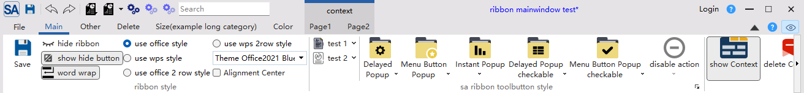

- 支持最小化模式，ribbon只显示标签（默认双击标签会进行切换）,支持上下文标签tab

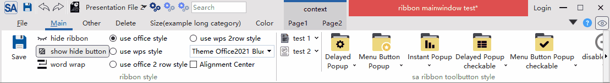

- 支持quickAccessBar（word快速菜单）和rightButtonGroup，在不同布局模式下会有不同的显示效果
- 支持多种不同风格的ribbon button，普通按钮，延迟弹出菜单按钮，菜单按钮，action菜单按钮（action菜单按钮是此ribbon控件最主要解决的问题之一）

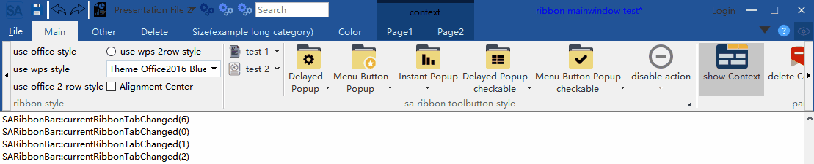

- 支持多种不同风格的布局样式

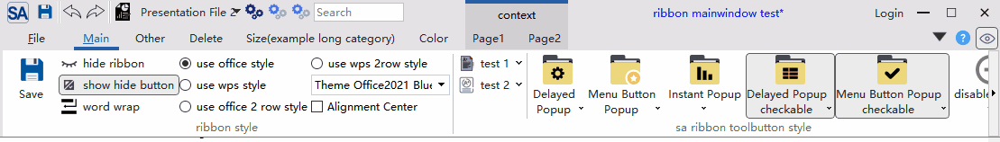

- 支持qss对ribbon进行自定义设置，可实时切换主题,内置了6种不同风格的主题

win7主题：

office2013主题：

office2016主题：

office2021主题：

dark主题：

dark2主题：


- 提供Gallery控件

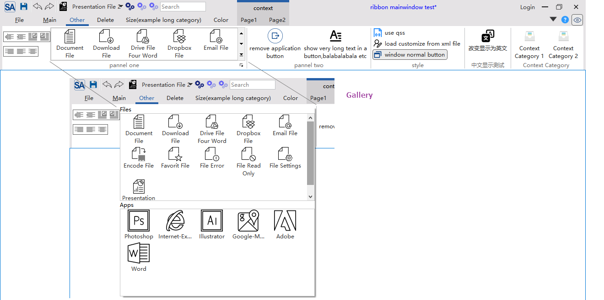

- 支持超长滚动和Option Action

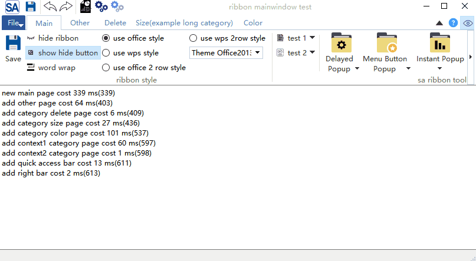

- 提供居中对齐模式

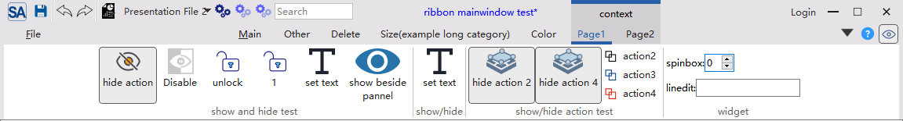

- 支持4K屏和多屏幕扩展
- 支持linux和MacOS（界面未做深度适配）

- **协议**：MIT（自由使用、修改、分发）
- **欢迎贡献**：欢迎提交 Issue、PR 或加入交流群讨论！

[gitee(码云) - https://gitee.com/czyt1988/SARibbon](https://gitee.com/czyt1988/SARibbon)

[github - https://github.com/czyt1988/SARibbon](https://github.com/czyt1988/SARibbon)

## 文档导航

| 文档 | 说明 |
|------|------|
| [构建说明](./build-guide/build-instructions.md) | 从零构建 SARibbon |
| [快速上手](./use-guide/SARibbon-user-guide.md) | 5分钟了解使用方法 |
| [创建Ribbon窗口](./use-guide/create-ribbon-style-window.md) | 创建第一个 Ribbon 窗口 |
| [开发者指南](./dev-guide/developer-guide.md) | 参与项目开发 |
| [常见问题](./faq.md) | 解答常见疑问 |

## 架构概览

SARibbon 采用四层嵌套结构，从主窗口到按钮逐层组织：

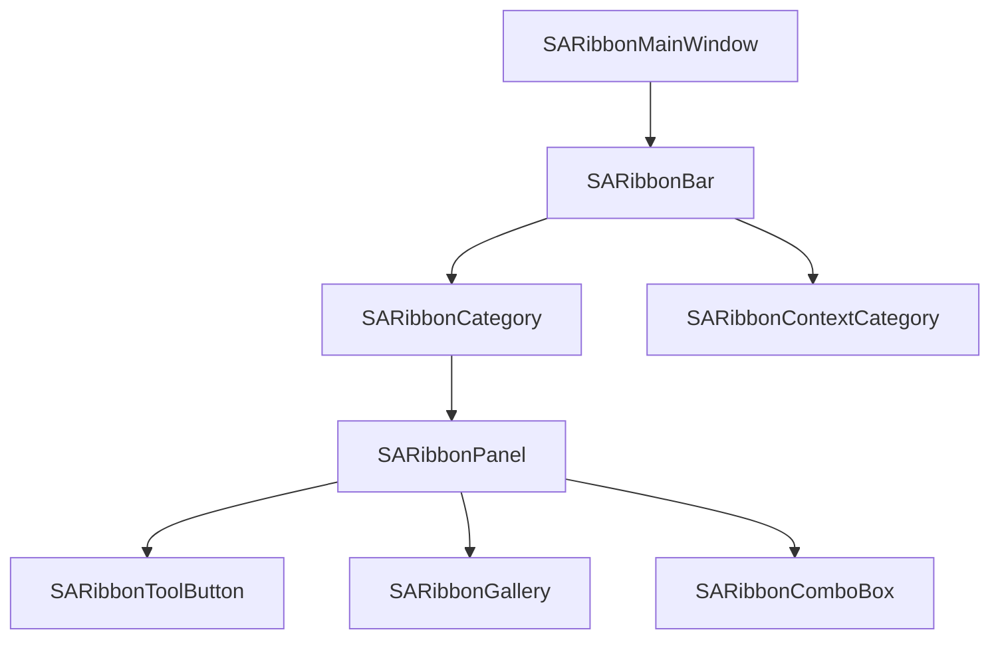
```mermaid
graph TD
    A[SARibbonMainWindow] --> B[SARibbonBar]
    B --> C[SARibbonCategory]
    B --> D[SARibbonContextCategory]
    C --> E[SARibbonPanel]
    E --> F[SARibbonToolButton]
    E --> G[SARibbonGallery]
    E --> H[SARibbonComboBox]
```

每一层职责明确：

- **SARibbonMainWindow** — 顶层主窗口，管理标题栏和主题切换
- **SARibbonBar** — 标签栏容器，控制整体布局风格和最小化模式
- **SARibbonCategory** — 单个标签页，包含若干面板
- **SARibbonPanel** — 功能面板，将相关按钮分组展示
- **SARibbonToolButton** — 操作按钮，支持大/中/小三种尺寸

## 30秒快速上手

只需三步即可创建带有 Ribbon 界面的窗口：

```cpp
#include "SARibbonMainWindow.h"
#include "SARibbonBar.h"
#include "SARibbonCategory.h"
#include "SARibbonPanel.h"

class MyMainWindow : public SARibbonMainWindow
{
public:
    MyMainWindow(QWidget* parent = nullptr) : SARibbonMainWindow(parent)
    {
        // 1. 获取 Ribbon 栏并设置样式
        SARibbonBar* ribbon = ribbonBar();
        ribbon->setRibbonStyle(SARibbonBar::RibbonStyleLooseThreeRow);

        // 2. 创建标签页和面板
        SARibbonCategory* category = ribbon->addCategoryPage("开始");
        SARibbonPanel* panel = category->addPanel("常用操作");

        // 3. 向面板添加按钮
        QAction* act = new QAction("打开", this);
        act->setIcon(QIcon(":/icons/open.png"));
        panel->addLargeAction(act);
    }
};
```

在 `main.cpp` 中创建并显示窗口即可运行：

```cpp
int main(int argc, char* argv[])
{
    QApplication app(argc, argv);
    MyMainWindow w;
    w.show();
    return app.exec();
}
```

!!! tip "推荐入手方式"
    建议从 `example/MainWindowExample` 示例项目入手学习 SARibbon 的使用方式。该示例覆盖了所有核心功能，可以直接运行体验各项特性。

## 构建及使用

**项目文档位于 docs/zh文件夹下，你可以直接点击此链接：**[https://czyt1988.github.io/SARibbon/zh](https://czyt1988.github.io/SARibbon/zh)

**项目的doxygen文档部署于：**[https://czyt1988.github.io/SARibbon/doxygen/index.html](https://czyt1988.github.io/SARibbon/doxygen/index.html)

## 更多截图

- 这是使用SARibbon构建的软件截图


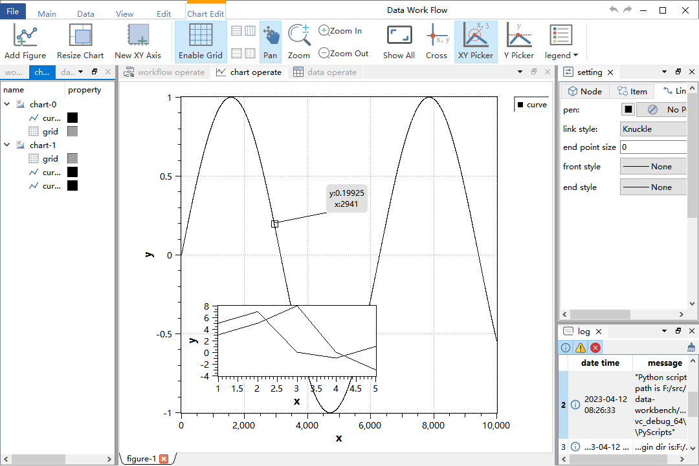
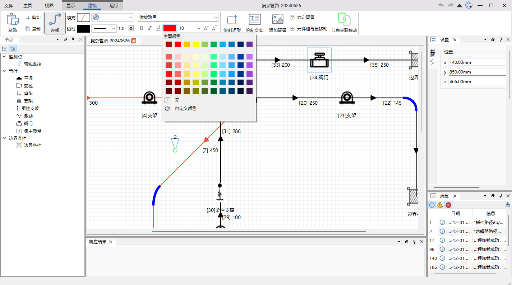

[github - https://github.com/czyt1988/data-workbench](https://github.com/czyt1988/data-workbench)

[gitee - https://gitee.com/czyt1988/data-workbench](https://gitee.com/czyt1988/data-workbench)

具体Ribbon的生成代码可见：

[https://github.com/czyt1988/data-workbench/blob/master/src/APP/DAAppRibbonArea.cpp](https://github.com/czyt1988/data-workbench/blob/master/src/APP/DAAppRibbonArea.cpp)

## 文档生成

- 使用 `doxygen` 生成 HTML 或 `.qch` 格式文档：
  - `docs/doxygen-doc-file/Doxyfile-wiki-cn` → 生成网页版文档
  - `docs/doxygen-doc-file/Doxyfile-qch-cn` → 生成 Qt Creator 可集成的帮助文档
- 项目静态文档通过 `mkdocs` 构建并部署于 GitHub Pages，你可以通过此链接来访问：[https://czyt1988.github.io/SARibbon/zh](https://czyt1988.github.io/SARibbon/zh)


## 给我一个鼓励❤️

如果 SARibbon 对你的项目有所帮助，欢迎扫码赞赏支持！

<div style="text-align:center">
    
</div>
