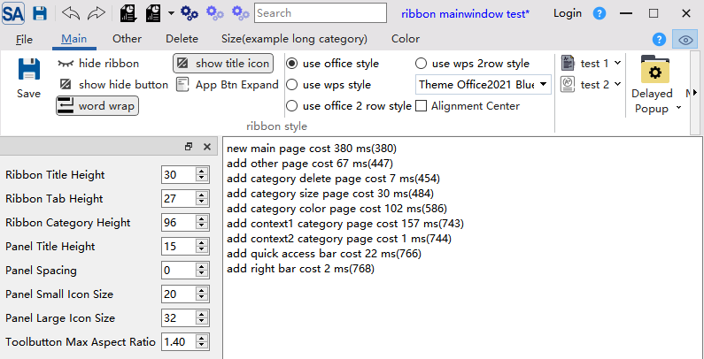

# Ribbon尺寸设置

SARibbon 允许您精细调整 ribbon 各个部分的高度和间距，以适应不同的界面布局和高分辨率显示器需求。

## 核心特性

- ✅ **全局高度控制**：可独立设置标题栏、标签栏、Category 区域的高度
- ✅ **面板级尺寸调节**：支持面板标题高度、面板间距、按钮图标大小的统一设置
- ✅ **动态图标计算**：图标大小根据 Category 高度和文字高度自动计算，无需手动指定每个按钮
- ✅ **按钮宽高比限制**：通过最大宽高比系数控制按钮的最大宽度，防止过度拉伸

## 完整API摘要

所有尺寸设置通过 `SARibbonBar` 统一管理，无需直接操作单个 Panel：

| 方法 | 返回值 | 说明 |
|------|--------|------|
| `setTitleBarHeight(h)` | void | 设置标题栏高度（仅宽松模式可见） |
| `titleBarHeight()` | int | 获取标题栏高度 |
| `setTabBarHeight(h)` | void | 设置标签栏高度 |
| `tabBarHeight()` | int | 获取标签栏高度 |
| `setCategoryHeight(h)` | void | 设置 Category 面板内容区域总高度 |
| `categoryHeight()` | int | 获取 Category 高度 |
| `setPanelTitleHeight(h)` | void | 设置面板底部标题区域高度 |
| `panelTitleHeight()` | int | 获取面板标题高度 |
| `setPanelSpacing(n)` | void | 设置相邻面板间的水平间距 |
| `panelSpacing()` | int | 获取面板间距 |
| `setPanelToolButtonIconSize(s, l)` | void | 设置工具按钮的小图标和大图标尺寸 |
| `panelToolButtonIconSize()` | QPair<QSize, QSize> | 获取工具按钮图标尺寸对 |
| `setPanelLargeIconSize(size)` | void | 单独设置大图标尺寸 |
| `panelLargeIconSize()` | QSize | 获取大图标尺寸 |
| `setPanelSmallIconSize(size)` | void | 单独设置小图标尺寸 |
| `panelSmallIconSize()` | QSize | 获取小图标尺寸 |
| `setButtonMaximumAspectRatio(r)` | void | 设置按钮最大宽高比（控制最大宽度） |
| `buttonMaximumAspectRatio()` | qreal | 获取按钮最大宽高比 |
| `normalModeMainBarHeight()` | int | 获取正常模式下的主栏高度 |
| `minimumModeMainBarHeight()` | int | 获取最小模式下的主栏高度 |

## 尺寸关系说明

Ribbon 的垂直高度由多个层级叠加而成，理解这些关系有助于合理配置尺寸：

```
┌─────────────────────────────────────┐  ← 标题栏高度 (setTitleBarHeight)
│  标题栏 (仅宽松模式可见)              │
├─────────────────────────────────────┤  ← 标签栏高度 (setTabBarHeight)
│  标签栏 (Tab Bar)                    │
├─────────────────────────────────────┤  ← Category高度 (setCategoryHeight)
│  Category 内容区域                    │
│  ┌─────────┬─────────┬─────────┐    │     包含: 面板内容 + 面板标题
│  │ Panel 1 │ Panel 2 │ Panel 3 │    │     面板标题高度由 setPanelTitleHeight 控制
│  └─────────┴─────────┴─────────┘    │
└─────────────────────────────────────┘
```

**总高度公式**（宽松模式）：
> Ribbon总高度 = 标题栏高度 + 标签栏高度 + Category高度

**总高度公式**（紧凑模式）：
> Ribbon总高度 = 标签栏高度 + Category高度（紧凑模式无标题栏）

Category 高度内部包含面板内容区域和面板标题区域。面板标题高度通过 `setPanelTitleHeight` 单独控制，默认显示在面板底部。

## 使用示例

以下示例展示如何创建一个紧凑风格的 Ribbon 界面并调整各项尺寸：

```cpp
#include "SARibbonMainWindow.h"
#include "SARibbonBar.h"
#include "SARibbonCategory.h"
#include "SARibbonPanel.h"

class MainWindow : public SARibbonMainWindow {
public:
    MainWindow(QWidget* parent = nullptr) : SARibbonMainWindow(parent)
    {
        SARibbonBar* ribbon = ribbonBar();

        // 使用紧凑三行模式
        ribbon->setRibbonStyle(SARibbonBar::RibbonStyleCompactThreeRow);

        // 调整各部分高度，使界面更紧凑
        ribbon->setTabBarHeight(28);
        ribbon->setCategoryHeight(80);
        ribbon->setPanelTitleHeight(16);

        // 设置图标尺寸（小图标、大图标）
        ribbon->setPanelToolButtonIconSize(QSize(16, 16), QSize(24, 24));

        // 设置面板间距，增加视觉分隔
        ribbon->setPanelSpacing(4);

        // 添加分类和面板
        SARibbonCategory* cat = ribbon->addCategoryPage(tr("&File"));
        SARibbonPanel* panel = cat->addPanel(tr("Operations"));
        panel->addLargeAction(new QAction(tr("New"), this));
        panel->addSmallAction(new QAction(tr("Open"), this));
    }
};
```

运行效果：界面紧凑但功能完整，各面板间距适当，图标大小适合高分辨率显示。

!!! info "图标动态计算逻辑"
    SARibbon 的图标大小并非像传统工具栏那样设置固定值，而是根据 RibbonBar 的 `CategoryHeight` 和文字高度动态计算。
    布局时会自动决定图标大小。想让图标变大：增大 `CategoryHeight`，或调用 `setEnableWordWrap(false)` 关闭文字换行以腾出更多图标空间。

!!! tip "4K/多显示器适配建议"
    在 4K 或多显示器环境中，建议调用 SARibbonBar::initHighDpi() 启用高 DPI 支持，并通过 setPanelToolButtonIconSize 适当增大图标尺寸。
    同时可配合 QApplication::setAttribute(Qt::AA_EnableHighDpiScaling) 使用，确保 ribbon 在不同 DPI 显示器上显示一致。

!!! example "交互式调试"
    运行 `example/MainWindowExample` 示例的 **Size** 标签页，可动态调整各部件尺寸并实时查看效果。
    
