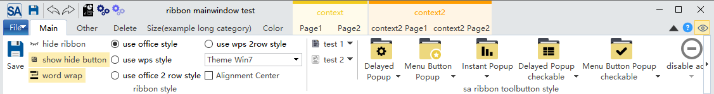

# Ribbon尺寸设置

SARibbon 允许您精细调整各个部分的高度和间距。

```cpp
// 设置标题栏高度
ribbonBar()->setTitleBarHeight(40);

// 设置标签栏高度
ribbonBar()->setTabBarHeight(30);

// 设置Category高度
ribbonBar()->setCategoryHeight(96);

// 设置面板标题高度
ribbonBar()->setPanelTitleHeight(20);

// 设置面板间间距
ribbonBar()->setPanelSpacing(5);

// 设置工具按钮图标大小
ribbonBar()->setPanelToolButtonIconSize(QSize(32, 32));

// 设置按钮最大宽高比
ribbonBar()->setButtonMaximumAspectRatio(2.0);
```

不同的尺寸能组合出不一样的显示效果，尤其针对图标大小的显示需求，SARibbon的图标不像工具栏那样设置一个固定的图标大小，而是根据ribbonBar的高度和文字的高度来决定图标的大小，SARibbon在布局的时候，会根据`CategoryHeight`,以及文字高度来决定图标的大小，因此，你想让图标变大，有两种方法：

- 调整`CategoryHeight`，让ribbonbar变高，字体不变情况下，图标会变大
- 调整字体换行方式（`SARibbonBar::setEnableWordWrap`），如果是双行模式，设置文字不换行，则在ribbonbar高度不变的情况下，会让图标变大

各个部件的尺寸如何设置，可以通过运行`example/MainWindowExample`例子的`Size`标签页进行动态调整，并查看效果


### 切换内置主题

SARibbon 提供了多种内置主题，如 Windows 7、Office 2013、Office 2016、暗色主题等，主题定义在`SARibbonTheme`枚举类中：

```cpp
enum class SARibbonTheme
{
    RibbonThemeOffice2013,      ///< office2013主题
    RibbonThemeOffice2016Blue,  ///< office2016-蓝色主题
    RibbonThemeOffice2021Blue,  ///< office2021-蓝色主题
    RibbonThemeWindows7,        ///< win7主题
    RibbonThemeDark,            ///< 暗色主题
    RibbonThemeDark2            ///< 暗色主题2
};
```

通过`SARibbonMainWindow::setRibbonTheme`/`SARibbonWidget::setRibbonTheme`函数，可以设置Ribbon的主题，此函数的参数为`SARibbonTheme`对象

> **注：**
>
> 某些Qt版本，在构造函数设置主题会不完全生效，可以使用QTimer投放到队列最后执行：
>
> ```cpp
> MainWindow::MainWindow(QWidget* par) : SARibbonMainWindow(par)
> {
>   ...
>   QTimer::singleShot(0, this, [ this ]() { this->setRibbonTheme(SARibbonMainWindow::RibbonThemeDark); });
> }
> ```

各个主题效果如下图所示：

win7主题：



office2013主题：


office2016主题：


office2021主题：


dark主题：


dark2主题：


SARibbon的主题是通过qss实现的，如果你的窗口已经存在qss样式，你需要把你现有的qss样式和ribbon的qss样式进行合并，否则，最后设置的样式将会覆盖之前设置的样式

## Ribbon的自定义

### SARibbon的自定义功能

ribbon的自定义是ribbon的一个特色，参考了office和wps的自定义界面，用户可以为自己的ribbon定义非常多的内容，甚至可以定义出一个完全和原来不一样的界面。

以下是office的自定义界面


SARibbon参考office和wps的界面，封装了方便使用的`SARibbonCustomize**`类，包括如下5个类：

> - SARibbonCustomizeDialog
> - SARibbonCustomizeWidget
> - SARibbonCustomizeData
> - SARibbonActionsManager
> - SARibbonActionsManagerModel

实际用户使用仅会面对`SARibbonActionsManager`和`SARibbonCustomizeDialog`/`SARibbonCustomizeWidget`，其余类用户正常不会使用。

`SARibbonActionsManager`是用来管理`QAction`，把想要自定义的`QAction`添加到`SARibbonActionsManager`中管理，并可以对`QAction`进行分类，以便在`SARibbonCustomizeDialog`/`SARibbonCustomizeWidget`中显示

`SARibbonCustomizeDialog`/`SARibbonCustomizeWidget`是具体的显示窗口，`SARibbonCustomizeDialog`把`SARibbonCustomizeWidget`封装为对话框，如果要实现office那样集成到配置对话框中可以使用`SARibbonCustomizeWidget`，`SARibbonCustomizeDialog`的效果如下图所示：


### 给界面添加自定义功能

这里演示如何添加自定义功能

首先定义`SARibbonActionsManager`作为MainWindow的成员变量

```cpp
//MainWindow.h 中定义成员变量
SARibbonActionsManager* m_ribbonActionMgr;///< 用于管理所有action
```

在MainWindow的初始化过程中，还需要创建大量的`QAction`，`QAction`的父对象指定为MainWindow，另外还会生成ribbon布局，例如添加category，添加pannel等操作，在上述操作完成后添加如下步骤，自动让`SARibbonActionsManager`管理所有的`QAction`

```cpp
//MainWindow的初始化，生成QAction
//生成ribbon布局
m_ribbonActionMgr = new SARibbonActionsManager(mainWinowPtr);
m_ribbonActionMgr->autoRegisteActions(mainWinowPtr);
```

`SARibbonActionsManager`的关键函数`autoRegisteActions`可以遍历 `SARibbonMainWindow`下的所有子object，找到action并注册，并会遍历所有`SARibbonCategory`,把`SARibbonCategory`下的action按`SARibbonCategory`的title name进行分类，此函数还会把`SARibbonMainWindow`下面的action，但不在任何一个category下的作为NotInRibbonCategoryTag标签注册，默认名字会赋予not in ribbon

在需要调用`SARibbonCustomizeDialog`的地方如下操作：

```cpp
QString cfgpath = "customization.xml";
SARibbonCustomizeDialog dlg(this, this);

dlg.setupActionsManager(m_ribbonActionMgr);
dlg.fromXml(cfgpath);//调用这一步是为了把已经存在的自定义步骤加载进来，在保存时能基于原有的自定义步骤上追加
if (QDialog::Accepted == dlg.exec()) {
    dlg.applys();//应用自定义步骤
    dlg.toXml(cfgpath);//把自定义步骤保存到文件中
}
```

在MainWindow生成前还需要把自定义的内容加载，因此在构造函数最后应该加入如下语句：

```cpp
//MainWindow的构造函数最后
sa_apply_customize_from_xml_file("customization.xml", this, m_ribbonActionMgr);
```

`sa_apply_customize_from_xml_file`是`SARibbonCustomizeWidget.h`中提供的函数，直接把配置文件中的自定义内容应用到MainWindow中。

这样软件每次启动都会按照配置文件加载。