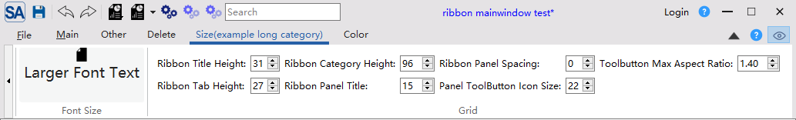

# Ribbon尺寸设置

SARibbon 允许您精细调整各个部分的高度和间距。

```cpp
// 设置标题栏高度
ribbonBar()->setTitleBarHeight(40);

// 设置标签栏高度
ribbonBar()->setTabBarHeight(30);

// 设置Category高度
ribbonBar()->setCategoryHeight(96);

// 设置面板标题高度
ribbonBar()->setPanelTitleHeight(20);

// 设置面板间间距
ribbonBar()->setPanelSpacing(5);

// 设置工具按钮图标大小
ribbonBar()->setPanelToolButtonIconSize(QSize(32, 32));

// 设置按钮最大宽高比
ribbonBar()->setButtonMaximumAspectRatio(2.0);
```

不同的尺寸能组合出不一样的显示效果，尤其针对图标大小的显示需求，SARibbon的图标不像工具栏那样设置一个固定的图标大小，而是根据ribbonBar的高度和文字的高度来决定图标的大小，SARibbon在布局的时候，会根据`CategoryHeight`,以及文字高度来决定图标的大小，因此，你想让图标变大，有两种方法：

- 调整`CategoryHeight`，让ribbonbar变高，字体不变情况下，图标会变大
- 调整字体换行方式（`SARibbonBar::setEnableWordWrap`），如果是双行模式，设置文字不换行，则在ribbonbar高度不变的情况下，会让图标变大

各个部件的尺寸如何设置，可以通过运行`example/MainWindowExample`例子的`Size`标签页进行动态调整，并查看效果


