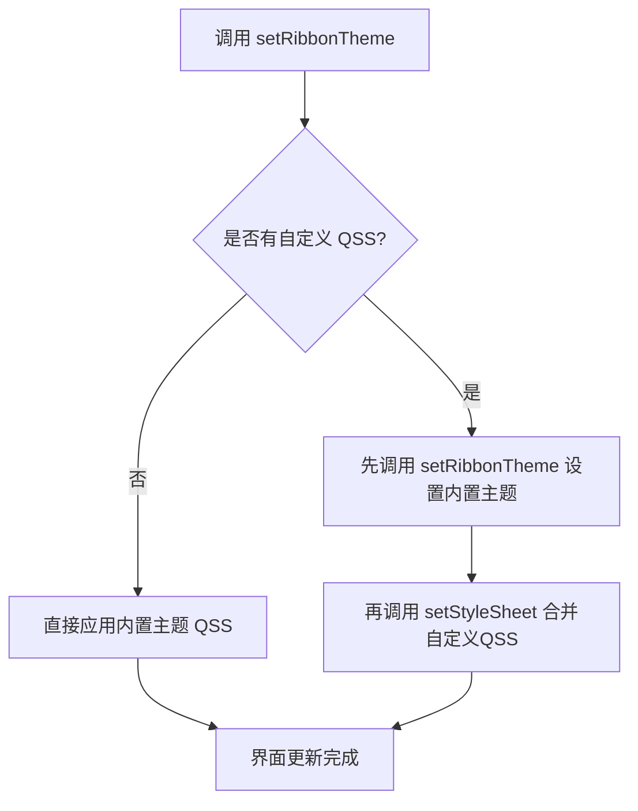

# SARibbon主题切换

- ✅ **10种内置主题**：Office2013、Office2016（Blue/Green/Dark）、Office2021（Blue/Green/Dark）、Windows7、Dark/Dark2，一键切换
- ✅ **运行时动态切换**：通过 `setRibbonTheme()` 即时更换主题，无需重启
- ✅ **QSS样式设置**：内置主题 QSS 由模板+调色板生成，详见下方「模板+调色板架构」
- ✅ **完全自定义主题**：基于QSS编写任意风格，参见 [自定义Ribbon主题](./design-your-theme.md)
- ✅ **JSON调色板配置**：通过调色板JSON文件自定义颜色，无需编辑QSS，参见 [JSON主题配置指南](./json-theme-config.md)

## 主题切换流程



SARibbon 提供了多种内置主题，如 Windows 7、Office 2013、Office 2016、暗色主题等，主题定义在`SARibbonTheme`枚举类中：

```cpp
enum class SARibbonTheme
{
    RibbonThemeOffice2013,      ///< Office 2013 主题
    RibbonThemeOffice2016Blue,  ///< Office 2016 - 蓝色主题
    RibbonThemeOffice2016Green, ///< Office 2016 - 绿色主题（1.4.0 新增）
    RibbonThemeOffice2016Dark,  ///< Office 2016 - 深色主题（1.4.0 新增）
    RibbonThemeOffice2021Blue,  ///< Office 2021 - 蓝色主题
    RibbonThemeWindows7,        ///< Windows 7 主题
    RibbonThemeDark,            ///< 暗色主题
    RibbonThemeDark2,           ///< 暗色主题2
    RibbonThemeOffice2021Green, ///< Office 2021 - 绿色主题（1.4.0 新增）
    RibbonThemeOffice2021Dark   ///< Office 2021 - 深色主题（1.4.0 新增）
};
```

!!! info "默认主题"
    `SARibbonTheme::RibbonThemeOffice2021Blue` 是 SARibbon 的默认主题，在 `SARibbonMainWindow` 和 `SARibbonWidget` 的 PrivateData 初始化器中显式设置。

    当操作系统处于暗色模式（Dark Mode）且当前主题为 `RibbonThemeOffice2021Blue` 时，SARibbon 会自动切换至 `RibbonThemeDark`。该检测通过 `QTimer::singleShot(0)` 延迟执行，确保 `QApplication` 上下文完整可用。

通过`SARibbonMainWindow::setRibbonTheme`/`SARibbonWidget::setRibbonTheme`函数，可以设置Ribbon的主题，此函数的参数为`SARibbonTheme`对象

!!! warning "注意"
    某些Qt版本，在构造函数设置主题会不完全生效，可以使用QTimer投放到队列最后执行：
    ```cpp
    MainWindow::MainWindow(QWidget* par) : SARibbonMainWindow(par)
    {
        ...
        QTimer::singleShot(0, this, [ this ]() {
            this->setRibbonTheme(SARibbonTheme::RibbonThemeDark);
        });
    }
    ```

!!! tip "根本原因"
    `setRibbonTheme()` 包含两个阶段：QSS 加载（`setStyleSheet()`）和后续程序调整（Tab 边距、上下文颜色、基线颜色）。`setStyleSheet()` 会调度异步样式重计算，后续调整依赖子控件树完全实例化且 QSS 已生效。在构造函数阶段，Qt 样式引擎尚未完成异步操作，导致调整无法正确应用。`QTimer::singleShot(0)` 将设置推迟到事件循环开始后，确保所有子控件已构建、样式引擎已处理完毕。这也是暗色模式自动检测需要延迟执行的原因。

各个主题效果如下图所示：

win7主题：


office2013主题：


office2016蓝色主题：


office2016绿色主题 <!-- TODO: add screenshot -->  
<!--  -->

office2016深色主题 <!-- TODO: add screenshot -->  
<!--  -->

office2021蓝色主题：


office2021绿色主题 <!-- TODO: add screenshot -->  
<!--  -->

office2021深色主题 <!-- TODO: add screenshot -->  
<!--  -->

dark主题：


dark2主题：


## 主题对照表

| 枚举值 | 风格说明 | 适用场景 |
|--------|---------|---------|
| `RibbonThemeOffice2013` | Office 2013 经典白色 | 追求简洁明亮风格 |
| `RibbonThemeOffice2016Blue` | Office 2016 蓝色调 | 商务/企业应用 |
| `RibbonThemeOffice2016Green` | Office 2016 绿色调 | 环保/健康类应用 |
| `RibbonThemeOffice2016Dark` | Office 2016 深色 | 低光环境使用 |
| `RibbonThemeOffice2021Blue` | Office 2021 蓝色调 | 现代化界面设计 |
| `RibbonThemeOffice2021Green` | Office 2021 绿色调 | 环保/健康类应用 |
| `RibbonThemeOffice2021Dark` | Office 2021 深色 | 低光环境使用 |
| `RibbonThemeWindows7` | Windows 7 经典 | 兼容传统风格 |
| `RibbonThemeDark` | 暗色主题 | 长时间使用/夜间模式 |
| `RibbonThemeDark2` | 暗色主题（变体） | 对比度更高的暗色需求 |

## 主题API摘要

| 方法 / 属性 | 所属类 | 说明 |
|-------------|--------|------|
| `setRibbonTheme(SARibbonTheme)` | SARibbonMainWindow / SARibbonWidget | 设置Ribbon主题 |
| `ribbonTheme()` → `SARibbonTheme` | SARibbonMainWindow / SARibbonWidget | 获取当前主题 |
| `Q_PROPERTY(ribbonTheme)` | SARibbonMainWindow / SARibbonWidget | 主题属性，可通过QSS或代码绑定 |

### SARibbonWidget 说明

`SARibbonWidget` 同样提供 `setRibbonTheme()` 方法和 `Q_PROPERTY(ribbonTheme)`，使用方式与 `SARibbonMainWindow` 一致。

**重要差异**：`SARibbonWidget::setRibbonTheme()` 不会调用 `setContextCategoryColorHighLight()`，上下文类别高亮函数会保留上一次主题设置的值，而非随主题更新。而 `SARibbonMainWindow` 会根据主题切换相应的高亮函数（`cs_vibrantHighlight`、`cs_darkerHighlight`、或 Office2021Blue 专属 lambda）。

### 无 themeChanged 信号

SARibbon 当前没有 `themeChanged` 信号。如需监听主题变化，有两种变通方式：

1. 在子类中重写 `setRibbonTheme()` 方法，在调用基类方法后处理自定义逻辑。
2. 如果通过 ComboBox 切换主题（参见上方「动态切换主题示例」），直接连接 ComboBox 的 `currentIndexChanged` 信号即可。

!!! note "构造函数中设置主题的时机"
    某些Qt版本在构造函数中直接调用 `setRibbonTheme()` 可能不完全生效，原因是QSS在构造阶段尚未完全加载。推荐使用 `QTimer::singleShot(0)` 将主题设置延迟到事件循环开始后执行。

## 动态切换主题示例

以下代码演示如何通过一个 ComboBox 动态切换主题（参考 `example/MainWindowExample`）：

```cpp
void MainWindow::onThemeChanged(int index)
{
    SARibbonTheme theme = static_cast<SARibbonTheme>(index);
    setRibbonTheme(theme);
    // 如果程序有自定义的QSS，需要在设置主题后再叠加
    if (!m_customStyleSheet.isEmpty()) {
        // setRibbonTheme会自动应用内置主题QSS
        // 注意：setStyleSheet会替换（而非追加）窗口的样式表，因此自定义QSS会覆盖内置主题样式
        this->setStyleSheet(m_customStyleSheet);
    }
}
```

## QSS合并说明

SARibbon的主题是通过QSS实现的。如果你的窗口已经存在QSS样式，需要将你的QSS样式和Ribbon的QSS样式进行合并，否则后设置的样式会覆盖之前的样式。

合并方法：

```cpp
// 方法一：先调用 setRibbonTheme 设置内置主题
// setRibbonTheme会自动应用内置主题的QSS到窗口
setRibbonTheme(SARibbonTheme::RibbonThemeOffice2021Blue);
// 之后设置自定义QSS（注意：setStyleSheet会替换窗口样式表，自定义QSS将覆盖内置主题样式）
this->setStyleSheet(loadMyCustomStyleSheet());

// 方法二：如果你不需要内置主题，完全使用自定义QSS
// 参考 example/MatlabUI 的实现方式
QFile file(":/theme/my-theme.qss");
if (file.open(QIODevice::ReadOnly | QIODevice::Text)) {
    this->setStyleSheet(QString::fromUtf8(file.readAll()));
}
```

!!! tip "提示"
    使用 `SA::getBuiltInRibbonThemeQss(SARibbonTheme)`（声明于 `SARibbonUtil.h`）可获取任意内置主题的完整 QSS 字符串。该函数加载模板 + 默认调色板并返回所有标记已替换的完整样式表。适用于调试或作为自定义主题覆盖的起点：

    ```cpp
    QString qss = SA::getBuiltInRibbonThemeQss(SARibbonTheme::RibbonThemeOffice2021Blue);
    // qss 包含 theme-base.qss + 已解析的 office2021 模板（调色板颜色已替换）
    ```

!!! tip "提示"
    内置主题模板位于 `src/SARibbonBar/resource/templates/`，调色板位于 `src/SARibbonBar/resource/palettes/`，可直接参考这些文件编写自定义主题。如需完全自定义主题，请参阅 [自定义Ribbon主题](./design-your-theme.md)。如需详细的JSON调色板配置，请参阅 [JSON主题配置指南](./json-theme-config.md)。

## Post-QSS 内部调整机制

`setRibbonTheme()` 在加载 QSS 之后，还会执行三项程序化调整，以弥补 QSS 无法表达或无法正确生效的样式细节。调整数据集中在 `SARibbonThemeManager.cpp` 的静态映射中（而非 `SARibbonMainWindow.cpp`）。

### 调整函数说明

| 函数 | 作用 |
|------|------|
| `updateTabBarMargins()` | 根据主题设置 Tab 边距 |
| `updateContextColors()` | 设置上下文类别颜色列表及高亮函数 |
| `updateTabBarBaseLineColor()` | 设置 Tab 栏基线颜色 |

### 各主题调整对照表

| 主题 | Tab 边距（QMargins） | 上下文类别颜色列表 | 高亮函数 | 基线颜色 |
|------|-------------------|-------------------|---------|---------|
| `RibbonThemeWindows7` | `QMargins(5, 0, 0, 0)` | 空列表（恢复默认） | `s_csVibrantHighlight` → `SA::makeColorVibrant(c)` | 清除 |
| `RibbonThemeOffice2013` | `QMargins(5, 0, 0, 0)` | 空列表（恢复默认） | `s_csVibrantHighlight` → `SA::makeColorVibrant(c)` | `QColor(186, 201, 219)` |
| `RibbonThemeOffice2016Blue` | `QMargins(5, 0, 0, 0)` | `QColor(18, 64, 120)` | `s_csDarkerHighlight` → `QColor::darker()` | 清除 |
| `RibbonThemeOffice2016Green` | `QMargins(5, 0, 0, 0)` | `QColor(24, 96, 48)` | `s_csDarkerHighlight` → `QColor::darker()` | 清除 |
| `RibbonThemeOffice2016Dark` | `QMargins(5, 0, 0, 0)` | `QColor(60, 60, 60)` | `s_csDarkerHighlight` → `QColor::darker()` | 清除 |
| `RibbonThemeOffice2021Blue` | `QMargins(5, 0, 5, 0)` | `QColor(209, 207, 209)` | Lambda → 始终返回 `QColor(39, 96, 167)` | 清除 |
| `RibbonThemeOffice2021Green` | `QMargins(5, 0, 5, 0)` | `QColor(180, 200, 180)` | `s_csVibrantHighlight` → `SA::makeColorVibrant(c)` | 清除 |
| `RibbonThemeOffice2021Dark` | `QMargins(5, 0, 5, 0)` | `QColor(80, 80, 80)` | `s_csVibrantHighlight` → `SA::makeColorVibrant(c)` | 清除 |
| `RibbonThemeDark` | `QMargins(5, 0, 0, 0)` | 空列表（恢复默认） | `s_csVibrantHighlight` → `SA::makeColorVibrant(c)` | 清除 |
| `RibbonThemeDark2` | `QMargins(5, 0, 0, 0)` | `QColor(42, 141, 181)` | `s_csVibrantHighlight` → `SA::makeColorVibrant(c)` | 清除 |

关键观察：
- 所有三个 Office2021 变体（Blue、Green、Dark）右边距为 5px（`QMargins(5, 0, 5, 0)`），其余主题右边距为 0。
- 仅 `RibbonThemeOffice2013` 设置基线颜色 `QColor(186, 201, 219)`，其余主题清除基线颜色。
- 所有三个 Office2016 变体（Blue、Green、Dark）使用 `QColor::darker()` 作为高亮函数。
- 高亮函数定义集中在 `SARibbonThemeManager.cpp` 中：

```cpp
// 使颜色更鲜艳（Win7、Office2013、Dark、Dark2、Office2021Green/Dark 使用）
static const SARibbonBar::FpContextCategoryHighlight s_csVibrantHighlight = [](const QColor& c) -> QColor {
    return SA::makeColorVibrant(c);
};
// 使颜色变暗（所有 Office2016 变体使用）
static const SARibbonBar::FpContextCategoryHighlight s_csDarkerHighlight = [](const QColor& c) -> QColor {
    return c.darker();
};
```

### 内部机制流程图

```mermaid
flowchart TD
    A[用户调用 setRibbonTheme] --> B[第一阶段：应用 QSS]
    B --> B1[SA::applyRibbonTheme]
    B1 --> B2[加载调色板 JSON]
    B2 --> B3[加载模板 QSS]
    B3 --> B4[替换 {{token}} 占位符]
    B4 --> B5[theme-base.qss + 已解析 QSS]
    B5 --> B6[w->setStyleSheet]
    A --> C[第二阶段：Post-QSS 调整]
    C --> C1[updateTabBarMargins]
    C --> C2[updateContextColors]
    C --> C3[updateTabBarBaseLineColor]
    C1 --> D[界面更新完成]
    C2 --> D
    C3 --> D
```

此流程图展示了 `setRibbonTheme()` 的两个阶段。第一阶段加载调色板 JSON，加载 QSS 模板，将 `{{token}}` 占位符替换为调色板颜色，拼接 `theme-base.qss` 与已解析模板，通过 `setStyleSheet()` 应用。第二阶段应用各主题的程序化修正（Tab 边距、上下文颜色、基线颜色），这些修正定义在 `SARibbonThemeManager.cpp` 的静态映射中。

## 模板+调色板架构

SARibbon 采用**模板+调色板**架构生成主题 QSS。该系统使多个颜色变体（Blue、Green、Dark）共享同一个 QSS 模板，通过不同的调色板 JSON 文件产生不同的视觉效果。

### 模板

模板是位于 `src/SARibbonBar/resource/templates/` 的 `.qss` 文件，包含使用 `{{token}}` 占位符代替硬编码颜色值的 CSS 规则：

```css
SARibbonBar {
    background-color: {{accent}};
    color: {{text-color}};
}
```

共有 6 个模板文件，每个对应一个视觉布局系列：

| 模板文件 | 使用该模板的主题 |
|---|---|
| `office2016.qss` | Office2016Blue、Office2016Green、Office2016Dark |
| `office2021.qss` | Office2021Blue、Office2021Green、Office2021Dark |
| `dark.qss` | Dark |
| `dark2.qss` | Dark2 |
| `win7.qss` | Windows7 |
| `office2013.qss` | Office2013 |

### 调色板

调色板是位于 `src/SARibbonBar/resource/palettes/` 的 `.json` 文件，定义用于填充模板中 `{{token}}` 占位符的颜色标记。每个调色板包含三个部分：

- **`keyColors`**（必填）— 主要设计标记：`accent`、`content-bg`、`text-color` 等
- **`derived`**（可选）— 从键色通过变亮/变暗规则计算的颜色，例如 `accent-hover` 由 `accent` 经 `lighten(15)` 派生
- **`fixed`**（可选）— 不依赖键色的绝对颜色值

共有 10 个调色板文件，每个主题一个：

| 调色板文件 | 主题 |
|---|---|
| `office2016-blue.json` | Office2016Blue |
| `office2016-green.json` | Office2016Green |
| `office2016-dark.json` | Office2016Dark |
| `office2021-blue.json` | Office2021Blue |
| `office2021-green.json` | Office2021Green |
| `office2021-dark.json` | Office2021Dark |
| `dark-default.json` | Dark |
| `dark2-default.json` | Dark2 |
| `win7-default.json` | Windows7 |
| `office2013-default.json` | Office2013 |

### 颜色查找

解析 `{{token}}` 占位符时，调色板按以下优先级查找：**derived** → **keyColors** → **fixed**。如果调色板 JSON 中 `isDark` 为 `true`，派生规则会自动反转方向（变暗变为变亮，反之亦然），以保持深色主题中的正确对比度。

### 公共 API

| API | 头文件 | 说明 |
|---|---|---|
| `SA::getBuiltInRibbonThemeQss(SARibbonTheme)` | `SARibbonUtil.h` | 返回完全解析的 QSS 字符串（基础 + 模板 + 默认调色板） |
| `SA::applyRibbonTheme(w, bar, theme)` | `SARibbonThemeManager.h` | 使用默认调色板应用内置主题 |
| `SA::applyRibbonTheme(w, bar, theme, palette)` | `SARibbonThemeManager.h` | 使用自定义调色板应用内置主题（支持自定义颜色变体） |

!!! example "自定义调色板示例"
    ```cpp
    // 加载内置主题模板但使用自定义调色板颜色
    SA::SARibbonThemePalette customPalette;
    customPalette.loadFromFile(":/my-custom-palette.json");
    SA::applyRibbonTheme(mainWindow, ribbonBar(),
                         SARibbonTheme::RibbonThemeOffice2021Blue, customPalette);
    ```
