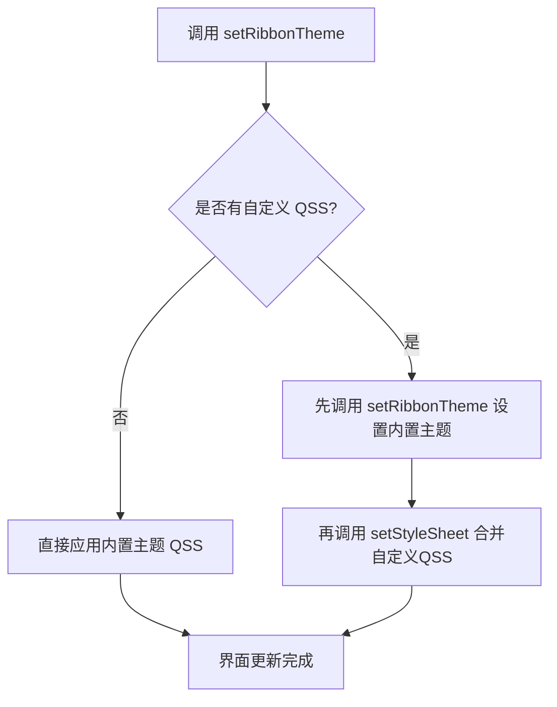
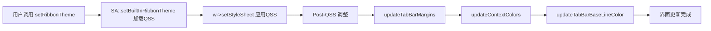

# SARibbon主题切换

- ✅ **6种内置主题**：Office2013/2016/2021、Windows7、Dark/Dark2，一键切换
- ✅ **运行时动态切换**：通过 `setRibbonTheme()` 即时更换主题，无需重启
- ✅ **QSS样式设置**：内置主题 QSS 可通过 `setStyleSheet()` 应用或替换，详见下方 QSS 说明
- ✅ **完全自定义主题**：基于QSS编写任意风格，参见 [自定义Ribbon主题](./design-your-theme.md)

## 主题切换流程



SARibbon 提供了多种内置主题，如 Windows 7、Office 2013、Office 2016、暗色主题等，主题定义在`SARibbonTheme`枚举类中：

```cpp
enum class SARibbonTheme
{
    RibbonThemeOffice2013,      ///< office2013主题
    RibbonThemeOffice2016Blue,  ///< office2016-蓝色主题
    RibbonThemeOffice2021Blue,  ///< office2021-蓝色主题
    RibbonThemeWindows7,        ///< win7主题
    RibbonThemeDark,            ///< 暗色主题
    RibbonThemeDark2            ///< 暗色主题2
};

```

!!! info "默认主题"
    `SARibbonTheme::RibbonThemeOffice2021Blue` 是 SARibbon 的默认主题，在 `SARibbonMainWindow` 和 `SARibbonWidget` 的 PrivateData 初始化器中显式设置。

    当操作系统处于暗色模式（Dark Mode）且当前主题为 `RibbonThemeOffice2021Blue` 时，SARibbon 会自动切换至 `RibbonThemeDark`。该检测通过 `QTimer::singleShot(0)` 延迟执行，确保 `QApplication` 上下文完整可用。

通过`SARibbonMainWindow::setRibbonTheme`/`SARibbonWidget::setRibbonTheme`函数，可以设置Ribbon的主题，此函数的参数为`SARibbonTheme`对象

!!! warning "注意"
    某些Qt版本，在构造函数设置主题会不完全生效，可以使用QTimer投放到队列最后执行：
    ```cpp
    MainWindow::MainWindow(QWidget* par) : SARibbonMainWindow(par)
    {
        ...
        QTimer::singleShot(0, this, [ this ]() {
            this->setRibbonTheme(SARibbonTheme::RibbonThemeDark);
        });
    }
    ```

!!! tip "根本原因"
    `setRibbonTheme()` 包含两个阶段：QSS 加载（`setStyleSheet()`）和后续程序调整（Tab 边距、上下文颜色、基线颜色）。`setStyleSheet()` 会调度异步样式重计算，后续调整依赖子控件树完全实例化且 QSS 已生效。在构造函数阶段，Qt 样式引擎尚未完成异步操作，导致调整无法正确应用。`QTimer::singleShot(0)` 将设置推迟到事件循环开始后，确保所有子控件已构建、样式引擎已处理完毕。这也是暗色模式自动检测需要延迟执行的原因。

各个主题效果如下图所示：

win7主题：


office2013主题：


office2016主题：


office2021主题：


dark主题：


dark2主题：


## 主题对照表

| 枚举值 | 风格说明 | 适用场景 |
|--------|---------|---------|
| `RibbonThemeOffice2013` | Office 2013 经典白色 | 追求简洁明亮风格 |
| `RibbonThemeOffice2016Blue` | Office 2016 蓝色调 | 商务/企业应用 |
| `RibbonThemeOffice2021Blue` | Office 2021 蓝色调 | 现代化界面设计 |
| `RibbonThemeWindows7` | Windows 7 经典 | 兼容传统风格 |
| `RibbonThemeDark` | 暗色主题 | 长时间使用/夜间模式 |
| `RibbonThemeDark2` | 暗色主题（变体） | 对比度更高的暗色需求 |

## 主题API摘要

| 方法 / 属性 | 所属类 | 说明 |
|-------------|--------|------|
| `setRibbonTheme(SARibbonTheme)` | SARibbonMainWindow / SARibbonWidget | 设置Ribbon主题 |
| `ribbonTheme()` → `SARibbonTheme` | SARibbonMainWindow / SARibbonWidget | 获取当前主题 |
| `Q_PROPERTY(ribbonTheme)` | SARibbonMainWindow / SARibbonWidget | 主题属性，可通过QSS或代码绑定 |

### SARibbonWidget 说明

`SARibbonWidget` 同样提供 `setRibbonTheme()` 方法和 `Q_PROPERTY(ribbonTheme)`，使用方式与 `SARibbonMainWindow` 一致。

**重要差异**：`SARibbonWidget::setRibbonTheme()` 不会调用 `setContextCategoryColorHighLight()`，上下文类别高亮函数会保留上一次主题设置的值，而非随主题更新。而 `SARibbonMainWindow` 会根据主题切换相应的高亮函数（`cs_vibrantHighlight`、`cs_darkerHighlight`、或 Office2021Blue 专属 lambda）。

### 无 themeChanged 信号

SARibbon 当前没有 `themeChanged` 信号。如需监听主题变化，有两种变通方式：

1. 在子类中重写 `setRibbonTheme()` 方法，在调用基类方法后处理自定义逻辑。
2. 如果通过 ComboBox 切换主题（参见上方「动态切换主题示例」），直接连接 ComboBox 的 `currentIndexChanged` 信号即可。

!!! note "构造函数中设置主题的时机"
    某些Qt版本在构造函数中直接调用 `setRibbonTheme()` 可能不完全生效，原因是QSS在构造阶段尚未完全加载。推荐使用 `QTimer::singleShot(0)` 将主题设置延迟到事件循环开始后执行。

## 动态切换主题示例

以下代码演示如何通过一个 ComboBox 动态切换主题（参考 `example/MainWindowExample`）：

```cpp
void MainWindow::onThemeChanged(int index)
{
    SARibbonTheme theme = static_cast<SARibbonTheme>(index);
    setRibbonTheme(theme);
    // 如果程序有自定义的QSS，需要在设置主题后再叠加
    if (!m_customStyleSheet.isEmpty()) {
        // setRibbonTheme会自动应用内置主题QSS
        // 注意：setStyleSheet会替换（而非追加）窗口的样式表，因此自定义QSS会覆盖内置主题样式
        this->setStyleSheet(m_customStyleSheet);
    }
}
```

## QSS合并说明

SARibbon的主题是通过QSS实现的。如果你的窗口已经存在QSS样式，需要将你的QSS样式和Ribbon的QSS样式进行合并，否则后设置的样式会覆盖之前的样式。

合并方法：

```cpp
// 方法一：先调用 setRibbonTheme 设置内置主题
// setRibbonTheme会自动应用内置主题的QSS到窗口
setRibbonTheme(SARibbonTheme::RibbonThemeOffice2021Blue);
// 之后设置自定义QSS（注意：setStyleSheet会替换窗口样式表，自定义QSS将覆盖内置主题样式）
this->setStyleSheet(loadMyCustomStyleSheet());

// 方法二：如果你不需要内置主题，完全使用自定义QSS
// 参考 example/MatlabUI 的实现方式
QFile file(":/theme/my-theme.qss");
if (file.open(QIODevice::ReadOnly | QIODevice::Text)) {
    this->setStyleSheet(QString::fromUtf8(file.readAll()));
}
```

!!! warning "注意"
    `sa_get_ribbon_theme_qss` 函数在早期文档中被提及，但该函数**不存在于当前代码库中**。获取内置主题QSS的唯一方式是通过 `setRibbonTheme()` 自动应用，没有公共API可以直接获取主题QSS字符串。

!!! tip "提示"
    内置主题的QSS文件位于 `src/SARibbonBar/resource` 目录，你可以直接参考这些文件来编写自定义主题。如果需要完全自定义主题，请参阅 [自定义Ribbon主题](./design-your-theme.md)。

## Post-QSS 内部调整机制

`setRibbonTheme()` 在加载 QSS 之后，还会执行三项程序化调整，以弥补 QSS 无法表达或无法正确生效的样式细节（源码参考 `SARibbonMainWindow.cpp:102-154`）。

### 调整函数说明

| 函数 | 作用 |
|------|------|
| `updateTabBarMargins()` | 根据主题设置 Tab 边距 |
| `updateContextColors()` | 设置上下文类别颜色列表及高亮函数 |
| `updateTabBarBaseLineColor()` | 设置 Tab 栏基线颜色 |

### 各主题调整对照表

| 主题 | Tab 边距（QMargins） | 上下文类别颜色列表 | 高亮函数 | 基线颜色 |
|------|-------------------|-------------------|---------|---------|
| `RibbonThemeWindows7` | `QMargins(5, 0, 0, 0)` | 空列表（恢复默认） | `cs_vibrantHighlight` → `SA::makeColorVibrant(c)` | 清除 |
| `RibbonThemeOffice2013` | `QMargins(5, 0, 0, 0)` | 空列表（恢复默认） | `cs_vibrantHighlight` → `SA::makeColorVibrant(c)` | `QColor(186, 201, 219)` |
| `RibbonThemeOffice2016Blue` | `QMargins(5, 0, 0, 0)` | `QColor(18, 64, 120)` | `cs_darkerHighlight` → `QColor::darker()` | 清除 |
| `RibbonThemeOffice2021Blue` | `QMargins(5, 0, 5, 0)` | `QColor(209, 207, 209)` | Lambda → 始终返回 `QColor(39, 96, 167)` | 清除 |
| `RibbonThemeDark` | `QMargins(5, 0, 0, 0)` | 空列表（恢复默认） | `cs_vibrantHighlight` → `SA::makeColorVibrant(c)` | 清除 |
| `RibbonThemeDark2` | `QMargins(5, 0, 0, 0)` | 无调整 | 无 | 清除 |

关键观察：
- 仅 `RibbonThemeOffice2021Blue` 的右边距为 5px（`QMargins(5, 0, 5, 0)`），其余主题右边距为 0。
- 仅 `RibbonThemeOffice2013` 设置基线颜色 `QColor(186, 201, 219)`，其余主题清除基线颜色。
- `RibbonThemeDark2` 没有上下文颜色或高亮调整（`switch` 中落入 `default: break`）。
- 高亮函数定义（`SARibbonMainWindow.cpp:120-125`）：

```cpp
// 使颜色更鲜艳
static const SARibbonBar::FpContextCategoryHighlight cs_vibrantHighlight = [](const QColor& c) -> QColor {
    return SA::makeColorVibrant(c);
};
// 使颜色变暗
static const SARibbonBar::FpContextCategoryHighlight cs_darkerHighlight = [](const QColor& c) -> QColor {
    return c.darker();
};
```

### 内部机制流程图



此调整机制仅在运行时 `setRibbonTheme()` 调用时完整执行。构造函数阶段因 QSS 异步加载和子控件树未完全实例化而无法执行这些调整，因此需要通过 `QTimer::singleShot(0)` 延迟调用。
