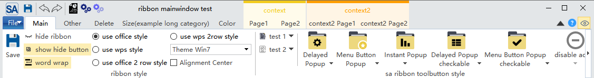
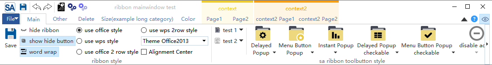
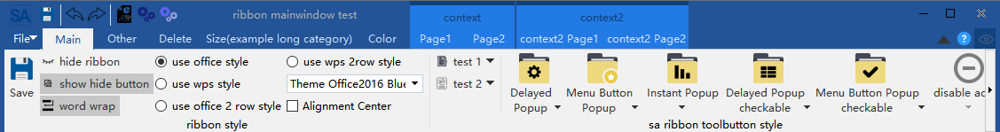
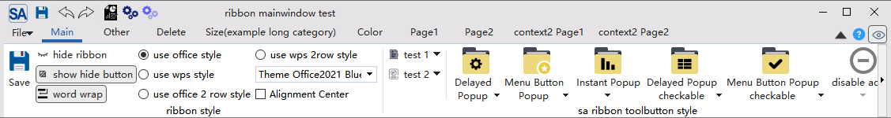
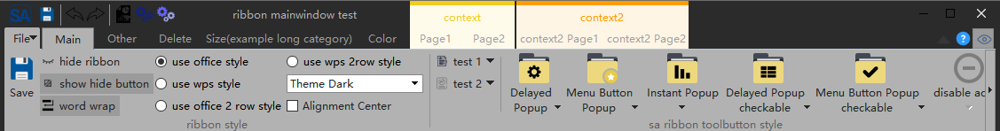
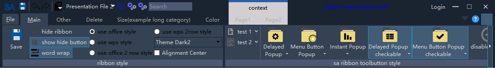

# SARibbon主题切换

SARibbon 提供了多种内置主题，如 Windows 7、Office 2013、Office 2016、暗色主题等，主题定义在`SARibbonTheme`枚举类中：

```cpp
enum class SARibbonTheme
{
    RibbonThemeOffice2013,      ///< office2013主题
    RibbonThemeOffice2016Blue,  ///< office2016-蓝色主题
    RibbonThemeOffice2021Blue,  ///< office2021-蓝色主题
    RibbonThemeWindows7,        ///< win7主题
    RibbonThemeDark,            ///< 暗色主题
    RibbonThemeDark2            ///< 暗色主题2
};
```

通过`SARibbonMainWindow::setRibbonTheme`/`SARibbonWidget::setRibbonTheme`函数，可以设置Ribbon的主题，此函数的参数为`SARibbonTheme`对象

!!! warning "注意"
    某些Qt版本，在构造函数设置主题会不完全生效，可以使用QTimer投放到队列最后执行：
    ```cpp
    MainWindow::MainWindow(QWidget* par) : SARibbonMainWindow(par)
    {
        ...
        QTimer::singleShot(0, this, [ this ]() {
            this->setRibbonTheme(SARibbonMainWindow::RibbonThemeDark);
        });
    }
    ```

各个主题效果如下图所示：

win7主题：



office2013主题：



office2016主题：



office2021主题：



dark主题：



dark2主题：



## 主题对照表

| 枚举值 | 风格说明 | 适用场景 |
|--------|---------|---------|
| `RibbonThemeOffice2013` | Office 2013 经典白色 | 追求简洁明亮风格 |
| `RibbonThemeOffice2016Blue` | Office 2016 蓝色调 | 商务/企业应用 |
| `RibbonThemeOffice2021Blue` | Office 2021 蓝色调 | 现代化界面设计 |
| `RibbonThemeWindows7` | Windows 7 经典 | 兼容传统风格 |
| `RibbonThemeDark` | 暗色主题 | 长时间使用/夜间模式 |
| `RibbonThemeDark2` | 暗色主题（变体） | 对比度更高的暗色需求 |

## 动态切换主题示例

以下代码演示如何通过一个 ComboBox 动态切换主题（参考 `example/MainWindowExample`）：

```cpp
void MainWindow::onThemeChanged(int index)
{
    SARibbonTheme theme = static_cast<SARibbonTheme>(index);
    // 如果程序有自定义的QSS，需要合并
    if (m_customStyleSheet.isEmpty()) {
        // 没有自定义QSS，直接设置主题
        setRibbonTheme(theme);
    } else {
        // 有自定义QSS，需要先获取主题的QSS再合并
        QString ribbonQss = sa_get_ribbon_theme_qss(theme);
        QString mergedQss = ribbonQss + "\n" + m_customStyleSheet;
        this->setStyleSheet(mergedQss);
    }
}
```

## QSS合并说明

SARibbon的主题是通过QSS实现的。如果你的窗口已经存在QSS样式，需要将你的QSS样式和Ribbon的QSS样式进行合并，否则后设置的样式会覆盖之前的样式。

合并方法：

```cpp
// 方法一：通过 sa_get_ribbon_theme_qss 获取主题QSS后手动合并
QString ribbonQss = sa_get_ribbon_theme_qss(SARibbonTheme::RibbonThemeOffice2021Blue);
QString myQss = loadMyCustomStyleSheet();  // 加载你自己的QSS
this->setStyleSheet(ribbonQss + "\n" + myQss);

// 方法二：如果你不需要内置主题，完全使用自定义QSS
// 参考 example/MatlabUI 的实现方式
QFile file(":/theme/my-theme.qss");
if (file.open(QIODevice::ReadOnly | QIODevice::Text)) {
    this->setStyleSheet(QString::fromUtf8(file.readAll()));
}
```

!!! tip "提示"
    内置主题的QSS文件位于 `src/SARibbonBar/resource` 目录，你可以直接参考这些文件来编写自定义主题。如果需要完全自定义主题，请参阅 [自定义Ribbon主题](./design-your-theme.md)。
