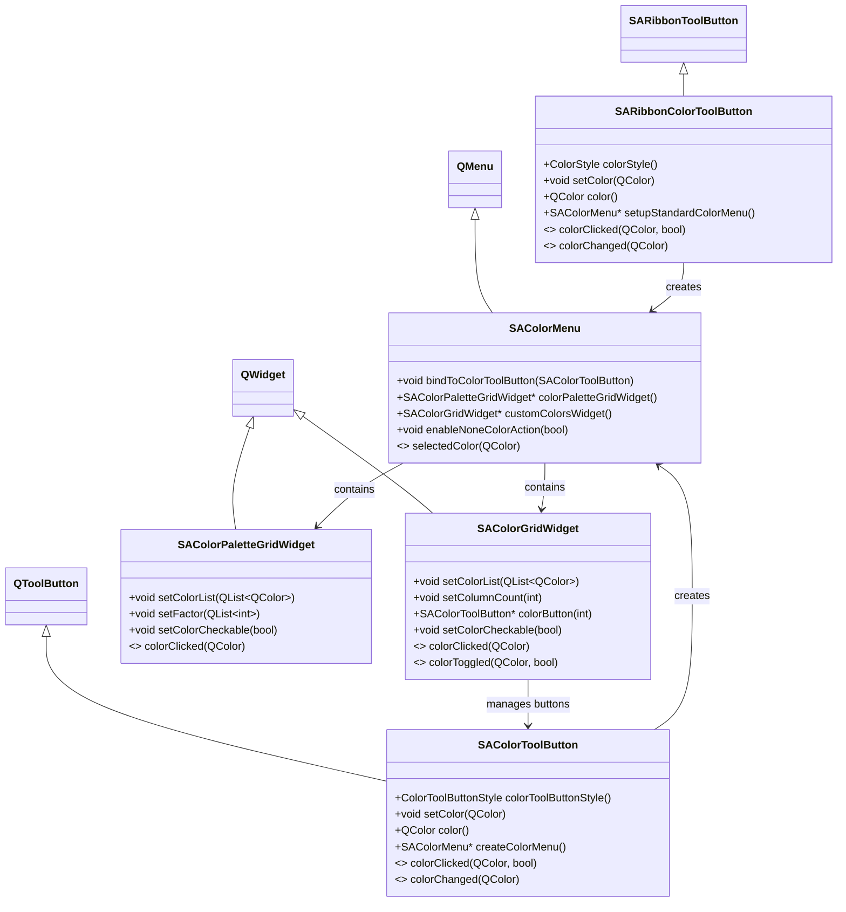

# 颜色控件 (Color Widgets)

## 功能概述

颜色控件子库提供了一套完整的颜色选择解决方案，参考 Microsoft Office 的颜色选择交互设计。包含 5 个类，覆盖从基础颜色按钮到完整颜色菜单的所有场景。

### ✅ 特性

- **Ribbon 集成**：`SARibbonColorToolButton` 继承 `SARibbonToolButton`，可无缝添加到 Ribbon Panel 中
- **独立使用**：`SAColorToolButton` 继承 `QToolButton`，可在任意 Qt 界面中使用
- **Office 风格菜单**：`SAColorMenu` 提供主题色面板、自定义颜色、无颜色选项的完整菜单
- **灵活网格布局**：`SAColorGridWidget` 支持自定义列数、行列间距、可选中的颜色网格
- **Palette 面板**：`SAColorPaletteGridWidget` 提供标准色行 + 浅色/深色色板的多层结构

## 类关系图



## SARibbonColorToolButton 使用方法

### 概述

继承自 `SARibbonToolButton`，专为 Ribbon 界面设计的颜色按钮。支持两种显示样式：

- **ColorUnderIcon**：颜色显示在图标下方（需设置 icon）
- **ColorFillToIcon**：颜色作为图标本身（`setColor` 会自动生成颜色图标替换原 icon）

### 代码示例

```cpp
#include "SARibbonColorToolButton.h"

// 创建颜色按钮
SARibbonColorToolButton* colorButton = new SARibbonColorToolButton(panel);

// 设置默认颜色
colorButton->setColor(Qt::red);

// 设置颜色显示为填充图标模式
colorButton->setColorStyle(SARibbonColorToolButton::ColorFillToIcon);

// 建立标准颜色下拉菜单
colorButton->setupStandardColorMenu();

// 连接颜色点击信号
connect(colorButton, &SARibbonColorToolButton::colorClicked,
        this, &MainWindow::onColorButtonColorClicked);

// 添加到 Ribbon Panel
panel->addSmallWidget(colorButton);  // 小按钮
panel->addLargeWidget(colorButton);  // 大按钮
```

### 效果说明

- `ColorFillToIcon` 且无 icon 时，按钮显示为纯色方块
- `ColorFillToIcon` 且有 icon 时，icon 被替换为颜色块
- `ColorUnderIcon` 时，图标下方显示一条彩色色带
- 点击按钮左侧区域触发 `colorClicked` 信号，点击右侧下拉箭头弹出颜色菜单

### 使用示例参考

!!! example
    完整使用示例见 `example/MainWindowExample/mainwindow.cpp` 中的 `createCategoryColor` 函数（约第 2358 行），展示了多种样式组合

    ```cpp
    // 无图标无文字 - 纯颜色块
    colorButton->setColorStyle(SARibbonColorToolButton::ColorFillToIcon);

    // 有图标有文字 - 图标下显示颜色带
    colorButton->setIcon(QIcon(":/icon/long-text.svg"));
    colorButton->setText("have Icon have text");

    // 大按钮模式
    colorButton->setButtonType(SARibbonToolButton::LargeButton);
    ```

## SAColorToolButton 使用方法

### 概述

继承自 `QToolButton`，可在任意 Qt 界面中使用的独立颜色按钮。支持四种 Qt 按钮样式（`ToolButtonIconOnly`、`ToolButtonTextBesideIcon`、`ToolButtonTextUnderIcon`、`ToolButtonTextOnly`），并内置颜色菜单功能。

### 两种按钮样式

| 样式 | 说明 |
|------|------|
| `WithColorMenu` | 默认样式，自动创建 `SAColorMenu` 下拉菜单 |
| `NoColorMenu` | 不创建菜单，仅作为颜色显示按钮 |

### 代码示例

```cpp
#include "colorWidgets/SAColorToolButton.h"

// 创建（默认带菜单）
SAColorToolButton* btn = new SAColorToolButton(parent);
btn->setColor(Qt::blue);

// 或通过样式构造
SAColorToolButton* btn2 = new SAColorToolButton(SAColorToolButton::NoColorMenu, parent);
btn2->setColor(Qt::green);

// 设置边距
btn->setMargins(QMargins(3, 3, 3, 3));

// 连接信号
connect(btn, &SAColorToolButton::colorClicked,
        this, [](const QColor& c, bool checked) {
            qDebug() << "Color clicked:" << c.name();
        });
connect(btn, &SAColorToolButton::colorChanged,
        this, [](const QColor& c) {
            qDebug() << "Color changed:" << c.name();
        });
```

### 效果说明

- **无 icon**：颜色占据整个按钮区域
- **有 icon**：图标在上方，颜色条在图标下方（高度为图标的 1/4）
- **有 icon + 菜单**：右侧显示下拉箭头指示器
- 点击颜色区域触发 `colorClicked(QColor, bool)`，菜单中选择颜色后触发 `colorChanged(QColor)`

## SAColorGridWidget 使用方法

### 概述

以网格布局展示多个颜色的 QWidget。内部使用 `SAColorToolButton` 作为每个颜色单元格，支持自定义列数、间距、可选中模式。

### 代码示例

```cpp
#include "colorWidgets/SAColorGridWidget.h"

SAColorGridWidget* grid = new SAColorGridWidget(parent);

// 设置列数（行数根据颜色数量自动计算）
grid->setColumnCount(5);

// 设置颜色列表
QList<QColor> colors;
colors << Qt::red << Qt::blue << Qt::green << Qt::yellow << Qt::cyan;
colors << Qt::magenta << Qt::gray << Qt::black << Qt::white << Qt::orange;
grid->setColorList(colors);

// 设置可选中模式
grid->setColorCheckable(true);

// 设置颜色图标大小和间距
grid->setColorIconSize(QSize(16, 16));
grid->setSpacing(2);
grid->setHorizontalSpacing(4);
grid->setVerticalSpacing(4);

// 获取当前选中的颜色
QColor current = grid->currentCheckedColor();

// 清除选中状态
grid->clearCheckedState();

// 连接信号
connect(grid, &SAColorGridWidget::colorClicked,
        this, [](const QColor& c) {
            qDebug() << "Grid color clicked:" << c.name();
        });
connect(grid, &SAColorGridWidget::colorToggled,
        this, [](const QColor& c, bool on) {
            qDebug() << "Color toggled:" << c.name() << "checked:" << on;
        });
```

### 效果说明

!!! example
    完整使用示例见 `src/SARibbonBar/colorWidgets/tst/Widget.cpp`（约第 37-49 行）

    ```cpp
    // 列数为 0 时，所有颜色在同一行
    ui->colorGrid1->setColumnCount(0);
    ui->colorGrid1->setColorList(SA::getStandardColorList());

    // 5 列布局
    ui->colorGrid2->setColumnCount(5);
    ui->colorGrid2->setColorList(randamColors);
    ```

- 列数设为 0 时，所有颜色排列在一行
- `setColorCheckable(true)` 后，点击颜色可选中/取消，并发射 `colorToggled` 信号
- 可通过 `colorButton(index)` 获取指定索引的颜色按钮进行自定义

## SAColorMenu 使用方法

### 概述

标准颜色下拉菜单，继承自 `QMenu`。内部包含三个区域：

1. **主题颜色**：使用 `SAColorPaletteGridWidget` 展示主题色板
2. **自定义颜色**：通过颜色对话框选取，记录最近使用的颜色到 `SAColorGridWidget`
3. **无颜色**（可选）：允许用户清除颜色选择

### 代码示例

```cpp
#include "colorWidgets/SAColorMenu.h"

// 创建菜单
SAColorMenu* menu = new SAColorMenu(parent);

// 或带标题
SAColorMenu* menuWithTitle = new SAColorMenu("字体颜色", parent);

// 启用无颜色选项
menu->enableNoneColorAction(true);

// 快速绑定到 SAColorToolButton
SAColorToolButton* btn = new SAColorToolButton(parent);
menu->bindToColorToolButton(btn);

// 获取内部组件
SAColorPaletteGridWidget* palette = menu->colorPaletteGridWidget();
SAColorGridWidget* customGrid = menu->customColorsWidget();
QAction* customAction = menu->customColorAction();
QAction* noneAction = menu->noneColorAction();

// 连接颜色选择信号
connect(menu, &SAColorMenu::selectedColor,
        this, [](const QColor& c) {
            qDebug() << "Selected color:" << c.name();
        });
```

### 效果说明

- `bindToColorToolButton()` 简化了菜单与按钮的绑定，自动连接 `selectedColor` 到按钮的 `setColor` 槽
- 主题色板区域展示一组基色及其深浅变体
- 点击"自定义颜色"弹出 `QColorDialog`，选中的颜色自动记录到自定义颜色行（最多 10 个）
- 用户可直接通过 `SARibbonColorToolButton::setupStandardColorMenu()` 或 `SAColorToolButton::createColorMenu()` 一键创建，无需手动构建

!!! example
    详见 `src/SARibbonBar/SARibbonColorToolButton.cpp` 的 `setupStandardColorMenu` 函数（约第 260 行）展示的一键建站模式

## SAColorPaletteGridWidget 使用方法

### 概述

类似 Office 的颜色选择面板，包含一行标准色和下方 5 行色板（3 行浅色 + 2 行深色）。根据传入的基色列表自动生成深浅变体。

### 代码示例

```cpp
#include "colorWidgets/SAColorPaletteGridWidget.h"

// 使用标准颜色列表初始化
SAColorPaletteGridWidget* palette = new SAColorPaletteGridWidget(
    SA::getStandardColorList(), parent);

// 或使用自定义颜色列表
QList<QColor> myColors;
myColors << Qt::red << Qt::blue << Qt::green << Qt::yellow << Qt::magenta;
SAColorPaletteGridWidget* palette2 = new SAColorPaletteGridWidget(myColors, parent);

// 设置深浅变体系数（默认 {180, 160, 140, 75, 50}）
// 值 > 100 表示变亮，< 100 表示变暗
palette->setFactor({75, 120});

// 设置可选中
palette->setColorCheckable(true);

// 设置颜色图标大小
palette->setColorIconSize(QSize(16, 16));

// 连接点击信号
connect(palette, &SAColorPaletteGridWidget::colorClicked,
        this, [](const QColor& c) {
            qDebug() << "Palette color clicked:" << c.name();
        });
```

### 效果说明

!!! example
    见 `example/MainWindowExample/mainwindow.cpp` 中 `createCategoryColor` 函数的使用（约第 2404 行）

    ```cpp
    SAColorPaletteGridWidget* palette = new SAColorPaletteGridWidget(
        SA::getStandardColorList(), panel);
    palette->setFactor({75, 120});
    panel->addLargeWidget(palette);
    ```

- 标准色行显示传入的颜色列表
- 下方色板根据 `setFactor` 中的系数生成每个基色的变体（>100 变亮，<100 变暗）
- 可直接作为 Ribbon Panel 的大组件使用
- 作为 `SAColorMenu` 的主题色面板子组件使用

## API 参考

### SARibbonColorToolButton

| 方法 | 返回值 | 说明 |
|------|--------|------|
| `color()` | `QColor` | 获取当前颜色 |
| `setColor(QColor)` | `void` | 设置颜色，发射 `colorChanged` 信号 |
| `colorStyle()` | `ColorStyle` | 获取颜色显示样式 |
| `setColorStyle(ColorStyle)` | `void` | 设置颜色显示样式 |
| `setupStandardColorMenu()` | `SAColorMenu*` | 建立标准颜色下拉菜单 |

**信号**：

| 信号 | 参数 | 说明 |
|------|------|------|
| `colorClicked(QColor, bool)` | `color`, `checked` | 颜色被点击时发射 |
| `colorChanged(QColor)` | `color` | 颜色改变时发射 |

### SAColorToolButton

| 方法 | 返回值 | 说明 |
|------|--------|------|
| `color()` | `QColor` | 获取当前颜色 |
| `setColor(QColor)` | `void` | 设置颜色，发射 `colorChanged` 信号 |
| `colorToolButtonStyle()` | `ColorToolButtonStyle` | 获取按钮样式 |
| `setColorToolButtonStyle(ColorToolButtonStyle)` | `void` | 设置按钮样式（WithColorMenu / NoColorMenu） |
| `createColorMenu()` | `SAColorMenu*` | 创建标准颜色菜单 |
| `colorMenu()` | `SAColorMenu*` | 获取颜色菜单（可能为 nullptr） |
| `setMargins(QMargins)` | `void` | 设置边距 |
| `margins()` | `QMargins` | 获取边距 |
| `paintNoneColor(QPainter*, QRect)` | `static void` | 绘制无颜色标识 |

**信号**：

| 信号 | 参数 | 说明 |
|------|------|------|
| `colorClicked(QColor, bool)` | `color`, `checked` | 颜色被点击时发射 |
| `colorChanged(QColor)` | `color` | 颜色改变时发射 |

### SAColorGridWidget

| 方法 | 返回值 | 说明 |
|------|--------|------|
| `setColorList(QList<QColor>)` | `void` | 设置颜色列表 |
| `getColorList()` | `QList<QColor>` | 获取颜色列表 |
| `setColumnCount(int)` | `void` | 设置列数 |
| `columnCount()` | `int` | 获取列数 |
| `setColorCheckable(bool)` | `void` | 设置可选中模式 |
| `isColorCheckable()` | `bool` | 检查是否可选中 |
| `currentCheckedColor()` | `QColor` | 获取当前选中的颜色 |
| `clearCheckedState()` | `void` | 清除选中状态 |
| `colorButton(int)` | `SAColorToolButton*` | 按索引获取颜色按钮 |
| `setColorIconSize(QSize)` | `void` | 设置颜色图标大小 |
| `colorIconSize()` | `QSize` | 获取颜色图标大小 |
| `setSpacing(int)` | `void` | 设置统一间距 |
| `spacing()` | `int` | 获取间距 |
| `setHorizontalSpacing(int)` | `void` | 设置水平间距 |
| `setVerticalSpacing(int)` | `void` | 设置垂直间距 |
| `setRowMinimumHeight(int, int)` | `void` | 设置行最小高度 |
| `setHorizontalSpacerToRight(bool)` | `void` | 设置水平弹簧到右侧 |
| `iterationColorBtns(FunColorBtn)` | `void` | 遍历所有颜色按钮 |

**信号**：

| 信号 | 参数 | 说明 |
|------|------|------|
| `colorClicked(QColor)` | `c` | 颜色被点击时发射 |
| `colorPressed(QColor)` | `c` | 颜色被按下时发射 |
| `colorReleased(QColor)` | `c` | 颜色被释放时发射 |
| `colorToggled(QColor, bool)` | `c`, `on` | checkable 模式下颜色切换时发射 |

### SAColorMenu

| 方法 | 返回值 | 说明 |
|------|--------|------|
| `bindToColorToolButton(SAColorToolButton*)` | `void` | 快速绑定到颜色按钮 |
| `colorPaletteGridWidget()` | `SAColorPaletteGridWidget*` | 获取主题颜色面板部件 |
| `customColorsWidget()` | `SAColorGridWidget*` | 获取自定义颜色网格部件 |
| `customColorAction()` | `QAction*` | 获取自定义颜色 action |
| `noneColorAction()` | `QAction*` | 获取无颜色 action（需先 `enableNoneColorAction(true)`） |
| `enableNoneColorAction(bool)` | `void` | 启用/禁用无颜色选项 |
| `emitSelectedColor(QColor)` | `void` | 辅助槽：发射 selectedColor 并隐藏菜单 |
| `themeColorsPaletteAction()` | `QWidgetAction*` | 获取主题色板 action |
| `getCustomColorsWidgetAction()` | `QWidgetAction*` | 获取自定义颜色 action |

**信号**：

| 信号 | 参数 | 说明 |
|------|------|------|
| `selectedColor(QColor)` | `c` | 选择颜色时发射 |

### SAColorPaletteGridWidget

| 方法 | 返回值 | 说明 |
|------|--------|------|
| `setColorList(QList<QColor>)` | `void` | 设置颜色列表 |
| `colorList()` | `QList<QColor>` | 获取颜色列表 |
| `setFactor(QList<int>)` | `void` | 设置深浅系数（默认 {180, 160, 140, 75, 50}） |
| `factor()` | `QList<int>` | 获取系数列表 |
| `setColorCheckable(bool)` | `void` | 设置可选中模式 |
| `isColorCheckable()` | `bool` | 检查是否可选中 |
| `setColorIconSize(QSize)` | `void` | 设置颜色图标大小 |
| `colorIconSize()` | `QSize` | 获取颜色图标大小 |

**信号**：

| 信号 | 参数 | 说明 |
|------|------|------|
| `colorClicked(QColor)` | `c` | 颜色被点击时发射 |

## 注意事项

1. **SARibbonColorToolButton vs SAColorToolButton**：前者用于 Ribbon 环境（继承 SARibbonToolButton），后者可在任意 Qt 界面使用（继承 QToolButton）。非 Ribbon 项目应使用 `SAColorToolButton`。

2. **ColorFillToIcon 模式限制**：使用 `SARibbonColorToolButton::ColorFillToIcon` 时，`setIcon()` 无效，因为 `setColor()` 会自动用颜色图标替换原有 icon。

3. **颜色菜单自动创建**：推荐使用 `SARibbonColorToolButton::setupStandardColorMenu()` 或 `SAColorToolButton::createColorMenu()` 一键建站，无需手动组装 `SAColorMenu`。

4. **标准颜色列表**：可通过 `SA::getStandardColorList()` 获取预定义的 10 种标准颜色（红、橙、黄、绿、青、蓝、紫、洋红、黑、白）。

5. **无颜色概念**：`SAColorMenu::enableNoneColorAction(true)` 启用后，用户可以选择 `QColor()`（无效颜色）来清除当前颜色。在自定义绘制时应使用 `QColor::isValid()` 判断。

6. **自定义颜色记录**：`SAColorMenu` 最多记录 10 个自定义颜色（`mMaxCustomColorSize`），超出后自动淘汰最旧记录。
